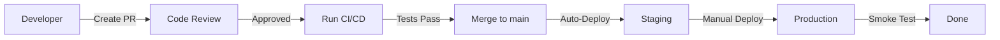
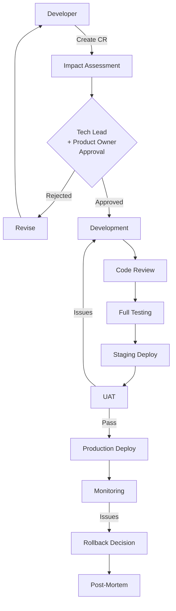
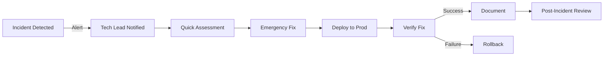
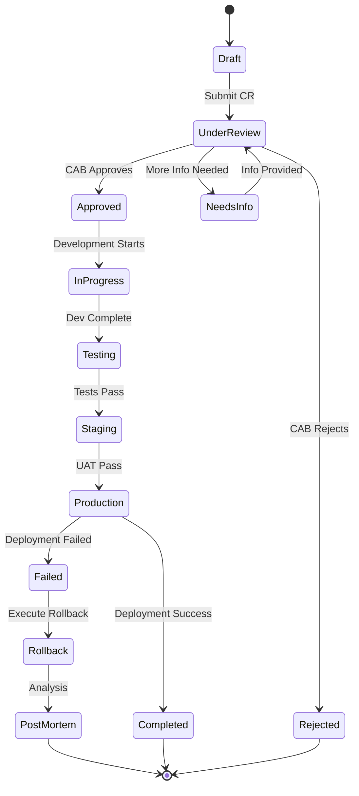

# Change Management Process (MVP v1)
## Self-Storage Aggregator Platform

**Document ID:** DOC-029  
**Version:** 1.1 (MVP Hardened)  
**Date:** December 17, 2025  
**Status:** MVP Supporting Process  

---

## Document Role & Scope

**Document Type:** Supporting / Process Policy  
**Project Phase:** MVP v1 Only  
**Nature:** Lightweight, Team-Driven Process  

### Key Characteristics:

- **Manual-First Decision Making**: Decisions made by Tech Lead + Product Owner, not automated committees
- **Best-Effort Approach**: Guidelines and targets are non-binding, subject to team capacity
- **Small Team Optimized**: Designed for startup/small team workflow, not enterprise governance
- **No Formal SLA/KPI Obligations**: Metrics are for tracking and improvement, not contractual commitments
- **Async-Friendly**: Meetings are optional, async review is acceptable
- **NOT an Enterprise Framework**: This is a practical process document, not a compliance framework

### Integration with Other Specs:

This process integrates with:
- **DOC-039** — Deployment Runbook (for deployment procedures)
- **DOC-020** — Audit Logging Specification (for change event logging)
- **DOC-042** — Disaster Recovery & Backup Plan (for recovery procedures)

### What This Document Is NOT:

❌ Not a formal ITSM process  
❌ Not binding SLA commitments  
❌ Not a compliance framework  
❌ Not a tool or system specification  
❌ Not mandatory for all changes  

---

# 1. Введение

## 1.1. Цель процесса Change Management

Change Management Process обеспечивает **контролируемое, прозрачное и безопасное внесение изменений** в платформу Self-Storage Aggregator MVP v1.

### Ключевые цели:

- **Минимизация рисков** при внесении изменений в production-окружение
- **Обеспечение стабильности** платформы для пользователей и операторов
- **Прозрачность** всех изменений для всех участников команды
- **Быстрое реагирование** на критические ситуации через Emergency Changes
- **Документирование** всех изменений для audit trail и compliance
- **Continuous Improvement** через анализ результатов изменений

### Преимущества процесса:

| Преимущество | Описание | Guideline (Non-Binding) |
|--------------|----------|-------------------------|
| **Снижение даунтайма** | Контролируемые релизы с rollback-планами | Guideline: ~30 min/месяц |
| **Качество кода** | Code review и тестирование | Guideline: ~90-95% coverage |
| **Скорость разработки** | Четкий процесс от идеи до продакшена | Guideline: 2-5 дней для minor |
| **Прозрачность** | Все изменения документированы | Best-effort coverage |
| **Безопасность** | Security review для критичных изменений | Goal: minimize incidents |

**Note:** All targets above are guidelines for continuous improvement, not contractual obligations.

---

## 1.2. Область охвата

Change Management Process применяется ко **всем компонентам** платформы Self-Storage Aggregator MVP v1.

### 1.2.1. Frontend (Next.js)

**Компоненты:**
- React-компоненты (UI/UX)
- Next.js страницы и роутинг
- Client-side логика
- Стили (Tailwind CSS)
- SEO-оптимизация

**Типичные изменения:**
- Новые фичи UI (поиск, фильтры, карточки складов)
- Редизайн страниц
- Оптимизация производительности
- Исправление багов отображения
- A/B тестирование элементов

**Критичность:** MEDIUM-HIGH (влияет на UX всех пользователей)

---

### 1.2.2. Backend (NestJS)

**Компоненты:**
- REST API endpoints
- Business logic (бронирование, оплата, складская логика)
- Authentication & Authorization (JWT)
- Database queries (Prisma ORM)
- WebSocket-коммуникации
- Background jobs (email, notifications)

**Типичные изменения:**
- Новые API endpoints
- Изменение бизнес-логики
- Оптимизация запросов к БД
- Исправление багов API
- Обновление зависимостей

**Критичность:** HIGH (core платформы)

---

### 1.2.3. AI Core (FastAPI)

**Компоненты:**
- AI-рекомендации складов
- Чат-бот (GPT-4)
- Обработка естественного языка
- Анализ предпочтений пользователей
- Кэширование AI-ответов (Redis)

**Типичные изменения:**
- Обновление промптов
- Интеграция новых AI-моделей
- Оптимизация времени ответа
- Настройка параметров модели
- Добавление новых AI-фичей

**Критичность:** MEDIUM (не блокирует работу платформы при сбое)

---

### 1.2.4. Database (PostgreSQL + PostGIS)

**Компоненты:**
- Schema changes (таблицы, колонки, constraints)
- Indexes и query optimization
- Миграции данных
- Геопространственные индексы (PostGIS)
- Backup & restore процедуры

**Типичные изменения:**
- Добавление новых таблиц/полей
- Изменение типов данных
- Оптимизация индексов
- Data migrations

**Критичность:** CRITICAL (любой сбой БД = полный даунтайм)

---

### 1.2.5. DevOps & Infrastructure

**Компоненты:**
- Docker containers & images
- CI/CD pipelines (GitHub Actions)
- Nginx конфигурация
- SSL/TLS сертификаты
- Мониторинг (Prometheus, Grafana)
- Logging (Winston, Loki)
- Secrets management (Doppler/AWS)

**Типичные изменения:**
- Обновление Docker images
- Изменение CI/CD пайплайнов
- Масштабирование инфраструктуры
- Обновление системных пакетов
- Настройка мониторинга

**Критичность:** HIGH (влияет на доступность всей платформы)

---

### 1.2.6. Integrations (n8n, APIs)

**Компоненты:**
- Yandex Maps / Google Maps API
- Email (SendGrid)
- SMS (Twilio / SMSC)
- n8n workflows (автоматизация)
- Payment gateway (Stripe/ЮKassa) - будущее
- CRM integrations - будущее

**Типичные изменения:**
- Обновление API ключей
- Изменение n8n workflows
- Добавление новых интеграций
- Обновление endpoints внешних API
- Rate limiting adjustments

**Критичность:** MEDIUM-HIGH (зависит от интеграции)

---

## 1.3. Принципы изменений

### 🎯 Основные принципы:

1. **Safety First**
   - Безопасность пользовательских данных превыше всего
   - Любое изменение должно иметь rollback-план
   - Тестирование обязательно перед продакшеном

2. **Transparency**
   - Все изменения документируются
   - Команда информируется о предстоящих изменениях
   - Пользователи уведомляются о значимых изменениях

3. **Pragmatic Automation**
   - CI/CD автоматизирует тестирование и деплой
   - Автоматические проверки безопасности
   - Manual rollback decisions by Tech Lead

4. **Continuous Improvement**
   - Анализ каждого релиза
   - Lessons learned после инцидентов
   - Постоянное улучшение процесса

5. **Speed with Stability**
   - Быстрые итерации без ущерба стабильности
   - Emergency changes для критических ситуаций
   - Feature flags для постепенного rollout (Post-MVP)

---

## 1.4. Кто участвует в процессе

### 1.4.1. Роли и ответственность

| Роль | Ответственность | Вовлечённость в Change Management |
|------|-----------------|-----------------------------------|
| **Product Owner** | Приоритизация фичей, business requirements | ✅ Одобряет Major Changes<br>✅ Определяет scope<br>✅ Утверждает release notes |
| **Tech Lead** | Архитектурные решения, code quality | ✅ Одобряет все технические изменения<br>✅ Code review критичного кода<br>✅ Принимает решение о rollback |
| **Backend Developer** | Разработка backend, API, база данных | ✅ Создаёт Change Requests<br>✅ Проводит code review<br>✅ Пишет тесты |
| **Frontend Developer** | Разработка UI/UX, интеграция с API | ✅ Создаёт Change Requests<br>✅ Проводит code review<br>✅ Пишет E2E тесты |
| **DevOps Engineer** | Инфраструктура, CI/CD, deployment | ✅ Деплоит изменения<br>✅ Настраивает мониторинг<br>✅ Выполняет rollback |

**Note:** For small teams, roles may overlap. Tech Lead can combine responsibilities with Backend Dev, DevOps, etc.

---

### 1.4.2. RACI Matrix

RACI = **R**esponsible, **A**ccountable, **C**onsulted, **I**nformed

| Активность | Product Owner | Tech Lead | Developer | DevOps |
|------------|---------------|-----------|-----------|--------|
| **Change Request Creation** | C | C | R/A | I |
| **Impact Assessment** | C | R/A | R | R |
| **Approval (Minor)** | I | A | I | I |
| **Approval (Major)** | A | R | I | I |
| **Code Review** | I | A | R | C |
| **Testing** | I | C | R | I |
| **Deployment** | I | C | I | A |
| **Smoke Testing** | I | C | R | R |
| **Rollback Decision** | C | A | C | R |
| **Post-mortem** | C | A | R | R |

**Легенда:**
- **R (Responsible)**: Выполняет работу
- **A (Accountable)**: Принимает финальное решение, несёт ответственность
- **C (Consulted)**: Консультируется до принятия решения
- **I (Informed)**: Информируется после принятия решения

---

# 2. Типы изменений

Все изменения в платформе классифицируются на **три типа** в зависимости от их **влияния**, **риска** и **срочности**.

---

## 2.1. Minor Changes

### Определение:
**Minor Changes** — это небольшие изменения с **низким риском** и **минимальным влиянием** на пользователей и систему.

### Характеристики:

| Параметр | Значение |
|----------|----------|
| **Влияние** | Низкое (затрагивает < 5% функционала) |
| **Риск** | Низкий (не влияет на критичные функции) |
| **Downtime** | Нет (zero-downtime deployment) |
| **Согласование** | Tech Lead (упрощённое) |
| **Тестирование** | Unit + Integration tests |
| **Rollback Time** | Guideline: < 5-10 минут |
| **Notification** | Только внутренняя команда |

### Примеры Minor Changes:

✅ **Frontend:**
- Исправление UI багов (кнопка не кликается, текст обрезается)
- Изменение текстов и копирайта
- Небольшие стилевые изменения (цвета, отступы)
- Оптимизация производительности (debouncing, lazy loading)
- Добавление analytics events

✅ **Backend:**
- Исправление багов в некритичной логике
- Оптимизация существующих API (без изменения контракта)
- Добавление логирования
- Обновление зависимостей (patch versions)
- Рефакторинг кода без изменения поведения

✅ **Database:**
- Добавление индексов для оптимизации
- Изменение текстовых полей (увеличение VARCHAR)
- Добавление nullable полей

✅ **Integrations:**
- Изменение настроек n8n workflows
- Обновление email/SMS шаблонов
- Настройка rate limiting

### Процесс Minor Changes:



**Сроки (Best-Effort Guidelines):**
- **Code Review**: ~1-2 часа (subject to team availability)
- **Testing**: ~30 минут - 1 час
- **Deployment**: ~15-30 минут
- **Total**: Guideline 2-5 часов (может быть больше)

---

## 2.2. Major Changes

### Определение:
**Major Changes** — это значительные изменения с **средним/высоким риском** и **существенным влиянием** на функционал или архитектуру платформы.

### Характеристики:

| Параметр | Значение |
|----------|----------|
| **Влияние** | Среднее-высокое (> 10% функционала) |
| **Риск** | Средний-высокий |
| **Downtime** | Возможен (планируемый) |
| **Согласование** | Product Owner + Tech Lead (informal CAB) |
| **Тестирование** | Full suite + UAT |
| **Rollback Time** | Guideline: < 15-30 минут |
| **Notification** | Команда + пользователи/операторы |

### Примеры Major Changes:

✅ **Frontend:**
- Новая страница или flow (бронирование, профиль)
- Редизайн ключевых компонентов
- Интеграция новых библиотек

✅ **Backend:**
- Новые API endpoints (booking, payments)
- Изменение бизнес-логики (booking flow, pricing)
- Major refactoring
- Интеграция с внешними сервисами

✅ **Database:**
- Добавление новых таблиц
- Изменение схемы (NOT NULL, FK)
- Масштабные миграции данных

✅ **AI Core:**
- Переход на новую модель AI
- Изменение архитектуры AI-рекомендаций

### Процесс Major Changes:



**Сроки (Best-Effort Guidelines):**
- **Approval**: 1-2 дня (async review acceptable)
- **Development**: 3-7 дней (varies by complexity)
- **Testing**: 1-2 дня
- **Total**: Guideline 1-2 недели (flexible based on scope)

---

## 2.3. Emergency Changes

### Определение:
**Emergency Changes** — это **срочные** изменения для устранения критических проблем, влияющих на **доступность** или **безопасность** платформы.

### Характеристики:

| Параметр | Значение |
|----------|----------|
| **Срочность** | CRITICAL (немедленное действие) |
| **Согласование** | Tech Lead (post-approval by Product Owner) |
| **Тестирование** | Минимальное (smoke tests) |
| **Rollback Time** | Guideline: < 5 минут |
| **Notification** | Real-time (Slack/Telegram) |

### Примеры Emergency Changes:

🚨 **Production Down:**
- Database connection failure
- Server crash
- SSL certificate expiry
- Payment gateway failure

🚨 **Security Incidents:**
- SQL injection vulnerability
- Exposed API keys
- Data breach
- DDoS attack mitigation

🚨 **Data Loss Risk:**
- Corrupted data
- Failed backup
- Critical bug causing data inconsistency

### Процесс Emergency Changes:



**Сроки (Critical Response):**
- **Detection to Fix**: Best-effort ASAP (typically 15-60 minutes)
- **Deployment**: ~5-15 минут
- **Verification**: ~5 минут

**Post-Emergency Process:**
- Document what happened (DOC-020 audit log)
- Inform Product Owner
- Schedule post-mortem within 24-48 hours
- Create follow-up CR if needed

---

# 3. Change Advisory Board (CAB)

## 3.1. MVP CAB Structure

### What is CAB in MVP Context:

**CAB** is an **informal review process**, not a formal committee. In MVP v1, CAB consists of:

- **Tech Lead** (technical decision maker)
- **Product Owner** (business decision maker)

### How CAB Works (Lightweight):

**For Major Changes:**
- Tech Lead + Product Owner review the change request
- Review can be **async** (via Slack, GitHub comments, email)
- Meetings are **optional**, not mandatory
- Decision timeline: typically 1-2 days (best-effort)

**For Minor Changes:**
- Tech Lead approval only (no formal CAB)
- Async approval via PR review

**For Emergency Changes:**
- Tech Lead makes immediate decision
- Product Owner informed post-deployment

### CAB Activities:

| Activity | Frequency | Format | Participants |
|----------|-----------|--------|--------------|
| **Major Change Review** | As needed | Async or quick sync | Tech Lead + PO |
| **Retrospective** | Monthly (optional) | 30-60 min meeting | Full team |
| **Release Planning** | Sprint-based | Async or sync | Tech Lead + PO |

**Note:** CAB in MVP is about **quick decision-making**, not bureaucracy. Async review is preferred to avoid meeting overhead.

---

## 3.2. Decision Making Process

### Approval Criteria:

Major changes are approved based on:

1. **Business Value**: Does it align with product roadmap?
2. **Technical Feasibility**: Is the implementation sound?
3. **Risk Assessment**: Are risks acceptable and mitigated?
4. **Resource Availability**: Do we have capacity?
5. **Dependencies**: Are all dependencies resolved?

### Decision Outcomes:

- ✅ **Approved**: Proceed with development
- ⏸️ **Conditional Approval**: Approved with specific requirements
- ❌ **Rejected**: Not aligned with priorities or too risky
- 🔄 **Deferred**: Postponed to future sprint

### Escalation:

If Tech Lead and Product Owner disagree:
- Discuss trade-offs openly
- Tech Lead has final say on technical decisions
- Product Owner has final say on business priorities
- If still unresolved, escalate to company leadership (rare in MVP)

---

# 4. Change Request (CR) Process

## 4.1. Creating a Change Request

### When to Create a CR:

- All **Major Changes** require a formal CR
- **Minor Changes** can use simplified PR process
- **Emergency Changes** documented post-deployment

### CR Template (GitHub Issue):

```markdown
## Change Request: [TITLE]

**Type:** Minor / Major / Emergency
**Priority:** Low / Medium / High / Critical
**Requested By:** @username
**Date:** YYYY-MM-DD

### Business Justification:
[Why is this change needed?]

### Technical Description:
[What will be changed? Which components affected?]

### Impact Assessment:
- **Users Affected:** [All / Specific segment / None]
- **Downtime Required:** [Yes/No, duration]
- **Rollback Plan:** [Describe]
- **Dependencies:** [List any]

### Testing Plan:
- [ ] Unit tests
- [ ] Integration tests
- [ ] E2E tests (if applicable)
- [ ] Manual UAT

### Risks:
- **Risk 1:** [Description] → Mitigation: [Plan]
- **Risk 2:** [Description] → Mitigation: [Plan]

### Rollback Strategy:
[How to revert if deployment fails?]

### Approvals:
- [ ] Tech Lead: @tech-lead
- [ ] Product Owner: @product-owner (for Major only)

### Timeline (Best-Effort):
- Development: [X days]
- Testing: [Y days]
- Deployment: [Z date]
```

---

## 4.2. CR Workflow



---

# 5. Audit Logging & Change Tracking

## 5.1. Integration with DOC-020

**All change events are logged through the central audit logging system defined in DOC-020 (Audit Logging Specification).**

### What Gets Logged:

Change management events are logged as **audit events** with:

- `event_type`: `change_management.*`
- `event_subtype`: `cr_created`, `cr_approved`, `deployment_started`, `deployment_completed`, `rollback_executed`
- `actor_id`: User/service performing the action
- `resource_id`: Change Request ID (e.g., `CR-2025-01-015`)
- `metadata`: Change details (type, affected components, etc.)

### Example Audit Events:

```json
{
  "event_type": "change_management.cr_created",
  "event_subtype": "major_change",
  "timestamp": "2025-01-15T14:23:00Z",
  "actor_id": "user_123",
  "actor_type": "backend_developer",
  "resource_id": "CR-2025-01-015",
  "resource_type": "change_request",
  "metadata": {
    "title": "Add payment gateway integration",
    "type": "major",
    "priority": "high",
    "affected_components": ["backend", "database"]
  }
}
```

```json
{
  "event_type": "change_management.deployment_completed",
  "event_subtype": "production",
  "timestamp": "2025-01-16T10:05:00Z",
  "actor_id": "devops_service",
  "resource_id": "CR-2025-01-015",
  "metadata": {
    "environment": "production",
    "version": "v1.8.0",
    "rollback_available": true
  }
}
```

### No Separate Change Audit System:

❌ MVP v1 does NOT include a separate `change_audit_log` database or service.  
✅ All change tracking uses the **central audit logging** defined in DOC-020.

---

## 5.2. Change Documentation

All changes are documented in:

1. **GitHub Issues** (Change Requests)
2. **GitHub PRs** (Code changes)
3. **CHANGELOG.md** (Version history)
4. **Deployment logs** (via DOC-039 runbook)
5. **Audit logs** (via DOC-020 system)

---

# 6. Deployment & Rollback

## 6.1. Deployment Process

**All deployment procedures follow DOC-039 (Deployment Runbook).**

This document does NOT duplicate deployment steps. See DOC-039 for:
- Pre-deployment checklists
- Deployment commands
- Post-deployment verification
- Environment-specific procedures

### Integration Points:

- **Change Request** → Approved → Triggers deployment workflow
- **Deployment execution** → Follows DOC-039 procedures
- **Rollback** → If needed, follows DOC-039 and DOC-042

---

## 6.2. Rollback Strategy

**All rollback and recovery procedures follow:**
- **DOC-039** — Deployment Runbook (rollback steps)
- **DOC-042** — Disaster Recovery & Backup Plan (data recovery)

### When to Rollback:

Rollback decision made by Tech Lead when:
- Deployment causes production errors
- Critical functionality broken
- Data integrity at risk
- User experience severely degraded

### Rollback Decision Tree:

```
Is production functionality broken? 
  → YES → Can we hotfix in < 15 min?
      → YES → Apply hotfix
      → NO → Execute rollback
  → NO → Monitor closely, no immediate action
```

### Rollback Execution:

**See DOC-039 for detailed procedures.**

Quick summary:
1. Tech Lead decides to rollback
2. DevOps executes rollback per DOC-039
3. Verify rollback success
4. Document incident (DOC-020 audit log)
5. Schedule post-mortem

---

# 7. Communication & Notifications

## 7.1. Stakeholder Mapping

| Stakeholder | Interest | Notification Level |
|-------------|----------|-------------------|
| **End Users (Renters)** | Platform availability, new features | Major changes, incidents |
| **Operators** | Booking system, CRM features | Major changes, incidents |
| **Internal Team** | All changes | All types |
| **Product Owner** | Business impact | Major changes, retrospectives |
| **Tech Lead** | Technical decisions | All changes |

---

## 7.2. Notification Channels

| Change Type | Channel | Timing | Content |
|-------------|---------|--------|---------|
| **Minor** | Slack (#dev) | Post-deployment | Brief summary |
| **Major** | Slack + Email | 24-48h before | Detailed release notes |
| **Emergency** | Slack + Telegram | Real-time | Incident alert |
| **Downtime** | Email to users | 24h before | Maintenance window notice |

---

## 7.3. Communication Templates

### Major Change Announcement (Email to Users):

```
Subject: Platform Update - [DATE]

Hi [Name],

We're improving the Self-Storage Aggregator platform with new features:

✨ What's New:
- [Feature 1]
- [Feature 2]

⏰ Maintenance Window:
- Date: [DATE]
- Time: [TIME RANGE]
- Expected Duration: [DURATION]

💡 What to Expect:
- [Impact on users, if any]

Questions? Reply to this email or contact support@selfstorage.com

Best regards,
Self-Storage Team
```

### Emergency Incident Alert (Slack):

```
🚨 INCIDENT ALERT 🚨

Severity: HIGH
Status: INVESTIGATING
Affected: [Component/Feature]
Impact: [User impact]

Team: Working on resolution
ETA: [Estimate if known]

Updates: This channel
```

---

# 8. Testing & Quality Assurance

## 8.1. Testing Requirements by Change Type

| Change Type | Unit Tests | Integration Tests | E2E Tests | Manual UAT | Load Tests |
|-------------|------------|-------------------|-----------|------------|------------|
| **Minor** | Required | Required | Optional | Optional | No |
| **Major** | Required | Required | Required | Required | Optional |
| **Emergency** | Best-effort | Best-effort | No | No | No |

**Note:** Requirements are guidelines. Emergency situations may require deploying with minimal testing.

---

## 8.2. Test Environments

### Staging Environment:

- **Purpose**: Pre-production testing
- **Data**: Anonymized copy of production data
- **Access**: Team only
- **Refresh**: Weekly (or as needed)

### Production Environment:

- **Deployment**: Manual trigger after staging validation
- **Monitoring**: Real-time (Grafana, Sentry)
- **Rollback**: Available immediately

---

## 8.3. Pre-Deployment Checklist

Before deploying to production:

- [ ] All tests passing in CI/CD
- [ ] Code review completed and approved
- [ ] Staging deployment successful
- [ ] Manual smoke tests passed
- [ ] Rollback plan documented
- [ ] Stakeholders notified (if Major change)
- [ ] Monitoring dashboards ready
- [ ] On-call engineer available

---

# 9. Metrics & Continuous Improvement

## 9.1. Change Management Metrics

**Note:** All metrics below are for **tracking and improvement**, not contractual SLA obligations.

### Success Metrics (Guidelines):

| Metric | Formula | Target (Non-Binding) | Review Frequency |
|--------|---------|----------------------|------------------|
| **Change Success Rate** | (Successful / Total) × 100% | Aim for >90% | Monthly |
| **Mean Time to Deploy (Minor)** | Avg time from CR to production | Guideline: 2-5 days | Monthly |
| **Mean Time to Deploy (Major)** | Avg time from CR to production | Guideline: 1-2 weeks | Monthly |
| **Change Failure Rate** | (Failed changes / Total) × 100% | Aim for <15% | Monthly |
| **Mean Time to Rollback** | Avg time to execute rollback | Guideline: <30 min | After incidents |

### Tracking Method:

- Manual tracking in spreadsheet (MVP v1)
- Data from GitHub (PRs, issues)
- Data from deployment logs
- Data from audit logs (DOC-020)

---

## 9.2. Monthly Review (Optional)

**Frequency:** Monthly (team capacity permitting)  
**Participants:** Tech Lead, Product Owner, key developers  
**Duration:** 30-60 minutes  
**Format:** Async or sync meeting  

### Review Agenda:

1. **Metrics Review**: Discuss trends (no blame, just learning)
2. **Lessons Learned**: What went well, what didn't
3. **Process Improvements**: Any changes to workflow?
4. **Upcoming Changes**: Preview next month's major changes

**Output:** Action items for process improvement (if any)

---

## 9.3. Post-Mortem Process

After any **failed major change** or **emergency incident**:

1. **Schedule post-mortem** within 24-48 hours
2. **Gather data**: Logs, metrics, timeline
3. **Conduct blameless review**: Focus on process, not people
4. **Document findings**: What happened, why, how to prevent
5. **Create action items**: Specific improvements
6. **Follow up**: Track action item completion

**Template:** Standard incident post-mortem (5 Whys, timeline, action items)

---

# 10. MVP Limitations & Future Considerations

## 10.1. What's Included in MVP v1

✅ **MVP v1 Scope:**

**Process:**
- 3 change types (Minor, Major, Emergency)
- Git-based workflow (GitHub)
- Manual production deployment
- Lightweight CAB (Tech Lead + Product Owner)
- Basic rollback procedures

**Tools:**
- GitHub Issues for Change Requests
- GitHub Actions for CI/CD
- Slack for team communication
- Email for stakeholder notifications
- Manual smoke tests

**Documentation:**
- Markdown-based docs
- CHANGELOG.md
- Basic runbooks (see DOC-039)
- API documentation (Swagger)

**Testing:**
- Unit tests (Jest)
- Integration tests (Supertest)
- Basic E2E tests (Playwright)
- Manual UAT

**Audit:**
- Central audit logging (DOC-020)
- Manual change tracking

---

## 10.2. Post-MVP / Future Considerations

❌ **NOT in MVP v1, deferred to future phases:**

### Phase 2 (v1.1+) - If/When Team Grows:

- Automated rollback triggers
- Feature flags framework
- Advanced monitoring dashboards
- A/B testing integration
- Automated release notes generation
- More sophisticated risk scoring

### Phase 3 (v2.0+) - Long-Term Vision:

- ITSM tool integration (ServiceNow, Jira Service Management)
- Compliance automation (SOC 2 tracking)
- Multi-environment management (dev → QA → staging → prod)
- Change advisory board automation

### AI/ML-Powered Features (Exploratory):

**NOT PART OF ANY COMMITTED ROADMAP**

Potential future research areas (no timelines, no commitments):
- AI risk assessment for changes
- Automated change impact prediction
- Intelligent rollback suggestions
- ML-based anomaly detection

**Important:** These are exploratory ideas only. Implementation depends on future business needs, team capacity, and technical feasibility.

---

# 11. Quick Reference

## 11.1. Change Type Decision Matrix

| If Your Change... | Then Use... |
|-------------------|-------------|
| Fixes a typo or minor UI bug | Minor Change |
| Adds a new API endpoint | Major Change |
| Changes booking logic | Major Change |
| Production is down | Emergency Change |
| Adds logging to existing code | Minor Change |
| Requires database migration | Major Change |
| Updates a config file | Minor Change |
| Security vulnerability fix | Emergency Change |

---

## 11.2. Contact & Resources

**Team Contacts:**
- Tech Lead: #tech-lead-channel (Slack)
- Product Owner: #product-channel (Slack)
- DevOps: #devops-channel (Slack)

**Documentation:**
- DOC-039: Deployment Runbook
- DOC-020: Audit Logging Specification
- DOC-042: Disaster Recovery & Backup Plan
- API Docs: https://api.selfstorage.com/docs

**Tools:**
- GitHub: https://github.com/selfstorage/platform
- CI/CD: GitHub Actions
- Monitoring: Grafana dashboard
- Logs: Loki/Winston

---

# Заключение

## MVP v1 Readiness Statement:

✅ **This Change Management Process is ready for MVP v1 use.**

### What We Have:

1. ✅ **Lightweight Process**: Simple, team-driven workflow
2. ✅ **3 Change Types**: Minor, Major, Emergency
3. ✅ **Pragmatic CAB**: Tech Lead + Product Owner, async-friendly
4. ✅ **Integration**: With DOC-020 (audit), DOC-039 (deployment), DOC-042 (DR)
5. ✅ **No Enterprise Burden**: Guidelines, not SLA obligations
6. ✅ **Small Team Optimized**: Minimal meetings, manual decisions

### What We Don't Have (By Design):

- ❌ Formal ITSM system
- ❌ Automated change management tools
- ❌ Binding SLA/KPI commitments
- ❌ Separate change audit database
- ❌ Enterprise governance framework

### Next Steps:

**Week 1:**
- Team onboarding on this process
- Assign roles (if not already done)
- Set up GitHub issue templates

**Week 2-4:**
- Execute first changes following this process
- Gather feedback
- Adjust as needed

### Success Criteria (Best-Effort Goals):

- Team understands and follows the process
- Changes are documented and tracked
- Rollback capability exists and is tested
- Communication flows work
- Process doesn't slow down delivery

**Remember:** This is a **lightweight MVP process**, not a compliance framework. Adjust as the team and product evolve.

---

**Document Version:** 1.1 (MVP Hardened)  
**Last Updated:** December 17, 2025  
**Status:** ✅ MVP Supporting Process  
**Next Review:** Quarterly or as needed  

---

**End of Document**
