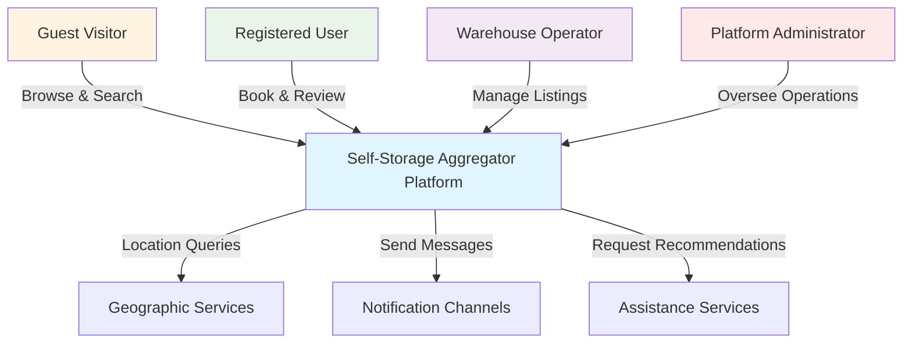
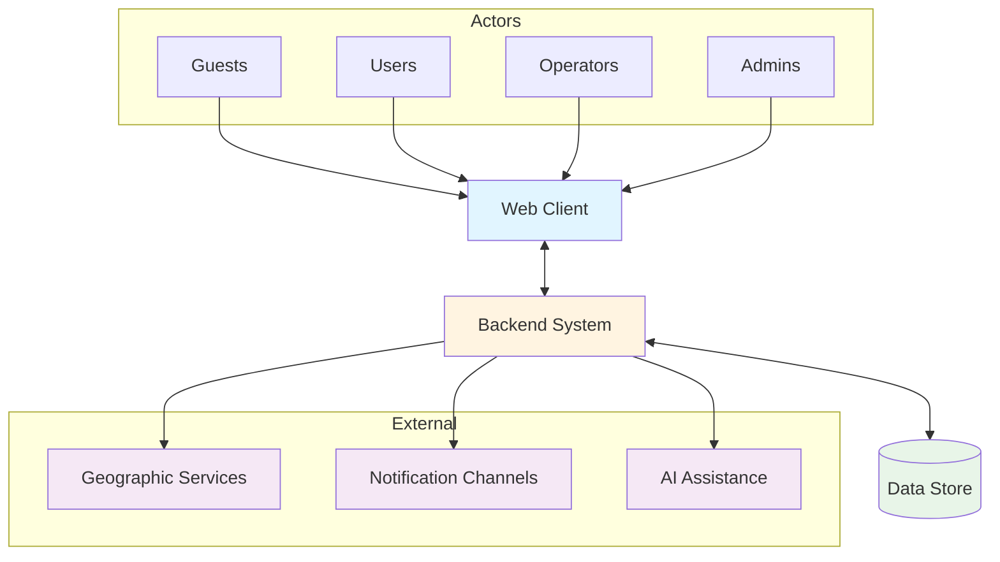
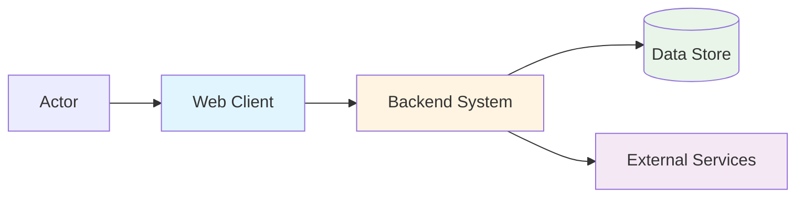

# High-Level Technical Architecture (MVP v1)

**Self-Storage Aggregator Platform**

---

## Document Information

| Field | Value |
|-------|-------|
| **Document ID** | DOC-002 |
| **Title** | High-Level Technical Architecture (MVP v1) |
| **Project** | Self-Storage Aggregator |
| **Version** | 1.0 |
| **Date** | December 16, 2025 |
| **Status** | Governance-Level Overview |
| **Audience** | Executives, Product Owners, Non-Technical Stakeholders, Investors |
| **Classification** | Strategic Architecture |

---

## 1. Purpose & Scope

### 1.1. What This Document Is

This document provides a **governance-level view** of the Self-Storage Aggregator platform's technical architecture. It describes:

- **What** major system components exist
- **Who** interacts with the platform
- **How** components relate to each other at the highest level
- **Why** certain architectural choices were made

This document is designed to be read and understood by:
- Executive leadership
- Product owners and business stakeholders
- Investors and board members
- Compliance and legal teams
- Non-technical project managers

**Reading time:** 10-15 minutes

### 1.2. What This Document Is NOT

This is **not** a technical design document. It does not contain:

- Implementation details or code structures
- Technology choices or vendor selections
- Technical protocols or data formats
- System internals or mechanics
- Development methodologies
- Operational procedures

For technical implementation details, refer to:
- Technical Architecture Document (detailed)
- API Design Blueprint
- Backend Implementation Plan
- Security and Compliance Plan

### 1.3. Document Goals

This document serves three primary purposes:

1. **Strategic Alignment** - Ensure technical direction supports business objectives
2. **Stakeholder Communication** - Provide a common understanding of system structure
3. **Governance Framework** - Establish boundaries and principles for technical decisions

---

## 2. Architectural Principles

The Self-Storage Aggregator platform is built on five core architectural principles that guide all technical decisions.

### Principle 1: Simplicity First

The architecture prioritizes clarity and maintainability over complexity. Every component serves a clear, single purpose. The system avoids unnecessary abstractions and favors straightforward solutions that can be understood and maintained by future teams.

**Why this matters:** Simpler systems are more reliable, easier to modify, and less expensive to maintain.

### Principle 2: User-Centric Design

All architectural decisions consider the end-user experience first. The system is organized around user journeys rather than technical convenience. Response to user actions takes precedence over background operations.

**Why this matters:** Business value comes from users successfully completing their goals, not from technical sophistication.

### Principle 3: Progressive Enhancement

The platform starts with essential features and adds capabilities only when clearly justified. MVP v1 delivers core value without attempting to solve all possible future needs. Features beyond immediate requirements are explicitly deferred.

**Why this matters:** Faster time to market, lower initial cost, validated assumptions before major investment.

### Principle 4: Separation of Concerns

Each system component has clear, non-overlapping responsibilities. Business logic lives separately from presentation. Data concerns remain isolated from user interactions. External integrations are contained and replaceable.

**Why this matters:** Changes to one component do not ripple unpredictably through the system.

### Principle 5: Resilience Through Isolation

The system continues operating when individual components experience issues. Critical user flows remain functional even when auxiliary features fail. External service problems do not cascade into complete system failures.

**Why this matters:** Platform availability and user trust are maintained even during partial outages.

---

## 3. System Context

### 3.1. Platform Overview

The Self-Storage Aggregator is a marketplace platform connecting people who need storage space with warehouse operators who provide it. The platform enables:

- **Discovery** - Users find suitable storage options based on location and needs
- **Comparison** - Users evaluate warehouses based on price, features, and reviews
- **Booking** - Users reserve storage boxes through an online process
- **Management** - Operators list their facilities and process reservations

### 3.2. Actors

The platform serves four distinct types of actors, each with different needs and permissions:

#### Guest

**Who they are:** Anyone visiting the platform without creating an account

**What they can do:**
- Search for warehouses by location
- View warehouse details, prices, and photos
- Read reviews from other users
- Use assistance to find appropriate storage sizes
- Browse the catalog and explore options

**What they cannot do:**
- Make reservations
- Write reviews
- Save favorites
- Manage bookings

**Why they matter:** Guests represent potential customers in the discovery phase. The platform must deliver value before requiring account creation.

#### User

**Who they are:** Registered individuals seeking storage solutions

**What they can do:**
- Everything a Guest can do, plus:
- Create booking requests for storage boxes
- Manage their active and past bookings
- Cancel reservations when plans change
- Write reviews after completing a stay
- Save favorite warehouses for later consideration
- Maintain a profile with contact information

**Why they matter:** Users are the demand side of the marketplace. Their successful bookings generate business value.

#### Operator

**Who they are:** Warehouse owners or managers listing storage facilities

**What they can do:**
- Everything a User can do, plus:
- Add and manage warehouse listings
- Define available storage boxes and pricing
- Receive and review booking requests
- Confirm or decline incoming reservations
- View occupancy information
- Monitor active tenants
- Track simple business metrics

**Why they matter:** Operators are the supply side of the marketplace. Without their listings, the platform has no inventory.

#### Admin

**Who they are:** Platform administrators with system-wide privileges

**What they can do:**
- Everything other actors can do, plus:
- Oversee all platform operations
- Moderate content and listings
- Manage user accounts
- Access system-level information
- Configure platform settings

**Why they matter:** Admins ensure platform quality, handle disputes, and maintain operational integrity.

### 3.3. External Environment

The platform operates within an ecosystem of external services and dependencies:

**Geographic Services**
- Location searches require address-to-coordinate conversion
- Map displays depend on external map providers
- Distance calculations use geographic data

**Notification Channels**
- Email communications for booking confirmations
- Text messages for time-sensitive alerts
- Optional messaging through social platforms

**Assistance Capabilities**
- Recommendation services help users find appropriate storage sizes
- Natural language understanding interprets user needs
- Fallback options ensure functionality when primary services are unavailable

**Payment Systems (Future)**
- Not included in MVP v1
- Will integrate when business model requires transaction processing

### 3.4. System Context Diagram



---

## 4. High-Level System Blocks

The platform consists of five major functional blocks. Each block has a distinct purpose and clear boundaries.

### 4.1. Web Client

**Purpose:** The interface through which all actors interact with the platform

**What it provides:**
- Visual presentation of warehouses and storage options
- Interactive search and filtering capabilities
- Forms for entering information and making requests
- Responsive layouts for different screen sizes
- Real-time updates during user interactions

**Key responsibilities:**
- Display information clearly and attractively
- Collect user input and validate immediately when possible
- Communicate with the Backend System for all operations
- Recognize authenticated user context
- Provide feedback during operations

**What it does NOT do:**
- Store any business data permanently
- Contain business logic or rules
- Process payments (not in MVP v1)
- Make direct connections to external services

**Accessed by:** All actor types (Guest, User, Operator, Admin)

### 4.2. Backend System

**Purpose:** The central orchestrator of all business operations and data management

**What it provides:**
- Business logic execution for all platform operations
- Coordination between different platform capabilities
- Rules enforcement for bookings, permissions, and workflows
- Request validation and authorization
- Integration coordination with external services

**Key responsibilities:**
- Execute all business operations (create bookings, manage listings, process reviews)
- Enforce access rules based on actor roles
- Maintain data consistency and integrity
- Coordinate external service interactions
- Generate appropriate responses to client requests

**What it does NOT do:**
- Display information to users directly
- Make business decisions autonomously
- Bypass defined business rules
- Store data in unstructured ways

**Accessed by:** The Web Client exclusively

### 4.3. Data Store

**Purpose:** Persistent storage of all platform information and relationships

**What it maintains:**
- User accounts and profiles
- Warehouse listings and details
- Storage box inventory and pricing
- Booking records and history
- Reviews and ratings
- System activity records

**Key responsibilities:**
- Preserve data reliably across time
- Support efficient information retrieval
- Maintain relationships between different types of information
- Ensure data correctness through constraints
- Enable geographic queries for location-based searches

**What it does NOT do:**
- Execute business logic
- Communicate directly with Web Client
- Make autonomous decisions about data
- Transform or process data beyond storage and retrieval

**Accessed by:** The Backend System exclusively

### 4.4. External Services

**Purpose:** Specialized capabilities provided by third-party systems

**What they provide:**

**Geographic Services:**
- Convert addresses to map coordinates
- Calculate distances between locations
- Provide map visualizations
- Support location-based searches

**Notification Channels:**
- Deliver email messages to users and operators
- Send text messages for time-sensitive information
- Enable optional social platform messaging
- Track delivery status

**What they do NOT do:**
- Store platform business data
- Execute platform business logic
- Make decisions about platform operations
- Access platform data directly

**Accessed by:** The Backend System exclusively

### 4.5. AI Assistance

**Purpose:** Intelligent recommendations to help users find appropriate storage solutions

**What it provides:**
- Box size recommendations based on item descriptions
- Natural language understanding of user needs
- Reasoning about storage requirements
- Alternative suggestions when primary recommendations are unavailable

**Key responsibilities:**
- Interpret user descriptions of items to store
- Recommend appropriate storage sizes
- Explain reasoning behind recommendations
- Provide fallback suggestions when primary service is unavailable

**What it does NOT do:**
- Store user data
- Make booking decisions
- Process payments
- Access warehouse inventory directly

**Accessed by:** The Backend System exclusively

**Note:** Only box finding capability is included in MVP v1. Additional assistance features are planned for future versions.

### 4.6. System Block Diagram



---

## 5. Conceptual Interaction Flows

This section describes how the major system blocks work together to accomplish key platform operations. These are conceptual flows showing coordination between blocks, not detailed step-by-step procedures.

### 5.1. Search & Browse Flow

**User Goal:** Find storage warehouses matching location and requirements

**Conceptual Flow:**

The Web Client presents a search interface where actors enter a location. This request travels to the Backend System, which interprets the search criteria. The Backend System queries the Data Store for warehouses matching the location parameters.

When warehouses are found, the Backend System may contact Geographic Services to enrich location information or calculate distances. The results are assembled and returned to the Web Client, which presents warehouses visually with relevant details like pricing and availability.

Actors can apply filters to narrow results. Each filter change triggers the same flow: Web Client requests, Backend System processes, Data Store retrieves, results return.

**Key Characteristic:** This flow operates entirely without actor authentication. Anyone can search and browse.

### 5.2. Booking Request Flow

**User Goal:** Reserve a specific storage box at a warehouse

**Conceptual Flow:**

The Web Client displays a warehouse's available boxes. When a User selects a box and submits a booking request, the Web Client sends this to the Backend System.

The Backend System verifies the User's identity and checks the Data Store to confirm the box is available for the requested period. If available, the Backend System records a booking request in the Data Store.

The Backend System then contacts Notification Channels to inform both the User and the Operator about the new request. The Operator must review and confirm before the booking becomes active.

**Key Characteristic:** This flow requires User authentication and involves coordination between multiple blocks.

### 5.3. Operator Management Flow

**User Goal:** Add and manage warehouse listings

**Conceptual Flow:**

An Operator accesses warehouse management through the Web Client. When adding a new warehouse, the Operator provides details like address, description, and available box sizes.

The Web Client sends this information to the Backend System, which validates the data and checks the Operator's permissions. The Backend System may contact Geographic Services to verify and convert the address to coordinates.

Once validated, the Backend System stores the warehouse information in the Data Store, making it available for searches. The Operator can subsequently modify warehouse details or add additional boxes through the same coordination pattern.

**Key Characteristic:** This flow is restricted to Operators and involves external service coordination for location validation.

### 5.4. AI-Assisted Recommendation Flow

**User Goal:** Determine appropriate storage box size based on items to store

**Conceptual Flow:**

The Web Client provides an interface where actors describe items they need to store. This description is sent to the Backend System, which forwards it to AI Assistance.

AI Assistance interprets the description and generates a box size recommendation with reasoning. This returns to the Backend System, which may enrich it with actual available boxes from the Data Store matching that size.

If AI Assistance is unavailable, the Backend System uses a simpler rule-based approach to provide recommendations. The result is returned to the Web Client regardless of which method was used.

**Key Characteristic:** This flow includes a fallback mechanism ensuring functionality even when external assistance is unavailable.

### 5.5. Interaction Flow Diagram



---

## 6. Boundaries & Responsibilities

Clear boundaries between system blocks prevent confusion and ensure each component has a well-defined role.

### 6.1. What Web Client Owns

**Owns:**
- Visual presentation and layout
- User input collection
- Immediate input validation
- Navigation between views
- Display state management
- User interaction feedback

**Does NOT own:**
- Business rule enforcement
- Data persistence
- Authorization decisions
- External service communication
- Complex calculations

**Boundary:** The Web Client never directly accesses the Data Store or External Services. All such needs go through the Backend System.

### 6.2. What Backend System Owns

**Owns:**
- All business logic execution
- Business rule enforcement
- Data consistency maintenance
- Authorization decisions
- External service coordination
- Request orchestration

**Does NOT own:**
- User interface presentation
- Direct user interaction
- Display formatting
- Navigation logic
- Long-term data storage mechanics

**Boundary:** The Backend System mediates all interactions between the Web Client and both the Data Store and External Services. No component bypasses this mediation.

### 6.3. What Data Store Owns

**Owns:**
- Persistent data retention
- Data relationship maintenance
- Query execution
- Data integrity constraints
- Geographic query capabilities

**Does NOT own:**
- Business logic execution
- Authorization decisions
- External service communication
- Data transformation logic
- Presentation formatting

**Boundary:** The Data Store responds only to requests from the Backend System. It does not initiate actions or make business decisions.

### 6.4. What External Services Own

**Owns (varies by service):**
- Geographic data and calculations
- Message delivery mechanisms
- AI recommendation generation
- Service-specific specialized capabilities

**Do NOT own:**
- Platform business data
- Platform business logic
- User account information
- Authorization decisions
- Platform operations

**Boundary:** External Services receive specific, limited requests from the Backend System and return responses. They have no access to platform data beyond what is explicitly sent in each request.

### 6.5. Responsibility Matrix

| Capability | Web Client | Backend System | Data Store | External Services |
|------------|-----------|---------------|-----------|------------------|
| Display to users | **Owns** | — | — | — |
| Collect input | **Owns** | — | — | — |
| Validate business rules | — | **Owns** | — | — |
| Execute operations | — | **Owns** | — | — |
| Store data permanently | — | — | **Owns** | — |
| Authorize actions | — | **Owns** | — | — |
| Calculate geography | — | Coordinates | — | **Owns** |
| Send notifications | — | Coordinates | — | **Owns** |
| Recommend sizes | — | Coordinates | — | **Owns** |

---

## 7. Security & Trust (Conceptual)

Security is woven throughout the platform architecture. This section describes security concepts without detailing specific methods.

### 7.1. Identity Separation

The platform maintains clear separation between different actor types. Each actor has a distinct identity that determines their capabilities. Identity verification occurs during initial access and is maintained throughout their session.

**Principle:** Know who is making each request before processing it.

### 7.2. Role-Based Boundaries

Different actors have different permissions based on their role. Guests have public access only. Users can manage their own bookings. Operators can manage their warehouses. Admins have broader oversight capabilities.

**Principle:** Permit only the actions appropriate to each actor type.

### 7.3. Data Protection Intent

The platform treats different types of data with appropriate care. Personal information receives special protection. Financial data (when added in future versions) will have the highest protection level. Public information like warehouse listings is accessible to all.

**Principle:** Protect data according to its sensitivity and regulatory requirements.

### 7.4. Trust Boundaries

Clear trust boundaries exist between system components:

- The Web Client is considered untrusted and all input from it is validated
- The Backend System is the trust authority that enforces all rules
- The Data Store trusts only the Backend System
- External Services operate in their own trust domains

**Principle:** Never assume input is safe; always verify at trust boundaries.

### 7.5. Secure Communication

All communication between actors and the platform uses protected channels. Communication between system blocks occurs over trusted internal connections. External service communication is protected appropriately.

**Principle:** Data in transit is protected from observation and tampering.

---

## 8. Non-Functional Intent

Beyond specific features, the platform pursues several qualities that affect overall user experience.

### 8.1. Reliability Intent

The platform aims to remain available and functional for users. When individual components experience issues, critical operations continue working. User bookings are not lost. Search and browse capabilities remain accessible.

**Goal:** Users can rely on the platform being available when they need it.

### 8.2. Usability Intent

The platform prioritizes ease of use for all actors. Complex operations are broken into simple steps. Feedback is immediate and clear. Help is available when needed. The interface works well on different devices.

**Goal:** Actors accomplish their goals without confusion or frustration.

### 8.3. Correctness Intent

The platform maintains data accuracy and consistency. Bookings do not conflict. Inventory reflects reality. Reviews are associated with the correct warehouses. Financial calculations (when added) are precise.

**Goal:** Users can trust the information and operations the platform provides.

### 8.4. Responsiveness Intent

The platform responds to user actions quickly. Search results appear promptly. Page transitions are smooth. Feedback to user actions is immediate. Background operations do not block user interactions.

**Goal:** Users perceive the platform as fast and responsive.

### 8.5. Data Integrity Intent

The platform prevents data corruption and loss. Related information remains connected correctly. Required information is always present. Constraints prevent invalid states. The system is designed with data recoverability in mind.

**Goal:** Platform data remains accurate and recoverable over time.

---

## 9. MVP Constraints

The MVP v1 scope is deliberately limited to validate core value quickly. The following capabilities are intentionally excluded.

### 9.1. Payment Processing

**Not Included:** Online payment, billing, invoicing, refunds

**Rationale:** Business model can be validated through booking intent before adding payment complexity. Operators handle payment through existing external processes.

**Future:** Payment integration planned for v1.1 once demand is validated.

### 9.2. Advanced Automation

**Not Included:** Automated booking confirmations, smart pricing, dynamic inventory management, automated follow-ups

**Rationale:** Manual processes work adequately at MVP scale. Automation added when volume justifies the investment.

**Future:** Selective automation based on operator feedback and transaction volume.

### 9.3. Analytics & Reporting

**Not Included:** Business intelligence, revenue analytics, conversion funnels, market insights

**Rationale:** Basic metrics sufficient for MVP. Comprehensive analytics require established user base to be meaningful.

**Future:** Analytics platform planned when data volume supports meaningful insights.

### 9.4. Extended AI Capabilities

**Not Included:** Price optimization, automatic description generation, predictive analytics, advanced search

**Rationale:** Box size recommendation validates AI value. Additional capabilities added based on user response and ROI.

**Future:** Progressive AI enhancement as value is demonstrated.

### 9.5. Multi-Tenant Operations

**Not Included:** Sub-accounts for operators, team management, permission hierarchies

**Rationale:** Single operator account sufficient for MVP warehouse management. Added when larger operators need delegation.

**Future:** Team features for operators managing multiple staff members.

### 9.6. Advanced Integration

**Not Included:** Third-party system connections, public API for partners, webhook systems

**Rationale:** Platform stands alone initially. Integrations added when ecosystem demands them.

**Future:** Partner API when value proposition is proven.

---

## 10. Risks & Trade-offs

Every architectural decision involves trade-offs. This section acknowledges key risks and the rationale for accepting them.

### 10.1. Simplified Architecture Risk

**Trade-off:** The architecture prioritizes simplicity over technical sophistication.

**Risk:** May need significant refactoring if usage exceeds expectations.

**Mitigation:** Architecture allows progressive enhancement. Critical components can be replaced without complete redesign.

**Acceptance Rationale:** MVP needs quick validation. Premature optimization is wasteful if market fit is not found.

### 10.2. Manual Process Risk

**Trade-off:** Operators manually confirm bookings rather than automatic confirmation.

**Risk:** Slower booking process might frustrate users. Operators might not respond quickly.

**Mitigation:** Notification systems ensure operators are promptly informed. Future automation can be added based on data about operator response times.

**Acceptance Rationale:** Manual confirmation allows operators to verify capacity and avoid conflicts during MVP phase. Automation added when patterns are understood.

### 10.3. External Service Dependency Risk

**Trade-off:** Platform depends on external providers for geographic services, notifications, and AI assistance.

**Risk:** External service outages affect platform functionality. Cost uncertainty as usage grows.

**Mitigation:** Fallback mechanisms for critical flows. Multiple provider options. Contractual agreements for availability.

**Acceptance Rationale:** Building these capabilities internally is not cost-effective at MVP scale. External services provide professional-grade functionality immediately.

### 10.4. Limited Initial Scale Risk

**Trade-off:** Architecture is optimized for MVP scale (hundreds of users, dozens of warehouses).

**Risk:** Architecture needs modification if growth exceeds expectations.

**Mitigation:** Architecture uses standard patterns that scale well. Growth can be accommodated through progressive enhancement rather than complete rebuild.

**Acceptance Rationale:** Unknown whether product will achieve market fit. Investing in large-scale architecture prematurely wastes resources.

### 10.5. Deferred Payment Risk

**Trade-off:** Payment processing excluded from MVP.

**Risk:** Harder to monetize immediately. Users might book without paying. Revenue validation delayed.

**Mitigation:** Booking intent still measurable. Operators handle payment through existing methods. Payment integration is straightforward addition.

**Acceptance Rationale:** Core value is connecting users with appropriate storage. Payment is important but not required to validate this value proposition.

---

## 11. Relationship to Other Documents

This high-level architecture serves as a governance anchor. Other documents provide progressively more detailed views of specific aspects.

### 11.1. Related Documents

**Functional Specification**
- **Relationship:** Defines WHAT the platform must do
- **This document:** Defines WHAT major blocks exist to do it
- **Use together:** Functional requirements map to architectural blocks

**Technical Architecture Document (Detailed)**
- **Relationship:** Contains all implementation-level architecture decisions
- **This document:** Provides governance-level overview
- **Use together:** This document for stakeholder communication, detailed document for development

**API Design Blueprint**
- **Relationship:** Specifies exact interfaces between Web Client and Backend System
- **This document:** Describes conceptual interaction between these blocks
- **Use together:** API implements the conceptual interactions described here

**Backend Implementation Plan**
- **Relationship:** Details internal structure of Backend System block
- **This document:** Treats Backend System as a single conceptual unit
- **Use together:** This document for understanding purpose, implementation plan for building it

**Security and Compliance Plan**
- **Relationship:** Specifies exact security controls and compliance requirements
- **This document:** Describes security concepts and trust boundaries
- **Use together:** This document for strategic security understanding, security plan for implementation

### 11.2. Document Hierarchy

```
[This Document: High-Level Architecture]
    Governance view for all stakeholders
    â†"
[Functional Specification]
    Business requirements and user stories
    â†"
[Technical Architecture (Detailed)]
    Implementation architecture decisions
    â†"
[API Blueprint] + [Backend Plan] + [Security Plan]
    Specific technical specifications
```

### 11.3. When to Use This Document

**Use this document when:**
- Explaining the platform to non-technical stakeholders
- Making strategic architecture decisions
- Evaluating alignment with business goals
- Onboarding executives or board members
- Presenting to investors
- Planning major platform changes

**Use other documents when:**
- Implementing specific features
- Making technology choices
- Designing detailed systems
- Writing code
- Conducting security audits
- Planning operations

---

## 12. Conclusion

The Self-Storage Aggregator platform architecture balances simplicity with flexibility. Five major blocks work together to create a marketplace connecting storage seekers with warehouse operators.

**Core Strengths:**
- Clear separation of concerns
- Resilient to component failures
- Understandable by non-technical stakeholders
- Capable of progressive enhancement
- Aligned with business goals

**MVP Focus:**
- Essential features only
- Quick market validation
- Manageable complexity
- Proven patterns
- Cost-effective operation

**Future Ready:**
- Enhancement without replacement
- Scale when justified
- Automation as learned
- Integration when beneficial
- Progressive sophistication

This architecture provides a solid foundation for validating the platform's value proposition while remaining flexible enough to grow with demonstrated success.

---

**Document End**

*For detailed technical specifications, refer to the Technical Architecture Document and related implementation specifications.*
