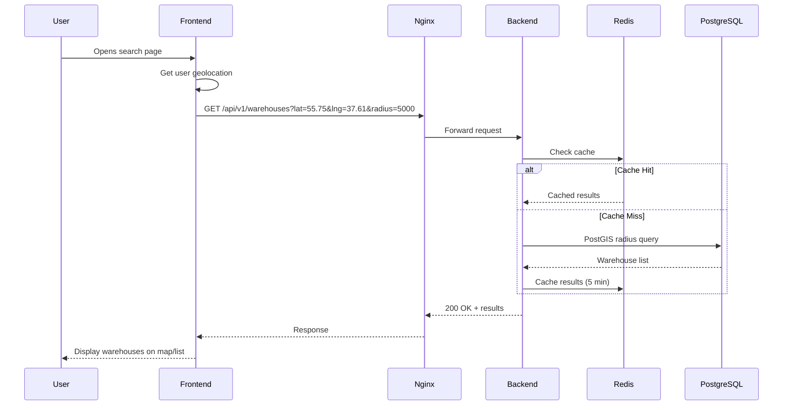
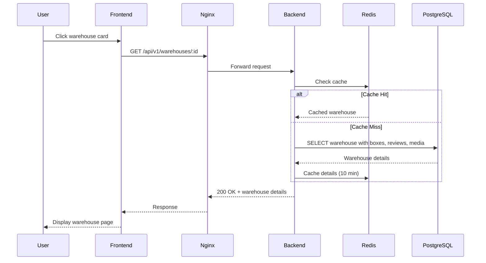
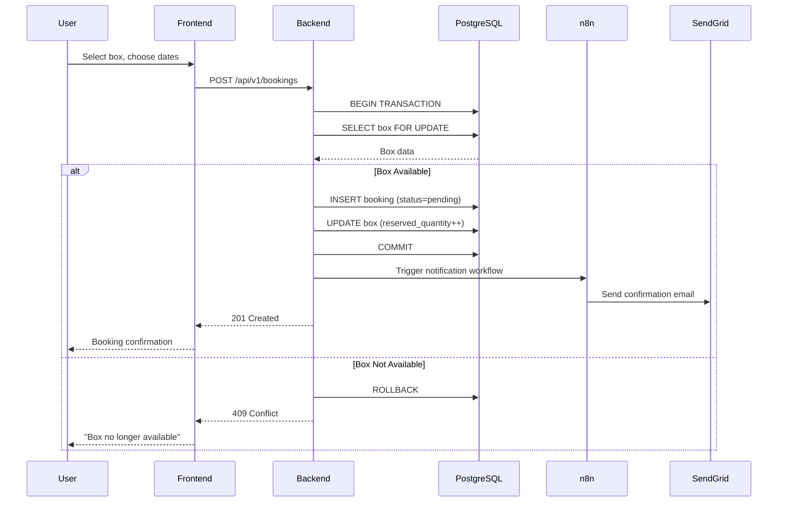
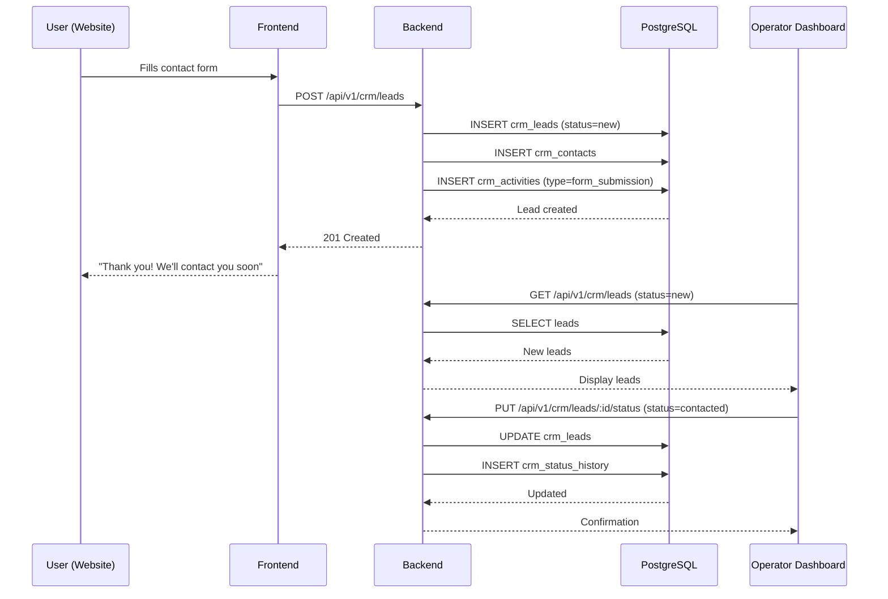
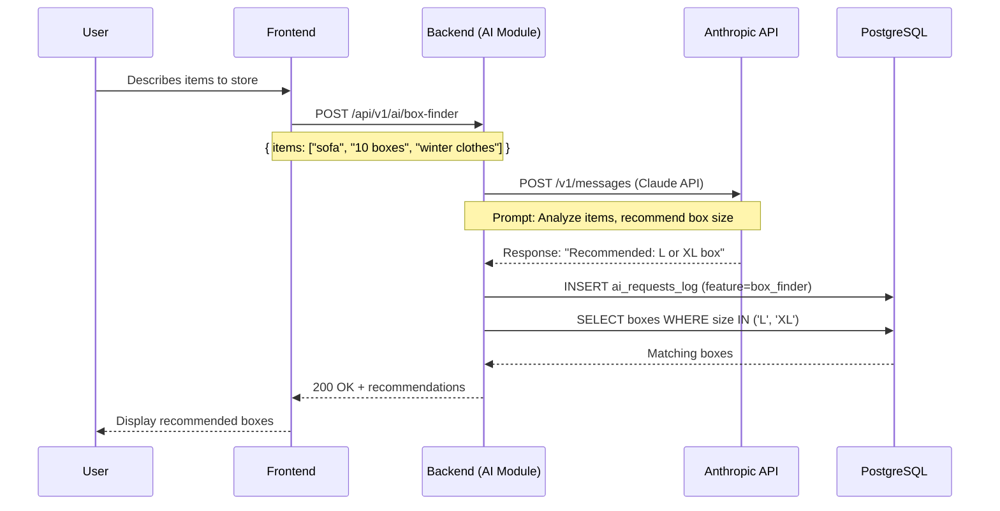

# Technical Architecture Document
# Self-Storage Aggregator MVP v1

**Version:** 2.1 (Final - Canonical)  
**Date:** December 15, 2025  
**Status:** ✅ Final - Strictly Aligned with MVP v1 Core Specifications  
**Project:** Self-Storage Aggregator MVP

---

## Document Information

| Field | Value |
|-------|-------|
| **Purpose** | Define complete technical architecture for MVP v1 ONLY |
| **Scope** | Monolithic backend, frontend, database, integrations (MVP minimal) |
| **Architecture Style** | Monolith-first (NestJS) |
| **Target Audience** | Backend developers, DevOps, System architects |
| **Dependencies** | Functional Spec, API Blueprint, Database Spec, Backend Plan |
| **Canonical Status** | All specifications defer to CORE documents |

---

## Table of Contents

1. [Overview & Scope (MVP v1 Only)](#1-overview--scope-mvp-v1-only)
2. [High-Level Architecture (Monolith + External Services)](#2-high-level-architecture)
3. [Core Modules & Responsibilities](#3-core-modules--responsibilities)
4. [Data Flows (Key Scenarios)](#4-data-flows)
5. [Integration Points](#5-integration-points)
6. [Error Handling & Logging](#6-error-handling--logging)
7. [Security & Access Control](#7-security--access-control)
8. [Performance & Scalability (MVP-Level)](#8-performance--scalability)
9. [Deployment & Infrastructure](#9-deployment--infrastructure)
10. [Out of Scope / Future Architecture Directions](#10-out-of-scope--future-architecture)

---

# 1. Overview & Scope (MVP v1 Only)

## 1.1. Architecture Philosophy

The Self-Storage Aggregator MVP v1 follows a **monolith-first approach**:

**Core Principles:**
- ✅ **Single deployment unit** - NestJS backend monolith
- ✅ **Modular design** - Clear separation of concerns within monolith
- ✅ **MVP-focused** - Only features required for launch
- ✅ **Production-ready** - Robust, scalable to 5,000 MAU
- ✅ **Pragmatic** - No over-engineering, no premature optimization

**Why Monolith for MVP:**
- Faster development and deployment
- Simpler debugging and testing
- Lower infrastructure costs
- Easier team coordination (< 5 developers)
- Sufficient for projected load (< 10 RPS peak)

**When to consider microservices:** Only when MAU > 10,000, RPS > 100, or team > 8 developers (see [Section 10](#10-out-of-scope--future-architecture)).

## 1.2. Scope Definition

### In Scope for MVP v1:

**Frontend:**
- Next.js 14 + React 18 web application
- Server-Side Rendering (SSR) for SEO
- Responsive design (mobile-first)
- Public pages + authenticated user flows

**Backend:**
- NestJS 10 monolithic API
- RESTful endpoints (as per API Blueprint)
- JWT-based authentication
- Role-based access control (user, operator, admin)

**Data Layer:**
- PostgreSQL 15 + PostGIS for geospatial queries
- Redis 7 for caching and sessions
- Prisma ORM for database access

**AI Integration (MVP MINIMAL):**
- AI module within backend monolith (not separate service)
- Anthropic Claude API for **box size recommendations ONLY**
- Single feature: Box Finder / Size Recommendation

**External Services:**
- Google Maps API (primary)
- Email (SendGrid) + SMS (Twilio + WhatsApp Business API)
- n8n for workflow automation
- S3-compatible storage (AWS S3 or MinIO)

**CRM Module:**
- Lead management system (integrated in monolith)
- Contact tracking
- Activity logging
- Status workflow management

### Out of Scope for MVP v1 (Future Versions):

- ❌ AI Price Analysis
- ❌ AI Description Generation
- ❌ AI Chat Hints / Customer Support
- ❌ Microservices architecture
- ❌ Event sourcing / CQRS
- ❌ Message queues (RabbitMQ, Kafka)
- ❌ Advanced ML pipelines
- ❌ Dynamic pricing engine
- ❌ Multi-region deployment
- ❌ Real-time analytics dashboards
- ❌ Advanced operator/admin analytics

---

# 2. High-Level Architecture

## 2.1. System Components Diagram

```
┌──────────────────────────────────────────────────────────────┐
│                     Users / Browsers                          │
│              (Web + Mobile Browsers)                          │
└────────────────────────┬─────────────────────────────────────┘
                         │
                         │ HTTPS
                         │
                ┌────────▼──────────┐
                │   Cloudflare CDN  │
                │   - DDoS Protection│
                │   - SSL/TLS       │
                │   - Static Assets │
                └────────┬──────────┘
                         │
                ┌────────▼──────────┐
                │   Nginx Gateway   │
                │   - Load Balancer │
                │   - Rate Limiting │
                │   - SSL Termination│
                └────────┬──────────┘
                         │
        ┌────────────────┼────────────────┐
        │                │                │
┌───────▼────────┐  ┌────▼──────────┐ ┌──▼────────────┐
│   Frontend     │  │   Backend API │ │   n8n         │
│   Next.js 14   │  │   NestJS 10   │ │   Automation  │
│   SSR + CSR    │  │   Monolith    │ │   Workflows   │
│   Port: 3000   │  │   Port: 4000  │ │   Port: 5678  │
└───────┬────────┘  └────┬──────────┘ └──┬────────────┘
        │                │                │
        └────────────────┼────────────────┘
                         │
        ┌────────────────┼────────────────┐
        │                │                │
┌───────▼────────┐  ┌────▼──────────┐ ┌──▼────────────┐
│  PostgreSQL 15 │  │  Redis 7      │ │  File Storage │
│  + PostGIS     │  │  Cache        │ │  S3/MinIO     │
│  Port: 5432    │  │  Port: 6379   │ │  Port: 9000   │
└────────────────┘  └───────────────┘ └───────────────┘
                         │
                         │ External APIs
                         │
        ┌────────────────┼────────────────┐
        │                │                │
┌───────▼───────┐  ┌─────▼────────┐  ┌───▼──────────┐
│ Anthropic API │  │  Google Maps │  │  SendGrid    │
│ (Box Finder)  │  │  + Google    │  │  + Twilio    │
└───────────────┘  └──────────────┘  └──────────────┘
```

## 2.2. API Base URL Convention

**Canonical API Base Path:** All backend endpoints are prefixed with `/api/v1`

**Examples:**
- `GET /api/v1/warehouses`
- `POST /api/v1/bookings`
- `GET /api/v1/users/me`

**Frontend API Client Configuration:**
```typescript
const API_BASE_URL = process.env.NEXT_PUBLIC_API_URL || 'http://localhost:4000/api/v1';
```

**Note:** Throughout this document, when referring to endpoints, the `/api/v1` prefix is implied unless stated otherwise.

## 2.3. Component Descriptions

### 2.3.1. Frontend Layer (Next.js)

**Technology Stack:**
- Next.js 14 (React 18, TypeScript 5)
- Tailwind CSS for styling
- React Query for server state management
- Zustand for client state
- Axios for HTTP requests

**Responsibilities:**
- Server-Side Rendering (SSR) for SEO
- Public pages (home, catalog, warehouse details, map)
- Authenticated user flows (bookings, profile, favorites)
- Operator dashboard (basic)
- Responsive UI (mobile-first)

**Key Features:**
- ISR (Incremental Static Regeneration) for warehouse pages
- Client-side routing with shallow navigation
- Optimistic UI updates
- Error boundaries for graceful error handling
- Image optimization with Next.js Image component

### 2.3.2. API Gateway Layer (Nginx)

**Responsibilities:**
- Reverse proxy to backend services
- SSL/TLS termination
- Load balancing (single instance in MVP, multiple in production)
- Rate limiting (per IP, per user)
- Static file serving
- Request/response logging

**Rate Limits:** As defined in `API_Rate_Limiting_&_Throttling_Specification_MVP_v1.md` (defer to spec for specific values)

### 2.3.3. Backend API Layer (NestJS Monolith)

**Technology Stack:**
- NestJS 10 (Node.js 20, TypeScript 5)
- Prisma ORM for database access
- class-validator + class-transformer for DTO validation
- Passport.js + JWT for authentication
- Winston for logging

**Architecture Pattern:**
```
Controllers → Services → Repositories → Database
           ↘ Integrations → External APIs
```

**Core Modules** (as per Backend Implementation Plan):
- `auth/` - Authentication & authorization
- `users/` - User management
- `operators/` - Operator profiles & settings
- `warehouses/` - Warehouse CRUD & search
- `boxes/` - Box inventory management
- `bookings/` - Booking workflow & state machine
- `reviews/` - User reviews & ratings
- `favorites/` - User favorites
- `files/` - File upload & storage

**Integration Modules:**
- `integrations/ai/` - AI features (Anthropic Claude API)
  - `box-finder.service.ts` - **Box size recommendations (ONLY MVP feature)**
- `integrations/maps/` - Geolocation services
  - `google-maps.client.ts` - Primary provider
  - `google-maps.client.ts` - Fallback provider
- `integrations/notifications/` - Multi-channel notifications
  - `email.service.ts` - SendGrid integration
  - `sms.service.ts` - Twilio integration
- `integrations/storage/` - File storage
  - `s3.client.ts` - S3-compatible storage

**CRM Module:**
- `crm/leads/` - Lead management
- `crm/contacts/` - Contact tracking
- `crm/activities/` - Activity logging
- `crm/pipelines/` - Pipeline & status management

**Supporting Modules:**
- `common/` - Shared utilities, guards, decorators, filters
- `config/` - Configuration management
- `database/` - Prisma client & migrations
- `health/` - Health check endpoints

**Background Tasks:**
- **MVP Minimal:** Simple scheduled tasks (cron) for booking expiration
- **Optional:** Bull + Redis queues (can be replaced by cron in MVP)
- Primarily used for: Expire pending bookings after 24h

**Key Responsibilities:**
- Business logic execution
- Data validation
- Transaction management
- Error handling & transformation
- Logging & monitoring
- External service integration

### 2.3.4. Database Layer (PostgreSQL + PostGIS)

**Technology:** PostgreSQL 15 + PostGIS 3.4

**Canonical Tables** (as per `full_database_specification_mvp_v1.md`):

**User Management:**
- `users` - Platform users (clients + operators)
- `operators` - Operator profiles
- `operator_settings` - Operator preferences
- `refresh_tokens` - JWT refresh tokens

**Warehouse & Inventory:**
- `warehouses` - Storage facilities
- `boxes` - Storage boxes/units
- `media` - Photos & videos

**Attributes & Services (TBD - must verify with DB spec):**
- `attributes` - Warehouse features reference
- `warehouse_attributes` - M:N junction table
- `services` - Additional services reference
- `warehouse_services` - M:N junction table
- `prices` - Price history (if confirmed in DB spec)

**Bookings & Reviews:**
- `bookings` - Booking records with state machine
- `reviews` - User reviews with ratings
- `favorites` - User favorites (M:N)

**CRM:**
- `crm_leads` - Lead records
- `crm_contacts` - Contact information
- `crm_activities` - Activity log
- `crm_status_history` - Lead status transitions
- `crm_activity_types` - Activity type reference

**Supporting:**
- `ai_requests_log` - AI request logging (box recommendations only in MVP)
- `files` - File metadata

**Tables requiring verification against DB spec:**
- `geo_cache` - Geocoding cache (TBD)
- `notifications` - Notification queue (TBD)
- `events_log` - System events audit log (TBD)

**Note:** Any table not explicitly confirmed in `full_database_specification_mvp_v1.md` should be verified before implementation.

**Key Features:**
- PostGIS for geospatial queries (radius search, distance calculation)
- Full-text search with pg_trgm
- Soft delete for critical tables (users, warehouses, bookings)
- Triggers for automatic `updated_at` timestamps
- JSONB columns for flexible metadata

### 2.3.5. Cache Layer (Redis)

**Technology:** Redis 7

**Use Cases:**
- Session storage (JWT refresh tokens)
- API response caching
  - Warehouse search results: 5 min TTL
  - Warehouse details: 10 min TTL
  - Box availability: 2 min TTL
- Rate limiting counters
- (Optional) Background job queues if using Bull
- Real-time data (booking availability)

**Cache Strategy:**
- Cache-aside pattern
- Lazy loading
- TTL-based expiration
- Manual invalidation on updates

### 2.3.6. n8n Automation Layer

**Technology:** n8n (self-hosted workflow automation)

**MVP Workflows:**
- Email notifications (booking confirmation, reminders)
- SMS notifications (booking alerts, verification codes)
- Scheduled tasks (expiry checks via webhook)

**Why n8n:**
- Visual workflow builder
- Self-hosted (no data leaves infrastructure)
- 300+ integrations
- Easy debugging & monitoring

---

# 3. Core Modules & Responsibilities

## 3.1. Frontend Modules

### Public Web Application

**Pages:**
- `/` - Home page with search
- `/catalog` - Warehouse listing with filters
- `/warehouse/[id]` - Warehouse details
- `/map` - Interactive map view
- `/about`, `/contact`, `/faq` - Static pages

**Authenticated User Pages:**
- `/profile` - User profile management
- `/bookings` - User booking history
- `/favorites` - Saved warehouses
- `/booking/[id]` - Booking details

**Operator Dashboard (Basic):**
- `/operator/dashboard` - Overview (basic metrics, NO advanced analytics in MVP)
- `/operator/warehouses` - Warehouse management
- `/operator/bookings` - Booking management
- `/operator/leads` - CRM lead management

**Admin Panel (Future):**
- ❌ `/admin/*` - Out of MVP scope

## 3.2. Backend API Modules

### 3.2.1. Authentication & Authorization

**Module:** `auth/`

**Endpoints:** (prefix: `/api/v1`)
- `POST /auth/register` - User registration
- `POST /auth/login` - User login (JWT)
- `POST /auth/refresh` - Token refresh
- `POST /auth/logout` - Logout
- `POST /auth/forgot-password` - Password reset request
- `POST /auth/reset-password` - Password reset confirmation

**Responsibilities:**
- JWT token generation & validation
- Password hashing (bcrypt)
- Refresh token management
- Role-based access control (RBAC)
- Session management

**Security:** Token expiry and hashing parameters are defined in `Security_and_Compliance_Plan_MVP_v1.md`

### 3.2.2. User Management

**Module:** `users/`

**Endpoints:** (prefix: `/api/v1`)
- `GET /users/me` - Current user profile
- `PUT /users/me` - Update profile
- `PUT /users/me/password` - Change password
- `DELETE /users/me` - Delete account (soft delete)

**Responsibilities:**
- User profile CRUD
- Password management
- Account deletion (soft delete)
- Role management

### 3.2.3. Warehouse Management

**Module:** `warehouses/`

**Endpoints:** (prefix: `/api/v1`)
- `GET /warehouses` - Search warehouses with filters
- `GET /warehouses/:id` - Get warehouse details
- `POST /warehouses` - Create warehouse (operator only)
- `PUT /warehouses/:id` - Update warehouse (operator only)
- `DELETE /warehouses/:id` - Delete warehouse (operator only)

**Search Filters:**
- Geolocation (lat, lng, radius)
- Price range
- Box sizes
- Attributes (climate control, 24/7 access, security)
- Services (packing, delivery, insurance)
- Rating
- Availability

**Responsibilities:**
- Warehouse CRUD operations
- Geospatial search (PostGIS)
- Full-text search
- Rating calculation (denormalized)
- Media management

### 3.2.4. Box Management

**Module:** `boxes/`

**Endpoints:** (prefix: `/api/v1`)
- `GET /warehouses/:warehouseId/boxes` - List boxes
- `GET /boxes/:id` - Get box details
- `POST /warehouses/:warehouseId/boxes` - Create box (operator)
- `PUT /boxes/:id` - Update box (operator)
- `DELETE /boxes/:id` - Delete box (operator)

**Responsibilities:**
- Box inventory management
- Availability tracking (total, available, reserved, occupied)
- Price management
- Size categorization (S, M, L, XL)

### 3.2.5. Booking Management

**Module:** `bookings/`

**Endpoints:** (prefix: `/api/v1`)
- `POST /bookings` - Create booking
- `GET /bookings` - List user bookings
- `GET /bookings/:id` - Get booking details
- `PUT /bookings/:id/confirm` - Confirm booking (operator)
- `PUT /bookings/:id/cancel` - Cancel booking (user/operator)
- `PUT /bookings/:id/complete` - Complete booking (operator)

**Canonical Booking State Machine:**
```
pending → confirmed → cancelled
                  ↘ completed
                  ↘ expired
```

**State Definitions:**
- `pending` - Initial state after creation (awaiting operator confirmation)
- `confirmed` - Operator approved booking
- `cancelled` - Booking cancelled by user or operator
  - When operator rejects: `status=cancelled`, `cancel_reason="rejected by operator"`, `cancelled_by=operator`
- `completed` - Rental period successfully ended
- `expired` - Auto-expired after 24h without confirmation

**State Transitions:**
- `pending → confirmed` - Operator approves booking
- `pending → cancelled` - User cancels OR operator rejects (sets cancel_reason)
- `pending → expired` - Auto-expire after 24h (scheduled task)
- `confirmed → cancelled` - User or operator cancels
- `confirmed → completed` - Rental period ends successfully

**Responsibilities:**
- Booking creation with validation
- Box availability check (with row-level locking)
- State machine management
- Notifications on state changes
- Price calculation
- Concurrent booking prevention

### 3.2.6. Review & Rating System

**Module:** `reviews/`

**Endpoints:** (prefix: `/api/v1`)
- `POST /warehouses/:warehouseId/reviews` - Create review
- `GET /warehouses/:warehouseId/reviews` - List reviews
- `PUT /reviews/:id` - Update review (author only)
- `DELETE /reviews/:id` - Delete review (author/admin)

**Responsibilities:**
- Review CRUD
- Rating calculation & update (denormalized in warehouses table)
- Review moderation
- Prevent duplicate reviews (1 review per user per warehouse)

### 3.2.7. AI Integration Module (MVP MINIMAL)

**Module:** `integrations/ai/`

**MVP Feature (ONLY ONE):**

**1. Box Size Recommendation / Box Finder**
   - **Endpoint:** `POST /api/v1/ai/box-finder` (or similar as per API Blueprint)
   - **Input:** User description of items to store (text)
   - **Process:** Claude API analyzes items, recommends box size(s)
   - **Output:** Recommended box sizes (S, M, L, XL) with reasoning
   - **Implementation:** `src/integrations/ai/features/box-finder.service.ts`

**Integration Details:**
- AI calls are synchronous HTTP requests to Anthropic API
- All requests logged to `ai_requests_log` table
- Error handling with fallback to size-based search
- Rate limiting to prevent abuse

**Out of MVP Scope (Future v2+):**
- ❌ Price Analyzer
- ❌ Description Generator
- ❌ Chat Hints / Customer Support AI

**Note:** AI is NOT a separate microservice - it's a module within the NestJS monolith under `src/integrations/ai/`.

### 3.2.8. CRM Module

**Module:** `crm/`

**Sub-modules:**
- `crm/leads/` - Lead management
- `crm/contacts/` - Contact management
- `crm/activities/` - Activity tracking
- `crm/pipelines/` - Pipeline & stage management

**Endpoints:** (prefix: `/api/v1/crm`)
- `GET /leads` - List leads with filters
- `POST /leads` - Create lead
- `GET /leads/:id` - Get lead details
- `PUT /leads/:id` - Update lead
- `PUT /leads/:id/status` - Update lead status
- `POST /leads/:id/activities` - Log activity
- `GET /leads/:id/activities` - Get activity history

**Lead Status Workflow:**
```
new → contacted → qualified → converted
                            ↘ lost
```

**Responsibilities:**
- Lead capture & tracking
- Contact information management
- Activity logging (calls, emails, meetings)
- Status transition history
- Lead assignment to operators

---

# 4. Data Flows

## 4.1. Search & Browse Flow



**Key Points:**
- Geolocation detection in browser
- Cache-first strategy
- PostGIS for radius search
- Results include distance calculation
- Pagination support (20 items per page)

## 4.2. Warehouse Details Flow



**Included Data:**
- Warehouse info (address, description, rating)
- Available boxes with prices
- Photos & videos
- Recent reviews
- Operator contact info
- Attributes & services

## 4.3. Booking Flow



**Key Points:**
- Row-level locking to prevent double-booking
- Transactional integrity
- Async notifications via n8n
- State machine: `pending → confirmed/cancelled/expired`
- Auto-expire after 24h if not confirmed (scheduled task)

## 4.4. CRM Lead Handling Flow



**Key Points:**
- Lead capture from multiple sources (forms, chat, calls)
- Activity tracking for all interactions
- Status workflow management
- Assignment to operators
- History audit trail

## 4.5. AI-Assisted Box Recommendation Flow (MVP ONLY FEATURE)



**Key Points:**
- **ONLY AI feature in MVP v1**
- AI module is part of backend monolith (not separate service)
- Synchronous API call to Anthropic
- All requests logged for monitoring
- Fallback to size-based search if AI fails
- Rate limiting to prevent abuse

---

# 5. Integration Points

## 5.1. AI Integration (Anthropic Claude API) - MVP MINIMAL

**Module Location:** `src/integrations/ai/` (within backend monolith)

**Integration Type:** Synchronous HTTP REST API

**MVP Feature:**
- **Box Finder:** `src/integrations/ai/features/box-finder.service.ts`
  - Analyzes user's item description
  - Returns recommended box sizes (S, M, L, XL)
  - Provides reasoning for recommendation

**Configuration:**
- API Key: Stored in environment variables
- Model: Claude Sonnet 3.5
- Max tokens: 1000-2000
- Timeout: 30 seconds

**Error Handling:**
- Timeout: Return fallback response (size-based selection)
- Rate limit: Queue request or return cached response
- API error: Log error, return generic response
- All errors logged to `ai_requests_log` table

**Logging:**
Table: `ai_requests_log`
- `id`, `user_id`, `feature` (always 'box_finder' in MVP), `prompt`, `response`, `tokens_used`, `duration_ms`, `status`, `created_at`

**Future Features (NOT in MVP):**
- ❌ Price Analysis
- ❌ Description Generation
- ❌ Chat Hints

## 5.2. Maps Integration (Google Maps API)

**Module Location:** `src/integrations/maps/`

**Providers:**
- **Primary:** Google Maps API
- **Fallback:** Google Maps API

**Services:**
- Geocoding (address → coordinates)
- Reverse geocoding (coordinates → address)
- Distance calculation

**Google Maps Advantages for UAE:**
- Excellent coverage for UAE cities
- More accurate addresses
- Better POI data
- Free tier: 25,000 requests/day

**Implementation:**
```typescript
// maps.service.ts
async geocode(address: string): Promise<Coordinates> {
  try {
    return await this.googleMaps.geocode(address);
  } catch (error) {
    // Fallback to Google
    return await this.googleMaps.geocode(address);
  }
}
```

**Caching:**
- Geocoding results cached (implementation TBD: Redis or DB table)
- TTL: 30 days
- Cache key: Hash of normalized address

## 5.3. Notification Integration

**Module Location:** `src/integrations/notifications/`

**Channels:**
- Email (SendGrid)
- SMS (Twilio + WhatsApp Business API)

**Email Templates (MVP):**
- Booking confirmation
- Booking reminder (24h before start)
- Booking expiration warning
- Password reset
- Operator notifications (new booking, review)

**SMS Templates (MVP):**
- Booking confirmation code
- Payment confirmation (future)
- Booking reminder

**Notification Flow:**
1. Backend triggers notification
2. Request sent to n8n workflow
3. n8n calls appropriate service (SendGrid, Twilio)
4. Delivery status logged (implementation TBD)

**Queue:** Optional Bull + Redis for async processing (can be replaced by cron in MVP)

## 5.4. Storage Integration (S3/MinIO)

**Module Location:** `src/integrations/storage/`

**Supported Providers:**
- AWS S3 (production)
- MinIO (local development)

**Use Cases:**
- Warehouse photos & videos
- User profile avatars
- Operator documents
- Booking attachments (future)

**Implementation:**
- Presigned URLs for direct upload (client → S3)
- Metadata stored in `files` table
- Image optimization (future)
- CDN integration via Cloudflare

**File Structure:**
```
bucket/
├── warehouses/
│   ├── {warehouse_id}/
│   │   ├── photos/
│   │   └── videos/
├── avatars/
│   └── {user_id}.jpg
└── documents/
    └── {operator_id}/
```

## 5.5. n8n Automation Workflows

**MVP Workflows:**
1. **Booking Notifications**
   - Trigger: Booking state change
   - Actions: Send email + SMS
   - Delay: Immediate

2. **Booking Reminders**
   - Trigger: Scheduled (daily cron)
   - Actions: Check bookings starting tomorrow, send reminders
   - Delay: 24h before start

3. **Booking Expiration**
   - Trigger: Scheduled (hourly cron) OR webhook from backend
   - Actions: Check pending bookings > 24h, mark as expired
   - Delay: Hourly

4. **Review Request**
   - Trigger: Booking completed
   - Actions: Send review request email
   - Delay: 1 day after completion

5. **Operator Alerts**
   - Trigger: New booking, new review
   - Actions: Send email/SMS to operator
   - Delay: Immediate

**Benefits:**
- Visual workflow builder
- Easy debugging
- No code changes for workflow updates
- Centralized monitoring

---

# 6. Error Handling & Logging

## 6.1. Canonical Error Response Format

As per **Error_Handling_&_Fault_Tolerance_Specification_MVP_v1.md**, all API errors use this canonical envelope:

```json
{
  "success": false,
  "error": {
    "code": "box_not_available",
    "message": "Unfortunately, the box was just reserved",
    "details": {
      "box_id": 123,
      "warehouse_id": 45
    }
  },
  "request_id": "req_abc123",
  "timestamp": "2025-12-15T10:30:00Z"
}
```

**Canonical Fields:**
- `success`: Always `false` for errors
- `error.code`: Machine-readable error code (e.g., `box_not_available`, `validation_error`)
- `error.message`: Human-readable message (localized)
- `error.details`: Additional context (optional)
- `request_id`: Unique request identifier for tracing
- `timestamp`: ISO 8601 timestamp

**This format is used consistently across:**
- All HTTP error responses (4xx, 5xx)
- Validation errors
- Business logic errors
- External service errors

For complete error taxonomy and handling strategies, refer to:
- **Error_Handling_&_Fault_Tolerance_Specification_MVP_v1.md**

## 6.2. Error Handling Strategy

### Layer-by-Layer Error Handling:

**1. API Gateway (Nginx):**
- 429 Rate Limit Exceeded
- 502 Bad Gateway (backend down)
- 504 Gateway Timeout
- All logged to nginx access logs

**2. Backend API (NestJS):**
- Global exception filter
- HTTP exceptions mapped to canonical format
- Business errors (BoxNotAvailable, BookingConflict)
- Validation errors (DTO validation)

**3. Service Layer:**
- Try-catch blocks
- Typed exceptions
- Retry logic for transient failures
- Circuit breaker for external APIs

**4. Data Layer:**
- Connection errors (auto-reconnect)
- Transaction rollback on errors
- Deadlock detection & retry
- Query timeout handling

### Error Categories:

**Client Errors (4xx):**
- `400 Bad Request` - Invalid input
- `401 Unauthorized` - Not authenticated
- `403 Forbidden` - Insufficient permissions
- `404 Not Found` - Resource not found
- `409 Conflict` - Business logic conflict (e.g., double booking)
- `422 Unprocessable Entity` - Validation errors
- `429 Too Many Requests` - Rate limit exceeded

**Server Errors (5xx):**
- `500 Internal Server Error` - Unexpected error
- `502 Bad Gateway` - External service error
- `503 Service Unavailable` - System overload or maintenance
- `504 Gateway Timeout` - Request timeout

### Circuit Breaker Pattern:

For external APIs (AI, Maps, Notifications):
- After 5 consecutive failures, circuit opens
- Circuit remains open for 60 seconds
- After timeout, allow 1 request (half-open state)
- If successful, close circuit; if failed, reopen

## 6.3. Logging Strategy

As per **Logging_Strategy_&_Log_Taxonomy_MVP_v1.md**:

### Log Levels:

- **ERROR** - System errors requiring immediate attention
- **WARN** - Business errors, failed validations, degraded performance
- **INFO** - Normal operations (bookings created, users registered)
- **DEBUG** - Detailed debugging information (dev/staging only)

### Log Format (JSON):

```json
{
  "level": "INFO",
  "timestamp": "2025-12-15T10:30:00.123Z",
  "request_id": "req_abc123",
  "user_id": 123,
  "event": "booking_created",
  "message": "Booking created successfully",
  "context": {
    "booking_id": 1001,
    "warehouse_id": 45,
    "box_id": 67,
    "duration_months": 3
  },
  "duration_ms": 234
}
```

### Log Storage:

- **Development:** Console output (Winston)
- **Production:** Structured logs to file + log aggregation service

### Key Events to Log:

**Authentication:**
- `user_login`, `user_logout`, `token_refresh`, `login_failed`

**Booking:**
- `booking_created`, `booking_confirmed`, `booking_cancelled`, `booking_completed`, `booking_expired`

**AI (MVP):**
- `ai_box_finder_request`, `ai_box_finder_response`, `ai_box_finder_error`

**External APIs:**
- `geocoding_request`, `geocoding_response`, `geocoding_error`

**Errors:**
- All exceptions with stack traces
- Database query errors
- External API failures

For complete log taxonomy, refer to:
- **Logging_Strategy_&_Log_Taxonomy_MVP_v1.md**

---

# 7. Security & Access Control

As per **Security_and_Compliance_Plan_MVP_v1.md**:

## 7.1. Authentication

**JWT-Based Authentication:**
- **Token expiry and parameters:** Defined in `Security_and_Compliance_Plan_MVP_v1.md` (defer to spec)
- **Token payload:** `user_id`, `role`, `iat`, `exp`

**Password Security:**
- bcrypt hashing (rounds defined in Security Plan)
- Password complexity requirements (defer to Security Plan)
- Password reset via email token (valid duration per Security Plan)

**Session Management:**
- Refresh tokens stored in `refresh_tokens` table
- Old tokens invalidated on new login
- Logout deletes refresh token

## 7.2. Authorization (RBAC)

**Roles:**
- `user` - Regular platform user
- `operator` - Warehouse operator
- `admin` - Platform administrator

**Permissions:**

| Action | User | Operator | Admin |
|--------|------|----------|-------|
| Search warehouses | ✅ | ✅ | ✅ |
| View warehouse details | ✅ | ✅ | ✅ |
| Create booking | ✅ | ❌ | ✅ |
| View own bookings | ✅ | ❌ | ✅ |
| Create warehouse | ❌ | ✅ (own) | ✅ |
| Edit warehouse | ❌ | ✅ (own) | ✅ |
| Manage bookings | ❌ | ✅ (own warehouses) | ✅ |
| Manage CRM leads | ❌ | ✅ (assigned) | ✅ |
| View all users | ❌ | ❌ | ✅ |
| Moderate reviews | ❌ | ❌ | ✅ |

**Implementation:**
- NestJS Guards (`JwtAuthGuard`, `RolesGuard`)
- Decorators (`@Roles('admin', 'operator')`)
- Route-level protection

## 7.3. Data Protection

**Encryption:**
- In-transit: TLS 1.3 (all connections)
- At-rest: Encrypted database backups
- Sensitive data: Parameters per Security Plan

**PII Protection:**
- User email, phone, address stored securely
- No plaintext passwords
- GDPR compliance (right to erasure - soft delete)
- Data minimization (only store what's needed)

**Access Control:**
- Database credentials in environment variables
- Secrets managed via Doppler or AWS Secrets Manager
- API keys rotated quarterly

## 7.4. API Security

**Rate Limiting:**
As per **API_Rate_Limiting_&_Throttling_Specification_MVP_v1.md** (defer to spec for specific values):

- IP-based for public endpoints
- User-based for authenticated endpoints
- Exponential backoff for repeated violations
- 429 response with `Retry-After` header

**Input Validation:**
- All DTOs validated with class-validator
- SQL injection prevention (Prisma parameterized queries)
- XSS prevention (sanitized inputs)
- CSRF protection (SameSite cookies)

**CORS:**
- Whitelist allowed origins
- Credentials allowed for authenticated requests
- Preflight caching

## 7.5. Infrastructure Security

**Network:**
- Firewall rules (only required ports open)
- VPC for database isolation (production)
- DDoS protection (Cloudflare)

**Monitoring:**
- Security audit logs
- Failed login attempts tracking
- Unusual activity detection

---

# 8. Performance & Scalability

## 8.1. Performance Targets (MVP)

| Metric | Target | Measurement |
|--------|--------|-------------|
| **Response Time (P95)** | < 500ms | API endpoints |
| **Response Time (P99)** | < 1s | API endpoints |
| **Database Query Time** | < 100ms | Individual queries |
| **Page Load Time** | < 2s | Frontend (FCP) |
| **Uptime** | 99.0% | ~7.3h downtime/month |
| **MTTR** | < 2h | Mean time to recovery |

## 8.2. Scalability Plan (MVP Load)

**Expected Load:**
- **MAU:** 300-1,000 users (Month 1-3)
- **Concurrent Users (Peak):** 30 users
- **RPS (Peak):** 4-6 requests/second
- **Database Size:** < 5 GB
- **Active Bookings:** < 500 simultaneously

**Current Capacity:**
- **Backend:** Single NestJS instance (2 vCPU, 4 GB RAM)
- **Database:** Single PostgreSQL instance (2 vCPU, 4 GB RAM)
- **Redis:** Single instance (1 GB RAM)
- **Frontend:** Vercel/Netlify auto-scaling

**Bottlenecks:**
- Database connections (max 100 connections)
- Redis memory (LRU eviction policy)
- Backend CPU (single-threaded Node.js)

## 8.3. Caching Strategy

**Cache Layers:**

1. **CDN (Cloudflare):**
   - Static assets: 1 year TTL
   - API responses: Bypassed
   - Images: 1 day TTL

2. **Redis Cache:**
   - Warehouse search results: 5 min TTL
   - Warehouse details: 10 min TTL
   - Box availability: 2 min TTL
   - Geocoding results: 30 days TTL

3. **Application Cache:**
   - User sessions
   - JWT token blacklist
   - Rate limiting counters

**Cache Invalidation:**
- Manual invalidation on data updates
- TTL-based expiration
- LRU eviction when memory limit reached

## 8.4. Database Optimization

**Indexing Strategy:**
- All foreign keys indexed
- Frequently filtered columns indexed
- Composite indexes for complex queries
- GIST indexes for geospatial queries

**Query Optimization:**
- Connection pooling (max 100 connections)
- Prepared statements (Prisma)
- Query result caching
- Avoid N+1 queries (eager loading with Prisma)

**Denormalization (where necessary):**
- `warehouses.rating` (calculated from reviews)
- `warehouses.review_count`
- `boxes.available_quantity` (calculated from bookings)

## 8.5. Horizontal Scaling (Future)

**When to scale:**
- MAU > 5,000
- RPS > 50
- Database size > 50 GB
- Response time > 1s

**Scaling Strategy:**

**Backend:**
- Multiple NestJS instances behind Nginx load balancer
- Stateless design (all state in Redis/DB)
- Session affinity not required

**Database:**
- Read replicas for read-heavy queries
- Master-slave replication
- Connection pooling (PgBouncer)

**Redis:**
- Redis Cluster for horizontal scaling
- Separate instances for cache vs. queues

**Frontend:**
- Auto-scaled via Vercel/Netlify
- CDN for global distribution

---

# 9. Deployment & Infrastructure

## 9.1. Technology Stack Summary

| Component | Technology | Version |
|-----------|-----------|---------|
| **Frontend** | Next.js | 14+ |
| **Backend** | NestJS | 10+ |
| **Runtime** | Node.js | 20 LTS |
| **Database** | PostgreSQL + PostGIS | 15+ |
| **Cache** | Redis | 7+ |
| **Automation** | n8n | Latest |
| **Container** | Docker | 24+ |
| **Orchestration** | docker-compose | 2.23+ |
| **Reverse Proxy** | Nginx | 1.25+ |
| **CI/CD** | GitHub Actions | Latest |

## 9.2. Deployment Architecture

**Development:**
- Local development with docker-compose
- Hot reload for frontend & backend
- Local PostgreSQL + Redis + n8n

**Staging:**
- Mimic production environment
- Automated deployment from `develop` branch
- Integration & E2E tests

**Production:**
- Railway or Render (MVP) or VPS (DigitalOcean)
- Cloudflare CDN + DDoS protection
- Automated deployment from `main` branch
- Blue-green deployment (zero downtime)

## 9.3. Docker Setup

**docker-compose.yml (Development):**
```yaml
version: '3.9'

services:
  frontend:
    build: ./frontend
    ports:
      - "3000:3000"
    environment:
      - NEXT_PUBLIC_API_URL=http://localhost:4000/api/v1
    volumes:
      - ./frontend:/app
      - /app/node_modules
    depends_on:
      - backend

  backend:
    build: ./backend
    ports:
      - "4000:4000"
    environment:
      - DATABASE_URL=postgresql://user:pass@db:5432/selfstorage
      - REDIS_URL=redis://redis:6379
      - JWT_SECRET=${JWT_SECRET}
      - ANTHROPIC_API_KEY=${ANTHROPIC_API_KEY}
    volumes:
      - ./backend:/app
      - /app/node_modules
    depends_on:
      - db
      - redis

  db:
    image: postgis/postgis:15-3.4
    ports:
      - "5432:5432"
    environment:
      - POSTGRES_USER=user
      - POSTGRES_PASSWORD=pass
      - POSTGRES_DB=selfstorage
    volumes:
      - pgdata:/var/lib/postgresql/data

  redis:
    image: redis:7-alpine
    ports:
      - "6379:6379"
    volumes:
      - redisdata:/data

  n8n:
    image: n8nio/n8n:latest
    ports:
      - "5678:5678"
    environment:
      - N8N_BASIC_AUTH_ACTIVE=true
      - N8N_BASIC_AUTH_USER=admin
      - N8N_BASIC_AUTH_PASSWORD=${N8N_PASSWORD}
    volumes:
      - n8ndata:/home/node/.n8n

volumes:
  pgdata:
  redisdata:
  n8ndata:
```

## 9.4. CI/CD Pipeline (GitHub Actions)

**Workflow:**
1. **Test:** Run unit + integration tests
2. **Build:** Build Docker images
3. **Push:** Push to container registry
4. **Deploy:** Deploy to staging/production
5. **Verify:** Run smoke tests

**Triggers:**
- Push to `develop` → Deploy to staging
- Push to `main` → Deploy to production
- Pull request → Run tests only

## 9.5. Hosting Recommendations

**Option 1: Railway (Recommended for MVP)**
- One-click deployment
- Auto-scaling
- Integrated PostgreSQL + Redis
- $5-20/month for MVP
- Easy monitoring & logs

**Option 2: Render**
- Similar to Railway
- Managed PostgreSQL
- $7-50/month
- SSL auto-renewal

**Option 3: VPS (DigitalOcean)**
- More control, lower cost
- Manual setup required
- Docker + docker-compose
- €20-40/month for MVP
- Recommended for production scale

## 9.6. Monitoring & Observability

**Metrics:**
- Prometheus for metrics collection
- Grafana for visualization
- Key metrics: RPS, latency, error rate, DB connections

**Logging:**
- Structured JSON logs (Winston)
- Log aggregation (future: Loki, ELK)

**Alerts:**
- Slack/email notifications
- Critical: Downtime, error rate > 10%, DB connection failure
- Warning: High latency, high memory usage

**Health Checks:**
- `GET /health` - Overall system health
- `GET /health/db` - Database connection
- `GET /health/redis` - Redis connection

---

# 10. Out of Scope / Future Architecture

## 10.1. AI Features (Post-MVP v2+)

**Not in MVP v1:**
- ❌ **Price Analyzer** - AI-powered price comparison and market analysis
- ❌ **Description Generator** - Auto-generate SEO-friendly warehouse descriptions
- ❌ **Chat Hints** - AI assistant for customer support operators
- ❌ **Review Sentiment Analysis** - Automated review categorization
- ❌ **Demand Prediction** - ML-based demand forecasting

**MVP v1 AI Scope:**
- ✅ **Box Size Recommendation ONLY** - Single AI feature

## 10.2. Advanced Analytics & Dashboards (v2+)

**Not in MVP v1:**
- ❌ **Operator Analytics Dashboard** - Revenue trends, occupancy rates, customer demographics
- ❌ **Admin Analytics Dashboard** - Platform-wide metrics, user growth, booking patterns
- ❌ **Real-time Dashboards** - Live booking updates, availability tracking
- ❌ **Reporting System** - Automated report generation and export

**MVP v1 Dashboard Scope:**
- ✅ **Basic Operator Dashboard** - List warehouses, manage bookings, view leads (no analytics charts)

## 10.3. Microservices Architecture (v2+)

**Not in MVP v1** - Kept as monolith for simplicity.

**Future Microservices** (when MAU > 10,000):
- Auth Service
- User Service
- Warehouse Service
- Booking Service
- Payment Service
- CRM Service
- Notification Service
- AI Service

**Benefits:**
- Independent scaling
- Technology diversity
- Team autonomy
- Fault isolation

**Trade-offs:**
- Increased complexity
- Network latency
- Distributed transactions
- Higher infrastructure costs

## 10.4. Event Sourcing & CQRS (v2+)

**Not in MVP v1** - Simple CRUD operations sufficient.

**Future Implementation:**
- Event store for booking state changes
- Separate read/write models
- Event replay for debugging

**Benefits:**
- Complete audit trail
- Time travel debugging
- Event-driven architecture

## 10.5. Message Queues (v2+)

**Not in MVP v1** - Background jobs handled by simple scheduled tasks (cron) or optional Bull + Redis.

**Future Implementation:**
- RabbitMQ or Kafka for event streaming
- Async communication between services
- Event-driven architecture

## 10.6. Multi-Region Deployment (v3+)

**Not in MVP v1** - Single region deployment.

**Future Implementation:**
- Active-active data centers
- Geographic load balancing
- Database replication across regions
- CDN for global content delivery

## 10.7. Advanced Security (v2+)

**Not in MVP v1** - Basic security sufficient.

**Future Enhancements:**
- SSO (SAML, OAuth 2.0)
- 2FA for operators & admins
- Advanced DDoS mitigation
- Security audit logs with tamper-proof storage
- Penetration testing

## 10.8. Kubernetes Orchestration (v2+)

**Not in MVP v1** - docker-compose sufficient.

**Future Implementation:**
- Kubernetes for container orchestration
- Helm charts for deployment
- Horizontal Pod Autoscaler
- Service mesh (Istio)

## 10.9. Payment Integration (v1.1+)

**Not in MVP v1** - Payment handling is out of scope for initial launch.

**Future Implementation:**
- Payment gateway integration (Stripe, Stripe)
- Automated billing
- Refund handling
- Payment status tracking

## 10.10. Dynamic Pricing (v2+)

**Not in MVP v1** - Fixed pricing only.

**Future Implementation:**
- Demand-based pricing
- Seasonal adjustments
- Competitor price tracking
- Automated price optimization

---

# 11. Conclusion

This Technical Architecture Document describes the **canonical architecture** for the Self-Storage Aggregator MVP v1 platform, strictly aligned with all CORE specifications.

**Key Architectural Decisions:**
- ✅ **Monolith-first** - NestJS backend monolith for simplicity
- ✅ **AI minimal scope** - Box Size Recommendation ONLY in MVP
- ✅ **Canonical booking states** - 5 states: pending, confirmed, cancelled, completed, expired
- ✅ **Consistent API paths** - All endpoints use `/api/v1` prefix
- ✅ **Simple background jobs** - Cron or optional Bull for booking expiration
- ✅ **Database alignment** - Only tables confirmed in DB specification
- ✅ **Canonical error format** - Single error envelope per Error Handling Spec
- ✅ **Security defers to spec** - TTL and parameters per Security Plan
- ✅ **Rate limits defer to spec** - Numbers defined in Rate Limiting Spec
- ✅ **No hidden v1.1 features** - Everything out of MVP clearly marked

**Strict Alignment with CORE Specifications:**
- ✅ Functional Specification MVP v1
- ✅ API Design Blueprint MVP v1
- ✅ Database Specification MVP v1
- ✅ Backend Implementation Plan MVP v1
- ✅ CRM Lead Management System MVP v1
- ✅ Security & Compliance Plan MVP v1
- ✅ API Rate Limiting & Throttling Specification MVP v1
- ✅ Error Handling & Fault Tolerance Specification MVP v1
- ✅ Logging Strategy & Log Taxonomy MVP v1

**Next Steps:**
1. Verify all table names against Database Specification
2. Implement backend module structure as defined
3. Set up Prisma schema from Database Specification
4. Implement core API endpoints per API Blueprint
5. Configure error handling per Error Handling Spec
6. Set up logging per Logging Strategy
7. Deploy to staging environment
8. Load testing & optimization
9. Launch MVP v1

---

**Document Status:** ✅ Final - Canonical - Strictly Aligned with MVP v1  
**Last Updated:** December 15, 2025  
**Version:** 2.1 (Final - Canonical)  
**Maintained By:** Technical Architecture Team

**Revision History:**

| Version | Date | Author | Changes |
|---------|------|--------|---------|
| 1.0 | 2025-11-30 | Technical Team | Initial draft |
| 2.0 | 2025-12-15 | Technical Team | Revised for MVP v1 alignment, changed to monolith |
| 2.1 | 2025-12-15 | Technical Team | **Canonical version:** AI minimal (box finder only), booking states corrected (no rejected), API paths unified, error format canonicalized, DB tables aligned, rate limits defer to spec, security defer to spec, analytics removed from MVP |
