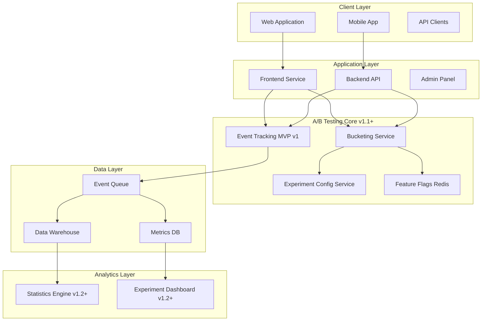

# A/B Testing Framework — Deep Technical Specification (MVP → v2)

---

## CRITICAL: MVP v1 Scope and Restrictions

**THIS SECTION MUST BE READ FIRST**

### MVP v1 Status: PASSIVE INSTRUMENTATION ONLY

The A/B Testing Framework is **NOT ACTIVE** in MVP v1.

**What MVP v1 DOES include:**
- Event collection infrastructure (logging user actions)
- Passive telemetry and analytics instrumentation
- Data pipeline for future experimentation
- Event schema definitions
- NO traffic splitting
- NO user-visible variations
- NO experiment execution

**What MVP v1 DOES NOT include:**
- Active A/B testing or multivariate testing
- User bucketing or assignment
- Treatment/control group splitting
- Dynamic feature flags affecting user experience
- Any user-facing experiment execution

**MVP v1 Implementation:**
- Backend services log events to data warehouse
- Analytics team can query historical data
- NO runtime experiment decisions
- NO variation serving to users

**Post-MVP (v1.1+):**
- Experiment execution begins in v1.1
- User-facing variations start in v1.1
- Traffic splitting activated in v1.1

This document describes the **future framework** (v1.1 and v2) for governance and planning purposes. Implementation begins post-MVP.

---

## 1. Introduction

### 1.1. Purpose and Scope

This document defines the A/B Testing Framework for the Self-Storage Aggregator platform, covering:

- Framework architecture and governance (v1.1+)
- Event instrumentation patterns (MVP v1)
- Experiment lifecycle management (v1.1+)
- Statistical methodology (reference only)
- Integration with platform services

**Out of Scope:**
- Product experiment definitions
- UX hypothesis generation
- Specific experiment playbooks
- Business KPI definitions (see DOC-014)

**Metrics Authority:**
All metrics referenced in experiments are defined exclusively in:
- **DOC-014: Analytics, Metrics & Tracking Specification**

This document does NOT define custom metrics. All experiment metrics must exist in DOC-014 before use.

### 1.2. Framework Objectives

The A/B Testing Framework (post-MVP) provides:

1. **Controlled experiment infrastructure** for measuring system behavior changes
2. **Statistical rigor** for decision-making
3. **Risk mitigation** through gradual rollout
4. **Data-driven validation** of platform changes
5. **Measurement consistency** across all experiment types

### 1.3. Experiment Categories

The framework (v1.1+) supports four general categories:

#### 1.3.1. System Behavior Experiments

Testing variations in platform logic, flows, or algorithms.

**Measurement focus:**
- System performance metrics (defined in DOC-014)
- User interaction patterns (defined in DOC-014)
- Platform efficiency metrics (defined in DOC-014)

**Note:** All metrics must be pre-defined in DOC-014. No ad-hoc metrics allowed.

#### 1.3.2. Algorithmic Experiments

Testing variations in ranking, search, or recommendation algorithms.

**Measurement focus:**
- Algorithm quality metrics (defined in DOC-014)
- Result relevance metrics (defined in DOC-014)
- System performance metrics (defined in DOC-014)

**Note:** Requires larger sample sizes for statistical significance.

#### 1.3.3. Configuration Experiments

Testing variations in system configuration or business rules.

**Measurement focus:**
- Business metrics (defined in DOC-014)
- Operator metrics (defined in DOC-014)
- Platform economics metrics (defined in DOC-014)

**Note:** Requires longer observation periods (30-60 days).

#### 1.3.4. ML Model Experiments

Testing different versions of machine learning models or AI-powered features.

**Measurement focus:**
- Model performance metrics (defined in DOC-014)
- Inference metrics (defined in DOC-014)
- Business impact metrics (defined in DOC-014)

**Implementation notes:**
- Shadow mode testing (model runs without affecting users)
- Canary deployment (gradual rollout)
- A/B/C testing (control + multiple model versions)

### 1.4. Roadmap and Versions

#### MVP v1 (Months 1-2)

**Status:** Passive instrumentation ONLY

**Deliverables:**
- Event schema definitions
- Logging infrastructure
- Data collection pipeline
- Event storage in data warehouse
- NO experiment execution
- NO traffic splitting

**Success criteria:**
- Events properly logged
- Data pipeline operational
- Analytics queries working

#### v1.1 (Months 3-4)

**Status:** Basic experiment execution

**Deliverables:**
- User bucketing service
- Feature flag system (Redis)
- 2-variant experiments (A/B only)
- Basic traffic splitting
- Manual statistical analysis

**Limitations:**
- 2-variant only (no A/B/C)
- No automated statistics
- No experiment UI
- Manual configuration

**Success criteria:**
- First experiment successfully executed
- Statistical significance measured
- Experiment creation time < 2 days

#### v1.2 (Months 5-6)

**Deliverables:**
- Multi-variant support (A/B/C/D)
- Automated statistics engine
- Progressive rollout (5% → 25% → 50% → 100%)
- Basic experiment dashboard
- BI tool integration

**Success criteria:**
- 10+ concurrent experiments
- Automated sample size calculation
- Experiment creation time < 2 hours

#### v2 (Months 7-10)

**Deliverables:**
- ML model testing infrastructure
- Advanced statistical methods
- Segment-based targeting
- Automated experiment analysis
- Cross-experiment interference detection

**Success criteria:**
- 20+ concurrent experiments
- ML-powered experiments in production
- Automated insights generation

---

## 2. Architecture

### 2.1. System Overview



**Architecture principles:**
1. Event tracking is decoupled from experiment execution
2. Bucketing service is stateless
3. Configuration is centralized
4. Analytics runs asynchronously

### 2.2. Component Responsibilities

#### 2.2.1. Event Tracking Layer (MVP v1)

**Purpose:** Capture user interactions and system events.

**Responsibilities:**
- Log events according to DOC-014 schema
- Enrich events with context
- Queue events for processing
- NO experiment logic

**Implementation:**
- Synchronous event emission
- Async event processing
- Event validation against schema

#### 2.2.2. Experiment Config Service (v1.1+)

**Purpose:** Manage experiment definitions and state.

**Responsibilities:**
- Store experiment configurations
- Validate experiment parameters
- Control experiment lifecycle
- Manage traffic allocation

**Data store:** PostgreSQL

#### 2.2.3. Bucketing Service (v1.1+)

**Purpose:** Assign users to experiment variants.

**Responsibilities:**
- Deterministic user assignment
- Consistent bucketing across sessions
- Isolation between experiments
- Traffic percentage enforcement

**Implementation:** See Appendix A for reference algorithm.

#### 2.2.4. Feature Flags Store (v1.1+)

**Purpose:** Cache experiment assignments for fast lookup.

**Responsibilities:**
- Store user → variant mappings
- Fast read performance (<1ms)
- Cache invalidation
- TTL management

**Technology:** Redis

#### 2.2.5. Statistics Engine (v1.2+)

**Purpose:** Calculate experiment metrics and statistical significance.

**Responsibilities:**
- Aggregate event data
- Calculate confidence intervals
- Compute p-values
- Generate reports

**Note:** All metrics calculated must be defined in DOC-014.

---

## 3. Event Instrumentation (MVP v1)

### 3.1. Event Schema Requirements

All events must follow the schema defined in DOC-014.

**Required fields:**
- `event_id`: Unique event identifier
- `user_id`: User identifier (or anonymous_id)
- `session_id`: Session identifier
- `timestamp`: Event timestamp (ISO 8601)
- `event_type`: Event type from DOC-014 taxonomy
- `properties`: Event-specific properties (defined in DOC-014)

**Context enrichment:**
- Platform (web, mobile, API)
- Device information
- Geographic location
- User agent

### 3.2. Event Emission

**MVP v1 implementation:**

```javascript
// Frontend example
trackEvent({
  event_type: 'page_view',
  properties: {
    page_name: 'search_results',
    // Additional properties per DOC-014
  }
});

// Backend example
eventTracker.track({
  user_id: userId,
  event_type: 'booking_completed',
  properties: {
    booking_id: bookingId,
    // Additional properties per DOC-014
  }
});
```

**Rules:**
- Events must not contain experiment metadata in MVP v1
- Events must be emitted synchronously
- Event processing is asynchronous
- Events must validate against DOC-014 schema

### 3.3. Event Storage

**MVP v1:**
- Events stored in data warehouse
- Retention: 2 years
- Access: Read-only for analytics

**Post-MVP:**
- Events enriched with experiment_id and variant_id (v1.1+)
- Real-time aggregation for dashboards (v1.2+)

---

## 4. Experiment Lifecycle (v1.1+)

**Note:** This section applies to v1.1 and later. Not implemented in MVP v1.

### 4.1. Experiment States

```
draft → review → approved → running → paused → completed → archived
```

**State definitions:**
- `draft`: Configuration in progress
- `review`: Awaiting approval
- `approved`: Ready to launch
- `running`: Active experiment
- `paused`: Temporarily stopped
- `completed`: Ended successfully
- `archived`: Historical record

### 4.2. Experiment Configuration

**Required parameters:**

```yaml
experiment:
  id: "exp_001"
  name: "Experiment name"
  description: "Experiment description"
  hypothesis: "Expected outcome"
  
  variants:
    - id: "control"
      name: "Control"
      traffic_percentage: 50
    - id: "treatment"
      name: "Treatment"
      traffic_percentage: 50
  
  metrics:
    primary:
      - metric_id: "booking_conversion_rate"  # Must exist in DOC-014
    secondary:
      - metric_id: "revenue_per_user"  # Must exist in DOC-014
  
  targeting:
    user_segments: []  # Optional
    platforms: ["web", "mobile"]
  
  duration:
    start_date: "2024-01-01T00:00:00Z"
    end_date: "2024-01-14T23:59:59Z"
  
  sample_size:
    minimum_per_variant: 10000
    expected_effect_size: 0.05
```

**Validation rules:**
- All metrics must exist in DOC-014
- Traffic percentages must sum to 100
- Start date must be in future
- Minimum sample size must be met

### 4.3. Experiment Launch Process

**Steps:**
1. Configuration created in `draft` state
2. Validation checks run automatically
3. Peer review required
4. Approval from experiment owner
5. State changes to `approved`
6. Scheduled start or manual trigger
7. State changes to `running`

**Safety checks:**
- No conflicting experiments
- All metrics exist
- Configuration is valid
- Bucketing service is operational

### 4.4. Experiment Monitoring

**Real-time metrics (v1.2+):**
- Sample size per variant
- Event volume per variant
- Traffic distribution validation
- Error rate monitoring

**Alerts:**
- Sample ratio mismatch (SRM)
- Traffic imbalance
- Event processing errors
- Metric anomalies

### 4.5. Experiment Termination

**Termination criteria:**
- Scheduled end date reached
- Statistical significance achieved (v1.2+)
- Critical issues detected
- Manual stop by owner

**Termination process:**
1. Stop bucketing new users
2. Continue tracking existing users (7-day cooldown)
3. Calculate final statistics
4. Generate report
5. Archive configuration

---

## 5. User Bucketing (v1.1+)

**Note:** This section applies to v1.1 and later. Not implemented in MVP v1.

### 5.1. Bucketing Requirements

**Consistency requirements:**
- Same user must receive same variant across sessions
- Same user must receive same variant across devices (if authenticated)
- Anonymous users may receive different variants after authentication
- Bucketing must be deterministic

**Isolation requirements:**
- Independent experiments must have independent bucketing
- No correlation between experiment assignments
- Traffic split must match configured percentages

### 5.2. Bucketing Algorithm Overview

**Reference implementation:** See Appendix A

**Key concepts:**
- Hash-based assignment
- Deterministic seeding
- Uniform distribution
- Traffic percentage enforcement

**Input:**
- User identifier (user_id or anonymous_id)
- Experiment identifier
- Traffic allocation

**Output:**
- Variant assignment

### 5.3. Anonymous User Handling

**MVP v1:** Not applicable (no bucketing)

**v1.1+:**
- Anonymous users receive `anonymous_id` cookie
- Bucketing based on `anonymous_id`
- After authentication, user may change variant
- Experiment events must track both user_id and anonymous_id

**Consistency strategy:**
- Best-effort consistency for anonymous users
- Guaranteed consistency for authenticated users

---

## 6. Metrics and Analysis

### 6.1. Metrics Authority

**CRITICAL RULE:**

All metrics used in experiments are defined exclusively in:
- **DOC-014: Analytics, Metrics & Tracking Specification**

**Prohibited:**
- Defining metrics in experiment configuration
- Creating ad-hoc metrics for experiments
- Using metrics not defined in DOC-014

**Process:**
1. Check if metric exists in DOC-014
2. If not, request metric addition to DOC-014 first
3. Only after metric is added to DOC-014, use in experiment

### 6.2. Metric Categories

All categories reference DOC-014:

**Primary metrics:**
- Must be defined in DOC-014
- One primary metric per experiment
- Used for statistical significance

**Secondary metrics:**
- Must be defined in DOC-014
- Multiple secondary metrics allowed
- Used for insight generation

**Guardrail metrics:**
- Must be defined in DOC-014
- Monitor for negative effects
- May trigger experiment stop

### 6.3. Statistical Analysis (v1.2+)

**Note:** This section is non-normative and provided as reference only.

**Analysis methods:**
- Frequentist hypothesis testing
- Confidence interval estimation
- Bayesian inference (v2)

**Statistical parameters:**
- Significance level: α = 0.05
- Power: 1 - β = 0.80
- Minimum detectable effect (MDE): Configurable

**Sample size calculation:** See Appendix B (reference only)

---

## 7. Integration Points

### 7.1. Integration with Analytics (DOC-014)

**Event flow:**
1. Application emits events
2. Events enriched with experiment context (v1.1+)
3. Events sent to data warehouse
4. Analytics queries events for reporting

**Experiment metadata in events (v1.1+):**
- `experiment_id`: Experiment identifier
- `variant_id`: Assigned variant
- `bucketing_timestamp`: When assignment occurred

**Constraints:**
- All event types must be defined in DOC-014
- All event properties must follow DOC-014 schema

### 7.2. Integration with Backend Services

**Backend services (v1.1+) must:**
- Call bucketing service for experiment assignment
- Cache assignments in Redis
- Emit events with experiment context
- Handle bucketing service failures gracefully

**Service dependencies:**
- Experiment Config Service
- Bucketing Service
- Feature Flags Store (Redis)
- Event Queue

### 7.3. Integration with Frontend

**Frontend (v1.1+) must:**
- Request variant assignment on page load
- Cache assignment in memory for session
- Emit events with experiment context
- Handle SSR and CSR consistently

**SSR considerations:**
- Bucketing must occur server-side
- Variant injected into HTML
- No flickering or layout shifts

---

## 8. Non-Functional Requirements

### 8.1. Performance

**v1.1+ requirements:**
- Bucketing latency: <5ms (p95)
- Feature flag lookup: <1ms (p95)
- Event emission: <10ms (p95)
- Event processing: <1 minute (p95)

**Caching:**
- Redis cache for assignments
- TTL: 24 hours
- Cache hit rate: >95%

### 8.2. Scalability

**v1.1+ capacity:**
- 10K requests/second to bucketing service
- 100K events/second to event queue
- 50 concurrent experiments
- 1M active users

**v1.2+ capacity:**
- 50K requests/second
- 500K events/second
- 100 concurrent experiments
- 10M active users

### 8.3. Reliability

**v1.1+ SLA:**
- Bucketing service uptime: 99.9%
- Event collection uptime: 99.95%
- Data loss: <0.01%

**Failure modes:**
- Bucketing service failure → serve default variant
- Redis failure → fallback to direct bucketing
- Event queue failure → buffer events locally

### 8.4. Security

**Access control:**
- Experiment configuration: Admin only
- Experiment viewing: Team access
- Event data: Analytics team access
- PII handling: Follow GDPR requirements

**Data protection:**
- Encrypt events in transit (TLS)
- Encrypt events at rest
- Anonymize PII in analytics
- Retention limits per GDPR

### 8.5. Observability

**Logging:**
- All experiment state changes logged
- All bucketing decisions logged (sampling 1%)
- All errors logged
- Follow DOC-009 (Logging Strategy)

**Monitoring:**
- Experiment health dashboards
- Sample ratio mismatch detection
- Traffic distribution validation
- Error rate alerts

**Alerting:**
- Critical: Bucketing service down
- High: Sample ratio mismatch >5%
- Medium: Traffic imbalance >10%
- Low: Event processing delay >5 minutes

---

## 9. Error Handling

### 9.1. Bucketing Service Errors (v1.1+)

**Error scenarios:**
- Service unavailable
- Invalid experiment ID
- Invalid user ID
- Configuration error

**Handling:**
- Log error with context
- Return default variant (control)
- Emit error event
- Do not block user flow

**Retry policy:**
- No retries for bucketing
- Return cached value if available
- Graceful degradation

### 9.2. Event Emission Errors

**MVP v1 and later:**

**Error scenarios:**
- Invalid event schema
- Queue unavailable
- Network failure

**Handling:**
- Log error locally
- Buffer events (max 1000)
- Retry with exponential backoff
- Drop events after 3 retries

**Error tracking:**
- Error rate per event type
- Failed event samples
- Alert on error rate >1%

### 9.3. Statistics Engine Errors (v1.2+)

**Error scenarios:**
- Insufficient data
- Invalid metric definition
- Calculation failure

**Handling:**
- Mark experiment as "Insufficient Data"
- Notify experiment owner
- Retry calculation on next run
- Manual intervention if persistent

---

## 10. Governance and Compliance

### 10.1. Experiment Approval Process

**v1.1+ workflow:**
1. Experiment owner creates draft
2. Configuration validation automatic
3. Peer review required (1 reviewer)
4. Data team review for statistics
5. Final approval by experiment owner
6. Launch scheduled or immediate

**Approval criteria:**
- Valid configuration
- Metrics exist in DOC-014
- No conflicts with running experiments
- Sufficient traffic allocation

### 10.2. Experiment Documentation

**Required documentation:**
- Hypothesis statement
- Expected outcomes
- Success criteria
- Rollback plan
- Risk assessment

**Storage:**
- Experiment config in database
- Documentation in wiki
- Results in analytics platform

### 10.3. Data Retention

**Event data:**
- Raw events: 2 years
- Aggregated metrics: 5 years
- PII: Anonymized after 90 days

**Experiment metadata:**
- Active experiments: Indefinite
- Completed experiments: 5 years
- Archived experiments: 10 years

### 10.4. Privacy and GDPR

**User rights:**
- Right to opt-out: Not applicable (platform optimization)
- Right to deletion: Events anonymized, not deleted
- Right to access: Experiment participation disclosed

**Data minimization:**
- No PII in experiment configuration
- Events contain only required fields
- Aggregated data preferred

---

## 11. Out of Scope

The following are explicitly OUT OF SCOPE for this framework document:

**Product decisions:**
- Which experiments to run
- Feature prioritization
- Hypothesis generation
- UX design decisions

**Business strategy:**
- Pricing strategy
- Market positioning
- Competitive analysis
- Revenue optimization

**Experiment playbooks:**
- How to design good experiments
- What to test
- Best practices for variants
- Experimentation training

These topics belong in product documentation, not in this technical framework specification.

---

## 12. Roadmap and Future Extensions

### 12.1. MVP v1 Deliverables

**Status:** Passive instrumentation

**In scope:**
- Event schema definitions (per DOC-014)
- Event logging infrastructure
- Data collection pipeline
- Event storage
- Basic analytics queries

**Not in scope:**
- Experiment execution
- User bucketing
- Traffic splitting
- Feature flags
- Experiment UI

**Timeline:** Months 1-2

### 12.2. v1.1 Additions

**New capabilities:**
- Basic bucketing service
- Feature flags (Redis)
- 2-variant experiments
- Manual statistical analysis

**Timeline:** Months 3-4

### 12.3. v1.2 Additions

**New capabilities:**
- Multi-variant support (A/B/C/D)
- Automated statistics engine
- Progressive rollout
- Experiment dashboard
- BI integration

**Timeline:** Months 5-6

### 12.4. v2 Vision

**Advanced capabilities:**
- ML model testing
- Sequential testing
- Multi-armed bandits
- Causal inference
- Segment targeting
- Cross-experiment analysis

**Timeline:** Months 7-10

### 12.5. Long-term Vision (Year 2+)

**Platform evolution:**
- Unified experiment hub
- Self-service no-code tools
- AI-powered insights
- Predictive analytics
- Enterprise features

---

## Appendix A: Bucketing Algorithm (Reference Only)

**Note:** This appendix is non-normative and provided as reference for implementation teams. It is not a requirement.

### A.1. Hash-Based Bucketing

**Concept:**
- Use cryptographic hash for deterministic assignment
- Hash input: concatenation of user_id and experiment_id
- Map hash to bucket in range [0, 1)
- Assign variant based on traffic allocation

**Reference implementation:**

```python
import hashlib

def bucket_user(user_id: str, experiment_id: str, variants: list) -> str:
    """
    Reference implementation - not normative.
    """
    # Create hash input
    hash_input = f"{user_id}:{experiment_id}"
    
    # Compute hash
    hash_bytes = hashlib.sha256(hash_input.encode()).digest()
    
    # Convert to float in [0, 1)
    hash_int = int.from_bytes(hash_bytes[:8], byteorder='big')
    bucket_value = hash_int / (2**64)
    
    # Find variant
    cumulative = 0
    for variant in variants:
        cumulative += variant['traffic_percentage'] / 100
        if bucket_value < cumulative:
            return variant['id']
    
    return variants[-1]['id']  # Fallback
```

### A.2. Traffic Allocation

**Example:**

```
Variants:
- Control: 40%
- Treatment A: 30%
- Treatment B: 30%

Bucket ranges:
- Control: [0, 0.4)
- Treatment A: [0.4, 0.7)
- Treatment B: [0.7, 1.0)
```

### A.3. Properties

**Uniformity:**
- SHA-256 provides uniform distribution
- Each user has equal probability of any variant

**Consistency:**
- Same user + experiment → same hash → same variant
- Deterministic across servers and time

**Independence:**
- Different experiments use different hashes
- No correlation between assignments

---

## Appendix B: Sample Size Calculation (Reference Only)

**Note:** This appendix is non-normative and provided as reference. Actual implementation may vary.

### B.1. Sample Size Formula

For binary metrics (e.g., conversion rate):

```
n = 2 × (Z_α + Z_β)² × p × (1 - p) / δ²

Where:
- n = sample size per variant
- Z_α = critical value for significance level (1.96 for α=0.05)
- Z_β = critical value for power (0.84 for power=0.80)
- p = baseline conversion rate
- δ = minimum detectable effect (MDE)
```

### B.2. Example Calculation

**Scenario:**
- Baseline conversion rate: 10%
- MDE: 2 percentage points (relative 20%)
- Significance: α = 0.05
- Power: 80%

**Calculation:**
```
n = 2 × (1.96 + 0.84)² × 0.10 × 0.90 / (0.02)²
n = 2 × 7.84 × 0.09 / 0.0004
n ≈ 3,528 users per variant
```

### B.3. Duration Estimate

**Given:**
- Daily active users: 10,000
- Traffic allocation: 50% to experiment
- Sample size needed: 3,528 per variant

**Calculation:**
```
Days = (3,528 × 2) / (10,000 × 0.5)
Days ≈ 1.4 days
```

**Recommendation:** Run for at least 7 days to account for weekly cycles.

---

## Appendix C: Glossary

**A/B Test:**
Controlled experiment comparing two variants.

**Bucketing:**
Process of assigning users to experiment variants.

**Control:**
Baseline variant (usually current behavior).

**Effect Size:**
Magnitude of difference between variants.

**Experiment:**
Controlled test of a hypothesis.

**Feature Flag:**
Configuration toggle for enabling/disabling features.

**Guardrail Metric:**
Metric monitored to prevent negative impacts.

**MDE (Minimum Detectable Effect):**
Smallest effect size that can be reliably detected.

**Primary Metric:**
Main metric used to evaluate experiment success.

**Sample Ratio Mismatch (SRM):**
Imbalance in traffic distribution across variants.

**Secondary Metric:**
Additional metrics for insights.

**Statistical Significance:**
Likelihood that results are not due to chance.

**Treatment:**
New variant being tested.

**Variant:**
One version in an experiment (control or treatment).

---

## Document Control

**Document ID:** DOC-003  
**Version:** 2.0  
**Status:** CANONICAL  
**Last Updated:** 2024-12-16  

**Change Log:**
- v2.0: Governance corrections - MVP v1 scope clarified, product leakage removed, metrics authority enforced
- v1.0: Initial version

**Dependencies:**
- DOC-001: Functional Specification MVP v1
- DOC-002: Technical Architecture Document
- DOC-014: Analytics, Metrics & Tracking Specification (metrics authority)
- DOC-009: Logging Strategy & Log Taxonomy

**Approvals:**
- Technical Lead: [Pending]
- Data Team: [Pending]
- Product Team: [Pending]

---

**END OF DOCUMENT**
