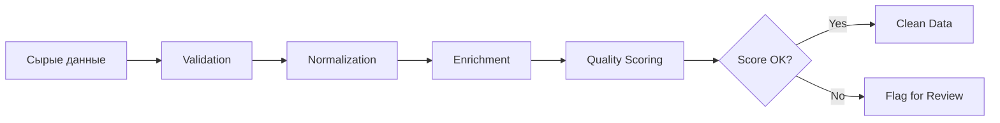
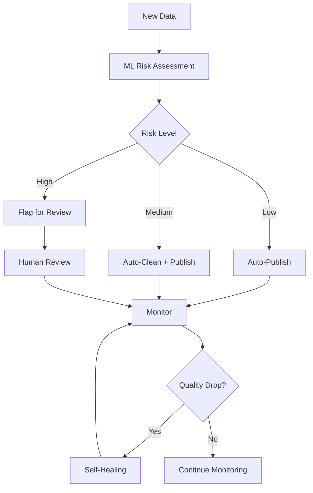
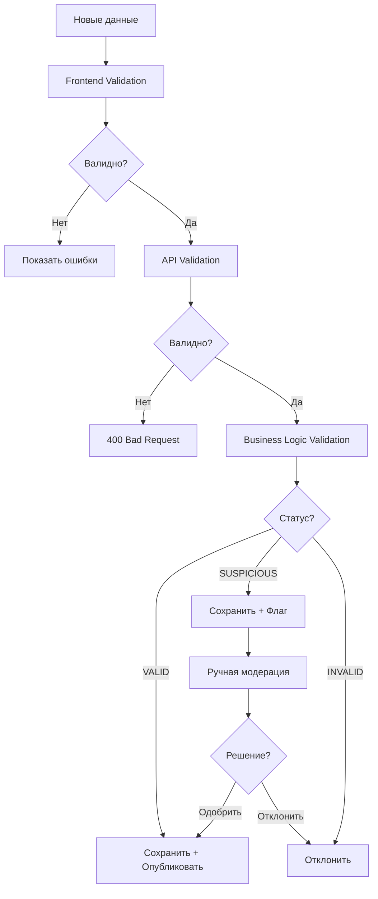
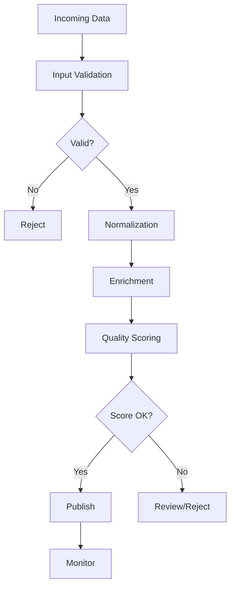
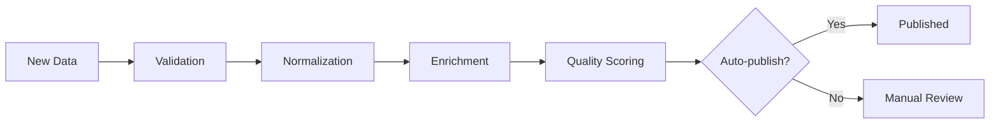
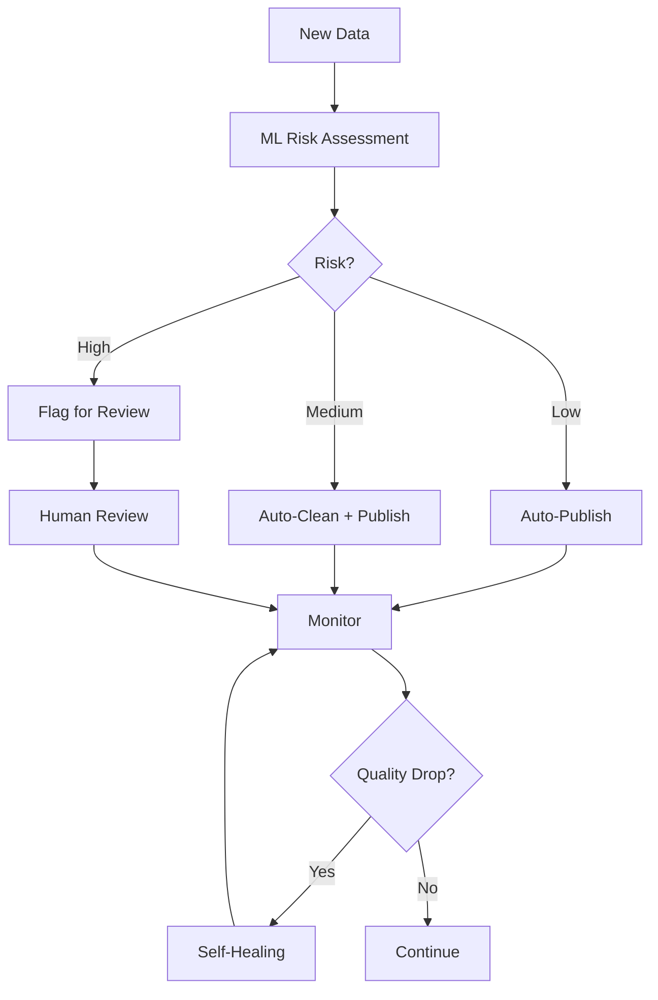

# Data Governance & Data Quality Specification (MVP → v2)

**Document Version:** 1.0  
**Release Date:** December 9, 2025  
**Status:** Draft  
**Project:** Self-Storage Aggregator Platform

---

## Document Control

| Version | Date | Author | Changes |
|---------|------|--------|---------|
| 1.0 | 2025-12-09 | Product Team | Initial release |

---

## Related Documents

- Full Database Specification
- Data Migration & ETL Plan
- Analytics & Metrics Specification
- AI Core Design
- Monitoring & Observability Plan
- Technical Architecture Document

---

# 1. Введение

## 1.1. Роль качества данных в Self-Storage Aggregator

Качество данных является критическим фактором успеха платформы Self-Storage Aggregator. В отличие от классических маркетплейсов, где качество контента влияет преимущественно на конверсию, в нашем продукте некачественные данные напрямую разрушают пользовательский опыт и доверие к сервису.

### Почему качество данных критично

**1. Поисковая система и рекомендации**

Неполные или некорректные данные о складах приводят к:
- Неправильной геолокации складов на карте
- Ошибочным результатам поиска по размеру/цене
- Отсутствию релевантных складов в выдаче
- Неточным AI-рекомендациям

**2. AI-модули**

AI-компоненты платформы (Box Finder, Price Analysis, Chat) полагаются на качественные данные:
- Некорректные цены искажают анализ рынка и рекомендации
- Неполные атрибуты ухудшают точность подбора
- Отсутствие фото снижает вовлечённость и доверие пользователей
- Неактуальные данные о доступности приводят к негативному опыту бронирования

**3. Финансовая аналитика и отчётность**

Операторы и администраторы платформы принимают бизнес-решения на основе данных:
- Неточные данные о занятости боксов искажают revenue-прогнозы
- Некорректные цены дают неверную картину доходности
- Отсутствие истории изменений затрудняет анализ трендов

**4. Пользовательский опыт**

Конечные пользователи (клиенты, ищущие хранение) сталкиваются с:
- Несоответствием информации на сайте и реальности
- Недоступными боксами, которые показываются как свободные
- Неверными адресами и контактами
- Устаревшими фотографиями объектов

### Финансовое влияние плохого качества данных

| Проблема | Прямое влияние | Косвенное влияние |
|----------|----------------|-------------------|
| Неверные координаты склада | Пользователи не могут найти объект | Потеря конверсии 30-40%, негативные отзывы |
| Неактуальные цены | Пользователь уходит при уточнении | Снижение trust score, отток операторов |
| Отсутствие фото | Конверсия падает на 60% | Снижение CTR в поиске, рост bounce rate |
| Неверный статус бокса | Неудачное бронирование | Отток клиентов, рост support-нагрузки |
| Дубли складов | Путаница в системе | Ошибки в аналитике, искажение рынка |

---

## 1.2. Зачем нужен Data Governance: влияние на поиск, AI-модули, отчёты и UX

Data Governance — это не просто контроль качества данных, это комплексная система управления жизненным циклом данных от момента их создания до архивирования.

### Влияние на ключевые компоненты системы

#### 1.2.1. Поисковая система

**Текущая архитектура:**
```sql
-- PostgreSQL full-text search с индексами
CREATE INDEX idx_warehouses_city ON warehouses(city);
CREATE INDEX idx_warehouses_coordinates ON warehouses USING GIST(coordinates);
CREATE INDEX idx_boxes_status ON boxes(status);
CREATE INDEX idx_boxes_price ON boxes(price_per_month);
```

**Влияние качества данных:**

| Компонент поиска | Зависимость от DQ | Последствия низкого качества |
|------------------|-------------------|------------------------------|
| Геопоиск | Координаты (latitude, longitude) | Объекты не попадают в радиус поиска |
| Фильтр по цене | price_per_month | Неверная сортировка, пропуск релевантных вариантов |
| Фильтр по размеру | width, height, depth, area | Неверный подбор боксов |
| Фильтр по доступности | available_quantity | Показ недоступных боксов |
| Full-text поиск | name, description, address | Пропуск релевантных складов |

**Критические поля для поиска:**
- `warehouses.coordinates` — geography(POINT, 4326)
- `warehouses.city`, `district`, `metro_station`
- `boxes.price_per_month`
- `boxes.available_quantity`
- `boxes.area`

#### 1.2.2. AI-модули

Платформа использует Anthropic Claude API для четырех основных AI-функций:

**Box Finder (AI подбор боксов)**

Input данные:
```typescript
interface BoxFinderInput {
  user_requirements: {
    items_to_store: string[];
    duration: string;
    budget: number;
    location: string;
  };
  filters: {
    city: string;
    max_distance_km: number;
    size_category?: string[];
  };
}
```

**Зависимость от качества данных:**
- Описания складов (для контекстного анализа)
- Атрибуты и сервисы (для фильтрации по требованиям)
- Цены (для бюджетного подбора)
- Фотографии (для визуальной оценки)

Если данные неполные:
- AI не может точно оценить соответствие склада требованиям
- Рекомендации будут неполными или неточными
- Пользователь получит нерелевантные варианты

**Price Analysis (AI анализ цен)**

Input данные:
```typescript
interface PriceAnalysisInput {
  warehouse_data: {
    location: string;
    box_sizes: Array<{size: string; price: number}>;
    attributes: string[];
    occupancy_rate: number;
  };
  market_context: {
    competitor_prices: number[];
    seasonal_trends: any;
  };
}
```

**Зависимость от качества данных:**
- Актуальные цены конкурентов
- Корректные данные о занятости (occupancy_rate)
- Достоверные атрибуты складов

Если данные некачественные:
- AI даст неверные рекомендации по ценообразованию
- Операторы потеряют деньги или конкурентоспособность
- Рыночный анализ будет искажён

**Chat AI (диалоговый помощник)**

Использует контекстные данные о складах для ответов на вопросы пользователей.

**Зависимость от качества данных:**
- Полнота информации о складе (адрес, часы работы, контакты)
- Актуальность данных о доступности
- Корректность описаний и атрибутов

Если данные некачественные:
- AI предоставит неверную информацию
- Пользователь получит негативный опыт
- Поддержка получит дополнительную нагрузку

**Description Generator (генератор описаний)**

Создаёт описания складов для операторов на основе атрибутов и услуг.

**Зависимость от качества данных:**
- Корректность базовых атрибутов (security, climate_control и т.д.)
- Достоверность списка услуг
- Точность информации о локации

#### 1.2.3. Отчёты и аналитика

Операторы полагаются на дашборды для управления бизнесом:

**Ключевые метрики:**
```typescript
interface OperatorAnalytics {
  occupancy_rate: number;        // % занятых боксов
  revenue: {
    current_month: number;
    projected: number;
  };
  conversion_funnel: {
    views: number;
    booking_requests: number;
    confirmed_bookings: number;
  };
  average_booking_duration: number;
  price_competitiveness: number;
}
```

**Влияние некачественных данных:**

| Метрика | Зависимость | Последствия |
|---------|-------------|-------------|
| Occupancy Rate | `boxes.available_quantity`, `occupied_quantity` | Неверные бизнес-решения об открытии новых боксов |
| Revenue | `bookings.amount`, `payment_status` | Искажённые финансовые отчёты |
| Conversion | Корректность всей цепочки данных | Неверная оценка эффективности маркетинга |
| Price Competitiveness | Цены конкурентов + собственные цены | Потеря конкурентного преимущества |

#### 1.2.4. Пользовательский опыт (UX)

Качество данных напрямую влияет на каждый этап user journey:

**Этап 1: Поиск**
- Пользователь ищет "склад возле метро Маяковская"
- Система находит объекты по геолокации и тексту
- **DQ проблема:** неверные координаты → объект не найден

**Этап 2: Просмотр каталога**
- Пользователь видит карточки складов с фото, ценами, рейтингом
- **DQ проблема:** отсутствие фото → конверсия падает на 60%

**Этап 3: Детальный просмотр**
- Пользователь изучает информацию о складе
- **DQ проблема:** неактуальные часы работы → звонок в нерабочее время

**Этап 4: Подбор бокса**
- Пользователь выбирает размер и цену
- **DQ проблема:** неверный available_quantity → бронирование недоступного бокса

**Этап 5: Бронирование**
- Пользователь отправляет запрос оператору
- **DQ проблема:** неверный email/телефон → запрос не доставлен

---

## 1.3. Основные принципы: прозрачность, проверяемость, автоматизация

Data Governance на платформе строится на трёх фундаментальных принципах:

### 1.3.1. Прозрачность (Transparency)

**Определение:** Все процессы управления данными, проверки качества и принятые решения должны быть видимы и понятны всем участникам системы.

**Реализация:**

**Для операторов:**
- Дашборд Data Quality показывает оценку качества их данных
- Чётко видно, какие поля заполнены некорректно
- История изменений качества данных доступна в личном кабинете
- Понятные инструкции по исправлению ошибок

**Для администраторов:**
- Полный аудит-лог всех изменений данных
- Визуализация Data Quality Score по всем складам
- Отчёты о проблемных данных с drill-down до конкретных полей
- Метрики эффективности Data Cleaning Pipeline

**Для пользователей:**
- Бейдж "Проверенные данные" на карточках складов
- Индикация актуальности информации (обновлено X дней назад)
- Отображение статуса проверки фотографий

**Технические механизмы:**

```sql
-- Audit trail для всех критических изменений
CREATE TABLE data_audit_log (
  id SERIAL PRIMARY KEY,
  table_name VARCHAR(50) NOT NULL,
  record_id INTEGER NOT NULL,
  field_name VARCHAR(100) NOT NULL,
  old_value TEXT,
  new_value TEXT,
  changed_by INTEGER REFERENCES users(id),
  change_reason VARCHAR(255),
  quality_impact VARCHAR(20), -- 'improvement', 'degradation', 'neutral'
  created_at TIMESTAMP DEFAULT NOW()
);

-- Data Quality Score history
CREATE TABLE dq_score_history (
  id SERIAL PRIMARY KEY,
  entity_type VARCHAR(20) NOT NULL, -- 'warehouse', 'box', 'operator'
  entity_id INTEGER NOT NULL,
  score DECIMAL(5,2) NOT NULL,
  completeness_score DECIMAL(5,2),
  accuracy_score DECIMAL(5,2),
  timeliness_score DECIMAL(5,2),
  details JSONB,
  created_at TIMESTAMP DEFAULT NOW()
);
```

### 1.3.2. Проверяемость (Verifiability)

**Определение:** Все данные в системе должны быть проверены автоматически или вручную, а результаты проверок — задокументированы.

**Уровни проверяемости:**

**Level 1: Синтаксическая проверка (автоматическая)**
- Типы данных (string, number, boolean)
- Обязательность полей (NOT NULL)
- Форматы (email, phone, URL)
- Диапазоны значений (цена > 0)

```typescript
// Пример валидации на уровне API
const warehouseValidationSchema = z.object({
  name: z.string().min(3).max(255),
  coordinates: z.object({
    latitude: z.number().min(-90).max(90),
    longitude: z.number().min(-180).max(180)
  }),
  contact_phone: z.string().regex(/^\+?\d{10,15}$/),
  price_from: z.number().positive().optional()
});
```

**Level 2: Семантическая проверка (автоматическая + AI)**
- Координаты соответствуют указанному адресу
- Цена находится в рыночном диапазоне
- Фотографии релевантны складу
- Описание соответствует атрибутам

```typescript
// AI-проверка релевантности фото
interface PhotoValidationResult {
  is_storage_related: boolean;
  confidence: number;
  detected_objects: string[];
  quality_issues: string[];
}
```

**Level 3: Бизнес-логика (автоматическая)**
- Сумма available_quantity + occupied_quantity = total_quantity
- При статусе "rented" available_quantity должен быть 0
- Цена за месяц < цены за 3 месяца (с учётом скидки)

**Level 4: Ручная проверка (модерация)**
- Проверка документов оператора
- Валидация первых фото нового склада
- Контроль подозрительных изменений цен

**Статусы проверяемости:**

```typescript
enum ValidationStatus {
  VALID = 'valid',           // Прошло все проверки
  SUSPICIOUS = 'suspicious', // Есть подозрительные паттерны
  INVALID = 'invalid',       // Не прошло критические проверки
  PENDING = 'pending',       // Ожидает проверки
  UNVERIFIED = 'unverified'  // Не проверялось
}
```

### 1.3.3. Автоматизация (Automation)

**Определение:** Максимум проверок и исправлений должны выполняться автоматически, минимизируя ручной труд и человеческие ошибки.

**Принципы автоматизации:**

**1. Fail-fast validation**
Проверки выполняются на самом раннем этапе:
```typescript
// Валидация при вводе данных в форме (фронтенд)
onInputChange(field, value) {
  const validation = validateField(field, value);
  if (!validation.valid) {
    showError(validation.message);
  }
}

// Валидация при получении запроса (API)
@Post('/warehouses')
async create(@Body() data: CreateWarehouseDto) {
  // Валидация на уровне DTO через class-validator
  // Если невалидно — возврат 400 Bad Request
}

// Валидация перед сохранением (база данных)
-- Constraints на уровне БД
CONSTRAINT chk_price CHECK (price_per_month > 0)
```

**2. Self-healing data**
Система автоматически исправляет типичные ошибки:
```typescript
// Нормализация телефона
function normalizePhone(phone: string): string {
  // "+971 50 123 4567" → "+971501234567"
  return phone.replace(/[^\d+]/g, '');
}

// Нормализация адреса
function normalizeAddress(address: string): string {
  // "Dubai, Al Quoz, д.5" → "Dubai, Al Quoz, 5"
  return address
    .replace(/^г\.\s*/i, '')
    .replace(/д\.\s*/gi, '')
    .replace(/ул\.\s*/gi, 'ул. ');
}

// Geocoding для получения координат
async function enrichWithCoordinates(address: string) {
  const coords = await geocodeAddress(address);
  return coords;
}
```

**3. Scheduled data quality checks**
Регулярные автоматические проверки:
```typescript
// Cron job: проверка качества данных каждый день в 3:00
@Cron('0 3 * * *')
async runDailyDataQualityCheck() {
  const warehouses = await this.getActiveWarehouses();
  
  for (const warehouse of warehouses) {
    const score = await this.calculateDQScore(warehouse);
    await this.saveDQScore(warehouse.id, score);
    
    if (score < THRESHOLD) {
      await this.notifyOperator(warehouse.operator_id, score);
    }
  }
}
```

**4. Автоматические алерты**
Система самостоятельно обнаруживает проблемы и уведомляет ответственных:
```typescript
// Алерт при резком падении качества
if (currentScore < previousScore - 20) {
  await alertAdmin({
    severity: 'high',
    warehouse_id: warehouse.id,
    message: 'Data quality dropped by 20+ points',
    old_score: previousScore,
    new_score: currentScore
  });
}
```

**5. AI-автоматизация**
Machine Learning для продвинутых сценариев:
- Автоматическое обнаружение аномалий в ценах
- Предсказание вероятности ошибки в данных
- Автоматическое категорирование фотографий
- Генерация предложений по улучшению данных

**Уровни автоматизации по версиям:**

| Версия | Уровень автоматизации | Описание |
|--------|----------------------|----------|
| MVP | 40% | Базовая валидация + ручная модерация |
| v1.1 | 70% | Автоматический Data Cleaning Pipeline |
| v2 | 90% | AI-driven quality engine с минимальным участием человека |

---

## 1.4. Диапазон версий: MVP → v1.1 → v2

Развитие системы Data Governance разделено на три этапа, каждый из которых постепенно повышает уровень автоматизации и качества данных.

### 1.4.1. MVP (Минимальный жизнеспособный продукт)

**Сроки:** Запуск платформы (Month 1-2)

**Цели:**
- Обеспечить базовый уровень качества данных
- Предотвратить критические ошибки
- Создать фундамент для будущих улучшений

**Функциональность:**

**✅ Базовая валидация на уровне API:**
- Обязательные поля проверяются при создании
- Форматы данных (email, phone, URL)
- Диапазоны значений (цена > 0, координаты в пределах нормы)

**✅ Database constraints:**
```sql
-- Примеры constraints в MVP
CONSTRAINT chk_price CHECK (price_per_month > 0)
CONSTRAINT chk_dimensions CHECK (size_length > 0 AND size_width > 0)
CONSTRAINT chk_coordinates CHECK (
  latitude BETWEEN -90 AND 90 AND
  longitude BETWEEN -180 AND 180
)
```

**✅ Ручная модерация:**
- Операторы проходят manual approval после регистрации
- Первые 5 фотографий каждого склада проверяются вручную
- Администраторы могут отмечать подозрительные данные

**✅ Базовые метрики качества:**
- Completeness score (% заполненности обязательных полей)
- Простой дашборд для операторов с Data Quality Score

**❌ Отсутствует в MVP:**
- Автоматическая нормализация данных
- AI-проверки качества
- Автоматические алерты
- Исторический анализ изменений качества
- Предиктивные модели

**Технический стек MVP:**
```typescript
// Простая валидация через Zod/Joi
import { z } from 'zod';

const BoxSchema = z.object({
  warehouse_id: z.number().positive(),
  size: z.enum(['XS', 'S', 'M', 'L', 'XL']),
  width: z.number().positive(),
  height: z.number().positive(),
  depth: z.number().positive(),
  price_per_month: z.number().positive()
});

// Расчёт Completeness Score
function calculateCompleteness(warehouse: Warehouse): number {
  const requiredFields = [
    'name', 'full_address', 'city', 'coordinates',
    'contact_phone', 'working_hours', 'photos'
  ];
  
  const filledFields = requiredFields.filter(
    field => warehouse[field] && warehouse[field] !== ''
  );
  
  return (filledFields.length / requiredFields.length) * 100;
}
```

**Ограничения MVP:**
- Проверки выполняются только при создании/обновлении записей
- Нет регулярного аудита качества данных
- Ручная работа занимает много времени
- Нет проактивного обнаружения проблем

---

### 1.4.2. v1.1 (Автоматизированные пайплайны)

**Сроки:** 2-3 месяца после MVP

**Цели:**
- Автоматизировать большинство проверок
- Внедрить Data Cleaning Pipeline
- Создать систему мониторинга и алертов
- Снизить нагрузку на ручную модерацию

**Новая функциональность:**

**✅ Data Cleaning Pipeline:**


**Этапы pipeline:**
1. **Validation** — проверка на соответствие правилам
2. **Normalization** — приведение к единому формату
3. **Enrichment** — обогащение данными (геокодинг, market data)
4. **Quality Scoring** — расчёт оценки качества
5. **Decision** — авто-публикация или отправка на review

**✅ Scheduled jobs:**
```typescript
// Ежедневная проверка качества всех складов
@Cron('0 3 * * *')
async dailyDataQualityAudit() {
  const warehouses = await this.warehouseService.findAll();
  
  for (const wh of warehouses) {
    const score = await this.calculateDQScore(wh);
    await this.saveDQHistory(wh.id, score);
    
    if (score.completeness < 70) {
      await this.notifyOperator(wh.operator_id, {
        type: 'low_completeness',
        score: score.completeness
      });
    }
  }
}

// Еженедельный отчёт по качеству данных
@Cron('0 9 * * 1')
async weeklyDQReport() {
  const report = await this.generateDQReport();
  await this.emailAdmin(report);
}
```

**✅ Автоматические алерты:**
- Резкое падение Data Quality Score (> 20 пунктов)
- Появление большого количества invalid-данных
- Аномалии в ценах (отклонение > 3σ от рынка)
- Недоступность критических данных (coordinates, price)

**✅ Расширенные метрики:**
Добавлены метрики:
- Accuracy (точность данных)
- Timeliness (актуальность)
- Consistency (согласованность)
- Uniqueness (отсутствие дублей)

**✅ Dashboards:**
- Дашборд качества для операторов (детальный)
- Админский дашборд с overview по всем складам
- Графики изменения DQ Score во времени
- Drill-down до конкретных проблемных полей

**Технологии v1.1:**
```typescript
// Background jobs через Bull Queue
import { Queue } from 'bull';

const dataCleaningQueue = new Queue('data-cleaning', {
  redis: { host: 'localhost', port: 6379 }
});

// Добавление задачи в очередь
dataCleaningQueue.add('clean-warehouse', {
  warehouse_id: 123
}, {
  attempts: 3,
  backoff: { type: 'exponential', delay: 2000 }
});

// Обработчик задачи
dataCleaningQueue.process('clean-warehouse', async (job) => {
  const warehouse = await fetchWarehouse(job.data.warehouse_id);
  const cleaned = await cleanData(warehouse);
  await saveCleanedData(cleaned);
});
```

**Снижение ручной работы:**
- MVP: 80% проверок вручную
- v1.1: 30% проверок вручную (только сложные кейсы)

---

### 1.4.3. v2 (AI-driven Data Quality Engine)

**Сроки:** 6+ месяцев после MVP

**Цели:**
- Довести автоматизацию до 90%
- Внедрить ML-модели для предиктивной оценки качества
- Создать автономную систему самообучения
- Минимизировать ручное вмешательство

**Новая функциональность:**

**✅ Machine Learning модели:**

**1. Predictive DQ Score**
Модель предсказывает вероятность некачественных данных ДО их сохранения:
```python
# Обучение модели
features = [
  'completeness_score',
  'operator_trust_score',
  'data_entry_speed',  # Как быстро вводились данные
  'price_deviation',
  'photo_quality',
  'historical_error_rate'
]

X_train, y_train = prepare_training_data()
model = RandomForestClassifier()
model.fit(X_train, y_train)

# Предсказание
risk_score = model.predict_proba(new_data)[0][1]
if risk_score > 0.7:
  flag_for_manual_review()
```

**2. Anomaly Detection**
Автоматическое обнаружение аномалий:
- Цены, выходящие за рыночные рамки
- Подозрительные паттерны редактирования
- Несоответствие фотографий описанию

```python
from sklearn.ensemble import IsolationForest

# Обучение модели на исторических данных
iso_forest = IsolationForest(contamination=0.05)
iso_forest.fit(historical_prices)

# Обнаружение аномалий
anomaly_score = iso_forest.predict([new_price])
if anomaly_score == -1:
  alert_anomaly()
```

**3. Image Quality AI**
Deep Learning для проверки фотографий:
```python
# Проверка релевантности фото
class PhotoRelevanceModel:
  def predict(self, image):
    features = self.extract_features(image)
    return {
      'is_storage_related': bool,
      'quality_score': float,
      'detected_objects': list,
      'recommendations': list
    }
```

**✅ Автономный Data Quality Engine:**


**✅ Self-healing mechanisms:**
Система автоматически исправляет типичные ошибки на основе ML:
- Автокоррекция адресов (используя геокодинг)
- Автозаполнение пропущенных атрибутов (на основе похожих складов)
- Автоматическая категоризация фотографий
- Исправление опечаток в названиях

**✅ Predictive monitoring:**
- Предсказание деградации качества данных
- Раннее предупреждение о возможных проблемах
- Рекомендации операторам по улучшению данных

**✅ A/B тесты качества данных:**
Система тестирует различные подходы к Data Cleaning:
- Вариант A: строгая валидация
- Вариант B: более мягкая валидация + автоисправление
- Метрики: конверсия, bounce rate, user satisfaction

**Технологии v2:**
- **ML Framework:** TensorFlow / PyTorch
- **Feature Store:** Feast
- **Model Serving:** TensorFlow Serving / TorchServe
- **Experiment Tracking:** MLflow
- **Data Versioning:** DVC

**Результаты v2:**
- 90% проверок автоматические
- 95% accuracy в обнаружении некачественных данных
- Время реакции на проблемы: < 1 час (автоматически)
- Среднее Data Quality Score по платформе: > 85/100

---

### Сравнительная таблица версий

| Функция | MVP | v1.1 | v2 |
|---------|-----|------|-----|
| **Валидация на уровне API** | ✅ Базовая | ✅ Расширенная | ✅ AI-enhanced |
| **Database constraints** | ✅ | ✅ | ✅ |
| **Ручная модерация** | ✅ 80% | ✅ 30% | ✅ 10% |
| **Data Cleaning Pipeline** | ❌ | ✅ | ✅ Advanced |
| **Scheduled jobs** | ❌ | ✅ | ✅ |
| **Автоматические алерты** | ❌ | ✅ | ✅ Predictive |
| **Completeness Score** | ✅ | ✅ | ✅ |
| **Accuracy Score** | ❌ | ✅ | ✅ ML-based |
| **Timeliness Score** | ❌ | ✅ | ✅ |
| **Consistency Score** | ❌ | ✅ | ✅ |
| **Uniqueness Score** | ❌ | ✅ | ✅ |
| **Dashboards** | ✅ Простой | ✅ Подробный | ✅ Advanced + Predictions |
| **ML модели** | ❌ | ❌ | ✅ |
| **Anomaly Detection** | ❌ | ⚠️ Heuristic | ✅ ML-based |
| **Self-healing** | ❌ | ⚠️ Частично | ✅ Полностью |
| **API для DQ** | ❌ | ✅ | ✅ Extended |
| **Среднее DQ Score** | 60/100 | 75/100 | 85/100 |
| **Время реакции на проблемы** | 24-48ч | 2-4ч | <1ч |
| **Cost per check** | High | Medium | Low |

---

# 2. Политика качества данных (Data Governance Policy)

## 2.1. Что считаем качественными данными

Качественные данные на платформе Self-Storage Aggregator определяются шестью ключевыми характеристиками. Данные считаются качественными, если они соответствуют ВСЕМ следующим критериям:

### 2.1.1. Полнота (Completeness)

**Определение:** Все обязательные поля заполнены, и данные достаточны для выполнения бизнес-функций.

**Критерии полноты:**

**Для склада (Warehouse):**
```typescript
interface CompleteWarehouseData {
  // Обязательные поля (100% требуется)
  name: string;                    // ✅ Название склада
  full_address: string;            // ✅ Полный адрес
  city: string;                    // ✅ Город
  coordinates: {                   // ✅ Координаты
    latitude: number;
    longitude: number;
  };
  contact_phone: string;           // ✅ Контактный телефон
  working_hours: object;           // ✅ Часы работы
  
  // Критически важные (80% требуется)
  photos: string[];                // ⚠️ Минимум 3 фото
  description: string;             // ⚠️ Минимум 100 символов
  attributes: string[];            // ⚠️ Минимум 3 атрибута
  
  // Желательные (50% требуется)
  district: string;                // 💡 Район
  metro_station: string;           // 💡 Ближайшее метро
  contact_email: string;           // 💡 Email
  website: string;                 // 💡 Сайт
}
```

**Оценка полноты:**
```
Completeness Score = 
  (Обязательные поля * 1.0 + 
   Критически важные * 0.8 + 
   Желательные * 0.5) / Total Weight
```

**Для бокса (Box):**
```typescript
interface CompleteBoxData {
  // Обязательные поля
  warehouse_id: number;            // ✅ ID склада
  size: 'XS' | 'S' | 'M' | 'L' | 'XL';  // ✅ Категория размера
  width: number;                   // ✅ Ширина (см)
  height: number;                  // ✅ Высота (см)
  depth: number;                   // ✅ Глубина (см)
  price_per_month: number;         // ✅ Цена за месяц
  total_quantity: number;          // ✅ Общее количество
  available_quantity: number;      // ✅ Доступное количество
  
  // Желательные
  features: string[];              // 💡 Особенности
  floor: number;                   // 💡 Этаж
}
```

**Пороги полноты:**

| Оценка | Диапазон | Статус | Действие |
|--------|----------|--------|----------|
| Отлично | 90-100% | ✅ Verified | Публикация без ограничений |
| Хорошо | 75-89% | ⚠️ Good | Публикация с рекомендациями по улучшению |
| Удовлетворительно | 60-74% | ⚠️ Acceptable | Публикация, но ниже в поиске |
| Плохо | 40-59% | ❌ Poor | Скрыт из поиска, видим оператору |
| Неприемлемо | <40% | ❌ Invalid | Не публикуется, требует доработки |

---

### 2.1.2. Точность (Accuracy)

**Определение:** Данные соответствуют реальности и могут быть проверены.

**Критерии точности:**

**Геолокация:**
```typescript
// Координаты должны совпадать с адресом
function validateGeolocation(warehouse: Warehouse): boolean {
  const declaredCoords = warehouse.coordinates;
  const geocodedCoords = await geocodeAddress(warehouse.full_address);
  
  const distance = calculateDistance(declaredCoords, geocodedCoords);
  
  return distance < 500; // Макс. отклонение 500 метров
}
```

**Цены:**
```typescript
// Цена должна быть в адекватном рыночном диапазоне
function validatePrice(box: Box, marketData: MarketData): boolean {
  const marketAvg = marketData.getAveragePriceForSize(box.size, box.area);
  const deviation = Math.abs(box.price_per_month - marketAvg) / marketAvg;
  
  // Допустимое отклонение: ±50% от рынка
  return deviation < 0.5;
}
```

**Контактные данные:**
```typescript
// Телефон должен быть рабочим
function validatePhone(phone: string): Promise<boolean> {
  // Проверка формата
  if (!isValidPhoneFormat(phone)) return false;
  
  // Опционально: звонок-проверка (в v1.1)
  // const isWorking = await testCall(phone);
  // return isWorking;
  
  return true;
}

// Email должен существовать
function validateEmail(email: string): Promise<boolean> {
  if (!isValidEmailFormat(email)) return false;
  
  // Проверка существования домена
  const domain = email.split('@')[1];
  const hasMX = await checkMXRecord(domain);
  
  return hasMX;
}
```

**Размеры боксов:**
```typescript
// Размеры должны быть логичными
function validateBoxDimensions(box: Box): boolean {
  // Минимальные размеры: 0.5м x 0.5м x 0.5м
  if (box.width < 50 || box.height < 50 || box.depth < 50) {
    return false;
  }
  
  // Максимальные размеры: 10м x 5м x 5м
  if (box.width > 1000 || box.height > 500 || box.depth > 500) {
    return false;
  }
  
  // Площадь должна совпадать с расчётной
  const calculatedArea = (box.width * box.depth) / 10000; // см² → м²
  const declaredArea = box.area;
  
  return Math.abs(calculatedArea - declaredArea) < 0.1;
}
```

**Оценка точности:**

| Проверка | Вес | Метод |
|----------|-----|-------|
| Геолокация | 30% | Сравнение с геокодингом |
| Цена | 25% | Сравнение с рынком |
| Контакты | 20% | Проверка формата + DNS/MX |
| Размеры боксов | 15% | Логические границы + расчёт площади |
| Фотографии | 10% | AI-проверка релевантности |

```
Accuracy Score = Σ (Passed Checks * Weight)
```

---

### 2.1.3. Актуальность (Timeliness)

**Определение:** Данные отражают текущее состояние и регулярно обновляются.

**Критерии актуальности:**

**Временные рамки:**

| Тип данных | Макс. возраст | Частота обновления |
|------------|---------------|-------------------|
| Доступность боксов (available_quantity) | 24 часа | Реал-тайм / Daily |
| Цены | 30 дней | По необходимости |
| Фотографии | 6 месяцев | По необходимости |
| Контактные данные | 90 дней | По изменению |
| Описание | 180 дней | По необходимости |
| Часы работы | 30 дней | По изменению |

**Проверка актуальности:**
```typescript
function calculateTimeliness(warehouse: Warehouse): number {
  const now = new Date();
  const scores: number[] = [];
  
  // Проверка возраста ключевых данных
  const checks = [
    {
      field: 'available_boxes',
      updated: warehouse.boxes_updated_at,
      maxAge: 24 * 60 * 60 * 1000, // 24 часа
      weight: 0.3
    },
    {
      field: 'photos',
      updated: warehouse.photos_updated_at,
      maxAge: 180 * 24 * 60 * 60 * 1000, // 6 месяцев
      weight: 0.2
    },
    {
      field: 'pricing',
      updated: warehouse.pricing_updated_at,
      maxAge: 30 * 24 * 60 * 60 * 1000, // 30 дней
      weight: 0.3
    },
    {
      field: 'contacts',
      updated: warehouse.contacts_updated_at,
      maxAge: 90 * 24 * 60 * 60 * 1000, // 90 дней
      weight: 0.2
    }
  ];
  
  for (const check of checks) {
    const age = now.getTime() - check.updated.getTime();
    const ageRatio = age / check.maxAge;
    
    // Score снижается по мере устаревания
    let score = Math.max(0, 100 - (ageRatio * 100));
    scores.push(score * check.weight);
  }
  
  return scores.reduce((a, b) => a + b, 0);
}
```

**Автоматические напоминания:**
```typescript
@Cron('0 9 * * *') // Каждый день в 9:00
async checkDataFreshness() {
  const warehouses = await this.findAll();
  
  for (const wh of warehouses) {
    const timeliness = this.calculateTimeliness(wh);
    
    if (timeliness < 70) {
      await this.notifyOperator(wh.operator_id, {
        type: 'data_outdated',
        warehouse_id: wh.id,
        score: timeliness,
        recommendations: [
          'Обновите доступность боксов',
          'Проверьте актуальность цен',
          'Добавьте свежие фотографии'
        ]
      });
    }
  }
}
```

---

### 2.1.4. Согласованность (Consistency)

**Определение:** Данные согласованы между собой и не противоречат друг другу.

**Проверки согласованности:**

**1. Внутренняя согласованность склада:**
```typescript
function validateWarehouseConsistency(warehouse: Warehouse): ValidationResult {
  const errors: string[] = [];
  
  // Проверка: сумма available + occupied = total
  const totalBoxesInDB = warehouse.boxes.reduce((sum, box) => 
    sum + box.total_quantity, 0
  );
  
  if (totalBoxesInDB !== warehouse.total_boxes) {
    errors.push('Total boxes mismatch: DB shows different count');
  }
  
  // Проверка: price_from соответствует минимальной цене бокса
  const minPrice = Math.min(...warehouse.boxes.map(b => b.price_per_month));
  if (warehouse.price_from !== minPrice) {
    errors.push(`price_from (${warehouse.price_from}) != min box price (${minPrice})`);
  }
  
  // Проверка: координаты соответствуют городу
  const cityFromCoords = await getCityFromCoordinates(warehouse.coordinates);
  if (cityFromCoords !== warehouse.city) {
    errors.push(`City mismatch: declared "${warehouse.city}", coords point to "${cityFromCoords}"`);
  }
  
  return {
    valid: errors.length === 0,
    errors
  };
}
```

**2. Согласованность боксов:**
```typescript
function validateBoxConsistency(box: Box): ValidationResult {
  const errors: string[] = [];
  
  // available + reserved + occupied = total
  const sum = box.available_quantity + 
              box.reserved_quantity + 
              box.occupied_quantity;
              
  if (sum !== box.total_quantity) {
    errors.push(`Quantity mismatch: ${sum} !== ${box.total_quantity}`);
  }
  
  // Статус соответствует available_quantity
  if (box.status === 'available' && box.available_quantity === 0) {
    errors.push('Status is "available" but available_quantity = 0');
  }
  
  // Площадь соответствует размерам
  const calculatedArea = (box.width * box.depth) / 10000;
  if (Math.abs(calculatedArea - box.area) > 0.1) {
    errors.push(`Area mismatch: calculated ${calculatedArea}, declared ${box.area}`);
  }
  
  return {
    valid: errors.length === 0,
    errors
  };
}
```

**3. Согласованность бронирований:**
```typescript
function validateBookingConsistency(booking: Booking): ValidationResult {
  const errors: string[] = [];
  
  // Даты логичны
  if (booking.end_date <= booking.start_date) {
    errors.push('end_date must be after start_date');
  }
  
  // Статус согласован с оплатой
  if (booking.status === 'confirmed' && booking.payment_status !== 'paid') {
    errors.push('Confirmed booking must have paid status');
  }
  
  // Сумма соответствует расчёту
  const months = calculateMonths(booking.start_date, booking.end_date);
  const expectedAmount = booking.monthly_price * months;
  
  if (Math.abs(booking.amount - expectedAmount) > 100) {
    errors.push(`Amount mismatch: ${booking.amount} vs expected ${expectedAmount}`);
  }
  
  return {
    valid: errors.length === 0,
    errors
  };
}
```

**Оценка согласованности:**
```
Consistency Score = 100 - (Количество несоответствий * 20)
Минимум: 0
```

---

### 2.1.5. Уникальность (Uniqueness)

**Определение:** Отсутствие дублей и уникальность ключевых идентификаторов.

**Проверки на дубликаты:**

**1. Склады-дубликаты:**
```typescript
async function detectDuplicateWarehouses(): Promise<DuplicateGroup[]> {
  const warehouses = await this.findAll();
  const duplicates: DuplicateGroup[] = [];
  
  for (let i = 0; i < warehouses.length; i++) {
    for (let j = i + 1; j < warehouses.length; j++) {
      const similarity = calculateSimilarity(warehouses[i], warehouses[j]);
      
      if (similarity > 0.8) { // 80% похожесть
        duplicates.push({
          warehouse1: warehouses[i].id,
          warehouse2: warehouses[j].id,
          similarity,
          reasons: getSimilarityReasons(warehouses[i], warehouses[j])
        });
      }
    }
  }
  
  return duplicates;
}

function calculateSimilarity(wh1: Warehouse, wh2: Warehouse): number {
  let score = 0;
  
  // Одинаковое название (40%)
  if (levenshteinDistance(wh1.name, wh2.name) < 3) {
    score += 0.4;
  }
  
  // Близкие координаты (<100м) (30%)
  const distance = calculateDistance(wh1.coordinates, wh2.coordinates);
  if (distance < 100) {
    score += 0.3;
  }
  
  // Один оператор (20%)
  if (wh1.operator_id === wh2.operator_id) {
    score += 0.2;
  }
  
  // Одинаковый телефон (10%)
  if (wh1.contact_phone === wh2.contact_phone) {
    score += 0.1;
  }
  
  return score;
}
```

**2. Дубликаты операторов:**
```typescript
async function detectDuplicateOperators(): Promise<DuplicateGroup[]> {
  const operators = await this.findAll();
  const duplicates: DuplicateGroup[] = [];
  
  // Проверка по ИНН
  const innGroups = groupBy(operators, 'inn');
  for (const [inn, ops] of Object.entries(innGroups)) {
    if (ops.length > 1) {
      duplicates.push({
        type: 'inn_duplicate',
        operators: ops.map(o => o.id),
        inn
      });
    }
  }
  
  // Проверка по email
  const emailGroups = groupBy(operators, op => op.user.email);
  for (const [email, ops] of Object.entries(emailGroups)) {
    if (ops.length > 1) {
      duplicates.push({
        type: 'email_duplicate',
        operators: ops.map(o => o.id),
        email
      });
    }
  }
  
  return duplicates;
}
```

**Уникальные constraints в БД:**
```sql
-- Уникальность на уровне базы данных
CREATE UNIQUE INDEX idx_operators_inn ON operators(inn) 
WHERE inn IS NOT NULL;

CREATE UNIQUE INDEX idx_users_email ON users(email);

CREATE UNIQUE INDEX idx_warehouses_slug ON warehouses(slug);

-- Предотвращение дублей боксов
CREATE UNIQUE INDEX idx_boxes_warehouse_size_floor ON boxes(
  warehouse_id, size, floor
) WHERE floor IS NOT NULL;
```

**Оценка уникальности:**
```
Uniqueness Score = 100 - (Количество дублей * 50)
```

Если найдены дубликаты → Score = 0 (критическая проблема)

---

### 2.1.6. Релевантность (Relevance)

**Определение:** Данные соответствуют своему назначению и применимы для решения бизнес-задач.

**Проверки релевантности:**

**1. Фотографии:**
```typescript
// AI-проверка релевантности фото
async function validatePhotoRelevance(photo: Photo, warehouse: Warehouse) {
  const aiAnalysis = await claudeAPI.analyzeImage(photo.url, {
    context: `This should be a photo of a self-storage warehouse "${warehouse.name}"`
  });
  
  return {
    is_relevant: aiAnalysis.is_storage_related,
    confidence: aiAnalysis.confidence,
    detected_objects: aiAnalysis.objects,
    issues: [
      !aiAnalysis.is_storage_related && 'Not a storage facility photo',
      aiAnalysis.quality < 0.5 && 'Low image quality',
      aiAnalysis.contains_people && 'Contains identifiable people'
    ].filter(Boolean)
  };
}
```

**2. Описания:**
```typescript
// Проверка релевантности описания
function validateDescriptionRelevance(warehouse: Warehouse): ValidationResult {
  const issues: string[] = [];
  
  // Описание должно содержать ключевые термины
  const keywords = ['хранение', 'склад', 'бокс', 'безопасность'];
  const hasKeywords = keywords.some(kw => 
    warehouse.description.toLowerCase().includes(kw)
  );
  
  if (!hasKeywords) {
    issues.push('Description does not mention storage-related terms');
  }
  
  // Описание должно быть достаточно длинным
  if (warehouse.description.length < 100) {
    issues.push('Description too short (min 100 chars)');
  }
  
  // Описание не должно быть спамом/повторениями
  const uniqueWords = new Set(warehouse.description.split(' ')).size;
  const totalWords = warehouse.description.split(' ').length;
  const uniqueRatio = uniqueWords / totalWords;
  
  if (uniqueRatio < 0.5) {
    issues.push('Description contains too many repeated words (possible spam)');
  }
  
  return {
    valid: issues.length === 0,
    issues
  };
}
```

**Общая оценка Data Quality:**

```typescript
interface DataQualityScore {
  overall: number;              // 0-100
  completeness: number;         // 0-100
  accuracy: number;             // 0-100
  timeliness: number;           // 0-100
  consistency: number;          // 0-100
  uniqueness: number;           // 0-100
  relevance: number;            // 0-100
}

function calculateOverallDQScore(scores: Partial<DataQualityScore>): number {
  const weights = {
    completeness: 0.25,
    accuracy: 0.25,
    timeliness: 0.15,
    consistency: 0.15,
    uniqueness: 0.10,
    relevance: 0.10
  };
  
  let total = 0;
  for (const [metric, score] of Object.entries(scores)) {
    if (metric !== 'overall' && score !== undefined) {
      total += score * weights[metric];
    }
  }
  
  return Math.round(total);
}
```

**Итоговая классификация качества:**

| Overall Score | Классификация | Бейдж | Действия |
|---------------|---------------|-------|----------|
| 90-100 | Excellent | 🏆 Premium Quality | Приоритет в поиске, рекомендации |
| 75-89 | Good | ✅ Verified | Нормальная публикация |
| 60-74 | Acceptable | ⚠️ Needs Improvement | Публикация с рекомендациями |
| 40-59 | Poor | ❌ Low Quality | Скрыт из поиска, уведомление оператору |
| <40 | Unacceptable | 🚫 Invalid | Не публикуется, требует исправления |

---

## 2.2. Основные компоненты Data Governance

Data Governance на платформе состоит из следующих ключевых компонентов:

### 2.2.1. Data Quality Framework

Фреймворк включает:
- Определение стандартов качества
- Процессы валидации
- Инструменты измерения
- Отчётность и дашборды

### 2.2.2. Data Policies

Набор политик и правил:
- Требования к обязательным полям
- Допустимые форматы данных
- Правила изменения критических полей
- Процедуры модерации

### 2.2.3. Data Validation Layer

Многоуровневая система проверок:
- Frontend validation (instant feedback)
- API validation (request level)
- Business logic validation (application level)
- Database constraints (persistence level)

### 2.2.4. Data Cleaning Pipeline

Автоматизированная система очистки:
- Нормализация форматов
- Обогащение данными (geocoding, market data)
- Исправление типичных ошибок
- Флагирование подозрительных данных

### 2.2.5. Monitoring & Alerting

Система мониторинга:
- Real-time метрики качества
- Автоматические алерты при деградации
- Дашборды для операторов и админов
- Отчёты о трендах качества

### 2.2.6. AI Quality Engine

AI-компоненты для оценки качества:
- Heuristic scoring (MVP)
- ML-based scoring (v2)
- Anomaly detection
- Predictive quality assessment

---

## 2.3. Зоны ответственности

Качество данных — это общая ответственность всех участников платформы. Каждая роль имеет свои зоны ответственности.

### 2.3.1. Продуктовая команда

**Ответственность:**
- Определение стандартов качества данных
- Проектирование Data Quality Framework
- Приоритизация функций DQ в roadmap
- Анализ влияния качества данных на продуктовые метрики
- Принятие решений о балансе между строгостью валидации и UX

**Ключевые задачи:**
- Определить минимальные требования к данным для публикации склада
- Спроектировать UI/UX для заполнения данных операторами
- Определить систему scoring и пороговые значения
- Создать incentives для операторов поддерживать высокое качество
- Мониторить влияние DQ на conversion rate и retention

**Инструменты:**
- Product analytics (конверсия, bounce rate по качеству данных)
- A/B тесты различных подходов к валидации
- User research с операторами и клиентами
- Дашборды DQ на уровне продукта

**KPI:**
- Средний Data Quality Score по платформе > 75/100
- % складов с DQ Score > 80: > 60%
- Снижение bounce rate из-за некачественных данных < 5%
- NPS операторов по процессу внесения данных > 8/10

---

### 2.3.2. Операторы (Warehouse Operators)

**Ответственность:**
- Внесение корректных и полных данных о своих складах
- Регулярное обновление информации (цены, доступность, фото)
- Оперативное исправление найденных ошибок
- Реагирование на уведомления о снижении качества данных

**Ключевые задачи:**
- Заполнить все обязательные поля при создании склада
- Загрузить минимум 5 качественных фотографий
- Обновлять доступность боксов минимум раз в неделю
- Проверять актуальность цен раз в месяц
- Реагировать на системные уведомления о проблемах с данными

**Инструменты:**
- Личный кабинет оператора с Data Quality Dashboard
- Чек-лист заполнения данных
- Автоматические напоминания об устаревших данных
- Инструкции по улучшению качества данных
- Превью того, как данные видят пользователи

**KPI (личные для каждого оператора):**
- Data Quality Score склада > 80/100
- Completeness > 85%
- Timeliness: обновление цен < 30 дней назад
- Timeliness: обновление доступности < 7 дней назад
- Количество активных алертов = 0

**Стимулы:**
- Склады с высоким DQ Score показываются выше в поиске
- Бейдж "Premium Quality" на карточке склада
- Приоритетная поддержка от платформы
- Снижение комиссии платформы (в будущем)

**Санкции:**
- DQ Score < 60 → склад скрывается из поиска
- DQ Score < 40 → склад снимается с публикации
- Игнорирование критических алертов > 7 дней → приостановка аккаунта

---

### 2.3.3. Служба поддержки (Support Team)

**Ответственность:**
- Помощь операторам в заполнении и исправлении данных
- Ручная модерация подозрительных данных
- Расследование жалоб пользователей на некорректные данные
- Эскалация системных проблем с качеством данных разработчикам

**Ключевые задачи:**
- Обрабатывать запросы операторов о проблемах с валидацией
- Проверять вручную склады с DQ Score 40-59 (gray zone)
- Модерировать фотографии новых складов
- Разрешать конфликты между автоматической валидацией и реальностью
- Обучать операторов best practices заполнения данных

**Инструменты:**
- Админ-панель с инструментами модерации
- Очередь задач на ручную проверку
- История изменений данных для расследований
- Шаблоны ответов для типичных проблем
- Доступ к логам валидации для debugging

**KPI:**
- Среднее время ответа на запрос оператора < 2 часа
- % успешно разрешённых проблем с первого обращения > 80%
- Среднее время модерации нового склада < 24 часа
- Satisfaction score от операторов > 4.5/5

---

### 2.3.4. Администраторы платформы (Platform Admins)

**Ответственность:**
- Общий контроль качества данных на платформе
- Анализ трендов и выявление системных проблем
- Принятие решений о приостановке проблемных операторов
- Настройка правил валидации и пороговых значений
- Управление процессами Data Governance

**Ключевые задачи:**
- Мониторить общий Data Quality Score платформы
- Выявлять операторов с систематически низким качеством данных
- Анализировать эффективность Data Cleaning Pipeline
- Корректировать пороговые значения качества
- Расследовать аномалии в данных

**Инструменты:**
- Comprehensive Data Quality Dashboard
- Analytics и reporting инструменты
- Инструменты массовой модерации
- Конфигурация правил валидации
- Доступ ко всем данным и логам

**KPI:**
- Средний DQ Score платформы > 75/100
- % складов с DQ Score < 60: < 10%
- Время реакции на критические алерты < 1 час
- % найденных и устранённых дублей > 95%

**Полномочия:**
- Скрывать склады из поиска
- Приостанавливать аккаунты операторов
- Изменять данные складов (с фиксацией в audit log)
- Изменять правила валидации
- Давать исключения для особых случаев

---

### 2.3.5. Автоматические процессы (AI/Data Pipelines)

**Ответственность:**
- Регулярная проверка качества всех данных
- Автоматическое исправление типичных ошибок
- Обнаружение аномалий и подозрительных паттернов
- Генерация алертов при деградации качества
- Обогащение данных внешней информацией

**Ключевые задачи:**
- Ежедневная проверка всех складов (scheduled job)
- Автоматическая нормализация форматов (телефоны, адреса)
- Геокодинг адресов для получения координат
- Обнаружение дублей
- AI-проверка релевантности фотографий
- Сравнение цен с рыночными данными

**Автоматические действия:**
```typescript
// Примеры автоматических действий

// 1. Нормализация телефона
function autoFixPhone(phone: string): string {
  return phone.replace(/[^\d+]/g, '');
}

// 2. Геокодинг адреса
async function autoEnrichCoordinates(warehouse: Warehouse) {
  if (!warehouse.coordinates && warehouse.full_address) {
    const coords = await geocodeAddress(warehouse.full_address);
    if (coords) {
      await updateWarehouse(warehouse.id, { coordinates: coords });
    }
  }
}

// 3. Расчёт price_from
async function autoUpdatePriceFrom(warehouse: Warehouse) {
  const boxes = await getBoxes(warehouse.id);
  const minPrice = Math.min(...boxes.map(b => b.price_per_month));
  
  if (warehouse.price_from !== minPrice) {
    await updateWarehouse(warehouse.id, { price_from: minPrice });
  }
}

// 4. Обнаружение дублей
@Cron('0 4 * * 0') // Каждое воскресенье в 4:00
async function detectDuplicates() {
  const duplicates = await findDuplicateWarehouses();
  
  for (const dup of duplicates) {
    await createAlert({
      type: 'duplicate_detected',
      severity: 'medium',
      warehouses: [dup.warehouse1, dup.warehouse2],
      similarity: dup.similarity
    });
  }
}

// 5. Проверка актуальности
@Cron('0 9 * * *') // Каждый день в 9:00
async function checkFreshness() {
  const staleWarehouses = await findWarehousesWithStaleData();
  
  for (const wh of staleWarehouses) {
    await notifyOperator(wh.operator_id, {
      type: 'stale_data',
      warehouse_id: wh.id,
      stale_fields: ['pricing', 'availability']
    });
  }
}
```

**Ограничения автоматических процессов:**
- НЕ должны изменять критические данные без подтверждения
- НЕ должны скрывать склады без уведомления оператора
- ДОЛЖНЫ логировать все свои действия
- ДОЛЖНЫ иметь механизм отката (rollback) изменений

---

## 2.4. Роли: Data Owner, Data Steward

### 2.4.1. Data Owner (Владелец данных)

**Определение:** Роль, несущая окончательную ответственность за качество и точность определённого набора данных.

**На платформе:**

**Оператор = Data Owner своих складов**

Оператор владеет всеми данными, касающимися его складов:
- Информация о складе (адрес, контакты, описание)
- Фотографии и медиа
- Боксы (размеры, цены, доступность)
- Атрибуты и услуги

**Права Data Owner:**
- Создавать и редактировать данные своих складов
- Загружать и удалять фотографии
- Изменять цены и доступность
- Видеть статистику и аналитику

**Обязанности Data Owner:**
- Гарантировать точность данных
- Своевременно обновлять информацию
- Реагировать на алерты о проблемах
- Поддерживать Data Quality Score > 60

**Ограничения:**
- Не может редактировать данные других операторов
- Не может отключать валидацию
- Не может публиковать склад с DQ Score < 40

---

### 2.4.2. Data Steward (Хранитель данных) — опциональная роль

**Определение:** Роль, помогающая Data Owner поддерживать качество данных, но не имеющая права окончательного решения.

**На платформе (опционально, в v2):**

Крупные операторы могут назначить Data Steward'ов — сотрудников, которые помогают управлять данными:

**Возможные роли:**
- **Контент-менеджер:** загружает фотографии, пишет описания
- **Ценовой аналитик:** управляет ценами и скидками
- **Менеджер по доступности:** обновляет статусы боксов

**Права Data Steward:**
- Редактировать назначенные ему данные (например, только фото или только цены)
- Получать уведомления о проблемах в своей зоне
- Видеть DQ Score по своим метрикам

**Обязанности:**
- Поддерживать качество данных в своей зоне ответственности
- Координироваться с Data Owner
- Исполнять корректирующие действия по запросу

**Технически (v2):**
```sql
-- Таблица прав Data Steward
CREATE TABLE data_stewards (
  id SERIAL PRIMARY KEY,
  operator_id INTEGER NOT NULL REFERENCES operators(id),
  user_id INTEGER NOT NULL REFERENCES users(id),
  permissions JSONB DEFAULT '{
    "can_edit_photos": true,
    "can_edit_pricing": true,
    "can_edit_availability": true,
    "can_edit_description": false
  }'::jsonb,
  created_at TIMESTAMP DEFAULT NOW()
);
```

**В MVP:** роль Data Steward не реализована. Только Data Owner (оператор) управляет данными.

---

**Конец разделов 1-2**
# Data Governance & Data Quality Specification (MVP → v2)
## Part 2: Sections 3-4

---

# 3. Метрики качества данных (Data Quality Metrics)

## 3.1. Completeness (полнота данных)

### Определение

Completeness измеряет степень заполненности данных и наличие всех критически важных атрибутов. Это базовая метрика, которая показывает, достаточно ли информации для корректной работы системы.

### Уровни полноты

**Level 1: Минимальный (40-59%)**
Заполнены только обязательные поля для создания записи в БД.

```typescript
interface MinimalWarehouse {
  name: string;              // ✅
  full_address: string;      // ✅
  city: string;              // ✅
  contact_phone: string;     // ✅
  // Остальное — пусто или дефолтные значения
}
```

**Проблемы:**
- Склад не индексируется поиском
- Не показывается на карте (нет координат)
- Низкая конверсия (нет фото)
- AI не может дать рекомендации

**Level 2: Базовый (60-74%)**
Добавлены координаты и минимум 1 фото.

```typescript
interface BasicWarehouse extends MinimalWarehouse {
  coordinates: { lat: number; lng: number };  // ✅
  photos: [string];                           // ✅ минимум 1
}
```

**Достаточно для:**
- Отображения на карте
- Базового поиска
- Но конверсия всё ещё низкая

**Level 3: Хороший (75-89%)**
Заполнены все критически важные поля.

```typescript
interface GoodWarehouse extends BasicWarehouse {
  description: string;            // ✅ минимум 100 символов
  photos: string[];               // ✅ минимум 3 фото
  working_hours: object;          // ✅
  attributes: string[];           // ✅ минимум 3 атрибута
  price_from: number;             // ✅
  total_boxes: number;            // ✅
}
```

**Достаточно для:**
- Полноценного участия в поиске
- AI-рекомендаций
- Нормальной конверсии

**Level 4: Отличный (90-100%)**
Заполнены все поля, включая опциональные.

```typescript
interface ExcellentWarehouse extends GoodWarehouse {
  district: string;               // ✅
  metro_station: string;          // ✅
  metro_line: string;             // ✅
  contact_email: string;          // ✅
  website: string;                // ✅
  photos: string[];               // ✅ 5+ качественных фото
  videos: string[];               // ✅ опционально
  services: Service[];            // ✅ доп. услуги
}
```

**Преимущества:**
- Максимальная видимость в поиске
- Приоритет в рекомендациях AI
- Высокая конверсия
- Бейдж "Premium Quality"

---

### Формула расчёта Completeness

```typescript
function calculateCompleteness(warehouse: Warehouse): number {
  // Определяем поля и их веса
  const fields = [
    // Критические (вес 1.0)
    { name: 'name', value: warehouse.name, weight: 1.0 },
    { name: 'full_address', value: warehouse.full_address, weight: 1.0 },
    { name: 'city', value: warehouse.city, weight: 1.0 },
    { name: 'coordinates', value: warehouse.coordinates, weight: 1.0 },
    { name: 'contact_phone', value: warehouse.contact_phone, weight: 1.0 },
    { name: 'working_hours', value: warehouse.working_hours, weight: 1.0 },
    
    // Очень важные (вес 0.8)
    { name: 'photos', value: warehouse.photos, weight: 0.8, min: 3 },
    { name: 'description', value: warehouse.description, weight: 0.8, minLength: 100 },
    { name: 'attributes', value: warehouse.attributes, weight: 0.8, min: 3 },
    { name: 'price_from', value: warehouse.price_from, weight: 0.8 },
    
    // Важные (вес 0.5)
    { name: 'district', value: warehouse.district, weight: 0.5 },
    { name: 'metro_station', value: warehouse.metro_station, weight: 0.5 },
    { name: 'contact_email', value: warehouse.contact_email, weight: 0.5 },
    
    // Желательные (вес 0.3)
    { name: 'website', value: warehouse.website, weight: 0.3 },
    { name: 'videos', value: warehouse.videos, weight: 0.3 },
  ];
  
  let totalWeight = 0;
  let earnedWeight = 0;
  
  for (const field of fields) {
    totalWeight += field.weight;
    
    // Проверка заполненности
    let isFilled = false;
    
    if (Array.isArray(field.value)) {
      const minCount = field.min || 1;
      isFilled = field.value.length >= minCount;
    } else if (typeof field.value === 'string') {
      const minLen = field.minLength || 1;
      isFilled = field.value.length >= minLen;
    } else if (typeof field.value === 'object' && field.value !== null) {
      isFilled = Object.keys(field.value).length > 0;
    } else {
      isFilled = field.value !== null && field.value !== undefined;
    }
    
    if (isFilled) {
      earnedWeight += field.weight;
    }
  }
  
  return Math.round((earnedWeight / totalWeight) * 100);
}
```

### Примеры расчёта

**Пример 1: Минимальный склад**
```typescript
const warehouse1 = {
  name: "СклаДом на Речном",
  full_address: "Dubai, Al Quoz Industrial Area, 10",
  city: "Dubai",
  contact_phone: "+971501234567",
  // Остальное пусто
};

calculateCompleteness(warehouse1);
// Результат: 44% (4 поля из 6 критических + 0 из остальных)
// Статус: ❌ Неприемлемо
```

**Пример 2: Базовый склад**
```typescript
const warehouse2 = {
  ...warehouse1,
  coordinates: { lat: 55.8547, lng: 37.4711 },
  photos: ["photo1.jpg"],
  working_hours: { monday: "09:00-21:00", /* ... */ }
};

calculateCompleteness(warehouse2);
// Результат: 67%
// Статус: ⚠️ Удовлетворительно
```

**Пример 3: Хороший склад**
```typescript
const warehouse3 = {
  ...warehouse2,
  photos: ["photo1.jpg", "photo2.jpg", "photo3.jpg"],
  description: "Современный складской комплекс с круглосуточным доступом...",
  attributes: ["24/7", "CCTV", "climate_control"],
  price_from: 2500
};

calculateCompleteness(warehouse3);
// Результат: 82%
// Статус: ✅ Хорошо
```

**Пример 4: Отличный склад**
```typescript
const warehouse4 = {
  ...warehouse3,
  district: "Левобережный",
  metro_station: "Речной вокзал",
  metro_line: "Замоскворецкая",
  contact_email: "info@skladom.ru",
  website: "https://skladom.ru",
  photos: ["photo1.jpg", "photo2.jpg", "photo3.jpg", "photo4.jpg", "photo5.jpg"],
  videos: ["tour.mp4"]
};

calculateCompleteness(warehouse4);
// Результат: 96%
// Статус: 🏆 Отлично
```

---

### Мониторинг Completeness

**Алерты:**

```typescript
// Алерт при падении Completeness
@Cron('0 3 * * *')
async checkCompletenessDrops() {
  const warehouses = await this.warehouseService.findAll();
  
  for (const wh of warehouses) {
    const currentScore = calculateCompleteness(wh);
    const previousScore = await this.getDQHistory(wh.id, 'completeness', -7); // 7 дней назад
    
    if (previousScore && currentScore < previousScore - 10) {
      await this.alertOperator({
        warehouse_id: wh.id,
        type: 'completeness_drop',
        current: currentScore,
        previous: previousScore,
        message: 'Полнота данных упала на 10+ пунктов за неделю'
      });
    }
  }
}
```

**Дашборд для оператора:**
```typescript
interface CompletenessReport {
  overall_score: number;
  missing_critical: string[];      // ["coordinates", "photos"]
  missing_important: string[];     // ["description"]
  missing_optional: string[];      // ["website", "videos"]
  recommendations: string[];       // ["Добавьте координаты", "Загрузите минимум 3 фото"]
  estimated_impact: {
    search_visibility: number;     // +30% если исправить
    conversion_lift: number;       // +25% если исправить
  };
}
```

---

## 3.2. Accuracy (точность)

### Определение

Accuracy измеряет корректность данных — соответствие реальному положению дел. Даже если все поля заполнены (Completeness = 100%), данные могут быть неточными.

### Компоненты Accuracy

#### 3.2.1. Геолокация (30% веса)

**Проверка:**
```typescript
async function validateGeoAccuracy(warehouse: Warehouse): Promise<AccuracyCheck> {
  // 1. Проверка: координаты в пределах города
  const cityBounds = await getCityBounds(warehouse.city);
  const isInCity = isPointInPolygon(warehouse.coordinates, cityBounds);
  
  if (!isInCity) {
    return {
      passed: false,
      score: 0,
      issue: `Coordinates outside ${warehouse.city} bounds`
    };
  }
  
  // 2. Проверка: координаты соответствуют адресу
  const geocoded = await geocodeAddress(warehouse.full_address);
  const distance = calculateDistance(warehouse.coordinates, geocoded);
  
  // Scoring по расстоянию
  let score = 100;
  if (distance > 500) score = 0;        // >500м — критическая ошибка
  else if (distance > 200) score = 50;  // 200-500м — подозрительно
  else if (distance > 100) score = 80;  // 100-200м — допустимо
  // <100м — отлично (100 баллов)
  
  return {
    passed: score > 50,
    score,
    distance,
    issue: distance > 100 ? `Coordinates ${distance}m away from geocoded address` : null
  };
}
```

**Примеры:**
```typescript
// ✅ Хорошая точность
warehouse.coordinates = { lat: 55.8547, lng: 37.4711 };
warehouse.full_address = "Dubai, Al Quoz Industrial Area, 10";
// Расстояние после геокодинга: 45м
// Score: 100/100

// ⚠️ Средняя точность
warehouse.coordinates = { lat: 55.8560, lng: 37.4750 };
// Расстояние: 150м
// Score: 80/100

// ❌ Плохая точность
warehouse.coordinates = { lat: 55.7558, lng: 37.6173 }; // Красная площадь!
warehouse.city = "Dubai";
warehouse.full_address = "Dubai, Al Quoz Industrial Area, 10";
// Расстояние: 15км
// Score: 0/100
```

---

#### 3.2.2. Цены (25% веса)

**Проверка:**
```typescript
async function validatePriceAccuracy(warehouse: Warehouse): Promise<AccuracyCheck> {
  const boxes = await this.getBoxes(warehouse.id);
  
  // 1. Проверка: цены в адекватном диапазоне
  for (const box of boxes) {
    if (box.price_per_month < 500 || box.price_per_month > 50000) {
      return {
        passed: false,
        score: 0,
        issue: `Box ${box.id} price ${box.price_per_month} outside reasonable range [500-50000]`
      };
    }
  }
  
  // 2. Проверка: сравнение с рынком
  const marketData = await this.getMarketData(warehouse.city, warehouse.district);
  let totalDeviation = 0;
  
  for (const box of boxes) {
    const marketAvg = marketData.getAveragePriceForSize(box.size, box.area);
    const deviation = Math.abs(box.price_per_month - marketAvg) / marketAvg;
    totalDeviation += deviation;
  }
  
  const avgDeviation = totalDeviation / boxes.length;
  
  // Scoring
  let score = 100;
  if (avgDeviation > 0.8) score = 0;       // >80% от рынка — аномалия
  else if (avgDeviation > 0.5) score = 40; // 50-80% — подозрительно
  else if (avgDeviation > 0.3) score = 70; // 30-50% — в пределах нормы
  else if (avgDeviation > 0.15) score = 90; // 15-30% — хорошо
  // <15% — отлично
  
  return {
    passed: score >= 40,
    score,
    avg_deviation: avgDeviation,
    issue: score < 40 ? 'Prices significantly deviate from market' : null
  };
}
```

---

### Общая формула Accuracy

```typescript
function calculateAccuracy(warehouse: Warehouse): Promise<number> {
  const checks = await Promise.all([
    validateGeoAccuracy(warehouse),        // 30%
    validatePriceAccuracy(warehouse),      // 25%
    validateContactAccuracy(warehouse),    // 20%
    validateBoxDimensionsAccuracy(warehouse), // 15%
    validatePhotoAccuracy(warehouse)       // 10%
  ]);
  
  const weights = [0.30, 0.25, 0.20, 0.15, 0.10];
  
  let totalScore = 0;
  for (let i = 0; i < checks.length; i++) {
    totalScore += checks[i].score * weights[i];
  }
  
  return Math.round(totalScore);
}
```

---

## 3.3. Timeliness (актуальность)

### Определение

Timeliness измеряет актуальность данных — как давно они были обновлены и насколько соответствуют текущему состоянию.

### Критические временные рамки

| Тип данных | Critical Age | Warning Age | Weight |
|------------|--------------|-------------|--------|
| Доступность боксов | 24 часа | 12 часов | 30% |
| Цены | 30 дней | 14 дней | 25% |
| Фотографии | 180 дней | 90 дней | 15% |
| Контактные данные | 90 дней | 60 дней | 15% |
| Описание | 180 дней | 90 дней | 10% |
| Часы работы | 30 дней | 14 дней | 5% |

---

### Формула расчёта Timeliness

```typescript
function calculateTimeliness(warehouse: Warehouse): number {
  const now = new Date();
  
  const dataPoints = [
    {
      field: 'availability',
      updated_at: warehouse.boxes_updated_at,
      critical_age_ms: 24 * 60 * 60 * 1000,
      warning_age_ms: 12 * 60 * 60 * 1000,
      weight: 0.30
    },
    {
      field: 'pricing',
      updated_at: warehouse.pricing_updated_at,
      critical_age_ms: 30 * 24 * 60 * 60 * 1000,
      warning_age_ms: 14 * 24 * 60 * 60 * 1000,
      weight: 0.25
    },
    // ... другие поля
  ];
  
  let totalScore = 0;
  
  for (const dp of dataPoints) {
    const age = now.getTime() - dp.updated_at.getTime();
    
    let fieldScore = 100;
    
    if (age >= dp.critical_age_ms) {
      fieldScore = 0;
    } else if (age >= dp.warning_age_ms) {
      const warningProgress = (age - dp.warning_age_ms) / (dp.critical_age_ms - dp.warning_age_ms);
      fieldScore = 100 - (warningProgress * 50);
    }
    
    totalScore += fieldScore * dp.weight;
  }
  
  return Math.round(totalScore);
}
```

---

## 3.4. Consistency (согласованность)

### Определение

Consistency измеряет внутреннюю согласованность данных — отсутствие противоречий между связанными полями.

### Проверки согласованности

```typescript
function validateWarehouseConsistency(warehouse: Warehouse): ConsistencyReport {
  const errors: string[] = [];
  let score = 100;
  
  // 1. total_boxes = sum(boxes.total_quantity)
  const calculatedTotal = warehouse.boxes.reduce((sum, box) => 
    sum + box.total_quantity, 0
  );
  
  if (warehouse.total_boxes !== calculatedTotal) {
    errors.push(`total_boxes (${warehouse.total_boxes}) != sum of boxes (${calculatedTotal})`);
    score -= 30;
  }
  
  // 2. price_from = min(boxes.price_per_month)
  const minPrice = Math.min(...warehouse.boxes.map(b => b.price_per_month));
  
  if (warehouse.price_from !== minPrice) {
    errors.push(`price_from (${warehouse.price_from}) != min box price (${minPrice})`);
    score -= 20;
  }
  
  return {
    score: Math.max(0, score),
    errors,
    passed: errors.length === 0
  };
}
```

---

## 3.5. Uniqueness (уникальность данных)

### Определение

Uniqueness измеряет отсутствие дублей и уникальность критических идентификаторов.

### Проверки на уникальность

```typescript
async function detectDuplicateWarehouses(): Promise<DuplicateWarehouse[]> {
  const warehouses = await this.findAll();
  const duplicates: DuplicateWarehouse[] = [];
  
  for (let i = 0; i < warehouses.length; i++) {
    for (let j = i + 1; j < warehouses.length; j++) {
      const similarity = this.calculateSimilarity(warehouses[i], warehouses[j]);
      
      if (similarity >= 0.8) {
        duplicates.push({
          warehouse1_id: warehouses[i].id,
          warehouse2_id: warehouses[j].id,
          similarity_score: similarity,
          matching_fields: this.getMatchingFields(warehouses[i], warehouses[j])
        });
      }
    }
  }
  
  return duplicates;
}
```

---

## 3.6. Как рассчитывается каждая метрика

### Сводная таблица метрик

| Метрика | Вес | Основные проверки | Пороги |
|---------|-----|-------------------|--------|
| **Completeness** | 25% | Заполненность полей | 90+ Excellent, 75-89 Good, 60-74 Acceptable |
| **Accuracy** | 25% | Геолокация, цены, контакты | 85+ Good, 70-84 Acceptable |
| **Timeliness** | 15% | Возраст данных | 90+ Fresh, 70-89 Acceptable |
| **Consistency** | 15% | Внутренние противоречия | 90+ Consistent |
| **Uniqueness** | 10% | Дубликаты | 100 No duplicates |
| **Relevance** | 10% | Релевантность фото | 80+ Relevant |

---

### Общий Data Quality Score

```typescript
async function calculateDataQualityScore(warehouse: Warehouse): Promise<DataQualityScore> {
  const completeness = calculateCompleteness(warehouse);
  const accuracy = await calculateAccuracy(warehouse);
  const timeliness = calculateTimeliness(warehouse);
  const consistency = await calculateConsistency(warehouse);
  const uniqueness = await calculateUniquenessScore('warehouse', warehouse.id);
  const relevance = await calculateRelevance(warehouse);
  
  const weights = {
    completeness: 0.25,
    accuracy: 0.25,
    timeliness: 0.15,
    consistency: 0.15,
    uniqueness: 0.10,
    relevance: 0.10
  };
  
  const overall = Math.round(
    completeness * weights.completeness +
    accuracy * weights.accuracy +
    timeliness * weights.timeliness +
    consistency * weights.consistency +
    uniqueness * weights.uniqueness +
    relevance * weights.relevance
  );
  
  let status: string;
  if (overall >= 90) status = 'excellent';
  else if (overall >= 75) status = 'good';
  else if (overall >= 60) status = 'acceptable';
  else if (overall >= 40) status = 'poor';
  else status = 'invalid';
  
  return {
    overall,
    completeness,
    accuracy,
    timeliness,
    consistency,
    uniqueness,
    relevance,
    status,
    issues: await this.collectIssues(warehouse),
    recommendations: this.generateRecommendations(...)
  };
}
```

---

# 4. Автоматические проверки данных (Data Validation Rules)

## 4.1. Сущность "Склад"

### 4.1.1. Обязательные поля

**Критические поля:**

```typescript
const REQUIRED_WAREHOUSE_FIELDS = {
  name: {
    type: 'string',
    minLength: 3,
    maxLength: 255,
    pattern: /^[а-яА-ЯёЁa-zA-Z0-9\s\-"'№.]+$/,
    errorMessage: 'Название должно содержать минимум 3 символа'
  },
  
  full_address: {
    type: 'string',
    minLength: 10,
    maxLength: 500,
    errorMessage: 'Укажите полный адрес склада'
  },
  
  city: {
    type: 'string',
    enum: ['Dubai', 'Abu Dhabi', 'Sharjah'],
    errorMessage: 'Выберите город из списка'
  },
  
  coordinates: {
    type: 'object',
    required: ['latitude', 'longitude'],
    latitude: { type: 'number', min: -90, max: 90 },
    longitude: { type: 'number', min: -180, max: 180 },
    errorMessage: 'Укажите координаты склада на карте'
  },
  
  contact_phone: {
    type: 'string',
    pattern: /^\+?\d{10,15}$/,
    errorMessage: 'Укажите корректный номер телефона'
  },
  
  working_hours: {
    type: 'object',
    required: ['monday', 'tuesday', 'wednesday', 'thursday', 'friday', 'saturday', 'sunday'],
    pattern: /^\d{2}:\d{2}-\d{2}:\d{2}$/,
    errorMessage: 'Укажите часы работы для всех дней недели'
  }
};
```

---

### 4.1.2. Проверка координат

```typescript
async function validateCoordinates(warehouse: Warehouse): Promise<ValidationResult> {
  const errors: string[] = [];
  const warnings: string[] = [];
  
  const { latitude, longitude } = warehouse.coordinates;
  
  // Level 1: Базовая валидация
  if (latitude < -90 || latitude > 90) {
    errors.push('Latitude must be between -90 and 90');
  }
  
  if (longitude < -180 || longitude > 180) {
    errors.push('Longitude must be between -180 and 180');
  }
  
  if (errors.length > 0) {
    return { valid: false, errors, warnings };
  }
  
  // Level 2: Проверка города
  const cityBounds = await getCityBounds(warehouse.city);
  const isInCity = isPointInPolygon({ latitude, longitude }, cityBounds);
  
  if (!isInCity) {
    errors.push(`Coordinates outside ${warehouse.city} bounds`);
    return { valid: false, errors, warnings };
  }
  
  // Level 3: Соответствие адресу
  const geocoded = await geocodeAddress(warehouse.full_address);
  const distance = calculateDistance({ latitude, longitude }, geocoded);
  
  if (distance > 500) {
    errors.push(`Coordinates are ${distance.toFixed(0)}m away from address`);
  } else if (distance > 200) {
    warnings.push(`Coordinates are ${distance.toFixed(0)}m away from address`);
  }
  
  return {
    valid: errors.length === 0,
    errors,
    warnings
  };
}
```

---

### 4.1.3. Проверка атрибутов

```typescript
const VALID_ATTRIBUTES = [
  'security_24_7',
  'cctv',
  'access_control',
  'climate_control',
  'heating',
  'car_access',
  'freight_elevator',
  'ground_floor'
];

function validateAttributes(warehouse: Warehouse): ValidationResult {
  const errors: string[] = [];
  const warnings: string[] = [];
  
  // Минимум 3 атрибута
  if (warehouse.attributes.length < 3) {
    warnings.push('Recommend adding at least 3 attributes');
  }
  
  // Все атрибуты валидны
  for (const attr of warehouse.attributes) {
    if (!VALID_ATTRIBUTES.includes(attr)) {
      errors.push(`Unknown attribute: "${attr}"`);
    }
  }
  
  // Нет дублей
  const uniqueAttrs = new Set(warehouse.attributes);
  if (uniqueAttrs.size < warehouse.attributes.length) {
    errors.push('Duplicate attributes found');
  }
  
  return {
    valid: errors.length === 0,
    errors,
    warnings
  };
}
```

---

## 4.2. Сущность "Бокс"

### 4.2.1. Проверка размеров

```typescript
function validateBoxDimensions(box: Box): ValidationResult {
  const errors: string[] = [];
  const warnings: string[] = [];
  
  // Минимальные размеры: 50см
  const MIN_SIZE = 50;
  if (box.width < MIN_SIZE || box.height < MIN_SIZE || box.depth < MIN_SIZE) {
    errors.push(`Dimensions must be at least ${MIN_SIZE}cm`);
  }
  
  // Максимальные размеры
  const MAX_WIDTH = 1000;  // 10м
  const MAX_HEIGHT = 500;  // 5м
  const MAX_DEPTH = 500;   // 5м
  
  if (box.width > MAX_WIDTH || box.height > MAX_HEIGHT || box.depth > MAX_DEPTH) {
    errors.push('Dimensions exceed maximum limits');
  }
  
  // Площадь соответствует размерам
  const calculatedArea = (box.width * box.depth) / 10000;
  const deviation = Math.abs(calculatedArea - box.area) / box.area;
  
  if (deviation > 0.05) {
    errors.push(`Area mismatch: calculated ${calculatedArea.toFixed(2)}m², declared ${box.area}m²`);
  }
  
  // Размер категории соответствует площади
  const SIZE_RANGES = {
    'XS': { min: 1.0, max: 2.5 },
    'S':  { min: 2.0, max: 4.0 },
    'M':  { min: 3.5, max: 7.0 },
    'L':  { min: 6.0, max: 12.0 },
    'XL': { min: 10.0, max: 30.0 }
  };
  
  const range = SIZE_RANGES[box.size];
  if (box.area < range.min || box.area > range.max) {
    warnings.push(`Area ${box.area}m² outside typical range for size "${box.size}"`);
  }
  
  return {
    valid: errors.length === 0,
    errors,
    warnings
  };
}
```

---

### 4.2.2. Проверка цен

```typescript
async function validateBoxPrice(box: Box, warehouse: Warehouse): Promise<ValidationResult> {
  const errors: string[] = [];
  const warnings: string[] = [];
  const flags: string[] = [];
  
  // Базовые проверки
  if (box.price_per_month <= 0) {
    errors.push('Price must be positive');
  }
  
  const MIN_PRICE = 500;
  const MAX_PRICE = 50000;
  
  if (box.price_per_month < MIN_PRICE) {
    errors.push(`Price ${box.price_per_month}AED  below minimum ${MIN_PRICE}AED `);
  }
  
  if (box.price_per_month > MAX_PRICE) {
    errors.push(`Price ${box.price_per_month}AED  exceeds maximum ${MAX_PRICE}AED `);
  }
  
  if (errors.length > 0) {
    return { valid: false, errors, warnings, flags };
  }
  
  // Сравнение с рынком
  const marketData = await getMarketData(warehouse.city, warehouse.district);
  const marketAvg = marketData.getAveragePriceForSize(box.size, box.area);
  const marketStd = marketData.getStandardDeviation(box.size);
  
  const zScore = (box.price_per_month - marketAvg) / marketStd;
  
  if (Math.abs(zScore) > 3) {
    flags.push('PRICE_ANOMALY');
    warnings.push(`Price significantly differs from market average`);
  }
  
  return {
    valid: flags.length === 0,
    errors,
    warnings,
    flags
  };
}
```

---

### 4.2.3. Проверка доступности

```typescript
function validateBoxAvailability(box: Box): ValidationResult {
  const errors: string[] = [];
  
  // available + reserved + occupied = total
  const sum = box.available_quantity + box.reserved_quantity + box.occupied_quantity;
  
  if (sum !== box.total_quantity) {
    errors.push(`Quantity mismatch: ${sum} != ${box.total_quantity}`);
  }
  
  // Все количества >= 0
  if (box.available_quantity < 0 || box.reserved_quantity < 0 || 
      box.occupied_quantity < 0 || box.total_quantity < 0) {
    errors.push('All quantities must be non-negative');
  }
  
  // Статус соответствует available_quantity
  if (box.status === 'available' && box.available_quantity === 0) {
    errors.push('Status is "available" but available_quantity = 0');
  }
  
  return {
    valid: errors.length === 0,
    errors
  };
}
```

---

## 4.3. Проверки цен

**AI-анализ цен (v2):**

```typescript
async function validatePriceWithAI(box: Box, warehouse: Warehouse): Promise<ValidationResult> {
  const context = {
    box: {
      size: box.size,
      area: box.area,
      price: box.price_per_month
    },
    warehouse: {
      city: warehouse.city,
      attributes: warehouse.attributes
    },
    market: await getMarketData(warehouse.city)
  };
  
  const aiAnalysis = await claudeAPI.analyze({
    prompt: `Analyze if this price is reasonable: ${JSON.stringify(context)}`
  });
  
  const result = JSON.parse(aiAnalysis.response);
  
  return {
    valid: result.is_reasonable,
    confidence: result.confidence,
    reasoning: result.reasoning
  };
}
```

---

## 4.4. Проверка фото

### 4.4.1. Базовые проверки (MVP)

```typescript
async function validatePhoto(photo: Photo): Promise<ValidationResult> {
  const errors: string[] = [];
  const warnings: string[] = [];
  
  // URL доступен
  const response = await fetch(photo.url, { method: 'HEAD' });
  if (response.status !== 200) {
    errors.push('Photo not accessible');
    return { valid: false, errors, warnings };
  }
  
  // Формат изображения
  const allowedFormats = ['image/jpeg', 'image/png', 'image/webp'];
  const contentType = await getContentType(photo.url);
  
  if (!allowedFormats.includes(contentType)) {
    errors.push(`Invalid format: ${contentType}`);
  }
  
  // Размер файла
  const MAX_SIZE = 5 * 1024 * 1024; // 5 MB
  if (photo.size > MAX_SIZE) {
    errors.push('File size exceeds 5MB');
  }
  
  // Разрешение
  const dimensions = await getImageDimensions(photo.url);
  const MIN_WIDTH = 800;
  const MIN_HEIGHT = 600;
  
  if (dimensions.width < MIN_WIDTH || dimensions.height < MIN_HEIGHT) {
    warnings.push(`Low resolution: ${dimensions.width}×${dimensions.height}`);
  }
  
  return {
    valid: errors.length === 0,
    errors,
    warnings
  };
}
```

---

### 4.4.2. AI-проверка (v2)

```typescript
async function validatePhotoWithAI(photo: Photo, warehouse: Warehouse): Promise<ValidationResult> {
  const aiAnalysis = await claudeAPI.analyzeImage(photo.url, {
    prompt: `
      Analyze this image for storage facility listing.
      Context: ${warehouse.name}, ${warehouse.city}
      Evaluate: storage-related, quality, inappropriate content
    `
  });
  
  const result = JSON.parse(aiAnalysis.response);
  
  const errors: string[] = [];
  if (!result.is_storage_related) {
    errors.push('Photo not related to storage facility');
  }
  
  if (result.contains_inappropriate) {
    errors.push('Inappropriate content detected');
  }
  
  return {
    valid: errors.length === 0,
    errors,
    ai_analysis: result
  };
}
```

---

## 4.5. Единый механизм Data Validation

### 4.5.1. Статусы валидации

```typescript
enum ValidationStatus {
  VALID = 'valid',           // ✅ Прошло все проверки
  SUSPICIOUS = 'suspicious', // ⚠️ Есть warnings
  INVALID = 'invalid',       // ❌ Критические ошибки
  PENDING = 'pending',       // ⏳ Ожидает проверки
  REVIEWING = 'reviewing'    // 👁️ На модерации
}
```

---

### 4.5.2. Универсальный валидатор

```typescript
async function validateEntity(
  entity: 'warehouse' | 'box' | 'operator',
  data: any
): Promise<ValidationResult> {
  
  const validators = getValidatorsForEntity(entity);
  
  const errors: ValidationError[] = [];
  const warnings: ValidationWarning[] = [];
  const flags: string[] = [];
  const passed: string[] = [];
  const failed: string[] = [];
  
  for (const validator of validators) {
    const result = await validator.validate(data);
    
    if (result.valid) {
      passed.push(validator.name);
    } else {
      failed.push(validator.name);
      errors.push(...result.errors);
    }
    
    warnings.push(...result.warnings);
    flags.push(...result.flags);
  }
  
  // Определяем статус
  let status: ValidationStatus;
  if (errors.length === 0 && flags.length === 0) {
    status = ValidationStatus.VALID;
  } else if (errors.length === 0 && flags.length > 0) {
    status = ValidationStatus.SUSPICIOUS;
  } else {
    status = ValidationStatus.INVALID;
  }
  
  // Score
  const totalChecks = passed.length + failed.length;
  const score = totalChecks > 0 ? Math.round((passed.length / totalChecks) * 100) : 0;
  
  return {
    status,
    score,
    errors,
    warnings,
    flags,
    passed_checks: passed,
    failed_checks: failed,
    recommendations: generateRecommendations(errors, warnings, flags)
  };
}
```

---

### 4.5.3. Workflow валидации



---

**Конец разделов 3-4**
# Data Governance & Data Quality Specification (MVP → v2)
## Part 3: Sections 5-6

---

# 5. Data Cleaning Pipeline

## 5.1. Архитектура пайплайна

Data Cleaning Pipeline — автоматизированная система обработки данных.

### Общая архитектура



### Компоненты пайплайна

1. **Input Validation**: проверка типов, форматов, обязательных полей
2. **Normalization**: приведение к единому формату
3. **Enrichment**: обогащение данными (геокодинг, market data)
4. **Quality Scoring**: расчёт DQ метрик
5. **Decision**: принятие решения о публикации

### Технический стек

```typescript
// Bull Queue + Redis
import { Queue, Worker } from 'bullmq';

const queues = {
  validation: new Queue('data-validation', { connection: redis }),
  normalization: new Queue('data-normalization', { connection: redis }),
  enrichment: new Queue('data-enrichment', { connection: redis }),
  scoring: new Queue('quality-scoring', { connection: redis })
};

// Worker example
const validationWorker = new Worker('data-validation', async (job) => {
  const validationResult = await validateEntity(job.data.entity, job.data.data);
  
  if (validationResult.status === 'invalid') {
    throw new Error(`Validation failed`);
  }
  
  await queues.normalization.add('normalize', job.data);
  return validationResult;
}, { connection: redis });
```

## 5.2. Валидация → нормализация → маркировка

### Этап 1: Валидация

```typescript
async function validateData(entity: string, data: any): Promise<ValidationResult> {
  const errors: ValidationError[] = [];
  
  // Проверка обязательных полей
  const required = getRequiredFields(entity);
  for (const field of required) {
    if (!data[field]) errors.push({ field, type: 'required' });
  }
  
  // Проверка форматов
  if (data.contact_phone && !isValidPhone(data.contact_phone)) {
    errors.push({ field: 'contact_phone', type: 'format' });
  }
  
  return { valid: errors.length === 0, errors };
}
```

### Этап 2: Нормализация

```typescript
async function normalizeData(entity: string, data: any): Promise<any> {
  const normalized = { ...data };
  
  // Телефон
  if (normalized.contact_phone) {
    normalized.contact_phone = normalizePhone(normalized.contact_phone);
  }
  
  // Email
  if (normalized.contact_email) {
    normalized.contact_email = normalized.contact_email.toLowerCase().trim();
  }
  
  // Адрес
  if (normalized.full_address) {
    normalized.full_address = normalizeAddress(normalized.full_address);
  }
  
  return normalized;
}
```

### Этап 3: Обогащение

```typescript
async function enrichData(entity: string, data: any): Promise<any> {
  const enriched = { ...data };
  
  if (entity === 'warehouse') {
    // Геокодинг
    if (!enriched.coordinates && enriched.full_address) {
      const coords = await geocodeAddress(enriched.full_address);
      enriched.coordinates = coords;
    }
    
    // Район
    if (enriched.coordinates && !enriched.district) {
      const location = await reverseGeocode(enriched.coordinates);
      enriched.district = location.district;
    }
    
    // Метро
    if (enriched.coordinates && !enriched.metro_station) {
      const metro = await findNearestMetro(enriched.coordinates);
      if (metro.distance < 1500) {
        enriched.metro_station = metro.name;
        enriched.metro_line = metro.line;
      }
    }
  }
  
  return enriched;
}
```

### Этап 4: Маркировка

```typescript
async function markData(entity: string, data: any, dqScore): Promise<any> {
  const marked = { ...data };
  
  marked._data_quality = {
    score: dqScore.overall,
    status: dqScore.status,
    checked_at: new Date()
  };
  
  marked._flags = [];
  if (dqScore.overall < 60) marked._flags.push('LOW_QUALITY');
  if (dqScore.completeness < 70) marked._flags.push('INCOMPLETE_DATA');
  
  // Рекомендация
  if (dqScore.overall >= 75) {
    marked._recommended_action = 'auto_publish';
  } else if (dqScore.overall >= 60) {
    marked._recommended_action = 'review';
  } else {
    marked._recommended_action = 'reject';
  }
  
  return marked;
}
```

## 5.3. Логика нормализации

### Правила нормализации

| Тип данных | Преобразование | Пример |
|------------|----------------|--------|
| Телефон | +7XXXXXXXXXX | "+971 50 123 4567" → "+971501234567" |
| Email | lowercase | "Info@Company.RU" → "info@company.ru" |
| URL | https://domain | "company.ru/" → "https://company.ru" |
| Адрес | Стандартизация | "Dubai, Al Quoz, д.5" → "Dubai, Al Quoz, 5" |

### Примеры функций

```typescript
function normalizePhone(phone: string): string {
  let cleaned = phone.replace(/[^\d+]/g, '');
  if (cleaned.startsWith('8')) cleaned = '+7' + cleaned.substring(1);
  if (!cleaned.startsWith('+') && cleaned.length === 10) cleaned = '+7' + cleaned;
  return cleaned;
}

function normalizeAddress(address: string): string {
  let normalized = address.trim();
  normalized = normalized.replace(/^г\.\s*/i, '');
  normalized = normalized.replace(/\bул\.\s*/gi, 'ул. ');
  normalized = normalized.replace(/\bд\.\s*/gi, '');
  normalized = normalized.replace(/\s+/g, ' ');
  return normalized;
}

function normalizeURL(url: string): string {
  let normalized = url.trim().toLowerCase();
  if (!normalized.startsWith('http')) normalized = 'https://' + normalized;
  normalized = normalized.replace(/\/$/, '');
  return normalized;
}
```

## 5.4. Флаг "bad data" и логика обработки

### Классификация проблем

```typescript
enum DataQualityFlag {
  // Критические
  MISSING_CRITICAL_FIELDS = 'missing_critical_fields',
  INVALID_COORDINATES = 'invalid_coordinates',
  DUPLICATE_ENTITY = 'duplicate_entity',
  
  // Серьёзные
  LOW_COMPLETENESS = 'low_completeness',
  PRICE_ANOMALY = 'price_anomaly',
  STALE_DATA = 'stale_data',
  
  // Предупреждения
  INSUFFICIENT_PHOTOS = 'insufficient_photos',
  MISSING_OPTIONAL_FIELDS = 'missing_optional_fields'
}
```

### Логика обработки

```typescript
async function handleDataQualityIssues(issues: DataQualityIssue[]): Promise<HandleResult> {
  const critical = issues.filter(i => i.severity === 'critical');
  const serious = issues.filter(i => i.severity === 'serious');
  
  // Критические — блокируем
  if (critical.length > 0) {
    // Пробуем автофикс
    for (const issue of critical) {
      if (issue.auto_fixable) {
        await autoFixIssue(issue);
      }
    }
    
    const remaining = critical.filter(i => !i.auto_fixed);
    if (remaining.length > 0) {
      return { action: 'reject', issues: remaining };
    }
  }
  
  // Серьёзные — на модерацию
  if (serious.length > 0) {
    return { action: 'review', issues: serious };
  }
  
  // Только warnings — публикуем
  return { action: 'publish_with_warnings' };
}
```

### Автофиксы

```typescript
async function autoFixIssue(issue: DataQualityIssue): Promise<void> {
  switch (issue.flag) {
    case DataQualityFlag.INVALID_COORDINATES:
      if (data.full_address) {
        const coords = await geocodeAddress(data.full_address);
        data.coordinates = coords;
        logAutoFix('coordinates', 'geocoded');
      }
      break;
      
    case DataQualityFlag.MISSING_OPTIONAL_FIELDS:
      if (data.coordinates && !data.district) {
        const location = await reverseGeocode(data.coordinates);
        data.district = location.district;
        logAutoFix('district', 'reverse_geocoded');
      }
      break;
  }
}
```

## 5.5. Обновление данных и переоценка

### Триггеры переоценки

```typescript
const RECHECK_TRIGGERS = {
  immediate: ['data_updated', 'photos_added', 'pricing_changed'],
  delayed: ['minor_field_updated', 'enrichment_completed'],
  scheduled: ['daily_check', 'weekly_audit']
};

eventEmitter.on('warehouse.updated', async (id, changedFields) => {
  if (changedFields.some(f => criticalFields.includes(f))) {
    await recalculateDQScore(id); // Немедленно
  } else {
    await queues.scoring.add('recalculate', { id }, { delay: 3600000 }); // Через час
  }
});
```

### Процесс переоценки

```typescript
async function recalculateDQScore(entity: string, id: number): Promise<DQScoreUpdate> {
  const data = await fetchEntity(entity, id);
  const previousScore = await getDQScore(entity, id);
  const newScore = await calculateDataQualityScore(data);
  
  const delta = newScore.overall - (previousScore?.overall || 0);
  
  await saveDQScoreHistory(entity, id, newScore, delta);
  
  if (Math.abs(delta) >= 10) {
    await notifyDQScoreChange(entity, id, previousScore, newScore);
  }
  
  if (newScore.overall >= 75 && previousScore && previousScore.overall < 60) {
    await clearDataQualityFlags(entity, id);
  }
  
  return { entity, id, previous_score: previousScore, new_score: newScore, delta };
}
```

## 5.6. Ошибки и fallback-сценарии

### Retry logic

```typescript
const RETRY_CONFIG = {
  EXTERNAL_API_ERROR: { attempts: 3, delay: 2000, backoff: 'exponential' },
  GEOCODING_FAILED: { attempts: 2, delay: 1000, backoff: 'fixed' },
  DATABASE_ERROR: { attempts: 5, delay: 1000, backoff: 'exponential' }
};

async function handlePipelineError(error: PipelineError, job, attemptNumber) {
  const config = RETRY_CONFIG[error.type];
  
  if (error.recoverable && attemptNumber < config.attempts) {
    const delay = config.backoff === 'exponential' 
      ? config.delay * Math.pow(2, attemptNumber - 1)
      : config.delay;
    
    await job.retry({ delay });
    return 'retry';
  }
  
  if (error.recoverable) {
    return 'fallback';
  }
  
  return 'fail';
}
```

### Fallback стратегии

```typescript
async function applyFallback(error: PipelineError, data: any): Promise<any> {
  switch (error.type) {
    case 'GEOCODING_FAILED':
      // Альтернативный сервис
      const coords = await alternativeGeocode(data.full_address);
      return { ...data, coordinates: coords };
      
    case 'EXTERNAL_API_ERROR':
      // Кеш или дефолты
      const cached = await getCachedData(error.data.cacheKey);
      return cached || getDefaultValues();
      
    case 'ENRICHMENT_TIMEOUT':
      // Пропускаем обогащение
      return data;
  }
}
```

### Graceful degradation

```typescript
async function processWithGracefulDegradation(entity, data) {
  const result = { stages_completed: [], stages_failed: [], overall_status: 'success' };
  
  // Валидация (критично)
  try {
    await validateData(entity, data);
    result.stages_completed.push('validation');
  } catch (error) {
    result.overall_status = 'failed';
    throw error;
  }
  
  // Нормализация (критично)
  try {
    data = await normalizeData(entity, data);
    result.stages_completed.push('normalization');
  } catch (error) {
    result.stages_failed.push('normalization');
    result.overall_status = 'partial';
  }
  
  // Обогащение (некритично)
  try {
    data = await enrichData(entity, data);
    result.stages_completed.push('enrichment');
  } catch (error) {
    result.stages_failed.push('enrichment');
    data = await applyFallback('enrichment', error, data);
  }
  
  return result;
}
```

---

# 6. AI-оценка качества данных

## 6.1. Роль AI в оценке качества

### Зачем нужен AI

**Проблемы rule-based:**
- ❌ Не оценивает семантическую корректность
- ❌ Не понимает контекст
- ❌ Не может проверить релевантность фото
- ❌ Не обнаруживает сложные паттерны мошенничества

**Преимущества AI:**
- ✅ Понимает естественный язык
- ✅ Оценивает качество описаний
- ✅ Проверяет релевантность изображений
- ✅ Обнаруживает аномалии
- ✅ Самообучается

### Применение AI в DQ

| Задача | Rule-based | AI | Рекомендация |
|--------|-----------|-----|--------------|
| Email формат | ✅ Regex | ❌ | Rule-based |
| Координаты range | ✅ | ❌ | Rule-based |
| Качество описания | ❌ | ✅ NLP | AI |
| Релевантность фото | ❌ | ✅ Vision | AI |
| Дубли | ⚠️ | ✅ Embedding | AI |
| Аномалии цен | ⚠️ | ✅ Context | AI |
| Fraud | ❌ | ✅ Pattern | AI |

## 6.2. Input features для модели

### Feature набор

```typescript
interface DQModelFeatures {
  // Базовые метрики
  completeness_score: number;
  accuracy_score: number;
  timeliness_score: number;
  consistency_score: number;
  uniqueness_score: number;
  
  // Статистические
  field_fill_rate: number;
  required_fields_missing: number;
  data_age_days: number;
  
  // Контентные (склад)
  photo_count: number;
  photo_avg_resolution: number;
  description_length: number;
  attribute_count: number;
  
  // Ценовые
  price_to_market_ratio: number;
  price_std_deviation: number;
  
  // Географические
  has_valid_coordinates: boolean;
  distance_to_metro: number;
  district_density: number;
  
  // Оператор
  operator_trust_score: number;
  operator_warehouse_count: number;
  operator_complaint_rate: number;
  
  // Временные
  days_since_creation: number;
  days_since_last_update: number;
  update_count_30d: number;
  
  // Поведенческие
  data_entry_speed: number;
  same_day_edits: number;
  suspicious_patterns: number;
  
  // Исторические
  previous_dq_score: number;
  dq_score_trend: number;
  rejection_count: number;
}
```

### Сбор features

```typescript
async function extractFeatures(entity: string, data: any): Promise<DQModelFeatures> {
  const features: Partial<DQModelFeatures> = {};
  
  // Базовые метрики
  const dqScore = await calculateDataQualityScore(data);
  features.completeness_score = dqScore.completeness;
  features.accuracy_score = dqScore.accuracy;
  
  // Статистика
  const allFields = Object.keys(data);
  const filledFields = allFields.filter(k => data[k]);
  features.field_fill_rate = filledFields.length / allFields.length;
  
  // Контент
  if (entity === 'warehouse') {
    features.photo_count = data.photos?.length || 0;
    features.description_length = data.description?.length || 0;
    features.attribute_count = data.attributes?.length || 0;
  }
  
  // Цены
  if (data.boxes) {
    const prices = data.boxes.map(b => b.price_per_month);
    const marketData = await getMarketData(data.city);
    features.price_to_market_ratio = prices[0] / marketData.average;
  }
  
  // География
  features.has_valid_coordinates = !!(data.coordinates?.latitude);
  if (features.has_valid_coordinates) {
    const metro = await findNearestMetro(data.coordinates);
    features.distance_to_metro = metro.distance;
  }
  
  // Оператор
  const operator = await getOperator(data.operator_id);
  features.operator_trust_score = operator.trust_score || 50;
  features.operator_complaint_rate = operator.complaint_count / Math.max(1, operator.booking_count);
  
  // Временные
  features.days_since_creation = Math.floor((Date.now() - data.created_at) / 86400000);
  features.days_since_last_update = Math.floor((Date.now() - data.updated_at) / 86400000);
  
  // История
  const history = await getDQScoreHistory(entity, data.id);
  if (history.length > 0) {
    features.previous_dq_score = history[0].overall_score;
  }
  
  return features as DQModelFeatures;
}
```

## 6.3. Heuristic scoring (MVP)

### Rule-based подход

```typescript
function calculateHeuristicAIScore(features: DQModelFeatures): AIQualityScore {
  let score = 100;
  const issues: string[] = [];
  const flags: string[] = [];
  
  // Completeness (20%)
  if (features.completeness_score < 60) {
    score -= 20;
    issues.push('Low completeness');
    flags.push('INCOMPLETE_DATA');
  }
  
  // Фото (15%)
  if (features.photo_count === 0) {
    score -= 15;
    issues.push('No photos');
  } else if (features.photo_count < 3) {
    score -= 10;
  }
  
  // Описание (10%)
  if (features.description_length < 50) {
    score -= 10;
  }
  
  // Цены (15%)
  if (Math.abs(features.price_to_market_ratio - 1.0) > 0.5) {
    score -= 15;
    flags.push('PRICE_ANOMALY');
  }
  
  // Координаты (15%)
  if (!features.has_valid_coordinates) {
    score -= 15;
    flags.push('NO_COORDINATES');
  }
  
  // Актуальность (10%)
  if (features.days_since_last_update > 30) {
    score -= 10;
    flags.push('STALE_DATA');
  }
  
  // Оператор (10%)
  if (features.operator_trust_score < 40) {
    score -= 10;
  }
  
  // Поведение (5%)
  if (features.data_entry_speed > 100) {
    score -= 5;
    flags.push('SUSPICIOUS_ENTRY_SPEED');
  }
  
  score = Math.max(0, score);
  
  let recommendation: 'approve' | 'review' | 'reject';
  if (score >= 75) recommendation = 'approve';
  else if (score >= 50) recommendation = 'review';
  else recommendation = 'reject';
  
  return { score, confidence: 0.8, recommendation, issues, flags, method: 'heuristic' };
}
```

## 6.4. ML scoring (v2)

### Machine Learning модель

```python
# Training ML model
import pandas as pd
from sklearn.ensemble import GradientBoostingRegressor, RandomForestClassifier

def train_models():
    # Prepare data
    X, y_score, y_action = prepare_training_data()
    
    # Score prediction model
    score_model = GradientBoostingRegressor(n_estimators=200, max_depth=5)
    score_model.fit(X_train, y_train)
    
    # Action prediction model
    action_model = RandomForestClassifier(n_estimators=200, max_depth=10)
    action_model.fit(X_train, y_train)
    
    # Save models
    joblib.dump(score_model, 'models/dq_score_model.pkl')
    joblib.dump(action_model, 'models/dq_action_model.pkl')
```

### Inference

```typescript
async function predictWithML(features: DQModelFeatures): Promise<MLPrediction> {
  return new Promise((resolve, reject) => {
    const python = spawn('python3', ['scripts/ml_predict.py', JSON.stringify(features)]);
    
    let dataString = '';
    python.stdout.on('data', (data) => { dataString += data.toString(); });
    python.on('close', () => {
      const result = JSON.parse(dataString);
      resolve(result);
    });
  });
}
```

### Выбор метода

```typescript
async function calculateAIScore(entity, data, features): Promise<AIQualityScore> {
  const config = getConfig();
  
  if (config.dqScoringMethod === 'heuristic') {
    return calculateHeuristicAIScore(features);
  }
  
  if (config.dqScoringMethod === 'ml') {
    try {
      const ml = await predictWithML(features);
      return {
        score: Math.round(ml.predicted_score),
        confidence: ml.confidence,
        recommendation: ml.predicted_action,
        method: 'machine_learning'
      };
    } catch (error) {
      return calculateHeuristicAIScore(features); // Fallback
    }
  }
  
  // Hybrid
  const heuristic = calculateHeuristicAIScore(features);
  const ml = await predictWithML(features);
  
  return {
    score: Math.round(heuristic.score * 0.3 + ml.predicted_score * 0.7),
    confidence: (heuristic.confidence * 0.3 + ml.confidence * 0.7),
    recommendation: ml.predicted_action,
    method: 'hybrid'
  };
}
```

## 6.5. Пример расчёта DQ Score

### Полный процесс

```typescript
async function calculateCompleteDQScore(warehouse: Warehouse): Promise<CompleteDQResult> {
  // 1. Rule-based метрики
  const completeness = calculateCompleteness(warehouse);
  const accuracy = await calculateAccuracy(warehouse);
  const timeliness = calculateTimeliness(warehouse);
  const consistency = await calculateConsistency(warehouse);
  const uniqueness = await calculateUniquenessScore('warehouse', warehouse.id);
  
  // 2. Features для AI
  const features = await extractFeatures('warehouse', warehouse);
  
  // 3. AI-оценка
  const aiScore = await calculateAIScore('warehouse', warehouse, features);
  
  // 4. Комбинирование
  const weights = {
    completeness: 0.20,
    accuracy: 0.20,
    timeliness: 0.10,
    consistency: 0.10,
    uniqueness: 0.05,
    ai_evaluation: 0.35
  };
  
  const overall = Math.round(
    completeness * weights.completeness +
    accuracy * weights.accuracy +
    timeliness * weights.timeliness +
    consistency * weights.consistency +
    uniqueness * weights.uniqueness +
    aiScore.score * weights.ai_evaluation
  );
  
  // 5. Статус
  let status: DQStatus;
  if (overall >= 90) status = 'excellent';
  else if (overall >= 75) status = 'good';
  else if (overall >= 60) status = 'acceptable';
  else status = 'poor';
  
  // 6. Action
  let action: 'publish' | 'review' | 'reject';
  if (overall >= 75 && aiScore.confidence >= 0.7) action = 'publish';
  else if (overall >= 50) action = 'review';
  else action = 'reject';
  
  return {
    warehouse_id: warehouse.id,
    overall_score: overall,
    status,
    action,
    confidence: aiScore.confidence,
    component_scores: { completeness, accuracy, timeliness, consistency, uniqueness, ai_evaluation: aiScore.score },
    calculated_at: new Date()
  };
}
```

### Пример результата

```json
{
  "warehouse_id": 123,
  "overall_score": 78,
  "status": "good",
  "action": "publish",
  "confidence": 0.85,
  "component_scores": {
    "completeness": 82,
    "accuracy": 88,
    "timeliness": 65,
    "consistency": 90,
    "uniqueness": 100,
    "ai_evaluation": 75
  },
  "recommendations": [
    "Update box availability",
    "Add 2 more photos",
    "Consider adding website"
  ]
}
```

## 6.6. Логирование и мониторинг

### Логирование predictions

```typescript
interface AIScoreLog {
  id: number;
  entity_type: string;
  entity_id: number;
  features: DQModelFeatures;
  predicted_score: number;
  predicted_action: string;
  confidence: number;
  model_version: string;
  inference_time_ms: number;
  actual_score?: number;
  actual_action?: string;
  predicted_at: Date;
}

async function logAIPrediction(entity, id, features, aiScore, inferenceTimeMs) {
  await db.aiScoreLogs.create({
    entity_type: entity,
    entity_id: id,
    features,
    predicted_score: aiScore.score,
    predicted_action: aiScore.recommendation,
    confidence: aiScore.confidence,
    model_version: getModelVersion(),
    inference_time_ms: inferenceTimeMs,
    predicted_at: new Date()
  });
}
```

### Мониторинг модели

```typescript
async function calculateAIModelMetrics(days = 7): Promise<AIModelMetrics> {
  const logs = await db.aiScoreLogs.findMany({
    where: { predicted_at: { gte: new Date(Date.now() - days * 86400000) }, actual_score: { not: null } }
  });
  
  // MAE
  const errors = logs.map(log => Math.abs(log.predicted_score - log.actual_score));
  const mae = errors.reduce((a, b) => a + b) / errors.length;
  
  // RMSE
  const mse = logs.reduce((sum, log) => sum + Math.pow(log.predicted_score - log.actual_score, 2), 0) / logs.length;
  const rmse = Math.sqrt(mse);
  
  // Accuracy
  const correctPredictions = logs.filter(log => log.predicted_action === log.actual_action).length;
  const accuracy = correctPredictions / logs.length;
  
  return {
    mae: parseFloat(mae.toFixed(2)),
    rmse: parseFloat(rmse.toFixed(2)),
    accuracy: parseFloat(accuracy.toFixed(4)),
    avg_inference_time_ms: logs.reduce((sum, log) => sum + log.inference_time_ms, 0) / logs.length
  };
}
```

### Алерты

```typescript
@Cron('0 */6 * * *')
async function monitorAIModelHealth() {
  const metrics = await calculateAIModelMetrics(7);
  
  if (metrics.accuracy < 0.80) {
    await createAlert({
      type: 'ml_model_degradation',
      severity: 'high',
      message: `AI model accuracy dropped to ${(metrics.accuracy * 100).toFixed(1)}%`
    });
  }
  
  if (metrics.p95_inference_time_ms > 500) {
    await createAlert({
      type: 'ml_slow_inference',
      severity: 'medium',
      message: `Slow inference: P95 = ${metrics.p95_inference_time_ms}ms`
    });
  }
}
```

---

**Конец разделов 5-6**
# Data Governance & Data Quality Specification (MVP → v2)
## Part 4: Sections 7-8 (Final)

---

# 7. Мониторинг качества данных

## 7.1. Основные дашборды

### 7.1.1. Dashboard для операторов

Каждый оператор имеет доступ к персональному дашборду качества данных в личном кабинете.

**Компоненты дашборда:**

```typescript
interface OperatorDQDashboard {
  // Общий score
  overall_score: number;              // 0-100
  status: 'excellent' | 'good' | 'acceptable' | 'poor';
  trend: 'improving' | 'stable' | 'degrading';
  
  // Breakdown по складам
  warehouses: Array<{
    id: number;
    name: string;
    score: number;
    status: string;
    last_updated: Date;
    issues_count: number;
  }>;
  
  // Метрики по компонентам
  component_scores: {
    completeness: number;
    accuracy: number;
    timeliness: number;
    consistency: number;
  };
  
  // Проблемные области
  issues: Array<{
    severity: 'critical' | 'serious' | 'warning';
    warehouse_id: number;
    field: string;
    message: string;
    recommendation: string;
  }>;
  
  // Активные алерты
  active_alerts: Array<{
    type: string;
    warehouse_id: number;
    created_at: Date;
    message: string;
  }>;
  
  // Рекомендации
  top_recommendations: string[];
  
  // История изменений
  score_history: Array<{
    date: Date;
    score: number;
  }>;
}
```

**UI Layout:**

```
┌─────────────────────────────────────────────────────┐
│ Data Quality Overview                               │
│                                                     │
│ Overall Score: 78/100 ✅ Good                      │
│ Trend: ↗️ Improving (+5 за 30 дней)               │
│                                                     │
│ ┌─────────────────────────────────────────────┐   │
│ │ Component Scores                            │   │
│ │ Completeness:  █████████░░ 82%             │   │
│ │ Accuracy:      ██████████░ 88%             │   │
│ │ Timeliness:    ██████░░░░░ 65%  ⚠️         │   │
│ │ Consistency:   █████████░░ 90%             │   │
│ └─────────────────────────────────────────────┘   │
│                                                     │
│ ┌─────────────────────────────────────────────┐   │
│ │ Your Warehouses                             │   │
│ │                                             │   │
│ │ СклаДом Речной        85/100 ✅            │   │
│ │ Last update: 2 days ago                     │   │
│ │                                             │   │
│ │ СклаДом Центральный   62/100 ⚠️            │   │
│ │ Last update: 15 days ago                    │   │
│ │ Issues: 3 warnings                          │   │
│ └─────────────────────────────────────────────┘   │
│                                                     │
│ ⚠️ Active Alerts (2)                               │
│ • Update availability for "СклаДом Центральный"   │
│ • Add missing photos for "СклаДом Речной"         │
│                                                     │
│ 💡 Top Recommendations                             │
│ 1. Update box availability (не обновлялось 15 дн) │
│ 2. Add 5+ quality photos to each warehouse         │
│ 3. Fill in website URL for better trust            │
└─────────────────────────────────────────────────────┘
```

**Генерация дашборда:**

```typescript
async function generateOperatorDashboard(operatorId: number): Promise<OperatorDQDashboard> {
  // Получаем все склады оператора
  const warehouses = await getOperatorWarehouses(operatorId);
  
  // Рассчитываем DQ Score для каждого склада
  const warehouseScores = await Promise.all(
    warehouses.map(async (wh) => {
      const score = await calculateDataQualityScore(wh);
      return {
        id: wh.id,
        name: wh.name,
        score: score.overall,
        status: score.status,
        last_updated: wh.updated_at,
        issues_count: score.issues.length
      };
    })
  );
  
  // Общий score (средневзвешенный)
  const totalBoxes = warehouses.reduce((sum, wh) => sum + wh.total_boxes, 0);
  const overallScore = Math.round(
    warehouses.reduce((sum, wh, i) => 
      sum + warehouseScores[i].score * (wh.total_boxes / totalBoxes), 0
    )
  );
  
  // Определяем статус
  let status: string;
  if (overallScore >= 90) status = 'excellent';
  else if (overallScore >= 75) status = 'good';
  else if (overallScore >= 60) status = 'acceptable';
  else status = 'poor';
  
  // Анализ тренда
  const history = await getDQScoreHistory('operator', operatorId, 30);
  const trend = analyzeDQTrend(history);
  
  // Собираем проблемы
  const allIssues: any[] = [];
  for (const wh of warehouses) {
    const score = await calculateDataQualityScore(wh);
    allIssues.push(...score.issues.map(issue => ({
      ...issue,
      warehouse_id: wh.id
    })));
  }
  
  // Сортируем по severity
  allIssues.sort((a, b) => {
    const severityOrder = { critical: 0, serious: 1, warning: 2 };
    return severityOrder[a.severity] - severityOrder[b.severity];
  });
  
  // Активные алерты
  const activeAlerts = await getActiveAlerts('operator', operatorId);
  
  // Рекомендации
  const recommendations = generateTopRecommendations(allIssues);
  
  // Component scores (средние по складам)
  const componentScores = {
    completeness: Math.round(
      warehouseScores.reduce((sum, wh) => sum + wh.completeness, 0) / warehouseScores.length
    ),
    accuracy: Math.round(
      warehouseScores.reduce((sum, wh) => sum + wh.accuracy, 0) / warehouseScores.length
    ),
    timeliness: Math.round(
      warehouseScores.reduce((sum, wh) => sum + wh.timeliness, 0) / warehouseScores.length
    ),
    consistency: Math.round(
      warehouseScores.reduce((sum, wh) => sum + wh.consistency, 0) / warehouseScores.length
    )
  };
  
  return {
    overall_score: overallScore,
    status,
    trend: trend.trend,
    warehouses: warehouseScores,
    component_scores: componentScores,
    issues: allIssues.slice(0, 10), // Топ-10
    active_alerts: activeAlerts,
    top_recommendations: recommendations.slice(0, 5),
    score_history: history.map(h => ({
      date: h.created_at,
      score: h.overall_score
    }))
  };
}
```

---

### 7.1.2. Dashboard для администраторов

Админы видят агрегированную картину качества данных по всей платформе.

**Компоненты админ-дашборда:**

```typescript
interface AdminDQDashboard {
  // Platform-wide metrics
  platform_metrics: {
    avg_score: number;
    median_score: number;
    warehouses_total: number;
    warehouses_by_status: {
      excellent: number;
      good: number;
      acceptable: number;
      poor: number;
      invalid: number;
    };
  };
  
  // Распределение по компонентам
  component_distribution: {
    completeness: { avg: number; std: number };
    accuracy: { avg: number; std: number };
    timeliness: { avg: number; std: number };
    consistency: { avg: number; std: number };
  };
  
  // Проблемные склады
  problematic_warehouses: Array<{
    id: number;
    name: string;
    operator_name: string;
    score: number;
    critical_issues: number;
    last_updated: Date;
  }>;
  
  // Проблемные операторы
  problematic_operators: Array<{
    id: number;
    company_name: string;
    avg_score: number;
    warehouse_count: number;
    low_quality_count: number;
  }>;
  
  // Тренды
  quality_trends: {
    daily: Array<{ date: Date; avg_score: number }>;
    weekly: Array<{ week: string; avg_score: number }>;
    monthly: Array<{ month: string; avg_score: number }>;
  };
  
  // AI Model Performance
  ai_metrics: {
    accuracy: number;
    precision: number;
    recall: number;
    f1_score: number;
    avg_inference_time_ms: number;
  };
  
  // Pending reviews
  pending_reviews: Array<{
    entity_type: string;
    entity_id: number;
    score: number;
    flagged_at: Date;
    flags: string[];
  }>;
  
  // Recent actions
  recent_actions: Array<{
    type: 'approved' | 'rejected' | 'flagged' | 'fixed';
    entity_id: number;
    performed_by: string;
    timestamp: Date;
  }>;
}
```

**UI Layout:**

```
┌──────────────────────────────────────────────────────────┐
│ Platform Data Quality Dashboard                          │
│                                                          │
│ Average Score: 76/100 ✅                                │
│ Trend: ↗️ +2.3 за последний месяц                       │
│                                                          │
│ ┌────────────────────────────────────────────────────┐ │
│ │ Distribution by Status                             │ │
│ │                                                    │ │
│ │ Excellent (90-100):  ████████░░░░ 127 (12%)       │ │
│ │ Good (75-89):        ████████████████ 485 (48%)   │ │
│ │ Acceptable (60-74):  ████████░░░░ 298 (30%)       │ │
│ │ Poor (40-59):        ███░░░░░░░░░ 85 (8%)         │ │
│ │ Invalid (<40):       █░░░░░░░░░░░ 15 (2%)  ⚠️     │ │
│ └────────────────────────────────────────────────────┘ │
│                                                          │
│ ⚠️ Requires Attention                                   │
│                                                          │
│ Pending Reviews: 23                                      │
│ Critical Issues: 8                                       │
│ Low Quality Warehouses: 15 (< 40 score)                 │
│                                                          │
│ 🔴 Problematic Operators (avg score < 50)               │
│ • "СкладПро" - 3 warehouses, avg 42/100                │
│ • "ХранилищеМск" - 5 warehouses, avg 38/100            │
│                                                          │
│ 📊 AI Model Performance                                 │
│ Accuracy: 87.3% | Precision: 89.1% | Recall: 85.4%     │
│ Avg Inference: 145ms                                    │
└──────────────────────────────────────────────────────────┘
```

---

### 7.1.3. Dashboard качества по складам

Детальный view для конкретного склада.

```typescript
interface WarehouseDQDetail {
  warehouse_id: number;
  warehouse_name: string;
  
  // Current state
  current_score: number;
  status: string;
  last_checked: Date;
  
  // Detailed breakdown
  detailed_scores: {
    completeness: {
      score: number;
      missing_fields: string[];
      optional_fields: string[];
    };
    accuracy: {
      score: number;
      issues: Array<{ field: string; problem: string }>;
    };
    timeliness: {
      score: number;
      stale_fields: Array<{ field: string; last_update: Date }>;
    };
    consistency: {
      score: number;
      inconsistencies: Array<{ description: string }>;
    };
  };
  
  // Issues
  all_issues: DataQualityIssue[];
  
  // History
  score_history: Array<{
    date: Date;
    score: number;
    event?: string;
  }>;
  
  // AI analysis
  ai_insights: {
    predicted_score: number;
    confidence: number;
    top_positive_factors: string[];
    top_negative_factors: string[];
  };
  
  // Comparison
  comparison: {
    vs_city_avg: number;
    vs_operator_avg: number;
    vs_platform_avg: number;
  };
}
```

---

## 7.2. Alerts (Алерты)

### 7.2.1. Типы алертов

```typescript
enum AlertType {
  // Критические (требуют немедленного действия)
  QUALITY_CRITICAL = 'quality_critical',           // Score < 40
  DUPLICATE_DETECTED = 'duplicate_detected',       // Найден дубликат
  FRAUD_SUSPECTED = 'fraud_suspected',             // Подозрение на мошенничество
  
  // Высокий приоритет
  QUALITY_DEGRADED = 'quality_degraded',           // Резкое падение score (-20+)
  INVALID_DATA = 'invalid_data',                   // Критические ошибки валидации
  PRICE_ANOMALY = 'price_anomaly',                 // Аномальные цены
  
  // Средний приоритет
  COMPLETENESS_LOW = 'completeness_low',           // Completeness < 70%
  STALE_DATA = 'stale_data',                       // Данные устарели
  PHOTOS_MISSING = 'photos_missing',               // Нет фото или < 3
  
  // Низкий приоритет (предупреждения)
  TIMELINESS_WARNING = 'timeliness_warning',       // Давно не обновлялось
  OPTIONAL_FIELDS = 'optional_fields',             // Не заполнены опциональные поля
  QUALITY_IMPROVEMENT = 'quality_improvement'       // Можно улучшить
}

interface Alert {
  id: number;
  type: AlertType;
  severity: 'critical' | 'high' | 'medium' | 'low';
  
  entity_type: 'warehouse' | 'box' | 'operator';
  entity_id: number;
  entity_name: string;
  
  message: string;
  details: any;
  
  assigned_to?: string;
  status: 'new' | 'acknowledged' | 'in_progress' | 'resolved' | 'dismissed';
  
  created_at: Date;
  acknowledged_at?: Date;
  resolved_at?: Date;
  
  actions_taken?: string[];
}
```

---

### 7.2.2. Правила генерации алертов

```typescript
// Scheduled job: проверка и создание алертов

@Cron('0 */1 * * *') // Каждый час
async function checkAndCreateAlerts() {
  const warehouses = await getActiveWarehouses();
  
  for (const wh of warehouses) {
    const dqScore = await getLatestDQScore('warehouse', wh.id);
    const previousScore = await getPreviousDQScore('warehouse', wh.id);
    
    // Критический score
    if (dqScore.overall < 40) {
      await createAlert({
        type: AlertType.QUALITY_CRITICAL,
        severity: 'critical',
        entity_type: 'warehouse',
        entity_id: wh.id,
        entity_name: wh.name,
        message: `Critical quality issue: score ${dqScore.overall}/100`,
        details: {
          score: dqScore.overall,
          issues: dqScore.issues.filter(i => i.severity === 'critical')
        }
      });
    }
    
    // Резкое падение
    if (previousScore && dqScore.overall < previousScore.overall - 20) {
      await createAlert({
        type: AlertType.QUALITY_DEGRADED,
        severity: 'high',
        entity_type: 'warehouse',
        entity_id: wh.id,
        entity_name: wh.name,
        message: `Quality dropped from ${previousScore.overall} to ${dqScore.overall}`,
        details: {
          previous: previousScore.overall,
          current: dqScore.overall,
          delta: dqScore.overall - previousScore.overall
        }
      });
    }
    
    // Низкая completeness
    if (dqScore.completeness < 70) {
      await createAlert({
        type: AlertType.COMPLETENESS_LOW,
        severity: 'medium',
        entity_type: 'warehouse',
        entity_id: wh.id,
        entity_name: wh.name,
        message: `Low completeness: ${dqScore.completeness}%`,
        details: {
          completeness: dqScore.completeness,
          missing_fields: getMissingFields(wh)
        }
      });
    }
    
    // Устаревшие данные
    const daysSinceUpdate = Math.floor(
      (Date.now() - wh.updated_at.getTime()) / (24 * 60 * 60 * 1000)
    );
    
    if (daysSinceUpdate > 30) {
      await createAlert({
        type: AlertType.STALE_DATA,
        severity: 'medium',
        entity_type: 'warehouse',
        entity_id: wh.id,
        entity_name: wh.name,
        message: `Data not updated for ${daysSinceUpdate} days`,
        details: {
          days_since_update: daysSinceUpdate,
          last_updated: wh.updated_at
        }
      });
    }
    
    // Отсутствие фото
    if (!wh.photos || wh.photos.length < 3) {
      await createAlert({
        type: AlertType.PHOTOS_MISSING,
        severity: 'medium',
        entity_type: 'warehouse',
        entity_id: wh.id,
        entity_name: wh.name,
        message: `Insufficient photos: ${wh.photos?.length || 0}/5`,
        details: {
          current_count: wh.photos?.length || 0,
          recommended: 5
        }
      });
    }
  }
}
```

---

### 7.2.3. Обработка алертов

```typescript
// Workflow обработки алертов

async function handleAlert(alertId: number, action: string, performedBy: string) {
  const alert = await getAlert(alertId);
  
  switch (action) {
    case 'acknowledge':
      // Админ признал алерт
      await updateAlert(alertId, {
        status: 'acknowledged',
        acknowledged_at: new Date(),
        assigned_to: performedBy
      });
      break;
      
    case 'start_work':
      // Начата работа над проблемой
      await updateAlert(alertId, {
        status: 'in_progress'
      });
      break;
      
    case 'resolve':
      // Проблема решена
      await updateAlert(alertId, {
        status: 'resolved',
        resolved_at: new Date()
      });
      
      // Пересчитываем DQ Score
      await recalculateDQScore(alert.entity_type, alert.entity_id);
      break;
      
    case 'dismiss':
      // False positive — отклоняем алерт
      await updateAlert(alertId, {
        status: 'dismissed',
        resolved_at: new Date()
      });
      
      // Логируем для улучшения модели
      await logFalsePositive(alert);
      break;
  }
}

// Автоматическое закрытие алертов
@Cron('0 2 * * *') // Каждый день в 2:00
async function autoResolveAlerts() {
  const openAlerts = await getOpenAlerts();
  
  for (const alert of openAlerts) {
    // Проверяем, решена ли проблема
    const currentScore = await getLatestDQScore(alert.entity_type, alert.entity_id);
    
    let shouldResolve = false;
    
    if (alert.type === AlertType.QUALITY_CRITICAL && currentScore.overall >= 60) {
      shouldResolve = true;
    }
    
    if (alert.type === AlertType.COMPLETENESS_LOW && currentScore.completeness >= 75) {
      shouldResolve = true;
    }
    
    if (alert.type === AlertType.STALE_DATA) {
      const entity = await getEntity(alert.entity_type, alert.entity_id);
      const daysSinceUpdate = Math.floor(
        (Date.now() - entity.updated_at.getTime()) / (24 * 60 * 60 * 1000)
      );
      if (daysSinceUpdate < 14) {
        shouldResolve = true;
      }
    }
    
    if (shouldResolve) {
      await updateAlert(alert.id, {
        status: 'resolved',
        resolved_at: new Date(),
        actions_taken: ['auto_resolved', 'issue_fixed_by_operator']
      });
    }
  }
}
```

---

### 7.2.4. Уведомления по алертам

```typescript
// Отправка уведомлений

async function notifyAboutAlert(alert: Alert) {
  // 1. Определяем кого уведомлять
  let recipients: string[] = [];
  
  if (alert.severity === 'critical') {
    // Критические — всем админам + оператору
    recipients = await getAdminEmails();
    
    if (alert.entity_type === 'warehouse') {
      const warehouse = await getWarehouse(alert.entity_id);
      const operator = await getOperator(warehouse.operator_id);
      recipients.push(operator.user.email);
    }
  } else if (alert.severity === 'high') {
    // Высокий приоритет — дежурному админу + оператору
    recipients.push(await getOnDutyAdminEmail());
    
    if (alert.entity_type === 'warehouse') {
      const warehouse = await getWarehouse(alert.entity_id);
      const operator = await getOperator(warehouse.operator_id);
      recipients.push(operator.user.email);
    }
  } else {
    // Средний/низкий — только оператору
    if (alert.entity_type === 'warehouse') {
      const warehouse = await getWarehouse(alert.entity_id);
      const operator = await getOperator(warehouse.operator_id);
      recipients.push(operator.user.email);
    }
  }
  
  // 2. Формируем сообщение
  const subject = `[${alert.severity.toUpperCase()}] ${alert.message}`;
  
  const body = `
    Обнаружена проблема с качеством данных:
    
    Тип: ${alert.type}
    Объект: ${alert.entity_type} "${alert.entity_name}"
    Сообщение: ${alert.message}
    
    Детали:
    ${JSON.stringify(alert.details, null, 2)}
    
    Рекомендуемые действия:
    ${generateRecommendations(alert)}
    
    Просмотреть: ${generateAlertURL(alert.id)}
  `;
  
  // 3. Отправляем
  for (const email of recipients) {
    await sendEmail({
      to: email,
      subject,
      body,
      priority: alert.severity === 'critical' ? 'high' : 'normal'
    });
  }
  
  // 4. Telegram (если настроено)
  if (alert.severity === 'critical') {
    await sendTelegramAlert({
      message: `🚨 ${alert.message}`,
      details: alert.details
    });
  }
}
```

---

## 7.3. Интеграция с Monitoring & Observability Plan

### 7.3.1. Метрики для мониторинга

Data Quality метрики интегрируются в общую систему мониторинга платформы.

**Prometheus metrics:**

```typescript
// Prometheus metrics для DQ

import { Counter, Gauge, Histogram } from 'prom-client';

// Счётчики
const dqChecksTotal = new Counter({
  name: 'dq_checks_total',
  help: 'Total number of data quality checks performed',
  labelNames: ['entity_type', 'status']
});

const dqIssuesDetected = new Counter({
  name: 'dq_issues_detected_total',
  help: 'Total number of data quality issues detected',
  labelNames: ['entity_type', 'severity', 'flag']
});

const dqAlertsCreated = new Counter({
  name: 'dq_alerts_created_total',
  help: 'Total number of DQ alerts created',
  labelNames: ['type', 'severity']
});

// Гистограммы
const dqCheckDuration = new Histogram({
  name: 'dq_check_duration_seconds',
  help: 'Duration of DQ checks',
  labelNames: ['entity_type'],
  buckets: [0.1, 0.5, 1, 2, 5]
});

const aiInferenceDuration = new Histogram({
  name: 'ai_inference_duration_seconds',
  help: 'Duration of AI model inference',
  labelNames: ['model_type'],
  buckets: [0.05, 0.1, 0.2, 0.5, 1]
});

// Gauges (текущее состояние)
const platformAvgScore = new Gauge({
  name: 'platform_avg_dq_score',
  help: 'Average data quality score across platform'
});

const warehousesByStatus = new Gauge({
  name: 'warehouses_by_status',
  help: 'Number of warehouses by DQ status',
  labelNames: ['status']
});

const activeAlerts = new Gauge({
  name: 'active_dq_alerts',
  help: 'Number of active DQ alerts',
  labelNames: ['severity']
});

// Использование метрик
async function calculateDQScoreWithMetrics(entity: string, data: any) {
  const startTime = Date.now();
  
  try {
    const score = await calculateDataQualityScore(data);
    
    // Инкрементируем счётчик
    dqChecksTotal.inc({ entity_type: entity, status: score.status });
    
    // Записываем issues
    for (const issue of score.issues) {
      dqIssuesDetected.inc({
        entity_type: entity,
        severity: issue.severity,
        flag: issue.flag
      });
    }
    
    // Записываем длительность
    const duration = (Date.now() - startTime) / 1000;
    dqCheckDuration.observe({ entity_type: entity }, duration);
    
    return score;
  } catch (error) {
    dqChecksTotal.inc({ entity_type: entity, status: 'error' });
    throw error;
  }
}

// Обновление gauges
@Cron('*/5 * * * *') // Каждые 5 минут
async function updateDQGauges() {
  // Средний score по платформе
  const avgScore = await calculatePlatformAvgScore();
  platformAvgScore.set(avgScore);
  
  // Распределение по статусам
  const distribution = await getWarehousesByStatus();
  for (const [status, count] of Object.entries(distribution)) {
    warehousesByStatus.set({ status }, count);
  }
  
  // Активные алерты
  const alerts = await getActiveAlertsBySerity();
  for (const [severity, count] of Object.entries(alerts)) {
    activeAlerts.set({ severity }, count);
  }
}
```

---

### 7.3.2. Grafana дашборды

**Пример дашборда "Data Quality Overview":**

```yaml
# Grafana dashboard configuration

dashboard:
  title: "Data Quality Overview"
  refresh: "1m"
  
  panels:
    - title: "Platform Average DQ Score"
      type: "gauge"
      targets:
        - expr: "platform_avg_dq_score"
      thresholds:
        - value: 0
          color: "red"
        - value: 60
          color: "yellow"
        - value: 75
          color: "green"
          
    - title: "DQ Checks Rate"
      type: "graph"
      targets:
        - expr: "rate(dq_checks_total[5m])"
          legendFormat: "{{entity_type}} - {{status}}"
          
    - title: "Issues Detected (Last Hour)"
      type: "graph"
      targets:
        - expr: "increase(dq_issues_detected_total[1h])"
          legendFormat: "{{severity}} - {{flag}}"
          
    - title: "Active Alerts"
      type: "stat"
      targets:
        - expr: "sum(active_dq_alerts)"
      colorMode: "background"
      
    - title: "Warehouses by Status"
      type: "piechart"
      targets:
        - expr: "warehouses_by_status"
          legendFormat: "{{status}}"
          
    - title: "AI Inference Latency"
      type: "graph"
      targets:
        - expr: "histogram_quantile(0.95, ai_inference_duration_seconds)"
          legendFormat: "P95"
        - expr: "histogram_quantile(0.99, ai_inference_duration_seconds)"
          legendFormat: "P99"
```

---

### 7.3.3. Логирование

```typescript
// Структурированное логирование DQ событий

import winston from 'winston';

const dqLogger = winston.createLogger({
  level: 'info',
  format: winston.format.json(),
  defaultMeta: { service: 'data-quality' },
  transports: [
    new winston.transports.File({ filename: 'dq-error.log', level: 'error' }),
    new winston.transports.File({ filename: 'dq-combined.log' })
  ]
});

// Логируем события DQ
dqLogger.info('DQ check completed', {
  entity_type: 'warehouse',
  entity_id: 123,
  score: 78,
  status: 'good',
  duration_ms: 245,
  issues_count: 2
});

dqLogger.warn('Low quality detected', {
  entity_type: 'warehouse',
  entity_id: 456,
  score: 42,
  status: 'poor',
  critical_issues: ['missing_coordinates', 'no_photos']
});

dqLogger.error('DQ check failed', {
  entity_type: 'warehouse',
  entity_id: 789,
  error: error.message,
  stack: error.stack
});
```

---

## 7.4. Ответственные лица

### 7.4.1. Матрица ответственности (RACI)

| Задача / Роль | Оператор | Поддержка | Админ | Разработчик |
|---------------|----------|-----------|-------|-------------|
| **Заполнение данных** | R/A | C | I | I |
| **Обновление данных** | R/A | C | I | I |
| **Исправление ошибок** | R/A | C | I | I |
| **Модерация нового контента** | I | R/A | C | I |
| **Расследование алертов** | I | R | A | C |
| **Настройка правил валидации** | I | C | R | A |
| **Мониторинг DQ метрик** | I | C | R/A | C |
| **Обучение ML моделей** | I | I | C | R/A |
| **Разработка DQ функций** | I | I | C | R/A |

**Легенда:**
- **R** (Responsible): Выполняет задачу
- **A** (Accountable): Отвечает за результат
- **C** (Consulted): Консультирует
- **I** (Informed): Информируется

---

### 7.4.2. Эскалация проблем

```typescript
// Правила эскалации DQ проблем

interface EscalationRule {
  condition: (alert: Alert) => boolean;
  escalate_to: string[];
  escalate_after: number; // минуты
}

const escalationRules: EscalationRule[] = [
  {
    // Критические алерты не resolved за 1 час → эскалация на директора
    condition: (alert) => 
      alert.severity === 'critical' && 
      alert.status === 'new' &&
      (Date.now() - alert.created_at.getTime()) > 60 * 60 * 1000,
    escalate_to: ['director@company.com'],
    escalate_after: 60
  },
  {
    // Fraud suspected → немедленная эскалация на security
    condition: (alert) => alert.type === AlertType.FRAUD_SUSPECTED,
    escalate_to: ['security@company.com', 'legal@company.com'],
    escalate_after: 0 // Немедленно
  },
  {
    // Высокий приоритет не acknowledged за 4 часа → эскалация на team lead
    condition: (alert) =>
      alert.severity === 'high' &&
      alert.status === 'new' &&
      (Date.now() - alert.created_at.getTime()) > 4 * 60 * 60 * 1000,
    escalate_to: ['teamlead@company.com'],
    escalate_after: 240
  }
];

// Проверка эскалации
@Cron('*/15 * * * *') // Каждые 15 минут
async function checkEscalations() {
  const activeAlerts = await getActiveAlerts();
  
  for (const alert of activeAlerts) {
    for (const rule of escalationRules) {
      if (rule.condition(alert)) {
        const timeElapsed = (Date.now() - alert.created_at.getTime()) / (60 * 1000);
        
        if (timeElapsed >= rule.escalate_after) {
          await escalateAlert(alert, rule.escalate_to);
        }
      }
    }
  }
}

async function escalateAlert(alert: Alert, recipients: string[]) {
  await sendEmail({
    to: recipients,
    subject: `[ESCALATION] ${alert.message}`,
    body: `
      Alert has been escalated due to lack of response.
      
      Original alert: ${alert.id}
      Created: ${alert.created_at}
      Severity: ${alert.severity}
      Status: ${alert.status}
      
      Please take immediate action.
    `,
    priority: 'urgent'
  });
  
  await updateAlert(alert.id, {
    escalated: true,
    escalated_at: new Date(),
    escalated_to: recipients
  });
}
```

---

# 8. Roadmap улучшений качества данных

## 8.1. MVP: минимальные проверки + ручная корректировка

**Сроки:** Месяц 1-2 (запуск платформы)

**Цели:**
- Обеспечить базовый уровень качества для запуска
- Предотвратить критические ошибки
- Создать фундамент для будущих улучшений

### Функциональность MVP

**✅ Базовая валидация (Week 1-2)**

```typescript
// Проверки на уровне API
- Required fields validation
- Format validation (email, phone, URL)
- Range validation (prices, coordinates)
- Type validation
```

**Реализовано:**
- Frontend validation с мгновенной обратной связью
- API validation с возвратом понятных ошибок
- Database constraints для критических полей

**✅ Ручная модерация (Week 2-3)**

- Все новые операторы проходят manual approval
- Первые 5 фотографий каждого склада проверяются модератором
- Админы могут вручную помечать подозрительные данные

**Инструменты:**
- Админ-панель для модерации
- Очередь на проверку
- Статусы: pending → approved/rejected

**✅ Базовые метрики (Week 3-4)**

```typescript
// Только Completeness Score
function calculateCompleteness(warehouse: Warehouse): number {
  const requiredFields = ['name', 'address', 'city', 'phone', 'coordinates'];
  const filledFields = requiredFields.filter(f => warehouse[f]);
  return (filledFields.length / requiredFields.length) * 100;
}
```

**Дашборд:**
- Простой view для операторов: "Ваш профиль заполнен на X%"
- Список недостающих полей
- Базовые рекомендации

**❌ Не входит в MVP:**
- Автоматическая нормализация
- AI-проверки
- Автоматические алерты
- Детальные метрики (Accuracy, Timeliness, etc.)
- Data Cleaning Pipeline

### Ограничения MVP

**Проблемы:**
- Ручная модерация занимает много времени (5-10 мин на склад)
- Нет проактивного обнаружения проблем
- Проверки выполняются только при создании/обновлении
- Нет системы мониторинга качества

**Метрики MVP:**
- Время модерации: 5-10 минут на склад
- Охват проверками: ~40% данных
- Среднее DQ Score: 60-65/100
- % ручной работы: 80%

### Технический долг MVP

Что нужно будет переделать в v1.1:
- Добавить таблицы для DQ Score history
- Создать очереди для асинхронной обработки
- Внедрить систему алертов
- Настроить мониторинг метрик

---

## 8.2. v1.1: автоматические пайплайны + отчёты

**Сроки:** Месяц 3-4 после MVP

**Цели:**
- Автоматизировать 70% проверок
- Внедрить Data Cleaning Pipeline
- Создать систему мониторинга и алертов
- Снизить нагрузку на модераторов

### Новая функциональность v1.1

**✅ Data Cleaning Pipeline (Week 1-3)**



**Компоненты:**
1. **Validation Layer** — проверки на всех уровнях
2. **Normalization Engine** — автоматическое приведение к стандартам
3. **Enrichment Module** — геокодинг, market data, метро
4. **Quality Scoring Engine** — расчёт всех DQ метрик
5. **Decision Engine** — авто-публикация или на модерацию

**Технологии:**
- Bull Queue + Redis для асинхронной обработки
- Google Geocoding API for geocoding
- PostgreSQL для хранения DQ Score history

**✅ Расширенные метрики (Week 2-4)**

Добавлены метрики:
- **Accuracy** — корректность данных (геолокация, цены, контакты)
- **Timeliness** — актуальность (возраст данных)
- **Consistency** — согласованность (нет противоречий)
- **Uniqueness** — отсутствие дублей

**Формула общего DQ Score:**
```
Overall = Completeness * 0.25 + 
          Accuracy * 0.25 + 
          Timeliness * 0.15 + 
          Consistency * 0.15 + 
          Uniqueness * 0.10 + 
          Relevance * 0.10
```

**✅ Scheduled Jobs (Week 3-4)**

```typescript
@Cron('0 3 * * *') // Ежедневно в 3:00
async dailyDQAudit() {
  // Проверяем все склады
  const warehouses = await findAll();
  for (const wh of warehouses) {
    await recalculateDQScore(wh.id);
  }
}

@Cron('0 9 * * 1') // Еженедельно по понедельникам
async weeklyDQReport() {
  // Отчёт для админов
  const report = await generateDQReport();
  await emailAdmin(report);
}
```

**✅ Автоматические алерты (Week 4)**

Алерты создаются автоматически при:
- Резком падении DQ Score (> 20 пунктов)
- Обнаружении критических проблем
- Появлении аномалий в ценах
- Устаревании данных (> 30 дней)

**Уведомления:**
- Email для операторов и админов
- Telegram для критических алертов
- В дашборде (in-app notifications)

**✅ Детальные дашборды (Week 4)**

**Для операторов:**
- Breakdown по всем метрикам
- История изменений DQ Score
- Детальные рекомендации
- Сравнение с конкурентами

**Для админов:**
- Обзор по всей платформе
- Проблемные склады/операторы
- Очередь на модерацию
- AI model performance

### Результаты v1.1

**Метрики:**
- Время на модерацию: 2-3 минуты (↓ 60%)
- Охват проверками: ~85% данных (↑ 45%)
- Среднее DQ Score: 73-75/100 (↑ 10-15 пунктов)
- % ручной работы: 30% (↓ 50%)
- Время реакции на проблемы: 2-4 часа

**Автоматизация:**
- 70% проверок выполняются автоматически
- 80% данных нормализуются автоматически
- 60% складов публикуются без модерации

---

## 8.3. v2: AI-модели, автономный Data Quality Engine

**Сроки:** Месяц 6+ после MVP

**Цели:**
- Довести автоматизацию до 90%
- Внедрить ML для предиктивной оценки качества
- Создать самообучающуюся систему
- Минимизировать ручное вмешательство до 10%

### Новая функциональность v2

**✅ Machine Learning Models (Month 6-7)**

**1. Predictive DQ Score Model**

```python
# Градиентный бустинг для предсказания score
from sklearn.ensemble import GradientBoostingRegressor

model = GradientBoostingRegressor(
    n_estimators=200,
    learning_rate=0.05,
    max_depth=5
)

# Features: 40+ параметров
features = [
    'completeness_score',
    'photo_count',
    'description_length',
    'price_to_market_ratio',
    'operator_trust_score',
    'days_since_last_update',
    # ... ещё 35 features
]

model.fit(X_train, y_train)
# RMSE: ~5 баллов
# R²: 0.87
```

**2. Anomaly Detection Model**

```python
# Isolation Forest для обнаружения аномалий
from sklearn.ensemble import IsolationForest

iso_forest = IsolationForest(contamination=0.05)
iso_forest.fit(historical_data)

# Автоматическое обнаружение:
# - Аномальных цен
# - Подозрительных паттернов редактирования
# - Fraud patterns
```

**3. Image Quality AI**

```python
# Computer Vision для проверки фото
class PhotoQualityModel:
    def analyze(self, image_url):
        # Проверяет:
        # - Релевантность (это склад?)
        # - Качество изображения
        # - Наличие людей/лиц
        # - Соответствие описанию
        
        return {
            'is_storage_related': True/False,
            'quality_score': 0.0-1.0,
            'detected_objects': [...],
            'recommendations': [...]
        }
```

**✅ Автономный DQ Engine (Month 7-8)**



**Возможности:**
- Автоматическая классификация (approve/review/reject)
- Предсказание вероятности ошибки ДО сохранения
- Self-healing для типичных проблем
- Адаптация к изменениям паттернов данных

**✅ Advanced Features (Month 8-9)**

**1. Automatic Data Correction**

```typescript
// AI предлагает исправления
const suggestions = await aiEngine.suggestCorrections({
  warehouse_id: 123,
  issues: [
    { field: 'coordinates', problem: 'outside_city' },
    { field: 'price', problem: 'too_low' }
  ]
});

// Пример:
{
  coordinates: {
    current: { lat: 55.123, lng: 37.456 },
    suggested: { lat: 55.8547, lng: 37.4711 },
    confidence: 0.92,
    reasoning: "Geocoded from address, matches city bounds"
  },
  price: {
    current: 1000,
    suggested: 2800,
    confidence: 0.78,
    reasoning: "Market average for this size and location"
  }
}
```

**2. Predictive Monitoring**

```typescript
// Предсказание деградации качества
const prediction = await aiEngine.predictQualityTrend({
  warehouse_id: 123,
  horizon_days: 30
});

// Результат:
{
  predicted_score_30d: 62,  // Предсказание через 30 дней
  confidence: 0.85,
  risk_factors: [
    "Data not updated regularly",
    "Operator has history of neglecting listings",
    "Seasonal decline pattern detected"
  ],
  recommendations: [
    "Schedule reminder to operator",
    "Monitor more closely",
    "Suggest using auto-update features"
  ]
}
```

**3. A/B Testing для DQ Rules**

```typescript
// Тестируем разные подходы
const experiment = {
  name: "Stricter photo requirements",
  variants: [
    { name: "control", min_photos: 3 },
    { name: "treatment", min_photos: 5 }
  ],
  metrics: [
    "conversion_rate",
    "bounce_rate",
    "operator_satisfaction"
  ]
};

// Система автоматически выбирает лучший вариант
```

**✅ Integration & API (Month 9)**

```typescript
// Public API для Data Quality

// Получить DQ Score
GET /api/v1/data-quality/warehouse/:id
Response: {
  score: 78,
  status: "good",
  components: {...},
  recommendations: [...]
}

// Проверить данные перед сохранением
POST /api/v1/data-quality/validate
Request: { entity: "warehouse", data: {...} }
Response: {
  valid: true/false,
  issues: [...],
  suggestions: [...]
}

// Webhook для уведомлений
POST /webhooks/data-quality
{
  event: "score_changed",
  warehouse_id: 123,
  old_score: 65,
  new_score: 82
}
```

### Результаты v2

**Метрики:**
- Время на модерацию: <1 минута (↓ 80% от v1.1)
- Охват проверками: 100% данных
- Среднее DQ Score: 85-87/100 (↑ 12-15 пунктов от v1.1)
- % ручной работы: 10% (↓ 20% от v1.1)
- Время реакции на проблемы: <1 час (автоматически)

**Автоматизация:**
- 90% проверок автоматические
- 95% accuracy в обнаружении проблем
- 70% проблем исправляются автоматически
- 85% складов публикуются без участия человека

**AI Performance:**
- Score prediction RMSE: ~5 баллов
- Classification accuracy: 92%
- Fraud detection precision: 88%
- Image quality assessment: 94% accuracy

### Сравнение версий

| Метрика | MVP | v1.1 | v2 |
|---------|-----|------|-----|
| **Среднее DQ Score** | 60-65 | 73-75 | 85-87 |
| **Автоматизация** | 20% | 70% | 90% |
| **Ручная работа** | 80% | 30% | 10% |
| **Время модерации** | 5-10 мин | 2-3 мин | <1 мин |
| **Охват проверками** | 40% | 85% | 100% |
| **Время реакции** | 24-48ч | 2-4ч | <1ч |
| **ML модели** | ❌ | ❌ | ✅ |
| **Предсказательная аналитика** | ❌ | ❌ | ✅ |
| **Self-healing** | ❌ | ⚠️ Частично | ✅ |
| **API для DQ** | ❌ | ⚠️ Базовый | ✅ Полный |

### Timeline

```
Month 1-2:  MVP Launch
            └─ Базовая валидация + ручная модерация

Month 3-4:  v1.1 Development
            └─ Data Cleaning Pipeline + Alerts

Month 5:    v1.1 Testing & Deployment

Month 6-7:  v2 ML Development
            └─ Обучение моделей + тестирование

Month 8-9:  v2 Integration
            └─ Автономный DQ Engine + API

Month 10:   v2 Testing & Optimization

Month 11+:  v2 Production + Continuous Improvement
```

### Инвестиции

| Версия | Разработка | Инфраструктура | Итого |
|--------|-----------|----------------|-------|
| MVP | 2 недели разработки | Минимальная | ~40 часов |
| v1.1 | 4 недели разработки | Redis, очереди | ~160 часов |
| v2 | 8+ недель (ML team) | ML infra, GPU | ~320+ часов |

### ROI (Return on Investment)

**v1.1:**
- Снижение времени модерации: 60% → экономия ~20 часов/неделю
- Улучшение качества данных → рост конверсии на 15-20%
- Снижение поддержки → экономия ~10 часов/неделю
- **ROI:** окупается за 2-3 месяца

**v2:**
- Снижение времени модерации: 90% → экономия ~40 часов/неделю
- Улучшение качества данных → рост конверсии на 30-35%
- Снижение fraud → экономия репутации и денег
- Predictive alerts → предотвращение проблем
- **ROI:** окупается за 4-6 месяцев

---

**Конец документа**

---

# Заключение

Этот документ определяет комплексную систему Data Governance & Data Quality для платформы Self-Storage Aggregator, охватывающую:

1. **Политику и принципы** управления качеством данных
2. **Метрики DQ** для объективной оценки качества
3. **Автоматические проверки** для предотвращения ошибок
4. **Data Cleaning Pipeline** для обработки данных
5. **AI-оценку качества** для интеллектуального скоринга
6. **Мониторинг и алерты** для проактивного управления
7. **Roadmap** поэтапного внедрения от MVP до v2

Система спроектирована для масштабирования от минимальных ручных проверок в MVP до полностью автоматизированного AI-driven Data Quality Engine в v2, обеспечивая высокое качество данных при минимальных затратах ресурсов.

**Ключевые принципы:**
- 📊 **Data-driven**: решения на основе метрик
- 🤖 **AI-powered**: использование ML для автоматизации
- 🔄 **Iterative**: постепенное улучшение
- 👥 **User-centric**: фокус на UX операторов и клиентов
- 🎯 **Goal-oriented**: четкие KPI и roadmap

**Следующие шаги:**
1. Review документа командой
2. Утверждение roadmap и бюджета
3. Начало разработки MVP компонентов
4. Настройка мониторинга и дашбордов
5. Запуск в production с постепенным rollout
