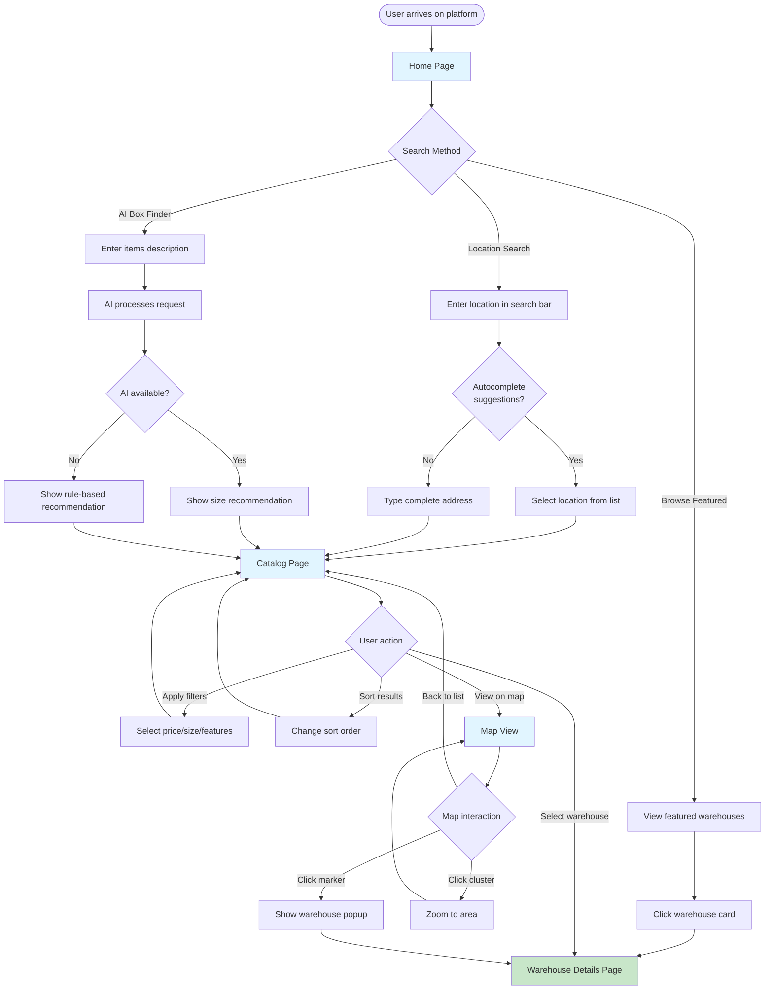
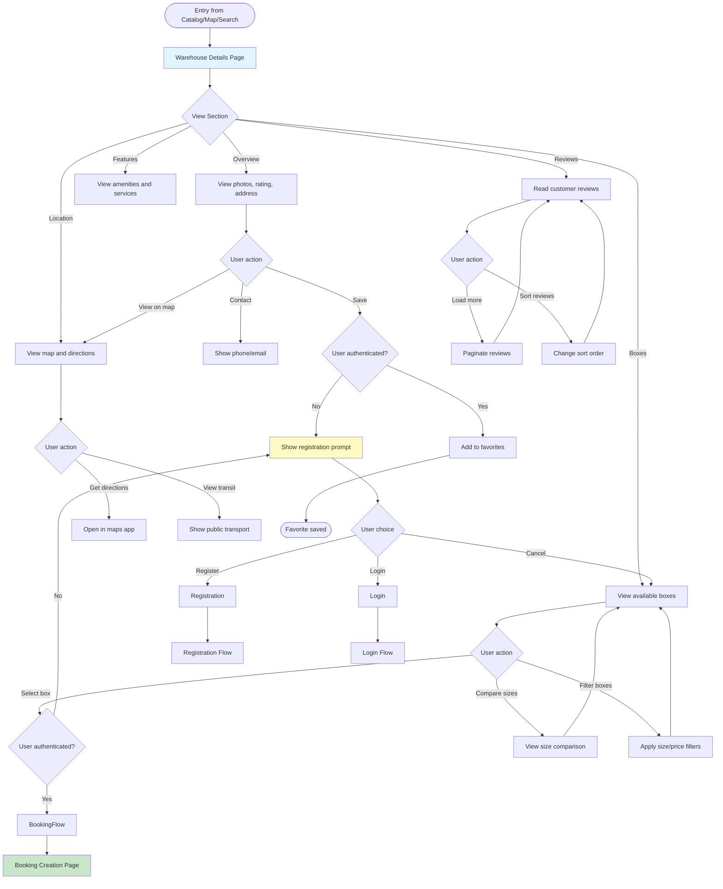

# UX Flow Diagrams & Wireframes Specification (MVP v1)

**Document ID:** DOC-091  
**Project:** Self-Storage Aggregator  
**Status:** 🟡 Supporting / UX Specification  
**Version:** 1.0  
**Last Updated:** December 16, 2025  
**Owner:** Product & Frontend Team

---

> **Document Status:** 🟡 Supporting / UX Specification  
> **Canonical:** ❌ No  
>
> This document visualizes MVP user flows and wireframe-level layouts.  
> It does NOT define business logic, API contracts, or system behavior.  
> For authoritative requirements, always refer to canonical documents.

---

## Document Control

| Attribute | Value |
|-----------|-------|
| Document Type | Supporting / UX Specification |
| Scope | MVP v1 |
| Audience | Product Team, Frontend Developers, UI Designers |
| Dependencies | DOC-001 (Functional Spec), DOC-046 (Frontend Architecture), DOC-077 (Search UX), DOC-023 (Booking Flow) |
| Review Cycle | Per sprint or when user flows change |

---

# Table of Contents

1. [Introduction](#1-introduction)
2. [Covered User Flows (MVP)](#2-covered-user-flows-mvp)
3. [Flow Diagrams](#3-flow-diagrams)
4. [Wireframe-Level Screen Specifications](#4-wireframe-level-screen-specifications)
5. [Cross-Flow Consistency Rules](#5-cross-flow-consistency-rules)
6. [Assumptions & Open Questions](#6-assumptions--open-questions)
7. [Relationship to Canonical Documents](#7-relationship-to-canonical-documents)
8. [Non-Goals](#8-non-goals)

---

# 1. Introduction

## 1.1. Purpose

This document provides **visual representations** of user interactions with the Self-Storage Aggregator platform. It helps:

- **Product teams** validate that user flows match requirements
- **Frontend developers** understand expected user journeys
- **UI designers** create consistent interface designs
- **QA engineers** develop test scenarios based on user paths

**Critical:** This document describes **how users navigate** the system, not **how the system must behave**. For system behavior, business logic, and technical contracts, refer to canonical documents.

## 1.2. Scope (MVP v1)

This specification covers user flows for the initial MVP release only:

**In Scope:**
- ✅ Search & Discovery (guest users)
- ✅ Warehouse Details Page
- ✅ Box Selection Flow
- ✅ Booking Creation Flow
- ✅ User Account Management
- ✅ Operator Onboarding (MVP subset: registration, warehouse creation)

**Out of Scope:**
- ❌ Advanced operator features (team management, analytics)
- ❌ Payment processing flows (post-MVP)
- ❌ Admin panel flows
- ❌ Mobile app-specific flows
- ❌ Multi-language flows (MVP is single language)

## 1.3. Document Conventions

### Flow Diagram Notation

All flow diagrams use **Mermaid** syntax with the following conventions:

- **Rectangles** = Screens/Pages
- **Diamonds** = Decision points
- **Rounded Rectangles** = Actions/Processes
- **Dashed Lines** = Optional/Alternative paths
- **Red paths** = Error/Failure scenarios
- **Green paths** = Success scenarios

### Wireframe-Level Descriptions

Screen specifications describe:
- **What information** appears on the screen
- **What actions** the user can take
- **What happens** when actions are triggered
- **What data** is required/displayed

Screen specifications DO NOT describe:
- Visual design (colors, fonts, spacing)
- Component implementation
- Animation or transitions
- Exact pixel dimensions

---

# 2. Covered User Flows (MVP)

## 2.1. Guest User Flows

| Flow ID | Flow Name | Priority | Description |
|---------|-----------|----------|-------------|
| **GF-01** | Search & Discovery | HIGH | Find warehouses by location, filters, map |
| **GF-02** | Warehouse Details | HIGH | View warehouse information and available boxes |
| **GF-03** | AI Box Finder | HIGH | Get size recommendations based on items |
| **GF-04** | Registration Prompt | MEDIUM | Navigate to registration when attempting booking |

## 2.2. Authenticated User Flows

| Flow ID | Flow Name | Priority | Description |
|---------|-----------|----------|-------------|
| **UF-01** | User Registration | HIGH | Create new user account |
| **UF-02** | User Login | HIGH | Authenticate existing user |
| **UF-03** | Booking Creation | HIGH | Select box and create booking request |
| **UF-04** | Booking Management | HIGH | View and cancel bookings |
| **UF-05** | Profile Management | MEDIUM | Update personal information |
| **UF-06** | Favorites Management | MEDIUM | Save and view favorite warehouses |
| **UF-07** | Review Submission | MEDIUM | Write review after completed booking |

## 2.3. Operator Flows

| Flow ID | Flow Name | Priority | Description |
|---------|-----------|----------|-------------|
| **OF-01** | Operator Registration | HIGH | Register as warehouse operator |
| **OF-02** | Warehouse Creation | HIGH | Add new warehouse to platform |
| **OF-03** | Box Management | HIGH | Add/edit box inventory |
| **OF-04** | Booking Request Processing | HIGH | Approve or decline booking requests |
| **OF-05** | Dashboard Overview | MEDIUM | View business metrics and requests |

---

# 3. Flow Diagrams

## 3.1. Guest User Flows

### GF-01: Search & Discovery Flow



**Key Decision Points:**
- **Search Method:** User can choose location search, AI Box Finder, or browse featured
- **Autocomplete:** System provides suggestions based on input
- **AI Availability:** System falls back to rule-based if AI unavailable
- **Catalog Actions:** User can filter, sort, view map, or select warehouse

**Data Requirements:**
- Location data for autocomplete
- Warehouse listings with filters applied
- AI service status for fallback logic
- Map markers with warehouse coordinates

---

### GF-02: Warehouse Details Flow



**Key Decision Points:**
- **Section Navigation:** User can jump to different information sections
- **Box Selection:** Triggers authentication check before proceeding
- **Save to Favorites:** Requires authentication
- **Contact Actions:** Direct phone/email or map directions

**Data Requirements:**
- Complete warehouse information (from `/api/v1/warehouses/{id}`)
- Box availability and pricing (from `/api/v1/warehouses/{id}/boxes`)
- Reviews with pagination (from `/api/v1/warehouses/{id}/reviews`)
- Map coordinates and location data
- Authentication status

---

### GF-03: AI Box Finder Flow

```mermaid
flowchart TD
    Start([User on Home Page]) --> AISection[AI Box Finder Section]
    
    AISection --> Input[Enter items description]
    Input --> Optional{Add budget?}
    Optional -->|Yes| Budget[Enter monthly budget]
    Optional -->|No| Submit
    Budget --> Submit[Click "Подобрать" button]
    
    Submit --> Validate{Input valid?}
    Validate -->|No - empty| ErrorEmpty[Show "Опишите вещи" error]
    Validate -->|Yes| APICall[Call AI service]
    
    ErrorEmpty --> Input
    
    APICall --> Loading[Show loading indicator]
    Loading --> AIStatus{AI service<br/>available?}
    
    AIStatus -->|Yes| AISuccess[AI processes request]
    AIStatus -->|No| Fallback[Use rule-based logic]
    
    AISuccess --> ShowResults[Display recommendation]
    Fallback --> FallbackResults[Display fallback recommendation]
    
    ShowResults --> ResultsDisplay{Results section}
    FallbackResults --> ResultsDisplay
    
    ResultsDisplay --> MainRec[Show recommended size with reasoning]
    ResultsDisplay --> Alternatives[Show alternative sizes]
    
    MainRec --> UserAction{User action}
    Alternatives --> UserAction
    
    UserAction -->|Search with size| SearchFilter[Go to catalog with size filter]
    UserAction -->|Try again| Input
    UserAction -->|Browse all| Catalog[Go to catalog without filter]
    
    SearchFilter --> CatalogPage[Catalog Page]
    Catalog --> CatalogPage
    
    style AISection fill:#e1f5ff
    style ShowResults fill:#c8e6c9
    style FallbackResults fill:#fff9c4
    style ErrorEmpty fill:#ffcdd2
```

**Key Decision Points:**
- **Budget Input:** Optional field for price filtering
- **Input Validation:** Must have description text
- **AI Availability:** System handles fallback gracefully
- **Result Actions:** User can search with recommendation or browse freely

**Data Requirements:**
- AI service endpoint (`/api/v1/ai/box-finder`)
- Fallback recommendation rules
- Size categories and typical prices
- Error messages for validation

---

## 3.2. Authenticated User Flows

### UF-01: User Registration Flow

```mermaid
flowchart TD
    Start([User clicks "Регистрация"]) --> RegForm[Registration Form]
    
    RegForm --> FormFields[Fill required fields]
    FormFields --> FieldsList[Email, Password, Name, Phone]
    FieldsList --> Terms{Accept terms?}
    
    Terms -->|No| TermsError[Show terms required error]
    Terms -->|Yes| Submit[Click "Зарегистрироваться"]
    
    TermsError --> Terms
    
    Submit --> Validate{Client-side<br/>validation}
    
    Validate -->|Email invalid| EmailError[Show email format error]
    Validate -->|Password weak| PasswordError[Show password requirements]
    Validate -->|Phone invalid| PhoneError[Show phone format error]
    Validate -->|Name too short| NameError[Show name length error]
    Validate -->|All valid| APICall[Call /auth/register]
    
    EmailError --> FormFields
    PasswordError --> FormFields
    PhoneError --> FormFields
    NameError --> FormFields
    
    APICall --> Loading[Show loading state]
    Loading --> ServerResponse{Server response}
    
    ServerResponse -->|201 Created| Success[Registration successful]
    ServerResponse -->|409 Email exists| DuplicateEmail[Show "Email уже используется"]
    ServerResponse -->|409 Phone exists| DuplicatePhone[Show "Телефон уже зарегистрирован"]
    ServerResponse -->|422 Validation| ValidationError[Show validation errors]
    ServerResponse -->|500 Server error| ServerError[Show "Попробуйте позже"]
    
    DuplicateEmail --> FormFields
    DuplicatePhone --> FormFields
    ValidationError --> FormFields
    ServerError --> FormFields
    
    Success --> SetAuth[Set auth cookies]
    SetAuth --> Redirect{Redirect<br/>context}
    
    Redirect -->|From booking| BookingPage[Return to booking]
    Redirect -->|From general| Dashboard[Go to user dashboard]
    
    style RegForm fill:#e1f5ff
    style Success fill:#c8e6c9
    style DuplicateEmail fill:#ffcdd2
    style DuplicatePhone fill:#ffcdd2
    style ServerError fill:#ffcdd2
```

**Key Decision Points:**
- **Terms Acceptance:** Required before submission
- **Client Validation:** Multi-field validation before API call
- **Server Errors:** Various error types with specific messages
- **Redirect Context:** Different destinations based on entry point

**Data Requirements:**
- Registration endpoint (`/api/v1/auth/register`)
- Validation rules (email format, password complexity, phone format)
- Error messages in Russian
- Authentication cookies setup

---

### UF-03: Booking Creation Flow

```mermaid
flowchart TD
    Start([Entry from Warehouse Details]) --> AuthCheck{User<br/>authenticated?}
    
    AuthCheck -->|No| AuthPrompt[Show login/register prompt]
    AuthCheck -->|Yes| BookingPage[Booking Form Page]
    
    AuthPrompt --> AuthChoice{User choice}
    AuthChoice -->|Login| Login[Login Flow]
    AuthChoice -->|Register| Register[Registration Flow]
    AuthChoice -->|Cancel| Cancel([Return to warehouse])
    
    Login --> BookingPage
    Register --> BookingPage
    
    BookingPage --> PrefilledData[Box pre-selected from warehouse]
    PrefilledData --> FormFields{Fill booking details}
    
    FormFields --> StartDate[Select start date]
    FormFields --> Duration[Select duration in months]
    FormFields --> SpecialReqs[Add special requirements]
    
    StartDate --> Validate{Form valid?}
    Duration --> Validate
    SpecialReqs --> Validate
    
    Validate -->|Date in past| DateError[Show "Дата не может быть в прошлом"]
    Validate -->|Duration invalid| DurationError[Show "Выберите от 1 до 12 месяцев"]
    Validate -->|Valid| PriceCalc[Calculate total price]
    
    DateError --> FormFields
    DurationError --> FormFields
    
    PriceCalc --> Summary[Show booking summary]
    Summary --> Confirm{User confirms?}
    
    Confirm -->|No| FormFields
    Confirm -->|Yes| SubmitBooking[Submit booking request]
    
    SubmitBooking --> APICall[Call /bookings POST]
    APICall --> Loading[Show loading state]
    Loading --> ServerResponse{Server response}
    
    ServerResponse -->|201 Created| BookingSuccess[Booking created]
    ServerResponse -->|409 Box unavailable| BoxUnavailable[Show "Бокс уже забронирован"]
    ServerResponse -->|422 Invalid data| ValidationError[Show validation errors]
    ServerResponse -->|500 Server error| ServerError[Show "Попробуйте позже"]
    
    BoxUnavailable --> BoxUnavailableAction{User action}
    BoxUnavailableAction -->|Choose another| BoxSelection[Return to warehouse]
    BoxUnavailableAction -->|Retry| SubmitBooking
    
    ValidationError --> FormFields
    ServerError --> RetryPrompt{Retry?}
    RetryPrompt -->|Yes| SubmitBooking
    RetryPrompt -->|No| Cancel
    
    BoxSelection --> Cancel
    
    BookingSuccess --> Notification[Show success notification]
    Notification --> NextSteps[Display next steps]
    NextSteps --> Redirect{User action}
    
    Redirect -->|View booking| BookingDetails[Booking Details Page]
    Redirect -->|Browse more| Catalog[Return to catalog]
    Redirect -->|Go to dashboard| Dashboard[User Dashboard]
    
    style BookingPage fill:#e1f5ff
    style BookingSuccess fill:#c8e6c9
    style BoxUnavailable fill:#ffcdd2
    style ServerError fill:#ffcdd2
```

**Key Decision Points:**
- **Authentication Check:** Required before accessing booking form
- **Form Validation:** Date and duration constraints
- **Box Availability:** May fail if box becomes unavailable
- **Success Actions:** Multiple options after successful booking

**Data Requirements:**
- Pre-selected box information
- Date validation rules (must be >= today)
- Duration limits (1-12 months)
- Price calculation logic
- Booking creation endpoint (`/api/v1/bookings`)

---

### UF-04: Booking Management Flow

```mermaid
flowchart TD
    Start([User Dashboard]) --> BookingsList[View bookings list]
    
    BookingsList --> FilterStatus{Filter by status}
    FilterStatus -->|All| AllBookings[Show all bookings]
    FilterStatus -->|Pending| PendingBookings[Show pending only]
    FilterStatus -->|Confirmed| ConfirmedBookings[Show confirmed only]
    FilterStatus -->|Active| ActiveBookings[Show active only]
    FilterStatus -->|Completed| CompletedBookings[Show completed only]
    FilterStatus -->|Cancelled| CancelledBookings[Show cancelled only]
    
    AllBookings --> BookingAction
    PendingBookings --> BookingAction
    ConfirmedBookings --> BookingAction
    ActiveBookings --> BookingAction
    CompletedBookings --> BookingAction
    CancelledBookings --> BookingAction
    
    BookingAction{User action} -->|Click booking| BookingDetails[Booking Details Page]
    
    BookingDetails --> ViewInfo[View full booking information]
    ViewInfo --> InfoSections{View section}
    
    InfoSections -->|Warehouse| WarehouseInfo[View warehouse details]
    InfoSections -->|Box| BoxInfo[View box specifications]
    InfoSections -->|Dates| DateInfo[View start/end dates]
    InfoSections -->|Price| PriceInfo[View pricing breakdown]
    InfoSections -->|Status| StatusInfo[View current status]
    
    WarehouseInfo --> Actions
    BoxInfo --> Actions
    DateInfo --> Actions
    PriceInfo --> Actions
    StatusInfo --> Actions
    
    Actions{Available actions} -->|View warehouse| ViewWarehouse[Go to warehouse page]
    Actions -->|Contact operator| ContactOp[Show operator contact]
    Actions -->|Cancel booking| CancelCheck
    Actions -->|Write review| ReviewCheck
    
    CancelCheck{Booking<br/>cancellable?}
    CancelCheck -->|Status = pending| CancelConfirm[Show cancellation confirmation]
    CancelCheck -->|Status = confirmed| CancelConfirm
    CancelCheck -->|Status = active| CancelNotAllowed[Show "Свяжитесь с оператором"]
    CancelCheck -->|Other status| CancelNotAllowed
    
    CancelNotAllowed --> Actions
    
    CancelConfirm --> CancelAction{Confirm cancel?}
    CancelAction -->|No| Actions
    CancelAction -->|Yes| APICancelCall[Call /bookings/{id} DELETE]
    
    APICancelCall --> CancelLoading[Show loading]
    CancelLoading --> CancelResponse{Response}
    
    CancelResponse -->|200 Success| CancelSuccess[Booking cancelled]
    CancelResponse -->|Error| CancelError[Show error message]
    
    CancelSuccess --> Notification1[Show success notification]
    CancelError --> Actions
    Notification1 --> BookingsList
    
    ReviewCheck{Can review?}
    ReviewCheck -->|Status = completed| ReviewForm[Show review form]
    ReviewCheck -->|Other status| ReviewNotAllowed[Show "Доступно после завершения"]
    
    ReviewNotAllowed --> Actions
    ReviewForm --> ReviewFlow[Review Submission Flow]
    
    ViewWarehouse --> WarehousePage[Warehouse Details Page]
    ContactOp --> Contact[Show contact info]
    Contact --> Actions
    
    style BookingsList fill:#e1f5ff
    style BookingDetails fill:#e1f5ff
    style CancelSuccess fill:#c8e6c9
    style CancelNotAllowed fill:#fff9c4
```

**Key Decision Points:**
- **Status Filtering:** User can filter bookings by status
- **Cancellation Rules:** Only pending/confirmed bookings can be cancelled
- **Review Availability:** Only completed bookings can be reviewed
- **Contact Options:** Operator contact available for active bookings

**Data Requirements:**
- Bookings list endpoint (`/api/v1/bookings`)
- Booking details endpoint (`/api/v1/bookings/{id}`)
- Cancel endpoint (`/api/v1/bookings/{id}`)
- Status-based action rules
- Operator contact information

---

## 3.3. Operator Flows

### OF-01: Operator Registration Flow

```mermaid
flowchart TD
    Start([User selects "Стать оператором"]) --> RoleChoice[Choose account type]
    
    RoleChoice --> OpRegForm[Operator Registration Form]
    
    OpRegForm --> PersonalInfo[Fill personal information]
    PersonalInfo --> CompanyInfo[Fill company information]
    CompanyInfo --> Documents[Upload verification documents]
    
    PersonalInfo --> PersonalFields[Email, Password, Name, Phone]
    CompanyInfo --> CompanyFields[Company name, INN, Legal address]
    Documents --> DocumentUpload[Upload INN, OGRN documents]
    
    PersonalFields --> Validate
    CompanyFields --> Validate
    DocumentUpload --> Validate
    
    Validate{Form validation}
    
    Validate -->|Personal info invalid| PersonalError[Show personal field errors]
    Validate -->|Company info invalid| CompanyError[Show company field errors]
    Validate -->|Documents missing| DocumentsError[Show "Загрузите документы"]
    Validate -->|All valid| TermsCheck
    
    PersonalError --> PersonalInfo
    CompanyError --> CompanyInfo
    DocumentsError --> Documents
    
    TermsCheck{Accept<br/>terms?}
    TermsCheck -->|No| TermsError[Show terms required error]
    TermsCheck -->|Yes| Submit[Submit registration]
    
    TermsError --> TermsCheck
    
    Submit --> APICall[Call /auth/register with role=operator]
    APICall --> Loading[Show loading state]
    Loading --> ServerResponse{Server response}
    
    ServerResponse -->|201 Created| RegSuccess[Registration successful]
    ServerResponse -->|409 Conflict| DuplicateError[Show duplicate error]
    ServerResponse -->|422 Validation| ValidationError[Show validation errors]
    ServerResponse -->|500 Server| ServerError[Show server error]
    
    DuplicateError --> OpRegForm
    ValidationError --> OpRegForm
    ServerError --> OpRegForm
    
    RegSuccess --> PendingVerification[Account in verification status]
    PendingVerification --> VerificationNotice[Show "Ждите проверку документов"]
    VerificationNotice --> OpDashboard[Operator Dashboard (Limited)]
    
    OpDashboard --> LimitedAccess[Can view interface but cannot create warehouses]
    
    style OpRegForm fill:#e1f5ff
    style RegSuccess fill:#c8e6c9
    style PendingVerification fill:#fff9c4
    style DuplicateError fill:#ffcdd2
```

**Key Decision Points:**
- **Role Selection:** Differentiates from regular user registration
- **Document Upload:** Required for operator verification
- **Terms Acceptance:** Additional business terms for operators
- **Verification Status:** Account created but limited access until verified

**Data Requirements:**
- Operator-specific registration fields
- Document upload endpoints
- Verification status tracking
- Terms of service for operators

---

### OF-02: Warehouse Creation Flow

```mermaid
flowchart TD
    Start([Operator Dashboard]) --> VerifyStatus{Operator<br/>verified?}
    
    VerifyStatus -->|No| NotVerified[Show "Ждите завершения верификации"]
    VerifyStatus -->|Yes| CreateButton[Click "Добавить склад"]
    
    NotVerified --> End([Cannot create warehouse])
    
    CreateButton --> WarehouseForm[Warehouse Creation Form]
    
    WarehouseForm --> FormSteps{Form sections}
    
    FormSteps --> BasicInfo[1. Basic Information]
    FormSteps --> LocationInfo[2. Location Details]
    FormSteps --> FeaturesInfo[3. Features & Amenities]
    FormSteps --> MediaInfo[4. Photos & Media]
    FormSteps --> ScheduleInfo[5. Working Hours]
    
    BasicInfo --> BasicFields[Name, Description, Contact]
    LocationInfo --> LocationFields[Address, Coordinates, Metro]
    FeaturesInfo --> FeaturesFields[Climate control, CCTV, Access 24/7]
    MediaInfo --> MediaUpload[Upload warehouse photos]
    ScheduleInfo --> ScheduleFields[Set hours for each day]
    
    BasicFields --> Validation
    LocationFields --> Validation
    FeaturesFields --> Validation
    MediaUpload --> Validation
    ScheduleFields --> Validation
    
    Validation{Validate step}
    
    Validation -->|Basic invalid| BasicError[Show basic field errors]
    Validation -->|Location invalid| LocationError[Show location errors]
    Validation -->|Coordinates invalid| CoordError[Show "Укажите на карте"]
    Validation -->|Photos missing| PhotoError[Show "Добавьте минимум 3 фото"]
    Validation -->|Schedule invalid| ScheduleError[Show schedule errors]
    Validation -->|All valid| ReviewForm[Review all information]
    
    BasicError --> BasicInfo
    LocationError --> LocationInfo
    CoordError --> LocationInfo
    PhotoError --> MediaInfo
    ScheduleError --> ScheduleInfo
    
    ReviewForm --> ConfirmCreate{Confirm<br/>creation?}
    
    ConfirmCreate -->|No| EditAgain[Back to form]
    ConfirmCreate -->|Yes| SubmitWarehouse[Submit warehouse]
    
    EditAgain --> WarehouseForm
    
    SubmitWarehouse --> APICall[Call /operator/warehouses POST]
    APICall --> Loading[Show loading state]
    Loading --> ServerResponse{Server response}
    
    ServerResponse -->|201 Created| CreateSuccess[Warehouse created]
    ServerResponse -->|422 Validation| APIValidationError[Show validation errors]
    ServerResponse -->|500 Server| ServerError[Show server error]
    
    APIValidationError --> WarehouseForm
    ServerError --> RetryPrompt{Retry?}
    RetryPrompt -->|Yes| SubmitWarehouse
    RetryPrompt -->|No| OpDashboard
    
    CreateSuccess --> NextSteps[Show success notification]
    NextSteps --> NextAction{Next action}
    
    NextAction -->|Add boxes| BoxCreation[Box Creation Flow]
    NextAction -->|View warehouse| WarehouseManage[Warehouse Management]
    NextAction -->|Create another| WarehouseForm
    NextAction -->|Go to dashboard| OpDashboard[Operator Dashboard]
    
    style WarehouseForm fill:#e1f5ff
    style CreateSuccess fill:#c8e6c9
    style NotVerified fill:#fff9c4
    style APIValidationError fill:#ffcdd2
```

**Key Decision Points:**
- **Verification Check:** Operator must be verified to create warehouses
- **Multi-Step Form:** Form divided into logical sections
- **Validation Per Step:** Each section validates independently
- **Photo Requirements:** Minimum 3 photos required
- **Next Actions:** Multiple options after successful creation

**Data Requirements:**
- Operator verification status
- Warehouse creation endpoint (`/api/v1/operator/warehouses`)
- Photo upload endpoints
- Map integration for coordinate selection
- Working hours structure
- Feature/amenity options

---

### OF-04: Booking Request Processing Flow

```mermaid
flowchart TD
    Start([Operator Dashboard]) --> Notifications{New booking<br/>notification?}
    
    Notifications -->|Yes| NotificationBadge[Show badge on "Заявки"]
    Notifications -->|Manual check| BookingsList
    
    NotificationBadge --> BookingsList[Bookings List Page]
    
    BookingsList --> FilterBookings{Filter options}
    FilterBookings -->|All| AllBookings[Show all bookings]
    FilterBookings -->|Pending only| PendingOnly[Show pending requests]
    FilterBookings -->|By warehouse| ByWarehouse[Filter by warehouse]
    FilterBookings -->|By date| ByDate[Filter by booking date]
    
    AllBookings --> SelectBooking
    PendingOnly --> SelectBooking
    ByWarehouse --> SelectBooking
    ByDate --> SelectBooking
    
    SelectBooking[Click booking request] --> BookingDetails[Booking Details View]
    
    BookingDetails --> ViewDetails[View booking information]
    ViewDetails --> DetailSections{Information sections}
    
    DetailSections -->|User info| UserInfo[Name, phone, email]
    DetailSections -->|Box info| BoxInfo[Box size, price, duration]
    DetailSections -->|Dates| DateInfo[Start date, months]
    DetailSections -->|Special| SpecialReqs[Special requirements]
    
    UserInfo --> Actions
    BoxInfo --> Actions
    DateInfo --> Actions
    SpecialReqs --> Actions
    
    Actions{Available actions} -->|Confirm| ConfirmCheck
    Actions -->|Decline| DeclineCheck
    Actions -->|Contact user| ContactUser[Show contact info]
    Actions -->|View warehouse| ViewWarehouse[Go to warehouse page]
    
    ConfirmCheck{Status<br/>= pending?}
    ConfirmCheck -->|Yes| ConfirmPrompt[Show confirmation prompt]
    ConfirmCheck -->|No| AlreadyProcessed[Show "Уже обработано"]
    
    AlreadyProcessed --> BookingsList
    
    ConfirmPrompt --> ConfirmAction{Confirm?}
    ConfirmAction -->|No| Actions
    ConfirmAction -->|Yes| ConfirmAPI[Call /operator/bookings/{id}/confirm]
    
    ConfirmAPI --> ConfirmLoading[Show loading]
    ConfirmLoading --> ConfirmResponse{Response}
    
    ConfirmResponse -->|200 Success| ConfirmSuccess[Booking confirmed]
    ConfirmResponse -->|Error| ConfirmError[Show error message]
    
    ConfirmSuccess --> NotifyUser1[User notified automatically]
    NotifyUser1 --> SuccessNotification1[Show success notification]
    SuccessNotification1 --> BookingsList
    
    ConfirmError --> Actions
    
    DeclineCheck{Status<br/>= pending?}
    DeclineCheck -->|Yes| DeclineForm[Show decline reason form]
    DeclineCheck -->|No| AlreadyProcessed
    
    DeclineForm --> ReasonInput[Enter decline reason]
    ReasonInput --> ReasonValidate{Reason<br/>provided?}
    
    ReasonValidate -->|No| ReasonRequired[Show "Укажите причину"]
    ReasonValidate -->|Yes| DeclineConfirm[Confirm decline]
    
    ReasonRequired --> ReasonInput
    
    DeclineConfirm --> DeclineAction{Confirm<br/>decline?}
    DeclineAction -->|No| Actions
    DeclineAction -->|Yes| DeclineAPI[Call /operator/bookings/{id}/reject]
    
    DeclineAPI --> DeclineLoading[Show loading]
    DeclineLoading --> DeclineResponse{Response}
    
    DeclineResponse -->|200 Success| DeclineSuccess[Booking declined]
    DeclineResponse -->|Error| DeclineError[Show error message]
    
    DeclineSuccess --> NotifyUser2[User notified with reason]
    NotifyUser2 --> SuccessNotification2[Show success notification]
    SuccessNotification2 --> BookingsList
    
    DeclineError --> Actions
    
    ContactUser --> ContactInfo[Show phone/email]
    ContactInfo --> Actions
    
    ViewWarehouse --> WarehousePage[Warehouse Management Page]
    WarehousePage --> Actions
    
    style BookingsList fill:#e1f5ff
    style BookingDetails fill:#e1f5ff
    style ConfirmSuccess fill:#c8e6c9
    style DeclineSuccess fill:#fff9c4
    style ConfirmError fill:#ffcdd2
```

**Key Decision Points:**
- **Status Check:** Only pending bookings can be processed
- **Decline Reason:** Required field when declining
- **Notification:** User automatically notified of operator decision
- **Contact Options:** Operator can contact user before deciding

**Data Requirements:**
- Bookings list endpoint (`/api/v1/operator/bookings`)
- Booking details with user information
- Confirm endpoint (`/api/v1/operator/bookings/{id}/confirm`)
- Reject endpoint (`/api/v1/operator/bookings/{id}/reject`)
- User contact information
- Status validation rules

---

# 4. Wireframe-Level Screen Specifications

## 4.1. Home Page

### Screen Purpose
Primary entry point for all users to discover storage options through search, AI recommendations, or featured listings.

### Primary Actions
- **Location search:** Enter city/district/address in prominent search bar
- **AI Box Finder:** Describe items to get size recommendation
- **Browse featured:** View curated list of top-rated warehouses

### Secondary Actions
- View "How it works" section
- Browse by city/region
- Access login/registration (header)

### Required Data
- Autocomplete suggestions (from `/api/v1/search/autocomplete`)
- Featured warehouses (from `/api/v1/warehouses/featured`)
- AI service status (for fallback handling)

### Screen Layout (Wireframe-Level)

**Header:**
- Logo (left)
- Navigation: "Как это работает", "Стать оператором" (center)
- "Войти" / "Регистрация" buttons (right)

**Hero Section:**
- Prominent headline: "Найдите склад для ваших вещей"
- Location search bar (full-width, prominent)
- AI Box Finder widget (below search or separate section)

**Featured Warehouses Section:**
- Heading: "Популярные склады"
- Grid of warehouse cards (2-3 rows, 3 cards per row on desktop)
- Each card shows: photo, name, rating, min price, location

**Footer:**
- Links: О нас, Контакты, Помощь, Условия использования
- Social media links
- Contact information

### Error States
- **No location results:** "Ничего не найдено. Попробуйте другой запрос"
- **AI service unavailable:** Silent fallback to rule-based recommendations
- **Network error:** "Проверьте подключение к интернету"

---

## 4.2. Catalog Page

### Screen Purpose
Display filterable, sortable list of warehouses matching user's search criteria.

### Primary Actions
- **Filter warehouses:** Apply price, size, features filters
- **Sort results:** By price, rating, distance
- **View on map:** Toggle to map view
- **Select warehouse:** Click card to view details

### Secondary Actions
- Clear all filters
- Adjust search location
- Change items per page
- Navigate pagination

### Required Data
- Warehouse listings (from `/api/v1/warehouses`)
- Available filter options (from `/api/v1/warehouses/filters`)
- Total results count for pagination

### Screen Layout (Wireframe-Level)

**Header:** (Same as home page)

**Breadcrumb:**
- Home > Склады в [Location]

**Filter Sidebar (Left, 25% width):**
- Location display with edit option
- Price range slider
- Box size checkboxes (S, M, L, XL)
- Features checkboxes (24/7 access, Climate control, CCTV, etc.)
- "Применить" and "Сбросить" buttons

**Main Content (Right, 75% width):**

**Toolbar:**
- Results count: "Найдено 47 складов"
- View toggle: List / Map
- Sort dropdown: По рейтингу, По цене, По расстоянию
- Per page: 12 / 24 / 48

**Warehouse Grid:**
- Grid of warehouse cards (2-3 columns depending on viewport)
- Each card:
  - Main photo
  - Name
  - Rating (stars) + review count
  - Min price per month
  - Location (district, metro)
  - Available boxes badge
  - Quick features icons (24/7, climate, etc.)

**Pagination:**
- Previous / Next buttons
- Page numbers
- "Показать больше" option

### Error States
- **No results:** "Ничего не найдено. Попробуйте изменить фильтры"
- **Loading error:** "Не удалось загрузить склады. Попробуйте позже"
- **Empty filters:** "Выберите хотя бы один критерий"

---

## 4.3. Warehouse Details Page

### Screen Purpose
Provide comprehensive information about a specific warehouse to help users make informed booking decisions.

### Primary Actions
- **Select box:** Choose box size and proceed to booking
- **View on map:** See precise location
- **Contact operator:** Get phone/email for questions
- **Save to favorites:** (requires authentication)

### Secondary Actions
- View photo gallery
- Read reviews
- Filter available boxes
- Get directions
- Share warehouse

### Required Data
- Complete warehouse details (from `/api/v1/warehouses/{id}`)
- Available boxes (from `/api/v1/warehouses/{id}/boxes`)
- Reviews (from `/api/v1/warehouses/{id}/reviews`)
- Authentication status (for favorites)

### Screen Layout (Wireframe-Level)

**Header:** (Same as home page)

**Breadcrumb:**
- Home > Склады в [City] > [Warehouse Name]

**Hero Section:**
- Photo gallery (main photo + thumbnails)
- Warehouse name
- Rating (stars) + review count
- Address with metro station
- "Сохранить" button (heart icon)
- "Поделиться" button

**Main Content (Tabbed or Scrollable Sections):**

**Section 1: Overview**
- Description text
- Key features (icons with labels):
  - 24/7 access
  - Video surveillance
  - Climate control
  - Parking
  - etc.
- Pricing: "От [min_price] AED /месяц"

**Section 2: Available Boxes**
- Box filter: By size, By price
- Box cards grid:
  - Size label (S, M, L, XL)
  - Dimensions (length × width × height)
  - Area (m²)
  - Price per month
  - Available quantity: "[X] свободно"
  - "Выбрать" button

**Section 3: Working Hours**
- Table: Day of week | Hours
- Special notes (holidays, breaks, etc.)

**Section 4: Location**
- Interactive map with warehouse marker
- Address with copy button
- "Проложить маршрут" button
- Nearest metro/bus stops

**Section 5: Reviews**
- Average rating breakdown (5 stars, 4 stars, etc.)
- Review cards:
  - Author name
  - Rating (stars)
  - Date
  - Review text
  - Pros/Cons (if provided)
- "Показать больше" button
- Sort by: Newest, Highest rating, Lowest rating

**Sidebar (if space allows):**
- Quick contact card:
  - Operator name
  - Phone number (click to call)
  - Email (click to open)
  - Response time estimate
- "Задать вопрос" button

### Error States
- **Warehouse not found (404):** "Склад не найден"
- **No boxes available:** "Нет свободных боксов. Попробуйте позже"
- **No reviews yet:** "Пока нет отзывов. Будьте первым!"
- **Map loading error:** "Не удалось загрузить карту"

---

## 4.4. Booking Creation Page

### Screen Purpose
Collect necessary information to create a booking request and submit it for operator approval.

### Primary Actions
- **Select start date:** Choose when rental begins
- **Select duration:** Choose number of months (1-12)
- **Submit booking:** Create booking request

### Secondary Actions
- Add special requirements (text field)
- View booking summary
- Cancel and return to warehouse

### Required Data
- Pre-selected box information
- User authentication status (redirect if not logged in)
- Price calculation (from `/api/v1/bookings` endpoint)
- Current date for validation

### Screen Layout (Wireframe-Level)

**Header:** (Same as home page)

**Breadcrumb:**
- Home > [Warehouse Name] > Бронирование

**Page Title:**
- "Бронирование бокса"

**Summary Card (Top):**
- Warehouse name
- Box size and specifications
- Price per month
- Thumbnail photo

**Booking Form:**

**Field 1: Start Date**
- Date picker
- Validation: Must be today or future
- Helper text: "Дата начала аренды"

**Field 2: Duration**
- Dropdown or number input
- Options: 1-12 months
- Helper text: "Количество месяцев"

**Field 3: Special Requirements (Optional)**
- Multiline text area
- Placeholder: "Укажите особые требования или пожелания"
- Character limit: 500

**Price Summary Box:**
- Box price per month: [X] AED 
- Duration: [Y] months
- **Total:** [X × Y] AED 
- "Цена указана без учета дополнительных услуг"

**Action Buttons:**
- "Отправить заявку" (primary button)
- "Отмена" (secondary button, returns to warehouse)

**Information Notice:**
- "После отправки заявки оператор склада свяжется с вами для подтверждения"
- "Бронирование не является договором и не гарантирует наличие бокса"

### Error States
- **Not authenticated:** Redirect to login/register with return URL
- **Date in past:** "Дата не может быть в прошлом"
- **Duration invalid:** "Выберите от 1 до 12 месяцев"
- **Box unavailable (409):** "К сожалению, бокс уже забронирован. Выберите другой"
- **Server error (500):** "Не удалось создать заявку. Попробуйте позже"

---

## 4.5. User Dashboard

### Screen Purpose
Central hub for authenticated users to manage their bookings, profile, and favorites.

### Primary Actions
- **View bookings:** See all booking requests and their statuses
- **Manage profile:** Update personal information
- **View favorites:** Access saved warehouses

### Secondary Actions
- Filter bookings by status
- Cancel bookings
- Write reviews (for completed bookings)
- Contact operator for active bookings

### Required Data
- User profile (from `/api/v1/users/me`)
- User bookings (from `/api/v1/bookings`)
- Favorites list (from `/api/v1/favorites`)

### Screen Layout (Wireframe-Level)

**Header:** (Authenticated state)
- Logo
- "Мои заявки", "Избранное" (navigation)
- User avatar/name dropdown (right)

**Sidebar (Left, 20% width):**
- User profile summary:
  - Avatar
  - Name
  - Email
- Navigation menu:
  - Мои заявки (active)
  - Избранное
  - Профиль
  - Настройки
  - Выйти

**Main Content (Right, 80% width):**

**Page Title:** "Мои заявки"

**Filter Tabs:**
- Все
- Ожидают (pending badge)
- Подтверждены
- Активные
- Завершенные
- Отмененные

**Bookings List:**
- Booking cards (one per row):
  - Warehouse name with thumbnail
  - Box size
  - Status badge (color-coded)
  - Start date
  - Duration
  - Total price
  - Action buttons (status-dependent):
    - Pending: "Отменить"
    - Confirmed: "Отменить", "Связаться с оператором"
    - Active: "Связаться с оператором"
    - Completed: "Оставить отзыв"
    - Cancelled: "Посмотреть детали"

**Empty States:**
- No bookings: "У вас пока нет заявок. Найдите склад и забронируйте бокс"
- No bookings in filter: "Нет заявок с таким статусом"

### Error States
- **Loading error:** "Не удалось загрузить заявки. Обновите страницу"
- **Cancel error:** "Не удалось отменить заявку. Попробуйте позже"

---

## 4.6. Operator Dashboard

### Screen Purpose
Central management interface for warehouse operators to oversee their business, process bookings, and manage inventory.

### Primary Actions
- **View metrics:** See key business indicators (pending requests, active bookings, occupancy)
- **Process bookings:** Approve or decline booking requests
- **Manage warehouses:** Add/edit warehouse information
- **Manage boxes:** Update box inventory and availability

### Secondary Actions
- View booking details
- Contact customers
- View warehouse analytics
- Update warehouse photos

### Required Data
- Operator stats (from `/api/v1/operator/stats`)
- Bookings list (from `/api/v1/operator/bookings`)
- Warehouses list (from `/api/v1/operator/warehouses`)
- Verification status

### Screen Layout (Wireframe-Level)

**Header:** (Operator state)
- Logo
- "Дашборд", "Склады", "Заявки", "Боксы" (navigation)
- Operator name dropdown (right)

**Sidebar (Left, 20% width):**
- Operator profile summary:
  - Company name
  - Verification status badge
- Navigation menu:
  - Дашборд (active)
  - Мои склады
  - Заявки
  - Боксы
  - Профиль
  - Выйти

**Main Content (Right, 80% width):**

**Page Title:** "Дашборд оператора"

**Metrics Cards (Top Row):**
- Card 1: Новые заявки
  - Number: [X]
  - Badge if > 0
  - Link: "Посмотреть"
- Card 2: Активные бронирования
  - Number: [Y]
  - Link: "Посмотреть"
- Card 3: Заполненность
  - Percentage: [Z]%
  - Subtext: "[filled] из [total] боксов"
- Card 4: Всего складов
  - Number: [W]
  - Link: "Управление"

**Recent Bookings Section:**
- Heading: "Недавние заявки"
- Table or card list:
  - User name
  - Warehouse name
  - Box size
  - Status
  - Date
  - Actions: "Подтвердить", "Отклонить", "Детали"
- "Посмотреть все" link

**Quick Actions:**
- "Добавить склад" button
- "Добавить боксы" button

**Verification Notice (if not verified):**
- Warning banner: "Ваш аккаунт на проверке. Вы сможете добавлять склады после завершения верификации"

### Error States
- **No warehouses:** "У вас пока нет складов. Добавьте первый склад"
- **Loading error:** "Не удалось загрузить данные. Обновите страницу"
- **Not verified:** Limited functionality with prominent notice

---

## 4.7. Map View

### Screen Purpose
Provide geographic visualization of warehouse locations with interactive clustering and filtering.

### Primary Actions
- **Browse map:** Pan and zoom to explore areas
- **Click markers:** View warehouse summary popup
- **Click clusters:** Zoom to see individual warehouses
- **Toggle to list:** Switch back to list view

### Secondary Actions
- Apply filters (same as catalog)
- Get directions to warehouse
- Save warehouse to favorites

### Required Data
- Warehouse locations with coordinates
- Cluster data for zoom levels
- Applied filters from catalog
- User's current location (if permitted)

### Screen Layout (Wireframe-Level)

**Header:** (Same as catalog page)

**Filter Sidebar (Left, collapsible on mobile):**
- Same filters as catalog page
- "Применить" updates map markers

**Map Container (Main area):**
- Full-screen interactive map
- Warehouse markers (single or clustered)
- User location marker (if available)
- Zoom controls
- "View as List" toggle button (top right)

**Marker Popup (on click):**
- Warehouse photo (small)
- Name
- Rating + review count
- Min price
- Distance from user location
- "Подробнее" button → Warehouse Details
- "Построить маршрут" button

**Cluster Marker (multiple warehouses):**
- Number badge showing warehouse count
- Click to zoom into area

### Error States
- **Location permission denied:** Map centers on default location (city center)
- **No warehouses in area:** "В этой области нет складов"
- **Map service unavailable:** Fallback to list view with message

---

# 5. Cross-Flow Consistency Rules

## 5.1. Navigation Patterns

### Back Button Behavior
- **Browser back:** Always supported, returns to previous page
- **In-app back:** Breadcrumbs provide explicit navigation path
- **Form back:** Warns about unsaved changes if data entered

### Breadcrumb Navigation
**Pattern:** Home > Category > Subcategory > Current Page

**Implementation:**
- Always clickable except current page
- Last item (current page) is not a link
- Ellipsis (...) used if breadcrumb too long on mobile

### Header Consistency
**Guest users:**
- Logo (left) → Home
- "Как это работает", "Стать оператором" (center)
- "Войти" / "Регистрация" (right)

**Authenticated users:**
- Logo (left) → Home or Dashboard (based on role)
- Role-specific navigation (center)
- User avatar/name dropdown (right)

## 5.2. Cancel & Retry Logic

### Form Cancellation
**Pattern:**
1. User clicks "Отмена" or back button during form entry
2. If form has unsaved changes:
   - Show confirmation modal: "Несохраненные изменения будут потеряны. Продолжить?"
   - Options: "Да, отменить" / "Нет, остаться"
3. If confirmed, return to previous page or entry point

### API Retry Logic
**Pattern for Failed Requests:**
1. Show error message with retry option
2. User can:
   - Retry immediately (same request)
   - Go back (cancel operation)
   - Continue without (if operation optional)

**Retry Button Behavior:**
- Disabled during retry attempt
- Shows loading state
- Max 3 automatic retries for critical operations

## 5.3. Loading & Empty States

### Loading States

**Initial Page Load:**
- Show skeleton screens matching expected content layout
- No blocking spinners except for critical data
- Progressive loading: Show header/navigation first, content second

**Data Fetching (AJAX):**
- Small inline spinners for component-level loading
- Disable interaction with loading component
- Timeout after 30 seconds with error message

**Form Submission:**
- Disable submit button
- Show loading spinner on button
- Prevent double-submission
- Show success/error feedback

### Empty States

**No Results (Search/Filter):**
- **Message:** "Ничего не найдено"
- **Illustration:** Simple icon or image
- **Action:** "Сбросить фильтры" or "Изменить запрос"
- **Helpful text:** "Попробуйте изменить условия поиска"

**No Data (Dashboard/Lists):**
- **Message:** "[Feature name] пока пусто"
- **Action:** Primary action to add first item
- **Example:** "У вас пока нет заявок. Найдите склад и забронируйте бокс"

**Error Loading:**
- **Message:** "Не удалось загрузить данные"
- **Action:** "Обновить" button
- **Helpful text:** "Проверьте подключение к интернету"

## 5.4. Error Handling Patterns

### Validation Errors
**Display:**
- Inline below field (for field-specific errors)
- Summary at top of form (for multiple errors)
- Red text and red border on invalid fields

**Pattern:**
```
Field Label *
[Text Input] ← Red border
⚠️ Validation error message in red
```

**Timing:**
- Client-side: On blur or before submit
- Server-side: After API response

### API Errors

**Network Errors:**
- **Message:** "Проверьте подключение к интернету"
- **Action:** Retry button

**4xx Client Errors:**
- **400 Bad Request:** Show specific validation errors
- **401 Unauthorized:** Redirect to login
- **403 Forbidden:** "У вас нет доступа к этой странице"
- **404 Not Found:** "Страница не найдена"
- **409 Conflict:** Context-specific message (e.g., "Бокс уже забронирован")
- **422 Unprocessable:** Show field-specific errors

**5xx Server Errors:**
- **500 Internal Server Error:** "Что-то пошло не так. Попробуйте позже"
- **503 Service Unavailable:** "Сервис временно недоступен. Попробуйте позже"

**Error Message Format:**
```
[Icon] Primary Error Message
Secondary explanation or helpful text
[Action Button]
```

### Critical Operation Confirmations
**Pattern for Destructive Actions:**
1. User clicks destructive action (e.g., "Отменить бронирование")
2. Show modal confirmation:
   - **Title:** "Отменить бронирование?"
   - **Message:** Explanation of consequences
   - **Actions:** "Да, отменить" (danger style) / "Нет, вернуться" (default style)
3. If confirmed, proceed with action
4. Show success feedback

## 5.5. Notification & Feedback Patterns

### Success Notifications
**Pattern:**
- Green toast/banner at top of screen
- Auto-dismiss after 5 seconds
- Close button (×) for manual dismiss
- Example: "✓ Бронирование успешно создано"

### Error Notifications
**Pattern:**
- Red toast/banner at top of screen
- Requires manual dismiss (no auto-dismiss)
- Close button (×)
- Example: "⚠️ Не удалось создать бронирование"

### Info Notifications
**Pattern:**
- Blue toast/banner
- Auto-dismiss after 7 seconds or manual dismiss
- Example: "ℹ️ Ваша заявка отправлена оператору"

### Notification Position
- **Desktop:** Top-right corner
- **Mobile:** Top of screen, full-width

---

# 6. Assumptions & Open Questions

## 6.1. Assumptions

### Authentication & Sessions
- **Assumption:** JWT tokens stored in HTTP-only cookies
- **Rationale:** Security best practice, prevents XSS attacks
- **Impact:** Frontend doesn't handle token storage directly

### Map Service
- **Assumption:** Primary map provider is Google Maps
- **Rationale:** Better coverage for Russian locations
- **Impact:** UI optimized for Google Maps API, Google Maps is fallback

### Language Support (MVP)
- **Assumption:** Single language (Russian) in MVP v1
- **Rationale:** Simplifies development, matches target market
- **Impact:** No language switcher in UI, all text is Russian

### Mobile Responsiveness
- **Assumption:** Mobile-first approach, desktop is enhancement
- **Rationale:** Majority of users on mobile devices
- **Impact:** All flows must work on mobile screens first

### AI Service Availability
- **Assumption:** AI Box Finder may be unavailable occasionally
- **Rationale:** External service dependency
- **Impact:** All AI features have rule-based fallbacks

### Booking Confirmation
- **Assumption:** Bookings require operator approval (not instant)
- **Rationale:** Warehouse operators need to verify availability
- **Impact:** "Request" rather than "Confirm" language throughout

## 6.2. Open Questions

### Photo Upload
- **Question:** What are exact requirements for warehouse photo upload?
- **Details:** Min/max dimensions, file formats, file size limits, compression
- **Impact:** Box Management Flow and Warehouse Creation Flow
- **Resolution Needed By:** Before implementation

### Booking Cancellation Policy
- **Question:** Are there time limits for user-initiated cancellation?
- **Details:** Can users cancel confirmed bookings? Active bookings?
- **Impact:** Booking Management Flow, cancellation rules
- **Resolution Needed By:** Before implementation

### Operator Verification Timeline
- **Question:** How long does operator verification take?
- **Details:** Manual review? Automated? Specific steps?
- **Impact:** Operator Registration Flow, messaging to operators
- **Resolution Needed By:** Before operator testing

### Payment Integration (Post-MVP)
- **Question:** How will payment flow integrate when added?
- **Details:** Payment gateway? Timing (upfront vs. on confirmation)?
- **Impact:** Booking Flow, may require significant changes
- **Resolution Needed By:** v1.1 planning phase

### Review Submission Rules
- **Question:** Can users edit/delete reviews after submission?
- **Details:** Moderation process? Edit window? Deletion allowed?
- **Impact:** Review Submission Flow, review display
- **Resolution Needed By:** Before review feature implementation

### Favorites Limit
- **Question:** Is there a limit on number of favorites per user?
- **Details:** Technical limit? Business decision?
- **Impact:** Favorites Management, storage
- **Resolution Needed By:** Before favorites implementation

---

# 7. Relationship to Canonical Documents

## 7.1. DOC-001: Functional Specification (MVP v1)

**Relationship:** This document **visualizes** the requirements defined in DOC-001.

**How They Connect:**
- All user stories in DOC-001 have corresponding flows in this document
- Acceptance criteria from DOC-001 inform flow decision points
- Feature scope in DOC-001 determines which flows are included

**Critical Rule:** If there is a conflict between this document and DOC-001, **DOC-001 wins**. This document must be updated to match.

**Examples:**
- US-HOME-001 (Search by Location) → GF-01 (Search & Discovery Flow)
- US-BOOKING-001 (Create Booking) → UF-03 (Booking Creation Flow)
- US-OPERATOR-002 (Process Requests) → OF-04 (Booking Processing Flow)

## 7.2. DOC-046: Frontend Architecture Specification

**Relationship:** This document defines **what** the UI should do, DOC-046 defines **how** to implement it.

**How They Connect:**
- Flow diagrams inform component architecture
- Screen specifications define required components
- State transitions guide state management approach

**Division of Responsibility:**
- **This Document (DOC-091):** User journeys, screen purposes, data requirements
- **DOC-046:** Component structure, state management, routing implementation

**Example:**
- DOC-091 defines "Booking Creation Flow requires user authentication check"
- DOC-046 defines "Authentication HOC wraps booking route component"

## 7.3. DOC-015 & DOC-016: API Design & Specification

**Relationship:** This document **references** API endpoints but does **not define** them.

**How They Connect:**
- Flow diagrams reference API calls by endpoint name
- Screen data requirements map to API responses
- Error states reflect API error codes

**Critical Rule:** API contracts are defined in DOC-015/DOC-016, not here. This document only describes **when** and **why** APIs are called.

**Example:**
- DOC-091: "Call `/api/v1/bookings` POST when user confirms booking"
- DOC-016: Defines exact request/response structure, validation rules, error codes

## 7.4. DOC-050: Database Specification

**Relationship:** This document shows **how users interact with data**, not **how data is stored**.

**How They Connect:**
- User actions in flows trigger database operations
- Screen data requirements correspond to database queries
- Status transitions reflect state machine changes

**Division of Responsibility:**
- **This Document (DOC-091):** User-facing data display and manipulation
- **DOC-050:** Database schema, constraints, relationships, indexes

## 7.5. DOC-040: Design System Overview

**Relationship:** This document defines **flow patterns**, DOC-040 defines **design patterns**.

**How They Connect:**
- Cross-flow consistency rules align with design principles
- Loading/empty/error states follow design system guidelines
- Screen layouts use component taxonomy from design system

**Division of Responsibility:**
- **This Document (DOC-091):** Flow-specific patterns and user journey rules
- **DOC-040:** Reusable UI patterns and component behavior rules

## 7.6. DOC-077: Search UX Behavior Specification

**Relationship:** DOC-077 provides **detailed** search behavior; this document provides **overview**.

**How They Connect:**
- GF-01 (Search & Discovery Flow) references detailed search behavior
- Catalog page specification aligns with search UX rules
- Filter and sort patterns follow DOC-077 guidelines

**When to Consult:**
- For search flow implementation details → DOC-077
- For overall user journey context → This document

## 7.7. DOC-023: Booking Flow Technical Specification (Supporting)

**Relationship:** Both are supporting documents; DOC-023 is **technical**, this is **UX-focused**.

**How They Connect:**
- UF-03 (Booking Creation Flow) is the UX version
- DOC-023 provides technical implementation details
- Both must be consistent with DOC-001 (canonical)

**When to Consult:**
- For user-facing booking journey → This document
- For booking state machine, business logic → DOC-023

---

# 8. Non-Goals

## 8.1. Not UI Design

**This Document Does NOT:**
- Define color palettes, typography, or visual styling
- Specify exact pixel dimensions or spacing
- Provide design mockups or high-fidelity prototypes
- Define animation or transition effects
- Specify icon choices or illustration styles

**Reason:** UI design is a separate deliverable that builds on top of these wireframe-level specifications.

## 8.2. Not Business Logic

**This Document Does NOT:**
- Define how booking status transitions work (see DOC-023)
- Specify price calculation formulas (see DOC-001)
- Define rate limiting rules (see DOC-043)
- Specify validation rules (see DOC-016)
- Define data retention policies (see DOC-036)

**Reason:** Business logic is defined in canonical technical documents, not UX specifications.

## 8.3. Not API Contracts

**This Document Does NOT:**
- Define API endpoint paths or HTTP methods
- Specify request/response JSON schemas
- Define error codes or error response structures
- Specify authentication mechanisms
- Define API rate limits

**Reason:** API contracts are defined in DOC-015 (API Design Blueprint) and DOC-016 (API Detailed Specification).

## 8.4. Not Acceptance Criteria

**This Document Does NOT:**
- Define what must be true for features to be "done"
- Specify test cases or test scenarios
- Define edge cases or error handling requirements
- Specify performance requirements
- Define security requirements

**Reason:** Acceptance criteria are defined in DOC-001 (Functional Specification).

## 8.5. Not Frontend Implementation

**This Document Does NOT:**
- Define React component structure
- Specify state management approach
- Define routing configuration
- Specify API client implementation
- Define error handling implementation

**Reason:** Frontend implementation is defined in DOC-046 (Frontend Architecture Specification).

## 8.6. Not Technical Architecture

**This Document Does NOT:**
- Define system components or services
- Specify deployment architecture
- Define database schema
- Specify caching strategies
- Define infrastructure requirements

**Reason:** Technical architecture is defined in DOC-002 (Technical Architecture Document).

---

# Appendix A: Flow Diagram Legend

## Shapes

| Shape | Meaning | Usage |
|-------|---------|-------|
| **Rectangle** | Screen/Page | User-visible page or screen |
| **Rounded Rectangle** | Process/Action | Backend process or user action |
| **Diamond** | Decision Point | Conditional logic or user choice |
| **Circle (Start)** | Entry Point | Flow begins here |
| **Circle (End)** | Exit Point | Flow terminates here |
| **Parallelogram** | Input/Output | Data entry or display |

## Colors

| Color | Meaning | Usage |
|-------|---------|-------|
| **Blue (#e1f5ff)** | Standard Screen | Regular pages and screens |
| **Green (#c8e6c9)** | Success Outcome | Successful completion |
| **Yellow (#fff9c4)** | Warning/Info | Intermediate states or notices |
| **Red (#ffcdd2)** | Error State | Error or failure scenarios |
| **Gray (default)** | Process/Decision | Internal logic or decisions |

## Line Styles

| Style | Meaning | Usage |
|-------|---------|-------|
| **Solid Arrow** | Primary Path | Main user journey |
| **Dashed Arrow** | Alternative Path | Optional or fallback paths |
| **Thick Arrow** | Common Path | Frequently used paths |
| **Labeled Arrow** | Conditional | Decision outcome |

---

# Appendix B: Screen Template

For consistency, all screen specifications should follow this template:

```markdown
## [Screen Number]. [Screen Name]

### Screen Purpose
[One sentence describing the screen's main purpose]

### Primary Actions
- **Action 1:** [Description]
- **Action 2:** [Description]

### Secondary Actions
- [Action 1]
- [Action 2]

### Required Data
- [Data source 1 with API endpoint reference]
- [Data source 2 with API endpoint reference]

### Screen Layout (Wireframe-Level)

**Header:**
[Description]

**Main Content:**
[Description]

**Sidebar/Footer:**
[Description]

### Error States
- **Error 1:** [Message and behavior]
- **Error 2:** [Message and behavior]
```

---

# Appendix C: Change Log

| Version | Date | Changes | Author |
|---------|------|---------|--------|
| 1.0 | 2025-12-16 | Initial version | Product & Frontend Team |

---

# Appendix D: Review Checklist

Before approving changes to this document, verify:

- [ ] All flows align with DOC-001 (Functional Specification)
- [ ] No business logic is defined (defer to canonical docs)
- [ ] No API contracts are defined (defer to DOC-015/DOC-016)
- [ ] Flow diagrams use consistent Mermaid notation
- [ ] Screen specs are wireframe-level, not UI design
- [ ] Error states cover common failure scenarios
- [ ] Loading and empty states are specified
- [ ] Cross-flow consistency rules are followed
- [ ] Document clearly states its supporting/non-canonical status
- [ ] All referenced documents (DOC-xxx) are correct

---

**END OF DOCUMENT**

**Document Status:** 🟡 Supporting / UX Specification  
**Maintenance:** Product & Frontend Team  
**Next Review:** Per sprint or when user flows change  
**Contact:** product-team@platform.example

---
