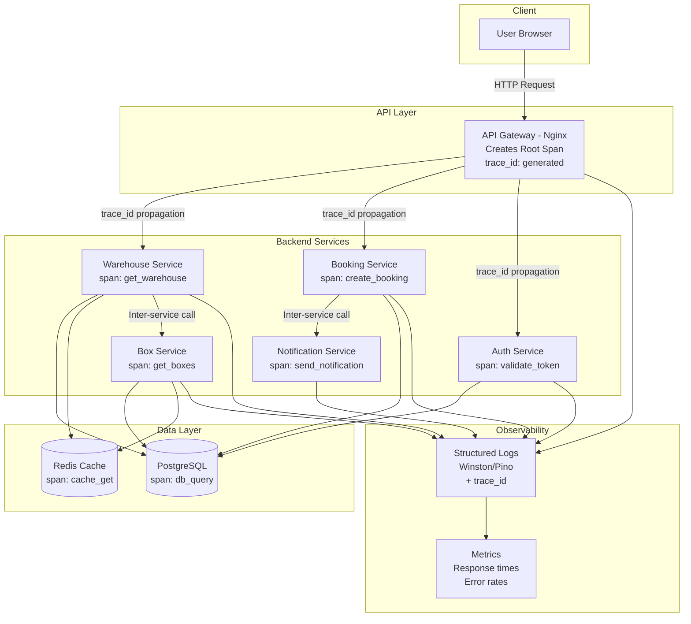

# Distributed Tracing Strategy (MVP v1)
# Self-Storage Aggregator

**Document ID:** DOC-043  
**Version:** 1.0  
**Date:** December 8, 2025  
**Status:** CANONICAL

---

## Table of Contents

1. [Tracing Overview](#1-tracing-overview)
   - 1.1. Назначение распределённого трейсинга в MVP
   - 1.2. Что покрывает трейсинг
   - 1.3. Основные принципы
   - 1.4. Компоненты архитектуры трейсинга

2. [Tracing Architecture](#2-tracing-architecture)
   - 2.1. Архитектурная схема
   - 2.2. Точки генерации спанов
   - 2.3. Где собираются данные трейсинга
   - 2.4. Интеграция с observability-стеком

3. [Context Propagation](#3-context-propagation)
   - 3.1. W3C Trace Context
   - 3.2. Как передаются trace_id и span_id
   - 3.3. Проброс заголовков через API Gateway
   - 3.4. Проброс контекста между сервисами

4. [Identifiers & Span Structure](#4-identifiers--span-structure)
   - 4.1. trace_id
   - 4.2. span_id
   - 4.3. parent span
   - 4.4. span attributes
   - 4.5. span events

5. [API Gateway Tracing](#5-api-gateway-tracing)
   - 5.1. Создание root span
   - 5.2. Обогащение метаданными запросов
   - 5.3. Error spans
   - 5.4. Проброс контекста в backend

6. [Backend Service Tracing](#6-backend-service-tracing)
   - 6.1. Основные точки инструментирования
   - 6.2. Обработка ошибок
   - 6.3. Взаимодействие между сервисами
   - 6.4. Тайминги выполнения запросов

7. [Database Tracing](#7-database-tracing)
   - 7.1. Инструментирование запросов БД
   - 7.2. Slow query spans
   - 7.3. Ошибки БД
   - 7.4. Корреляция с backend spans

8. [Log & Trace Correlation](#8-log--trace-correlation)
   - 8.1. request_id ↔ trace_id
   - 8.2. span_id в логах
   - 8.3. Политика стандартизации логов
   - 8.4. Пример связки лог + span

9. [Sampling Strategy](#9-sampling-strategy)
   - 9.1. Head sampling
   - 9.2. Tail sampling (Post-MVP)
   - 9.3. Adaptive sampling
   - 9.4. MVP-настройки

10. [Visualization & Analysis](#10-visualization--analysis)
    - 10.1. Где смотреть трейсинг
    - 10.2. Анализ цепочек вызовов
    - 10.3. Bottleneck analysis по trace
    - 10.4. Метрики трейсинга

11. [Alerting & Monitoring](#11-alerting--monitoring)
    - 11.1. Алерты на уровне трейсинга
    - 11.2. Ошибки в спанах
    - 11.3. Timeout-трейсы
    - 11.4. Трейсы деградации производительности

12. [Operational Guidelines](#12-operational-guidelines)
    - 12.1. Стандарты разработки
    - 12.2. Проверки в CI/CD
    - 12.3. Общие best practices
    - 12.4. Ограничения MVP

---

## Executive Summary

Данный документ определяет стратегию распределённого трейсинга (distributed tracing) для MVP v1 платформы Self-Storage Aggregator. Стратегия основана на OpenTelemetry SDK, W3C Trace Context и интеграции с существующей logging инфраструктурой (Winston/Pino).

**Ключевые компоненты:**
- OpenTelemetry SDK для генерации spans во всех сервисах
- W3C Trace Context для propagation между компонентами
- Структурированные логи с trace_id/span_id для корреляции
- Head-based sampling (10% в production)
- Log-centric подход без выделенного tracing backend

**Архитектурные компоненты:**
- API Gateway (Nginx + OpenTelemetry module)
- Backend Services (NestJS + OpenTelemetry SDK)
- Database (PostgreSQL с query instrumentation)
- Cache (Redis с operation tracing)
- AI Service (FastAPI + OpenTelemetry SDK)

**MVP ограничения:**
- Нет Jaeger/Tempo/Zipkin
- Хранение в структурированных логах (30 дней)
- Ручной анализ через log aggregation
- Критические пути инструментированы в первую очередь

---

## MVP v1 Scope Notice

**This document describes distributed tracing strategy exclusively for MVP v1.**

The log-centric approach without dedicated tracing backend (Jaeger/Tempo) is an intentional MVP decision to minimize infrastructure complexity and operational overhead. Sections marked as **"Post-MVP"**, **"Migration Path"**, or **"Future"** are informational only and NOT required for initial launch.

All architectural decisions align with:
- `Functional_Specification_MVP_v1_Complete.md`
- `Technical_Architecture_Document_FULL.md`
- `Logging_Strategy_&_Log_Taxonomy_MVP_v1.md`
- `Monitoring_and_Observability_Plan_MVP_v1.md`

---

## 1. Tracing Overview

### 1.1. Назначение распределённого трейсинга в MVP

Distributed Tracing в проекте Self-Storage Aggregator MVP обеспечивает end-to-end visibility всех запросов пользователей через систему. Основные задачи трейсинга в MVP:

**Цели:**
- **Performance Visibility** — отслеживание времени выполнения запросов на всех уровнях (API Gateway → Backend Services → Database)
- **Error Attribution** — точное определение места возникновения ошибок в цепочке вызовов
- **Request Flow Understanding** — визуализация пути запроса через микросервисы (Warehouse Service → Box Service → Database)
- **Latency Analysis** — выявление узких мест и bottleneck'ов в системе
- **Debugging Production Issues** — быстрая локализация проблем в production без необходимости воспроизведения локально

**Scope в MVP:**
Трейсинг покрывает критические user-facing операции:
- Поиск складов (Search warehouses)
- Просмотр деталей склада (Warehouse details + available boxes)
- Создание бронирования (Booking creation flow)
- AI-рекомендации (Box finder)
- Аутентификация (Auth flow)

### 1.2. Что покрывает трейсинг

**Инструментируемые компоненты:**

| Компонент | Что трейсим | Примеры операций |
|-----------|-------------|------------------|
| **API Gateway (Nginx)** | HTTP requests/responses | Request routing, rate limiting checks, CORS handling |
| **Backend Services** | Service-to-service calls | Warehouse → Box, Booking → Notification, Auth → User lookup |
| **Database (PostgreSQL)** | SQL queries | SELECT warehouses, INSERT bookings, UPDATE box availability |
| **Cache (Redis)** | Cache operations | GET cached search results, SET AI responses |
| **External APIs** | Third-party calls | Yandex Maps geocoding, OpenAI API calls |

**Что НЕ трейсим в MVP:**
- Frontend client-side operations (browser-side tracing excluded)
- Static asset requests (CDN traffic)
- Health check endpoints (`/health`, `/readiness`)
- Internal background jobs (scheduled tasks)

### 1.3. Основные принципы

**Принцип 1: End-to-End Visibility**

Каждый user request генерирует единый trace, проходящий через все компоненты:

```
User Request → API Gateway → Warehouse Service → PostgreSQL
                                ↓
                           Box Service → Redis Cache
                                ↓
                           Response → User
```

Все операции в рамках одного запроса связаны единым `trace_id`.

**Принцип 2: Correlation**

Трейсинг обеспечивает корреляцию между:
- **Traces ↔ Logs**: каждый лог содержит `trace_id` и `span_id`
- **Spans ↔ Errors**: ошибки маркируются в соответствующих spans
- **Requests ↔ Metrics**: метрики агрегируются по trace_id
- **Services ↔ Dependencies**: видна вся цепочка межсервисных вызовов

**Принцип 3: Sampling**

В MVP используется **head-based sampling**:

| Environment | Sampling Rate | Описание |
|-------------|---------------|----------|
| Development | 100% | Все трейсы записываются |
| Staging | 50% | Каждый второй трейс |
| Production | 10% | 10% случайных трейсов |
| Production (errors) | 100% | Все трейсы с ошибками |

Sampling позволяет снизить overhead и стоимость хранения данных при сохранении репрезентативности.

**Принцип 4: Low Overhead**

Трейсинг MUST NOT замедлять систему:
- Target latency overhead: < 5ms per request
- Memory overhead: < 50MB per service instance
- CPU overhead: < 2% additional load

### 1.4. Компоненты архитектуры трейсинга

**Стек трейсинга MVP:**

```
┌─────────────────────────────────────────────────┐
│         Application Components                   │
├─────────────────────────────────────────────────┤
│ API Gateway (Nginx) - OpenTelemetry Module      │
│ Backend Services (NestJS) - OTel SDK            │
│ AI Service (FastAPI) - OTel SDK                 │
└─────────────────┬───────────────────────────────┘
                  │
                  ▼
┌─────────────────────────────────────────────────┐
│         OpenTelemetry Collector                  │
│  - Receives spans from all services             │
│  - Performs sampling decisions                   │
│  - Enriches spans with metadata                  │
└─────────────────┬───────────────────────────────┘
                  │
                  ▼
┌─────────────────────────────────────────────────┐
│         Storage & Visualization                  │
│  - Log aggregation (with trace_id)              │
│  - Metrics (Prometheus/Custom)                   │
│  - Trace data (exportable JSON)                  │
└─────────────────────────────────────────────────┘
```

**Ключевые элементы:**

1. **OpenTelemetry SDK** — интеграция в каждый сервис для генерации spans
2. **W3C Trace Context** — стандарт propagation заголовков (см. Section 3.1)
3. **Structured Logging** — Winston/Pino с обязательными полями `trace_id`, `span_id`
4. **Correlation IDs** — `request_id` = `trace_id` для унификации
5. **Context Propagation** — автоматический проброс trace context через HTTP headers и internal calls

---

## 2. Tracing Architecture

### 2.1. Архитектурная схема



**Diagram explanation:**

1. **API Gateway (Nginx)** — creates root span, generates `trace_id` if not present
2. **Backend Services** — create child spans, propagate `trace_id`
3. **Data Layer** — database and cache operations generate spans
4. **Observability** — all components emit structured logs with `trace_id`

### 2.2. Точки генерации спанов

**Span Hierarchy:**

```
Root Span (API Gateway)
  └── Backend Service Span
      ├── Database Query Span
      ├── Cache Operation Span
      └── Inter-Service Call Span
          └── Target Service Span
```

**Span generation points:**

| Layer | Span Type | Generated By | Example |
|-------|-----------|--------------|---------|
| API Gateway | Root span | Nginx OTel module | `GET /api/v1/warehouses` |
| Backend Service | Service span | NestJS controller | `warehouse.get_by_id` |
| Database | Query span | TypeORM interceptor | `SELECT * FROM warehouses` |
| Cache | Cache span | Redis client wrapper | `GET cache:warehouse:123` |
| Inter-service | HTTP span | Axios interceptor | `POST http://box-service/api/boxes` |

### 2.3. Где собираются данные трейсинга

**MVP approach: Log-centric storage**

```yaml
# Log structure with trace context
{
  "timestamp": "2025-12-08T10:30:45.123Z",
  "level": "info",
  "service": "warehouse-service",
  "trace_id": "4bf92f3577b34da6a3ce929d0e0e4736",
  "span_id": "00f067aa0ba902b7",
  "parent_span_id": "8b03292b3fa9d8e9",
  "message": "Warehouse retrieved successfully",
  "duration_ms": 45,
  "attributes": {
    "warehouse_id": "123",
    "city": "moscow",
    "http.method": "GET",
    "http.status_code": 200
  }
}
```

**Storage strategy:**
- **Location**: Structured log files (JSON format)
- **Retention**: 30 days
- **Access**: Log aggregation scripts, `jq` queries
- **Export**: Manual JSON export for analysis

### 2.4. Интеграция с observability-стеком

**Integration points:**

1. **Logging** (Primary):
   - All logs MUST include `trace_id` and `span_id`
   - See: `Logging_Strategy_&_Log_Taxonomy_MVP_v1.md`

2. **Metrics** (Secondary):
   - Trace metrics aggregated from logs
   - See: `Monitoring_and_Observability_Plan_MVP_v1.md`

3. **Alerting** (Derived):
   - Alerts based on trace error rates
   - See: Section 11

---

## 3. Context Propagation

### 3.1. W3C Trace Context

**Standard**: [W3C Trace Context](https://www.w3.org/TR/trace-context/)

OpenTelemetry использует стандарт W3C для передачи trace context между компонентами через HTTP заголовки.

**Primary header:**
```
traceparent: 00-4bf92f3577b34da6a3ce929d0e0e4736-00f067aa0ba902b7-01
             │  └─────────── trace_id ──────────┘  └── span_id ──┘  └─ flags
             └─ version
```

**Format:**
- `version`: `00` (fixed in current spec)
- `trace_id`: 32 hex characters (128-bit)
- `span_id`: 16 hex characters (64-bit)
- `flags`: 2 hex characters (sampling decision)

**Optional header:**
```
tracestate: vendor1=value1,vendor2=value2
```

### 3.2. Как передаются trace_id и span_id

**Propagation flow:**

```
1. API Gateway (Nginx)
   ├── Generates trace_id if missing
   ├── Creates root span_id
   └── Adds traceparent header

2. Backend Service (NestJS)
   ├── Extracts traceparent from request
   ├── Creates child span_id
   ├── Logs with trace_id + span_id
   └── Propagates to next service

3. Database Layer
   ├── Receives trace_id from service
   └── Creates query span_id
```

**Implementation (NestJS):**

```typescript
import { trace, context, SpanStatusCode } from '@opentelemetry/api';

export class TracingInterceptor implements NestInterceptor {
  intercept(executionContext: ExecutionContext, next: CallHandler): Observable<any> {
    const request = executionContext.switchToHttp().getRequest();
    const tracer = trace.getTracer('warehouse-service');
    
    // Extract context from traceparent header (automatic with OTel SDK)
    return tracer.startActiveSpan(
      `${request.method} ${request.url}`,
      (span) => {
        const traceId = span.spanContext().traceId;
        const spanId = span.spanContext().spanId;
        
        // Add to request for logging
        request.traceId = traceId;
        request.spanId = spanId;
        
        return next.handle().pipe(
          tap(() => span.end()),
          catchError((error) => {
            span.recordException(error);
            span.setStatus({ code: SpanStatusCode.ERROR });
            span.end();
            throw error;
          })
        );
      }
    );
  }
}
```

### 3.3. Проброс заголовков через API Gateway

**Nginx configuration:**

```nginx
http {
    # Load OpenTelemetry module
    load_module modules/ngx_http_opentelemetry_module.so;
    
    # OpenTelemetry configuration
    opentelemetry_config /etc/nginx/otel-config.yaml;
    
    server {
        listen 80;
        server_name api.selfstorage.example.com;
        
        location /api/ {
            # Enable tracing for this location
            opentelemetry on;
            opentelemetry_operation_name $request_method$uri;
            opentelemetry_propagate;
            
            # Forward trace headers to backend
            proxy_set_header traceparent $opentelemetry_trace_id;
            proxy_set_header X-Request-ID $request_id;
            
            proxy_pass http://backend-service:3000;
        }
    }
}
```

**OpenTelemetry config (otel-config.yaml):**

```yaml
service:
  name: api-gateway

exporters:
  logging:
    logLevel: info

receivers:
  otlp:
    protocols:
      http:
        endpoint: 0.0.0.0:4318

processors:
  batch:
    timeout: 10s
    send_batch_size: 1024
```

### 3.4. Проброс контекста между сервисами

**Inter-service HTTP calls (Axios):**

```typescript
import axios from 'axios';
import { trace, context } from '@opentelemetry/api';
import { propagation } from '@opentelemetry/core';

export class HttpService {
  async callBoxService(warehouseId: string): Promise<Box[]> {
    const tracer = trace.getTracer('warehouse-service');
    
    return tracer.startActiveSpan('http.call_box_service', async (span) => {
      try {
        // Inject current trace context into HTTP headers
        const headers = {};
        propagation.inject(context.active(), headers);
        
        const response = await axios.get(
          `http://box-service:3000/api/boxes`,
          {
            params: { warehouse_id: warehouseId },
            headers // Contains traceparent automatically
          }
        );
        
        span.setAttributes({
          'http.method': 'GET',
          'http.url': response.config.url,
          'http.status_code': response.status,
          'warehouse_id': warehouseId
        });
        
        span.end();
        return response.data;
        
      } catch (error) {
        span.recordException(error);
        span.setStatus({ code: SpanStatusCode.ERROR });
        span.end();
        throw error;
      }
    });
  }
}
```

---

## 4. Identifiers & Span Structure

### 4.1. trace_id

**Format:**
- Length: 32 hexadecimal characters (128 bits)
- Example: `4bf92f3577b34da6a3ce929d0e0e4736`
- Generation: Random UUID v4 converted to hex

**Generation point:**
- API Gateway (Nginx) if no existing `traceparent` header
- First service in call chain if bypassing gateway

**Uniqueness guarantee:**
- Globally unique across all traces
- Low collision probability (~10^-38)

### 4.2. span_id

**Format:**
- Length: 16 hexadecimal characters (64 bits)
- Example: `00f067aa0ba902b7`
- Generation: Random 64-bit value

**Uniqueness:**
- Unique within trace (not globally unique)
- Each operation creates new span_id

### 4.3. parent span

**Relationship:**
```
Root Span (span_id: A, parent: null)
  └── Child Span (span_id: B, parent: A)
      └── Grandchild Span (span_id: C, parent: B)
```

**Storage in logs:**
```json
{
  "trace_id": "4bf92f3577b34da6a3ce929d0e0e4736",
  "span_id": "00f067aa0ba902b7",
  "parent_span_id": "8b03292b3fa9d8e9"
}
```

### 4.4. span attributes

**Standard attributes:**

| Attribute | Type | Example | Required |
|-----------|------|---------|----------|
| `service.name` | string | `warehouse-service` | MUST |
| `http.method` | string | `GET` | SHOULD |
| `http.url` | string | `/api/warehouses/123` | SHOULD |
| `http.status_code` | integer | `200` | SHOULD |
| `db.system` | string | `postgresql` | MUST (DB) |
| `db.statement` | string | `SELECT * FROM...` | SHOULD |

**Business attributes:**

```typescript
span.setAttributes({
  'warehouse.id': '123',
  'warehouse.city': 'moscow',
  'search.radius_km': 10,
  'user.id': 'user_456'
});
```

### 4.5. span events

**Events for significant moments:**

```typescript
span.addEvent('cache_miss', {
  'cache.key': 'warehouse:123',
  'cache.ttl_seconds': 3600
});

span.addEvent('ai_recommendation_generated', {
  'ai.model': 'gpt-4',
  'ai.tokens_used': 150
});
```

---

## 5. API Gateway Tracing

### 5.1. Создание root span

**Nginx responsibility:**

1. Receive incoming HTTP request
2. Check for existing `traceparent` header
3. If missing: generate new trace_id
4. Create root span
5. Forward to backend with trace context

**Root span attributes:**

```yaml
span_name: "GET /api/v1/warehouses"
attributes:
  http.method: "GET"
  http.url: "/api/v1/warehouses?city=moscow"
  http.user_agent: "Mozilla/5.0..."
  client.ip: "192.168.1.100"
  http.request_id: "req_abc123" # Optional correlation
```

### 5.2. Обогащение метаданными запросов

**Metadata enrichment:**

```nginx
location /api/ {
    opentelemetry on;
    opentelemetry_attribute "http.route" "$uri";
    opentelemetry_attribute "http.client_ip" "$remote_addr";
    opentelemetry_attribute "http.user_agent" "$http_user_agent";
    opentelemetry_attribute "api.version" "v1";
}
```

### 5.3. Error spans

**Error handling in Nginx:**

```nginx
location /api/ {
    # Backend errors
    error_page 500 502 503 504 /50x.html;
    
    # Record error in span
    opentelemetry_operation_name "$request_method $uri [ERROR]";
}
```

**Span attributes for errors:**
```yaml
span.error: true
error.type: "upstream_timeout"
error.message: "Backend service timeout"
http.status_code: 504
```

### 5.4. Проброс контекста в backend

See Section 3.3 for detailed Nginx configuration. Headers forwarded:
- `traceparent` (W3C standard)
- `X-Request-ID` (optional correlation)

---

## 6. Backend Service Tracing

### 6.1. Основные точки инструментирования

**Critical instrumentation points:**

```typescript
// 1. Controller entry point
@Controller('warehouses')
export class WarehouseController {
  @Get(':id')
  @UseInterceptors(TracingInterceptor)
  async getWarehouse(@Param('id') id: string) {
    const tracer = trace.getTracer('warehouse-service');
    return tracer.startActiveSpan('warehouse.get_by_id', async (span) => {
      span.setAttributes({ 'warehouse.id': id });
      
      const result = await this.warehouseService.findById(id);
      
      span.end();
      return result;
    });
  }
}

// 2. Service layer
export class WarehouseService {
  async findById(id: string): Promise<Warehouse> {
    const tracer = trace.getTracer('warehouse-service');
    return tracer.startActiveSpan('service.find_warehouse', async (span) => {
      // Check cache
      const cached = await this.checkCache(id);
      if (cached) {
        span.addEvent('cache_hit');
        span.end();
        return cached;
      }
      
      // Database query
      const warehouse = await this.repository.findOne({ where: { id } });
      
      // Cache result
      await this.cacheWarehouse(id, warehouse);
      
      span.end();
      return warehouse;
    });
  }
}
```

### 6.2. Обработка ошибок

**Error recording:**

```typescript
import { SpanStatusCode } from '@opentelemetry/api';

try {
  const result = await this.dangerousOperation();
  span.setStatus({ code: SpanStatusCode.OK });
  return result;
} catch (error) {
  span.recordException(error);
  span.setStatus({
    code: SpanStatusCode.ERROR,
    message: error.message
  });
  span.setAttributes({
    'error.type': error.constructor.name,
    'error.stack': error.stack
  });
  throw error;
} finally {
  span.end();
}
```

### 6.3. Взаимодействие между сервисами

See Section 3.4 for inter-service HTTP propagation.

**Key points:**
- Automatic context injection via OpenTelemetry SDK
- Parent-child span relationship maintained
- Errors propagated with trace context

### 6.4. Тайминги выполнения запросов

**Automatic timing:**

```typescript
// Span duration automatically recorded on span.end()
const span = tracer.startSpan('operation_name');
await longRunningOperation();
span.end(); // Duration: end_time - start_time
```

**Manual timing for specific segments:**

```typescript
const startTime = Date.now();
await complexCalculation();
const duration = Date.now() - startTime;

span.setAttributes({
  'calculation.duration_ms': duration,
  'calculation.complexity': 'high'
});
```

---

## 7. Database Tracing

### 7.1. Инструментирование запросов БД

**TypeORM interceptor:**

```typescript
import { Logger } from 'typeorm';
import { trace } from '@opentelemetry/api';

export class TracingLogger implements Logger {
  logQuery(query: string, parameters?: any[]) {
    const tracer = trace.getTracer('database');
    const span = tracer.startSpan('database.query');
    
    span.setAttributes({
      'db.system': 'postgresql',
      'db.statement': query.substring(0, 500), // Truncate long queries
      'db.operation': this.extractOperation(query),
      'db.table': this.extractTable(query)
    });
    
    span.end();
  }
  
  private extractOperation(query: string): string {
    const match = query.match(/^(SELECT|INSERT|UPDATE|DELETE)/i);
    return match ? match[1].toUpperCase() : 'UNKNOWN';
  }
}
```

### 7.2. Slow query spans

**Slow query detection:**

```typescript
const startTime = Date.now();
const result = await queryRunner.query(sql, params);
const duration = Date.now() - startTime;

if (duration > 1000) { // 1 second threshold
  span.addEvent('slow_query_detected', {
    'db.query_duration_ms': duration,
    'db.threshold_ms': 1000
  });
  
  logger.warn('Slow query detected', {
    trace_id: span.spanContext().traceId,
    query: sql,
    duration_ms: duration
  });
}
```

### 7.3. Ошибки БД

**Database error classification:**

```typescript
catch (error) {
  const errorType = error.code === '23505' 
    ? 'duplicate_key' 
    : error.code === '23503'
    ? 'foreign_key_violation'
    : 'database_error';
    
  span.setAttributes({
    'error.type': errorType,
    'db.error_code': error.code,
    'db.error_message': error.message
  });
  
  span.recordException(error);
  span.setStatus({ code: SpanStatusCode.ERROR });
}
```

### 7.4. Корреляция с backend spans

**Parent-child relationship:**

```
Backend Service Span (parent)
  └── Database Query Span (child)
```

Context automatically propagated through TypeORM integration.

---

## 8. Log & Trace Correlation

### 8.1. request_id ↔ trace_id

**Correlation strategy:**

```typescript
// In API Gateway (Nginx)
proxy_set_header X-Request-ID $request_id;
proxy_set_header traceparent $opentelemetry_trace_id;

// In Backend Service
const requestId = req.headers['x-request-id'];
const traceId = trace.getActiveSpan().spanContext().traceId;

// Store mapping
logger.info('Request received', {
  request_id: requestId,
  trace_id: traceId,
  mapping: 'request_id == trace_id for this system'
});
```

**MVP decision:** `request_id` = `trace_id` for simplicity.

### 8.2. span_id в логах

**Logger configuration:**

```typescript
import winston from 'winston';
import { trace } from '@opentelemetry/api';

const logger = winston.createLogger({
  format: winston.format.combine(
    winston.format.timestamp(),
    winston.format.json()
  ),
  defaultMeta: {
    service: 'warehouse-service',
    environment: process.env.NODE_ENV
  }
});

// Custom formatter to inject trace context
logger.format = winston.format((info) => {
  const span = trace.getActiveSpan();
  if (span) {
    info.trace_id = span.spanContext().traceId;
    info.span_id = span.spanContext().spanId;
  }
  return info;
})();
```

### 8.3. Политика стандартизации логов

**Required fields in all logs:**

```typescript
{
  "timestamp": "ISO8601",      // MUST
  "level": "info|warn|error",  // MUST
  "service": "service-name",   // MUST
  "trace_id": "32-hex-chars",  // MUST
  "span_id": "16-hex-chars",   // MUST
  "message": "Human readable", // MUST
  "attributes": {}             // SHOULD
}
```

See `Logging_Strategy_&_Log_Taxonomy_MVP_v1.md` for complete logging specification.

**Security restrictions:**
- ❌ MUST NOT log PII (email, phone, address)
- ❌ MUST NOT log secrets, tokens, passwords
- ❌ MUST NOT log credit card data
- ✅ trace_id and span_id are safe to log
- ✅ Business IDs (warehouse_id, booking_id) are safe

### 8.4. Пример связки лог + span

**Complete correlation example:**

```json
// Log entry
{
  "timestamp": "2025-12-08T10:30:45.123Z",
  "level": "info",
  "service": "warehouse-service",
  "trace_id": "4bf92f3577b34da6a3ce929d0e0e4736",
  "span_id": "00f067aa0ba902b7",
  "parent_span_id": "8b03292b3fa9d8e9",
  "message": "Warehouse retrieved successfully",
  "attributes": {
    "warehouse_id": "123",
    "city": "moscow",
    "http.method": "GET",
    "http.status_code": 200,
    "duration_ms": 45
  }
}

// Corresponding span data
{
  "trace_id": "4bf92f3577b34da6a3ce929d0e0e4736",
  "span_id": "00f067aa0ba902b7",
  "parent_span_id": "8b03292b3fa9d8e9",
  "name": "warehouse.get_by_id",
  "start_time": "2025-12-08T10:30:45.078Z",
  "end_time": "2025-12-08T10:30:45.123Z",
  "duration_ms": 45,
  "status": "OK",
  "attributes": {
    "warehouse.id": "123",
    "warehouse.city": "moscow"
  }
}
```

---

## 9. Sampling Strategy

### 9.1. Head sampling

**Implementation:**

Head sampling делает решение о записи трейса в момент его создания (в API Gateway).

```typescript
import { TraceIdRatioBasedSampler, ParentBasedSampler } from '@opentelemetry/sdk-trace-base';

const sampler = new ParentBasedSampler({
  root: new TraceIdRatioBasedSampler(0.1) // 10% sampling
});

const tracerProvider = new NodeTracerProvider({
  sampler,
  resource: new Resource({
    [SemanticResourceAttributes.SERVICE_NAME]: 'warehouse-service'
  })
});
```

**Sampling rules:**
- Base rate: 10% (configurable per environment)
- Always sample: errors (5xx), slow requests (>3s)
- Never sample: health checks, metrics endpoints

**Configuration:**

```yaml
# Environment-specific sampling
OTEL_TRACES_SAMPLER: "parentbased_traceidratio"
OTEL_TRACES_SAMPLER_ARG: "0.1" # 10% for production
```

### 9.2. Tail sampling

**Post-MVP / Informational Only**

Tail sampling NOT used in MVP. Requires buffering all spans until trace completion, which adds complexity and memory overhead. May be considered in post-MVP phase if dedicated tracing backend (Jaeger/Tempo) is added.

### 9.3. Adaptive sampling

**Dynamic rate adjustment:**

```typescript
export class AdaptiveSampler {
  private currentRate = 0.1;
  private targetRPS = 1000;
  
  adjustSamplingRate(actualRPS: number, errorRate: number) {
    // Increase on errors
    if (errorRate > 0.05) {
      this.currentRate = 1.0;
      return;
    }
    
    // Decrease on high load
    if (actualRPS > this.targetRPS) {
      this.currentRate = Math.max(0.01, this.currentRate * 0.8);
    }
    
    // Increase on low load
    if (actualRPS < this.targetRPS * 0.5) {
      this.currentRate = Math.min(0.5, this.currentRate * 1.2);
    }
  }
}
```

### 9.4. MVP-настройки

```typescript
const samplingRate = {
  development: 1.0,   // 100% - all traces
  staging: 0.5,       // 50% - half traces
  production: 0.1     // 10% - cost-effective
}[process.env.NODE_ENV];

// Force sampling
const alwaysSample = [
  '/api/v1/bookings',  // Critical path
  '/api/v1/payments'   // Financial operations
];

// Never sample
const neverSample = [
  '/health',
  '/readiness',
  '/metrics'
];
```

---

## 10. Visualization & Analysis

### 10.1. Где смотреть трейсинг

**MVP approach: Log-based analysis**

```bash
# View complete trace
cat logs/app.log | jq 'select(.trace_id == "4bf92f3577b34da6a3ce929d0e0e4736")'

# Find all errors
cat logs/app.log | jq 'select(.level == "error")'

# Find slow requests
cat logs/app.log | jq 'select(.duration_ms > 1000)'

# Get trace timeline
cat logs/app.log | jq -s 'sort_by(.timestamp) | .[] | select(.trace_id == "TRACE_ID")'
```

### 10.2. Анализ цепочек вызовов

**Reconstruct call tree:**

```bash
#!/bin/bash
# trace_analyzer.sh

TRACE_ID=$1

cat logs/app.log | jq -s "
  map(select(.trace_id == \"$TRACE_ID\"))
  | sort_by(.timestamp)
  | .[]
  | {
      service: .service,
      span_id: .span_id,
      parent_span_id: .parent_span_id,
      operation: .message,
      duration_ms: .duration_ms
    }
"
```

**Output:**
```
API Gateway (485ms)
  └── Warehouse Service (470ms)
      ├── Cache lookup (5ms) [MISS]
      ├── Database query (420ms) [SLOW]
      └── Box Service (20ms)
```

### 10.3. Bottleneck analysis по trace

**Automated detection:**

```typescript
export class BottleneckAnalyzer {
  analyzeTrace(spans: Span[]): BottleneckReport {
    const totalDuration = spans[0].duration_ms;
    
    const slowOperations = spans
      .filter(s => s.duration_ms > 1000)
      .map(s => ({
        operation: s.name,
        duration_ms: s.duration_ms,
        percentage: (s.duration_ms / totalDuration) * 100
      }));
      
    const overhead = this.calculateOverhead(spans);
    
    return {
      total_duration_ms: totalDuration,
      slow_operations: slowOperations,
      parent_child_overhead_ms: overhead,
      bottleneck: slowOperations[0]?.operation || 'none'
    };
  }
}
```

### 10.4. Метрики трейсинга

**Key metrics from logs:**

```bash
# Total traces count
cat logs/app.log | jq -s 'map(select(.span_id)) | unique_by(.trace_id) | length'

# Average duration
cat logs/app.log | jq -s 'map(select(.duration_ms)) | add / length'

# Error rate
cat logs/app.log | jq -s '
  map(select(.span_id)) | 
  group_by(.level == "error") | 
  map({level: .[0].level, count: length})
'

# P95 latency
cat logs/app.log | jq -s 'map(.duration_ms) | sort | .[length * 0.95 | floor]'
```

---

## 11. Alerting & Monitoring

### 11.1. Алерты на уровне трейсинга

**Alert Rules:**

```yaml
# High error rate
- alert: TraceErrorRateHigh
  expr: rate(trace_errors_total[5m]) > 0.05
  severity: CRITICAL
  description: "Trace error rate > 5%"

# High slow trace rate
- alert: SlowTraceRateHigh
  expr: rate(trace_slow_total[5m]) > 0.10
  severity: WARNING
  description: "Slow trace rate > 10%"

# High P99 latency
- alert: TraceP99LatencyHigh
  expr: histogram_quantile(0.99, rate(trace_duration_ms[5m])) > 5000
  severity: WARNING
  description: "P99 latency > 5 seconds"
```

### 11.2. Ошибки в спанах

**Error tracking:**

```typescript
export class ErrorTracker {
  trackSpanErrors(spans: Span[]) {
    const errors = spans.filter(s => s.status === 'ERROR');
    
    // Group by error type
    const byType = groupBy(errors, 'attributes.error.type');
    
    // Group by service
    const byService = groupBy(errors, 'service');
    
    // Detect cascading failures
    const cascading = this.detectCascadingFailures(errors);
    
    return { byType, byService, cascading };
  }
}
```

### 11.3. Timeout-трейсы

**Timeout detection:**

```yaml
Thresholds:
  api_gateway: 30s      # Client-facing timeout
  backend_service: 10s  # Internal service timeout
  database_query: 5s    # Database operation timeout
  external_api: 15s     # Third-party API timeout
```

**Alert:**
```typescript
if (span.duration_ms > timeout_threshold) {
  logger.error('Operation timeout', {
    trace_id: span.trace_id,
    operation: span.name,
    duration_ms: span.duration_ms,
    threshold_ms: timeout_threshold
  });
}
```

### 11.4. Трейсы деградации производительности

**Performance baseline comparison:**

```typescript
export class PerformanceDegradationDetector {
  detectDegradation(
    currentP50: number,
    baselineP50: number
  ): DegradationReport {
    const degradationPercent = 
      ((currentP50 - baselineP50) / baselineP50) * 100;
      
    if (degradationPercent > 100) {
      return {
        severity: 'CRITICAL',
        message: 'Performance >100% slower than baseline'
      };
    }
    
    if (degradationPercent > 50) {
      return {
        severity: 'WARNING',
        message: 'Performance >50% slower than baseline'
      };
    }
    
    return { severity: 'OK' };
  }
}
```

---

## 12. Operational Guidelines

### 12.1. Стандарты разработки

**DO:**
- ✅ Use clear, hierarchical span names (`warehouse.get_by_id`, `database.select_warehouse`)
- ✅ Include business context in attributes (`warehouse_id`, `city`, `search_radius_km`)
- ✅ Always record exceptions with `span.recordException(error)`
- ✅ End spans in `finally` blocks to guarantee cleanup
- ✅ Propagate context across service boundaries automatically via OTel SDK

**DON'T:**
- ❌ Use generic span names ("process", "handle", "execute")
- ❌ Include sensitive data in span attributes (see security restrictions below)
- ❌ Create unbounded attributes (arrays, large objects)
- ❌ Forget to end spans (causes memory leaks)
- ❌ Block application logic on trace export

**Security Restrictions:**

**MUST NOT log or store in spans:**
- ❌ PII (Personal Identifiable Information): emails, phone numbers, addresses, names
- ❌ Secrets: passwords, API keys, tokens, certificates
- ❌ Financial data: credit card numbers, bank accounts
- ❌ Authentication data: session tokens, JWTs (except redacted versions)

**SAFE to log:**
- ✅ trace_id and span_id (non-sensitive identifiers)
- ✅ Business IDs: warehouse_id, booking_id, user_id (UUIDs only)
- ✅ Operation metadata: HTTP methods, status codes, durations
- ✅ Aggregated metrics: counts, averages, percentiles

### 12.2. Проверки в CI/CD

**Automated validation:**

```yaml
# .github/workflows/tracing-validation.yml

name: Tracing Validation

on: [pull_request]

jobs:
  validate-tracing:
    runs-on: ubuntu-latest
    steps:
      # Check all logs include trace_id
      - name: Validate trace_id in logs
        run: |
          grep -r "logger\.\(log\|info\|warn\|error\)" src/ | \
          grep -v "trace_id" && \
          echo "ERROR: Log without trace_id found" && exit 1

      # Validate span naming conventions
      - name: Validate span names
        run: |
          grep -r "startSpan(" src/ | \
          grep -E "process|handle|execute" && \
          echo "ERROR: Generic span name found" && exit 1

      # Check for sensitive data in spans
      - name: Check sensitive data
        run: |
          grep -r "setAttributes" src/ | \
          grep -iE "password|secret|token|credit_card" && \
          echo "ERROR: Sensitive data in span attributes" && exit 1
```

### 12.3. Общие best practices

**Naming conventions:**

| Type | Pattern | Example |
|------|---------|---------|
| Service operations | `service.action_object` | `warehouse.get_details` |
| Database operations | `database.operation_table` | `database.select_warehouses` |
| HTTP calls | `http.method_service` | `http.get_box_service` |
| Cache operations | `cache.operation_key` | `cache.get_warehouse_123` |

**Performance targets:**

```yaml
Overhead targets (MUST NOT exceed):
  latency_per_request: <5ms
  memory_per_service: <50MB
  cpu_additional_load: <2%
```

**Span lifecycle:**

```typescript
// CORRECT
const span = tracer.startSpan('operation');
try {
  await doWork();
  span.setStatus({ code: SpanStatusCode.OK });
} catch (error) {
  span.recordException(error);
  span.setStatus({ code: SpanStatusCode.ERROR });
  throw error;
} finally {
  span.end(); // ALWAYS end in finally
}

// INCORRECT
const span = tracer.startSpan('operation');
await doWork();
span.end(); // Span not ended if doWork() throws
```

### 12.4. Ограничения MVP

**Current MVP limitations:**

1. **No dedicated tracing backend**
   - Tracing data stored in structured logs only
   - No Jaeger, Tempo, or Zipkin
   - Manual trace visualization required

2. **Log retention**
   - 30-day retention period
   - No long-term trace storage
   - Manual export for historical analysis

3. **Analysis limitations**
   - No real-time trace visualization
   - Manual reconstruction of call trees
   - Limited automated bottleneck detection

4. **Sampling constraints**
   - Head sampling only (decision at trace start)
   - No tail sampling (requires buffering)
   - Fixed sampling rates per environment

5. **Instrumentation scope**
   - Critical paths only in MVP
   - Background jobs not instrumented
   - Frontend tracing excluded

---

### **Post-MVP Migration Path** (Informational Only)

**These steps are NOT required for MVP v1 launch. This information is provided for future planning only.**

**Phase 1: Infrastructure (Post-MVP, 1-2 months)**
- Deploy OpenTelemetry Collector as central receiver
- Set up Jaeger for trace visualization
- Configure Prometheus for trace metrics

**Phase 2: Advanced Features (Post-MVP, 3-4 months)**
- Implement tail sampling for better trace selection
- Enable auto-instrumentation for faster development
- Add real-time dashboards (Grafana)

**Phase 3: Optimization (Post-MVP, 6+ months)**
- Fine-tune sampling strategies based on production data
- Implement adaptive sampling
- Add trace-based SLO tracking

---

## Conclusion

### Implementation Checklist

**Phase 1: Foundation (Week 1-2)**
- [ ] Deploy OpenTelemetry SDK to all services
- [ ] Configure Nginx with OTel module
- [ ] Implement trace context propagation
- [ ] Set up structured logging with trace_id

**Phase 2: Instrumentation (Week 3-4)**
- [ ] Instrument API Gateway root spans
- [ ] Instrument Backend service operations
- [ ] Instrument Database queries via TypeORM
- [ ] Implement error tracking in spans

**Phase 3: Analysis (Week 5-6)**
- [ ] Create trace analysis scripts (see Section 10)
- [ ] Set up log aggregation pipeline
- [ ] Configure sampling strategies per environment
- [ ] Deploy alert rules (see Section 11)

**Phase 4: Operations (Week 7-8)**
- [ ] Train development team on tracing standards
- [ ] Document operational runbooks
- [ ] Establish trace quality SLOs
- [ ] Monitor overhead and performance impact

---

### Success Metrics

| Metric | Target | Measurement Method |
|--------|--------|--------------------|
| Coverage | 100% critical paths instrumented | Code review + span count |
| Overhead | <5ms latency per request | Performance testing |
| Sampling | 10% in production | Log analysis |
| Completeness | >90% spans recorded | Trace validation |
| MTTR | <30min with traces | Incident response time |

---

### Next Steps

**1. Immediate (This Sprint):**
- Review this document with technical team
- Approve tracing strategy and MVP scope
- Assign implementation owners for each phase

**2. Short-term (Sprint 1-3, MVP v1 implementation):**
- Complete Phase 1-4 implementation
- Collect baseline trace metrics
- Refine sampling rates based on initial data
- Validate trace correlation with logs

**Post-MVP / Non-blocking:**

**3. Long-term (6-12 months post-launch):**
- Evaluate migration to dedicated tracing backend (Jaeger/Tempo)
- Implement advanced sampling strategies (tail sampling)
- Add real-time trace analysis and dashboards
- Extend instrumentation to background jobs

---

## Appendix A: Quick Reference

### Common Commands

```bash
# View complete trace
cat logs/app.log | jq 'select(.trace_id == "4bf92f3577b34da6a3ce929d0e0e4736")'

# Find errors in timeframe
cat logs/app.log | jq 'select(.level == "error" and .timestamp > "2025-12-08")'

# Calculate average duration
cat logs/app.log | jq -s 'map(select(.duration_ms)) | add / length'

# Reconstruct trace timeline
cat logs/app.log | jq -s 'sort_by(.timestamp) | .[] | select(.trace_id == "TRACE_ID")'

# Find slow queries (>1s)
cat logs/app.log | jq 'select(.duration_ms > 1000 and .service == "database")'

# Count traces per hour
cat logs/app.log | jq -s 'group_by(.timestamp[0:13]) | map({hour: .[0].timestamp[0:13], count: length})'
```

---

### Environment Variables

```bash
# OpenTelemetry configuration
OTEL_SERVICE_NAME=warehouse-service
OTEL_TRACES_SAMPLER=parentbased_traceidratio
OTEL_TRACES_SAMPLER_ARG=0.1        # 10% sampling
OTEL_EXPORTER_OTLP_ENDPOINT=http://localhost:4318

# Application configuration
NODE_ENV=production
LOG_LEVEL=info
LOG_FORMAT=json
```

---

### Key Endpoints

**Traced endpoints:**
- `GET /api/v1/warehouses` - Search warehouses
- `GET /api/v1/warehouses/:id` - Warehouse details
- `POST /api/v1/bookings` - Create booking
- `POST /api/v1/auth/login` - Authentication

**Not traced (excluded):**
- `GET /health` - Health check
- `GET /readiness` - Readiness probe
- `GET /metrics` - Prometheus metrics

---

## Appendix B: Glossary

**Trace** - Complete journey of a single request through the entire system  
**Span** - Individual operation within a trace (database query, service call, etc.)  
**trace_id** - Unique 128-bit identifier for an entire trace  
**span_id** - Unique 64-bit identifier for a specific span  
**parent_span_id** - Reference to parent span creating hierarchical relationship  
**Sampling** - Process of selecting subset of traces to record (cost vs. visibility)  
**Head Sampling** - Sampling decision made at trace creation (used in MVP)  
**Tail Sampling** - Sampling decision after trace completion (Post-MVP only)  
**Context Propagation** - Mechanism for passing trace context between services  
**W3C Trace Context** - Standard format for trace context HTTP headers  
**OpenTelemetry** - Vendor-neutral observability framework for traces, metrics, logs  
**Instrumentation** - Adding tracing code to application components  

---

## Document History

| Version | Date | Changes | Author |
|---------|------|---------|--------|
| 1.0 | 2025-12-08 | Initial complete version | Technical Team |
| 1.0 (CANONICAL) | 2025-12-17 | MVP scope clarification + security anchor | Technical Documentation Engine |

---

**End of Document**
