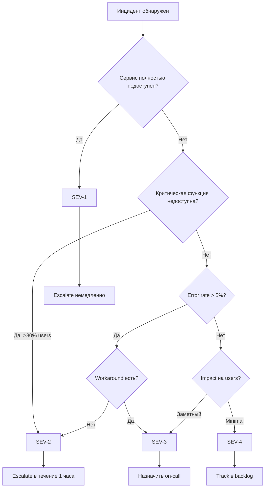
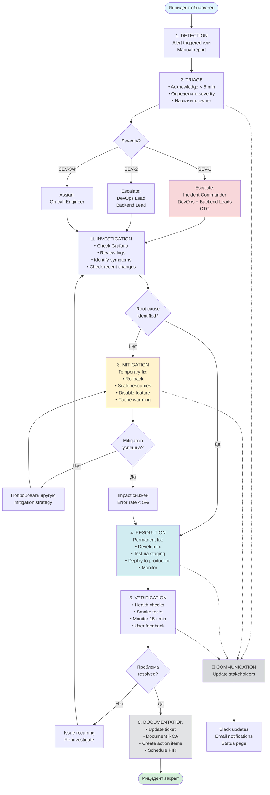
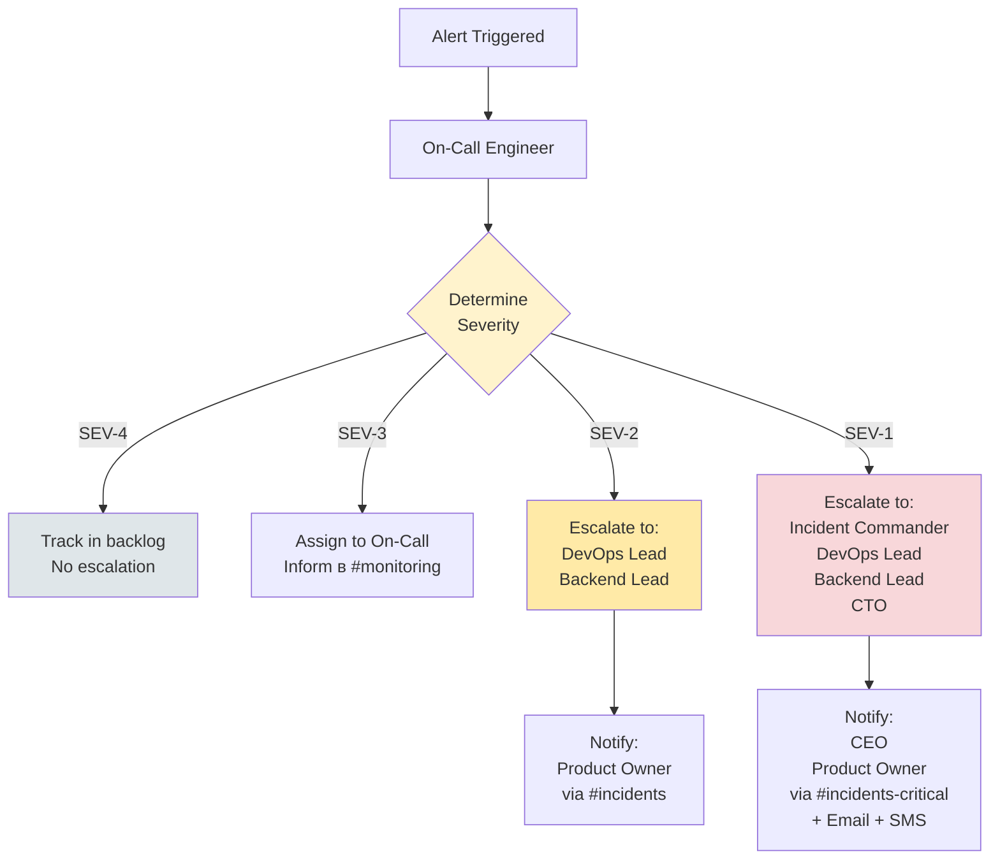

# INCIDENT RESPONSE PLAN (MVP v1)
# Self-Storage Aggregator Platform

**Document Version:** 1.0  
**Last Updated:** December 10, 2025  
**Owner:** DevOps Lead  
**Reviewers:** Backend Lead, CTO, Product Owner  

---

## Document Information

| Field | Value |
|-------|-------|
| **Project** | Self-Storage Aggregator MVP |
| **Document Type** | Incident Response Plan |
| **Status** | Draft → Review → **Approved** |
| **Classification** | Internal Use |
| **Distribution** | Engineering Team, Leadership |

---

## Revision History

| Version | Date | Author | Changes |
|---------|------|--------|---------|
| 1.0 | 2025-12-10 | DevOps Lead | Initial version - Complete IRP for MVP launch |

---

## Table of Contents

1. [Incident Response Overview](#1-incident-response-overview)
2. [Incident Classification](#2-incident-classification)
3. [Detection & Alerting](#3-detection--alerting)
4. [Triage Process](#4-triage-process)
5. [Incident Response Steps](#5-incident-response-steps)
6. [Roles & Responsibilities](#6-roles--responsibilities)
7. [Communication & Escalation](#7-communication--escalation)
8. [Resolution & Recovery](#8-resolution--recovery)
9. [Post-Incident Review (PIR / RCA)](#9-post-incident-review-pir--rca)
10. [Operational Readiness](#10-operational-readiness)

---

# EXECUTIVE SUMMARY

This Incident Response Plan (IRP) defines the processes, procedures, and responsibilities for managing incidents in the Self-Storage Aggregator MVP platform. The plan ensures rapid detection, effective response, and systematic learning from incidents to continuously improve system reliability.

**Key Objectives:**
- Minimize Mean Time To Resolution (MTTR): <4 hours for SEV-1
- Maximize availability: 99.5% uptime target
- Ensure effective communication during incidents
- Foster a blameless culture of continuous improvement

**Scope:**
- Backend API (NestJS on Node.js)
- Frontend (Next.js)
- Database (PostgreSQL 15 + PostGIS)
- Cache (Redis 7)
- AI Service (FastAPI/Python)

**Business Hours:** 09:00-18:00 Moscow Time (Monday-Friday)  
**After-Hours Coverage:** SEV-1 only (24/7), SEV-2 best effort

---


## 1.1. Назначение

Incident Response Plan (IRP) для Self-Storage Aggregator MVP определяет процессы обнаружения, классификации, реагирования и восстановления после инцидентов в продакшн-среде. Документ обеспечивает минимально необходимый уровень операционной готовности команды для обработки сбоев, критических ошибок и нарушений безопасности.

**Применимость:**
- Все компоненты MVP: Backend API, Frontend, PostgreSQL, Redis, AI Service
- Все типы инцидентов: технические сбои, security incidents, data breaches
- Все роли: DevOps Engineer, Backend Engineer, Product Owner, Support

## 1.2. Цели IR-процесса

| Цель | Метрика | Target (MVP) |
|------|---------|--------------|
| **Минимизация downtime** | MTTR (Mean Time To Resolve) | < 4 часа для SEV-1 |
| **Быстрое обнаружение** | MTTD (Mean Time To Detect) | < 15 минут для SEV-1 |
| **Прозрачность** | Документация инцидентов | 100% инцидентов задокументированы |
| **Улучшение процессов** | Post-Incident Reviews | 100% для SEV-1/SEV-2 |
| **Защита данных** | Security incident response | < 72 часа (GDPR compliance) |

## 1.3. Область охвата

### Инфраструктура MVP

```
┌─────────────────────────────────────────────────────┐
│                  PRODUCTION ENVIRONMENT              │
├─────────────────────────────────────────────────────┤
│                                                      │
│  Frontend (Next.js)                                  │
│  ├─ Nginx (reverse proxy, SSL)                      │
│  └─ CDN (Cloudflare)                                │
│                                                      │
│  Backend API (NestJS)                                │
│  ├─ REST API endpoints                              │
│  ├─ Authentication (JWT)                            │
│  └─ Business logic                                  │
│                                                      │
│  AI Service (FastAPI)                                │
│  └─ OpenAI API integration                          │
│                                                      │
│  Databases                                           │
│  ├─ PostgreSQL 15 + PostGIS                         │
│  └─ Redis 7 (cache, sessions)                       │
│                                                      │
│  Monitoring & Observability                          │
│  ├─ Prometheus (metrics collection)                 │
│  ├─ Grafana (visualization)                         │
│  ├─ Winston/Pino (application logs)                 │
│  └─ Health check endpoints                          │
│                                                      │
└─────────────────────────────────────────────────────┘
```

### Типы инцидентов в охвате

**Технические инциденты:**
- Application crashes, errors, timeout
- Database failures, connection pool exhaustion
- Redis unavailability, memory issues
- Network issues, DNS failures
- Deployment failures, rollback scenarios

**Security инциденты:**
- Unauthorized access attempts
- Data breaches, SQL injection
- DDoS attacks, rate limit bypass
- Suspicious authentication patterns
- Security vulnerabilities detected

**Бизнес-критичные инциденты:**
- Payment processing failures
- Booking system unavailability
- Email/SMS delivery failures
- AI service degradation
- Data integrity issues

### Вне охвата (для MVP)

- Инциденты третьих сторон (Cloudflare, OpenAI) — мониторим, но не контролируем
- Физическая инфраструктура hosting provider
- Client-side browser issues (handled by support)

## 1.4. Что считается инцидентом

### Определение инцидента

**Инцидент** — любое незапланированное событие, которое:
1. Снижает доступность или производительность сервиса
2. Нарушает безопасность системы или данных пользователей
3. Приводит к потере данных или их повреждению
4. Блокирует критические бизнес-процессы (booking, payments)

### Критерии инцидента vs. не-инцидент

| Критерий | Инцидент ✅ | Не инцидент ❌ |
|----------|-------------|----------------|
| **Доступность** | API response time > 5s для 50%+ запросов | Единичный медленный запрос от пользователя |
| **Ошибки** | Error rate > 5% в течение 5 минут | Единичная ошибка 500 без повторений |
| **База данных** | PostgreSQL недоступна > 1 минуты | Slow query от одного пользователя |
| **Безопасность** | 10+ failed login attempts с одного IP | Единичный failed login |
| **Данные** | Booking создан, но не записан в БД | Валидационная ошибка от пользователя |

### Примеры событий, НЕ являющихся инцидентами

- Плановое обслуживание (scheduled maintenance)
- Expected errors (404 для несуществующих ресурсов)
- User-side issues (плохой интернет, устаревший браузер)
- Feature requests или bug reports без impact на production
- Load testing или QA activity в dev/staging

### Когда создавать инцидент

**Создать инцидент немедленно, если:**
- Алерт от Prometheus/Grafana с severity HIGH/CRITICAL
- Множественные сообщения пользователей о недоступности
- Security alert от системы мониторинга
- Manual escalation от Support или Product Owner
- Обнаружение data corruption или data loss

**Можно не создавать инцидент:**
- Алерт INFO/LOW без impact на пользователей
- Проблема уже решена автоматически (auto-recovery)
- False positive от мониторинга (требуется tune алерта)

---

# 2. Incident Classification

## 2.1. Severity уровни (SEV-1…SEV-4)

Система классификации основана на **impact** (влияние на бизнес) и **urgency** (необходимость немедленных действий).

### SEV-1: Critical

**Определение:** Полная или критическая недоступность сервиса, затрагивающая всех пользователей.

**Характеристики:**
- Весь сайт недоступен (HTTP 5xx для всех запросов)
- База данных недоступна
- Критическая security breach (data exposure)
- Полная потеря данных

**Impact:** 100% пользователей не могут использовать сервис  
**Response time:** < 15 минут  
**Resolution target:** < 4 часа  
**Escalation:** Немедленно к Incident Commander + CTO

### SEV-2: High

**Определение:** Значительная деградация сервиса или partial outage.

**Характеристики:**
- Критическая функция недоступна (booking, search)
- API error rate > 10%
- Payment processing failures
- Security incident (unauthorized access attempt)
- Performance degradation (response time > 10s)

**Impact:** 30-100% пользователей испытывают проблемы  
**Response time:** < 1 час  
**Resolution target:** < 12 часов  
**Escalation:** К DevOps Lead + Backend Lead

### SEV-3: Medium

**Определение:** Частичная деградация сервиса или non-critical feature issues.

**Характеристики:**
- Вторичная функция недоступна (reviews, notifications)
- Intermittent errors (< 5% error rate)
- AI service degradation (slow responses)
- Redis cache unavailable (degraded performance)
- High resource utilization (CPU > 80%)

**Impact:** < 30% пользователей испытывают minor issues  
**Response time:** < 4 часа  
**Resolution target:** < 48 часов  
**Escalation:** К on-call engineer

### SEV-4: Low

**Определение:** Minor issues без significant impact.

**Характеристики:**
- UI glitches без функционального impact
- Non-critical logging errors
- Performance issues для редких use cases
- Minor configuration issues

**Impact:** Minimal или нет impact на пользователей  
**Response time:** < 24 часа  
**Resolution target:** Best effort (в рамках sprint)  
**Escalation:** Не требуется

## 2.2. Критерии классификации

### Матрица определения Severity

```
          │ Impact: 100%  │ Impact: 30-100% │ Impact: <30%  │ Impact: Minimal
          │ users         │ users           │ users         │
──────────┼───────────────┼─────────────────┼───────────────┼─────────────────
Urgency:  │               │                 │               │
Critical  │   SEV-1       │   SEV-2         │   SEV-3       │   SEV-4
──────────┼───────────────┼─────────────────┼───────────────┼─────────────────
Urgency:  │               │                 │               │
High      │   SEV-2       │   SEV-2         │   SEV-3       │   SEV-4
──────────┼───────────────┼─────────────────┼───────────────┼─────────────────
Urgency:  │               │                 │               │
Medium    │   SEV-3       │   SEV-3         │   SEV-3       │   SEV-4
──────────┼───────────────┼─────────────────┼───────────────┼─────────────────
Urgency:  │               │                 │               │
Low       │   SEV-4       │   SEV-4         │   SEV-4       │   SEV-4
```

### Факторы для определения Severity

**Impact оценка:**
- Сколько пользователей затронуто? (%, абсолютное число)
- Какие критические функции недоступны?
- Есть ли workaround для пользователей?
- Влияет ли на revenue или SLA?

**Urgency оценка:**
- Требуется ли немедленное вмешательство?
- Ухудшается ли ситуация со временем?
- Есть ли risk escalation (например, data loss)?

**Security dimension:**
- Есть ли risk data breach или unauthorized access?
- Нарушены ли compliance требования (GDPR)?
- Активная атака или vulnerability exploitation?

## 2.3. Примеры инцидентов

### SEV-1 Examples

| Сценарий | Symptom | Root Cause (пример) |
|----------|---------|---------------------|
| **Total outage** | Весь сайт возвращает 502/503 | Nginx crashed, backend containers down |
| **Database failure** | Все API requests fail с DB connection error | PostgreSQL out of disk space |
| **Data breach** | Unauthorized access к user data detected | SQL injection vulnerability exploited |
| **Critical data loss** | All bookings за последние 2 часа потеряны | Failed migration без backup |

### SEV-2 Examples

| Сценарий | Symptom | Root Cause (пример) |
|----------|---------|---------------------|
| **Booking system down** | POST /bookings returns 500, но search работает | Bug в booking validation logic |
| **Payment failures** | 100% payment transactions failing | Payment gateway API down |
| **High error rate** | API error rate 15% для всех endpoints | Backend memory leak, OOM kills |
| **Security incident** | Multiple unauthorized API calls detected | API key leaked, being abused |

### SEV-3 Examples

| Сценарий | Symptom | Root Cause (пример) |
|----------|---------|---------------------|
| **Email delays** | Booking confirmation emails delayed 2+ hours | Email queue backlog, rate limit hit |
| **Cache unavailable** | Redis connection errors, slow performance | Redis maxmemory reached, evicting keys |
| **AI slow responses** | Box finder takes 30+ seconds | OpenAI API throttling |
| **High CPU** | Backend CPU 90%, slow responses | Inefficient query в warehouse search |

### SEV-4 Examples

| Сценарий | Symptom | Root Cause (пример) |
|----------|---------|---------------------|
| **UI glitch** | Button styling broken на одной странице | CSS regression в последнем deploy |
| **Verbose logging** | Logs заполняют диск, но не критично | Debug logging enabled в production |
| **Minor config issue** | Environment variable missing, fallback работает | Deploy script не обновил .env |

## 2.4. Матрица приоритетов

### Priority vs Severity

**Приоритет** определяет порядок работы над инцидентами при multiple concurrent incidents.

| Severity | Default Priority | Может быть повышен если | Может быть понижен если |
|----------|------------------|-------------------------|------------------------|
| **SEV-1** | P0 (Emergency) | - | Workaround найден, impact снижен до SEV-2 |
| **SEV-2** | P1 (High) | Security implications | Partial workaround, impact на <10% users |
| **SEV-3** | P2 (Medium) | Affects critical customer/operator | Scheduled for next sprint |
| **SEV-4** | P3 (Low) | - | Deferred to backlog |

### SLA Response & Resolution Times

| Severity | Response Time | Resolution Target | Business Hours | After Hours |
|----------|---------------|-------------------|----------------|-------------|
| **SEV-1** | 15 minutes | 4 hours | Yes | Yes (24/7) |
| **SEV-2** | 1 hour | 12 hours | Yes | Best effort |
| **SEV-3** | 4 hours | 48 hours | Yes | No |
| **SEV-4** | 24 hours | Best effort | Yes | No |

**Примечания:**
- Response time = время до начала активной работы над инцидентом
- Resolution target = ожидаемое время полного восстановления
- Business hours для MVP: 09:00-18:00 Moscow Time (Mon-Fri)
- After hours coverage: только SEV-1, best effort для SEV-2

### Escalation thresholds

**Auto-escalate Severity если:**
- SEV-3 не resolved за 24 часа → upgrade to SEV-2
- SEV-2 не resolved за 12 часов → upgrade to SEV-1
- Новые symptoms появились (expanding impact)
- User complaints увеличились (social media mentions)

**De-escalate Severity если:**
- Workaround deployed, impact снизился значительно
- Root cause identified, low risk recurring
- Affecting < 5% users с non-critical feature

---

# 3. Detection & Alerting

## 3.1. Источники детекции (мониторинг, алерты, логи)

### Автоматические источники

#### 3.1.1. Prometheus Metrics

**Собираемые метрики:**

```yaml
# Application metrics
- http_requests_total (counter)
- http_request_duration_seconds (histogram)
- http_requests_errors_total (counter)
- active_connections (gauge)
- database_queries_duration_seconds (histogram)
- database_connections_active (gauge)
- cache_hit_rate (gauge)
- cache_memory_usage_bytes (gauge)

# System metrics
- cpu_usage_percent (gauge)
- memory_usage_bytes (gauge)
- disk_usage_bytes (gauge)
- network_bytes_sent/received (counter)

# Business metrics
- bookings_created_total (counter)
- bookings_failed_total (counter)
- payments_processed_total (counter)
- ai_requests_total (counter)
```

**Prometheus scrape config:**

```yaml
# /etc/prometheus/prometheus.yml
scrape_configs:
  - job_name: 'backend-api'
    scrape_interval: 15s
    static_configs:
      - targets: ['localhost:4000']
    
  - job_name: 'node-exporter'
    scrape_interval: 30s
    static_configs:
      - targets: ['localhost:9100']

  - job_name: 'postgres-exporter'
    scrape_interval: 30s
    static_configs:
      - targets: ['localhost:9187']

  - job_name: 'redis-exporter'
    scrape_interval: 30s
    static_configs:
      - targets: ['localhost:9121']
```

#### 3.1.2. Application Logs (Winston/Pino)

**Log levels & routing:**

```typescript
// backend/src/config/logger.config.ts
export const LOGGING_CONFIG = {
  level: process.env.NODE_ENV === 'production' ? 'info' : 'debug',
  
  transports: [
    // Console output
    new winston.transports.Console({
      format: winston.format.combine(
        winston.format.timestamp(),
        winston.format.json()
      )
    }),
    
    // Error file (для критических ошибок)
    new winston.transports.File({
      filename: '/var/log/selfstorage/error.log',
      level: 'error',
      maxsize: 10485760, // 10MB
      maxFiles: 5
    }),
    
    // Combined file (все логи)
    new winston.transports.File({
      filename: '/var/log/selfstorage/combined.log',
      maxsize: 10485760,
      maxFiles: 5
    })
  ]
};
```

**Структурированные логи:**

```typescript
// Error logging format
logger.error('Database query failed', {
  error: error.message,
  stack: error.stack,
  query: sanitizedQuery,
  userId: req.user?.id,
  requestId: req.id,
  timestamp: new Date().toISOString()
});
```

#### 3.1.3. Health Check Endpoints

**Backend health check:**

```typescript
// GET /health
{
  "status": "healthy" | "degraded" | "unhealthy",
  "timestamp": "2025-12-10T10:00:00Z",
  "checks": {
    "database": {
      "status": "up",
      "responseTime": 5
    },
    "redis": {
      "status": "up",
      "responseTime": 2
    },
    "ai_service": {
      "status": "up",
      "responseTime": 150
    }
  },
  "uptime": 86400,
  "version": "1.0.0"
}
```

**Health check schedule:**
- Prometheus scrapes `/health` каждые 30 секунд
- External monitoring (UptimeRobot/Pingdom) каждые 5 минут

### Ручные источники

#### 3.1.4. User Reports

**Support channels:**
- Email: support@selfstorage.com
- In-app chat (если реализован)
- Social media monitoring (manual check)

**Escalation от Support:**
- 3+ пользователя сообщают одну проблему → создать инцидент
- VIP operator/customer сообщает проблему → immediate triage

#### 3.1.5. Monitoring Dashboard Review

**Daily check (DevOps):**
- Grafana dashboard review (error rates, latency trends)
- Log aggregation review (unusual patterns)
- Resource utilization trends

## 3.2. Триггеры инцидентов

### Alert Rules (Prometheus)

```yaml
# /etc/prometheus/rules/alerts.yml
groups:
  - name: application_alerts
    interval: 30s
    rules:
      
      # SEV-1: Total outage
      - alert: ServiceDown
        expr: up{job="backend-api"} == 0
        for: 1m
        labels:
          severity: critical
        annotations:
          summary: "Backend API is down"
          description: "Backend API has been down for 1 minute"
      
      # SEV-1: High error rate
      - alert: HighErrorRate
        expr: |
          rate(http_requests_errors_total[5m]) / rate(http_requests_total[5m]) > 0.10
        for: 5m
        labels:
          severity: critical
        annotations:
          summary: "High API error rate (>10%)"
          description: "Error rate {{ $value | humanizePercentage }}"
      
      # SEV-2: Database issues
      - alert: DatabaseConnectionPoolExhausted
        expr: database_connections_active >= database_connections_max * 0.9
        for: 5m
        labels:
          severity: high
        annotations:
          summary: "Database connection pool nearly exhausted"
          description: "{{ $value }} connections active"
      
      # SEV-2: High latency
      - alert: HighAPILatency
        expr: |
          histogram_quantile(0.95, 
            rate(http_request_duration_seconds_bucket[5m])
          ) > 5
        for: 10m
        labels:
          severity: high
        annotations:
          summary: "API p95 latency > 5 seconds"
          description: "p95 latency: {{ $value }}s"
      
      # SEV-3: Redis unavailable
      - alert: RedisDown
        expr: up{job="redis-exporter"} == 0
        for: 5m
        labels:
          severity: medium
        annotations:
          summary: "Redis is down"
          description: "Redis has been unavailable for 5 minutes"
      
      # SEV-3: High memory usage
      - alert: HighMemoryUsage
        expr: |
          (node_memory_MemTotal_bytes - node_memory_MemAvailable_bytes) 
          / node_memory_MemTotal_bytes > 0.85
        for: 10m
        labels:
          severity: medium
        annotations:
          summary: "High memory usage (>85%)"
          description: "Memory usage: {{ $value | humanizePercentage }}"
      
      # SEV-4: Disk space warning
      - alert: DiskSpaceLow
        expr: |
          (node_filesystem_avail_bytes / node_filesystem_size_bytes) < 0.15
        for: 30m
        labels:
          severity: low
        annotations:
          summary: "Disk space low (<15%)"
          description: "Free space: {{ $value | humanizePercentage }}"
```

### Security Alert Triggers

```typescript
// Security monitoring rules (из security_and_compliance_plan)
const SECURITY_ALERT_RULES = {
  
  // Failed login attempts
  FAILED_LOGIN_THRESHOLD: {
    user: 5,      // 5 attempts → MEDIUM alert
    global: 10    // 10 attempts → HIGH alert
  },
  
  // Brute force detection
  BRUTE_FORCE_THRESHOLD: {
    user: 10,     // 10 attempts → HIGH alert + account lock
    ip: 20        // 20 attempts → HIGH alert + IP block
  },
  
  // Unusual API usage
  UNUSUAL_API_USAGE: {
    baseline_multiplier: 5,  // 5x baseline → MEDIUM alert
    time_window: 3600        // 1 hour window
  },
  
  // Unauthorized access
  UNAUTHORIZED_ACCESS: {
    threshold: 1,            // Immediate CRITICAL alert
    endpoints: ['/admin', '/operator/payments']
  }
};
```

## 3.3. Роли и каналы уведомлений

### Notification Matrix

| Severity | Channels | Recipients | Delay |
|----------|----------|------------|-------|
| **SEV-1** | Slack + Email + SMS | On-Call Engineer, DevOps Lead, CTO | Immediate |
| **SEV-2** | Slack + Email | On-Call Engineer, DevOps Lead | Immediate |
| **SEV-3** | Slack | On-Call Engineer | Within 1 hour |
| **SEV-4** | Slack (low-priority) | Engineering team | Daily digest |

### Slack Configuration

```typescript
// Alert routing to Slack channels
const SLACK_CHANNELS = {
  'critical': '#incidents-critical',    // SEV-1 alerts
  'high': '#incidents',                 // SEV-2 alerts
  'medium': '#monitoring',              // SEV-3 alerts
  'low': '#monitoring-low',             // SEV-4 alerts
  'security': '#security-alerts'        // All security incidents
};

// Alert message format
const formatSlackAlert = (alert: Alert) => ({
  text: `🚨 ${alert.severity.toUpperCase()}: ${alert.summary}`,
  blocks: [
    {
      type: "header",
      text: {
        type: "plain_text",
        text: `${getSeverityEmoji(alert.severity)} ${alert.severity.toUpperCase()} Alert`
      }
    },
    {
      type: "section",
      fields: [
        { type: "mrkdwn", text: `*Alert:*\n${alert.name}` },
        { type: "mrkdwn", text: `*Started:*\n${alert.startsAt}` },
        { type: "mrkdwn", text: `*Service:*\n${alert.labels.job}` },
        { type: "mrkdwn", text: `*Instance:*\n${alert.labels.instance}` }
      ]
    },
    {
      type: "section",
      text: {
        type: "mrkdwn",
        text: `*Description:*\n${alert.annotations.description}`
      }
    },
    {
      type: "actions",
      elements: [
        {
          type: "button",
          text: { type: "plain_text", text: "View in Grafana" },
          url: alert.grafana_url
        },
        {
          type: "button",
          text: { type: "plain_text", text: "Create Incident" },
          url: alert.incident_url
        }
      ]
    }
  ]
});

function getSeverityEmoji(severity: string): string {
  const emojis = {
    'critical': '🔴',
    'high': '🟠',
    'medium': '🟡',
    'low': '🟢'
  };
  return emojis[severity] || '⚪';
}
```

### Email Configuration

```typescript
// Email templates для alert notifications
const EMAIL_TEMPLATES = {
  
  SEV1: {
    subject: '🚨 CRITICAL: {{alert_name}}',
    body: `
      SEVERITY: SEV-1 (CRITICAL)
      ALERT: {{alert_name}}
      TIME: {{timestamp}}
      
      DESCRIPTION:
      {{description}}
      
      AFFECTED SERVICES:
      {{services}}
      
      IMMEDIATE ACTIONS REQUIRED:
      1. Acknowledge alert в Slack (#incidents-critical)
      2. Join incident bridge call
      3. Begin triage and mitigation
      
      GRAFANA: {{grafana_url}}
      RUNBOOK: {{runbook_url}}
    `
  },
  
  SEV2: {
    subject: '⚠️ HIGH: {{alert_name}}',
    body: `
      SEVERITY: SEV-2 (HIGH)
      ALERT: {{alert_name}}
      TIME: {{timestamp}}
      
      DESCRIPTION:
      {{description}}
      
      NEXT STEPS:
      1. Review alert в Grafana
      2. Начать triage в течение 1 часа
      3. Update в Slack #incidents
      
      GRAFANA: {{grafana_url}}
    `
  }
};
```

## 3.4. Автоматические и ручные алерты

### Автоматические алерты

**Prometheus → Alertmanager → Slack/Email**

```yaml
# /etc/alertmanager/config.yml
global:
  resolve_timeout: 5m
  slack_api_url: ${SLACK_WEBHOOK_URL}

route:
  group_by: ['alertname', 'severity']
  group_wait: 10s
  group_interval: 10s
  repeat_interval: 4h
  receiver: 'default'
  
  routes:
    # SEV-1: critical → multiple channels
    - match:
        severity: critical
      receiver: 'critical-alerts'
      continue: true
    
    # SEV-2: high
    - match:
        severity: high
      receiver: 'high-alerts'
    
    # SEV-3: medium
    - match:
        severity: medium
      receiver: 'medium-alerts'

receivers:
  - name: 'critical-alerts'
    slack_configs:
      - channel: '#incidents-critical'
        title: '🚨 CRITICAL Alert'
        text: '{{ range .Alerts }}{{ .Annotations.description }}{{ end }}'
    email_configs:
      - to: 'oncall@selfstorage.com, devops-lead@selfstorage.com, cto@selfstorage.com'
        headers:
          Subject: '🚨 CRITICAL: {{ .GroupLabels.alertname }}'
  
  - name: 'high-alerts'
    slack_configs:
      - channel: '#incidents'
        title: '⚠️ HIGH Alert'
    email_configs:
      - to: 'oncall@selfstorage.com, devops-lead@selfstorage.com'
  
  - name: 'medium-alerts'
    slack_configs:
      - channel: '#monitoring'
        title: '🟡 MEDIUM Alert'
```

### Ручные алерты

**Когда создавать вручную:**
1. Пользователь сообщает о проблеме, которую автоматика не детектировала
2. DevOps замечает аномалию в dashboard, но alert не triggered
3. Security team обнаруживает suspicious activity
4. Product Owner escalates business-critical issue

**Процесс создания ручного alert:**

```bash
# CLI команда для создания инцидента
./scripts/create-incident.sh \
  --severity SEV-2 \
  --title "Payment processing intermittent failures" \
  --description "Users reporting failed payments, no automated alert" \
  --reporter "support@selfstorage.com" \
  --slack-channel "#incidents"

# Или через Slack slash command
/incident create severity:SEV-2 title:"Payment failures"
```

### Alert Suppression & Maintenance Windows

**Maintenance mode:**

```typescript
// Disable non-critical alerts во время планового обслуживания
async function enableMaintenanceMode(duration: number) {
  await alertmanager.createSilence({
    matchers: [
      { name: 'severity', value: 'low|medium', isRegex: true }
    ],
    startsAt: new Date(),
    endsAt: new Date(Date.now() + duration),
    createdBy: 'maintenance-script',
    comment: 'Planned maintenance window'
  });
  
  await slack.send({
    channel: '#incidents',
    text: '🔧 Maintenance mode enabled. Non-critical alerts suppressed.'
  });
}
```

---

**END OF PART 1**

---

# 4. Triage Process

## 4.1. Initial triage

**Цель triage:** Быстро оценить инцидент, определить severity и назначить ответственного для дальнейших действий.

### Начало triage

**Триггеры для начала triage:**
- Автоматический alert от Prometheus/Grafana
- Ручное создание инцидента через Slack
- Escalation от Support или Product Owner
- Обнаружение проблемы при мониторинге dashboard

### Первый responder

**Кто выполняет initial triage:**
- **On-call Engineer** (если alert пришёл вне business hours)
- **DevOps Engineer** (если в business hours и доступен)
- **Любой инженер**, кто первым увидел alert и может начать

**Обязанности первого responder:**
1. **Acknowledge alert** в течение 5 минут (отметить в Slack emoji ✅)
2. Создать incident ticket (если ещё не создан)
3. Начать быструю проверку симптомов
4. Определить preliminary severity
5. Escalate при необходимости

### Создание incident ticket

**Минимальная информация в ticket:**

```markdown
# Incident: [SHORT_TITLE]

**Incident ID:** INC-2025-12-10-001
**Severity:** SEV-2 (preliminary)
**Status:** INVESTIGATING
**Started:** 2025-12-10 14:35 UTC
**Detected by:** Prometheus alert "HighErrorRate"

## Symptoms
- API error rate 15% для всех endpoints
- Users reporting "500 Internal Server Error"
- Response time p95: 8.5s (normal: 0.5s)

## Impact
- ~50% users experiencing errors
- Booking creation failing

## Initial Actions
- [ ] Check Grafana dashboard
- [ ] Review application logs
- [ ] Check database status
- [ ] Verify recent deployments

## Timeline
- 14:35 - Alert triggered
- 14:37 - DevOps acknowledged
- 14:40 - Started investigation
```

**Где создаётся ticket:**
- GitHub Issues (label: `incident`)
- Dedicated incident management tool (если есть)
- Минимум: Slack thread в #incidents с pinned message

## 4.2. Быстрая проверка симптомов

### Checklist для быстрой диагностики (5-10 минут)

#### 4.2.1. Проверка доступности сервисов

```bash
# Health check всех компонентов
curl -f https://api.selfstorage.com/health
curl -f https://selfstorage.com/

# Проверка статуса контейнеров
docker ps --filter "status=running"
docker ps --filter "status=exited"

# Проверка логов (последние 50 строк)
docker logs backend --tail 50
docker logs frontend --tail 50
```

#### 4.2.2. Проверка метрик в Grafana

**Основные dashboard для проверки:**

| Dashboard | Что смотреть | Red flags |
|-----------|--------------|-----------|
| **API Overview** | Request rate, error rate, latency | Error rate > 5%, p95 latency > 3s |
| **Database** | Connections, query time, locks | Connections > 80%, slow queries |
| **Redis** | Memory usage, hit rate, commands/sec | Memory > 90%, hit rate < 50% |
| **System Resources** | CPU, Memory, Disk, Network | CPU > 80%, Memory > 85%, Disk > 90% |

**Grafana queries для проверки:**

```promql
# Error rate (последние 5 минут)
rate(http_requests_errors_total[5m]) / rate(http_requests_total[5m])

# p95 latency
histogram_quantile(0.95, rate(http_request_duration_seconds_bucket[5m]))

# Database connection pool utilization
database_connections_active / database_connections_max

# Memory usage percentage
(node_memory_MemTotal_bytes - node_memory_MemAvailable_bytes) / node_memory_MemTotal_bytes
```

#### 4.2.3. Проверка логов (structured search)

```bash
# Поиск ошибок за последние 10 минут
grep -i "error\|exception\|fatal" /var/log/selfstorage/error.log | tail -100

# Поиск database errors
grep "database\|postgres\|connection" /var/log/selfstorage/error.log | tail -50

# Поиск timeout errors
grep "timeout\|timed out" /var/log/selfstorage/error.log | tail -50

# Поиск OOM (Out of Memory)
dmesg | grep -i "out of memory\|oom"
```

#### 4.2.4. Проверка недавних изменений

**Timeline проверки:**

```bash
# Последние деплои (Git log)
git log --oneline -10 --since="2 hours ago"

# Последние database migrations
psql -U user -d selfstorage -c "SELECT * FROM migrations ORDER BY executed_at DESC LIMIT 5;"

# Изменения в конфигурации
ls -lt /etc/nginx/conf.d/ | head -5
ls -lt .env* | head -5

# Docker image changes
docker images --format "{{.Repository}}:{{.Tag}} - {{.CreatedSince}}" | head -10
```

#### 4.2.5. Проверка внешних зависимостей

```bash
# OpenAI API status
curl -I https://api.openai.com/v1/models

# Email service (SendGrid)
curl -I https://api.sendgrid.com/v3/alerts

# Maps API (Yandex)
curl -I https://geocode-maps.yandex.ru/1.x/

# DNS resolution
dig selfstorage.com
dig api.selfstorage.com
```

### Результат быстрой проверки

**Обновить incident ticket с findings:**

```markdown
## Findings (initial triage)

✅ **Working:**
- Frontend accessible
- Database responding (avg query time 15ms)
- Redis available

❌ **Issues detected:**
- Backend API error rate 15%
- Database connection pool 85% utilized
- Recent deployment 30 minutes ago

🔍 **Hypothesis:**
- New code deployment introduced bug
- OR: Database connection leak from new code
```

## 4.3. Определение SEV уровня

### Decision tree для severity



### Критерии для окончательного определения severity

**Контрольные вопросы:**

| Вопрос | SEV-1 | SEV-2 | SEV-3 | SEV-4 |
|--------|-------|-------|-------|-------|
| Сколько users affected? | 100% | 30-100% | <30% | <5% |
| Критическая функция down? | Да | Да | Нет | Нет |
| Error rate? | >20% | >10% | >5% | <5% |
| Workaround доступен? | Нет | Нет | Возможно | Да |
| Data loss risk? | Да | Возможно | Нет | Нет |
| Security breach? | Да | Возможно | Нет | Нет |

**Примеры решений:**

```
Сценарий 1:
- Error rate: 15%
- Affected: 60% users
- Function: Booking creation fails
→ SEV-2 (критическая функция, high impact)

Сценарий 2:
- Error rate: 3%
- Affected: 10% users  
- Function: Email notifications delayed
→ SEV-3 (non-critical function, low error rate)

Сценарий 3:
- Error rate: 0%
- Affected: 0%
- Function: UI button misaligned
→ SEV-4 (cosmetic, no functional impact)
```

### Изменение severity в процессе

**Upgrade severity если:**
- Impact растёт (больше users affected)
- Новые symptoms появляются
- Mitigation attempts не работают
- Обнаружен data loss или security breach

**Downgrade severity если:**
- Workaround найден и работает
- Impact уменьшился значительно
- Root cause identified, risk minimal

## 4.4. Передача ответственному инженеру

### Escalation matrix

| Severity | Кто должен владеть инцидентом | Escalate если |
|----------|------------------------------|---------------|
| **SEV-1** | Incident Commander + DevOps Lead + Backend Lead | Immediate (< 5 min) |
| **SEV-2** | DevOps Lead или Backend Lead | Within 30 min |
| **SEV-3** | On-call Engineer | Within 4 hours |
| **SEV-4** | Assignee в sprint | Next sprint planning |

### Процесс передачи (handoff)

**1. Notify в Slack:**

```
@devops-lead @backend-lead 
🔴 SEV-2 Incident declared: "High API error rate"

**Summary:** Backend API returning 15% errors, booking creation failing
**Impact:** ~60% users affected
**Started:** 14:35 UTC
**Ticket:** INC-2025-12-10-001

Initial findings:
- Recent deployment 30 min ago
- Database connection pool high (85%)
- Error logs show "Connection timeout"

Need DevOps + Backend to investigate.
```

**2. Handoff checklist:**

```markdown
## Handoff to [ENGINEER_NAME]

- [x] Incident ticket created: INC-2025-12-10-001
- [x] Severity assigned: SEV-2
- [x] Initial triage completed
- [x] Symptoms documented
- [x] Grafana dashboard reviewed
- [x] Recent changes identified
- [x] Hypothesis documented

**Recommended next steps:**
1. Review recent deployment code
2. Check for connection leaks in new code
3. Consider rollback if issue persists
4. Monitor error rate during investigation
```

**3. Acknowledge handoff:**

Новый owner должен:
- Acknowledge в Slack (reply в thread)
- Review incident ticket
- Confirm understanding of situation
- Begin investigation immediately (SEV-1/2) или scheduled (SEV-3/4)

### Role assignment

**Primary roles для инцидента:**

| Role | Responsibility | Who |
|------|----------------|-----|
| **Incident Commander** | Overall coordination (SEV-1 only) | Senior Engineer / CTO |
| **Incident Owner** | Technical investigation & resolution | DevOps/Backend Lead |
| **Communication Lead** | Updates to stakeholders | Product Owner / Support Lead |
| **Scribe** | Documentation | Junior Engineer / rotation |

**Для MVP (упрощённо):**
- SEV-1: Incident Commander + Owner + Scribe
- SEV-2: Owner + optional Scribe
- SEV-3/4: Owner only

---

# 5. Incident Response Steps

## 5.1. Detection

**Определение:** Момент, когда проблема впервые обнаружена системой мониторинга или человеком.

### Автоматическая детекция

**Источники:**
- Prometheus alerts (метрики превышают thresholds)
- Health check failures (endpoint /health returns unhealthy)
- Error tracking (spike в error logs)
- Security monitoring (подозрительная активность)

**Метрики детекции:**
- **MTTD (Mean Time To Detect):** Время от начала проблемы до получения alert
- **Target MTTD:** < 5 минут для SEV-1, < 15 минут для SEV-2

**Пример автоматической детекции:**

```
14:35:00 UTC - HighErrorRate alert triggered
14:35:15 UTC - Alert sent to Slack #incidents-critical
14:35:20 UTC - Email sent to on-call engineer
14:35:30 UTC - SMS sent (SEV-1 only)
```

### Ручная детекция

**Источники:**
- User reports (email, support chat)
- DevOps dashboard review
- Operator complaints
- Social media mentions

**Процесс:**
1. Person обнаруживает проблему
2. Проверяет, есть ли уже alert
3. Если нет alert → создаёт incident ticket вручную
4. Notify в Slack #incidents

## 5.2. Triage

**Определение:** Быстрая оценка инцидента для определения severity, impact и первоначальных действий.

**Ключевые действия:**
1. Acknowledge alert (< 5 минут)
2. Быстрая проверка симптомов (5-10 минут)
3. Определение severity (SEV-1 до SEV-4)
4. Создание incident ticket
5. Назначение owner
6. Первоначальная коммуникация

**Результат triage:**
- Incident ticket с полной информацией
- Severity определён
- Owner назначен
- Stakeholders уведомлены

**Triage не должен занимать > 15 минут для SEV-1/2**

## 5.3. Mitigation

**Определение:** Немедленные действия для уменьшения impact инцидента, даже если root cause ещё не найден.

### Стратегии mitigation

#### 5.3.1. Rollback

**Когда использовать:**
- Инцидент начался после recent deployment
- Code change identified как potential cause
- Rollback безопасен (нет breaking DB changes)

**Процедура rollback:**

```bash
# 1. Identify previous stable version
git log --oneline -10

# 2. Checkout previous version
git checkout <previous-commit-hash>

# 3. Rebuild и redeploy
docker-compose build backend
docker-compose up -d backend

# 4. Verify rollback
curl https://api.selfstorage.com/health
# Check error rate в Grafana
```

**Rollback checklist:**
- [ ] Previous version identified
- [ ] Database migrations compatible
- [ ] Rollback approved by owner
- [ ] Backup created (if needed)
- [ ] Rollback executed
- [ ] Health check passed
- [ ] Error rate decreased
- [ ] Users notified (if applicable)

#### 5.3.2. Scaling Resources

**Когда использовать:**
- High CPU/Memory usage
- Database connection pool exhaustion
- Traffic spike

**Процедура scaling:**

```bash
# Vertical scaling (increase resources)
# Edit docker-compose.yml
services:
  backend:
    deploy:
      resources:
        limits:
          cpus: '2.0'  # было 1.0
          memory: 4G   # было 2G

docker-compose up -d backend

# Horizontal scaling (add instances)
docker-compose up -d --scale backend=3

# Database connection pool increase
# Edit backend .env
DB_POOL_SIZE=50  # было 20
docker-compose restart backend
```

#### 5.3.3. Disabling Feature

**Когда использовать:**
- Specific feature causing crashes
- Non-critical feature можно временно отключить
- Bug fix требует времени

**Процедура feature toggle:**

```typescript
// Feature flag через environment variable
const FEATURES = {
  AI_BOX_FINDER: process.env.ENABLE_AI_BOX_FINDER === 'true',
  EMAIL_NOTIFICATIONS: process.env.ENABLE_EMAIL_NOTIFICATIONS === 'true',
  REVIEWS: process.env.ENABLE_REVIEWS === 'true'
};

// Disable AI Box Finder если он causes issues
process.env.ENABLE_AI_BOX_FINDER = 'false';

// Restart service
docker-compose restart backend
```

#### 5.3.4. Database Optimization

**Когда использовать:**
- Slow queries identified
- Database lock contention
- High database CPU

**Immediate actions:**

```sql
-- Kill long-running queries
SELECT pg_terminate_backend(pid) 
FROM pg_stat_activity 
WHERE state = 'active' 
  AND query_start < NOW() - INTERVAL '5 minutes'
  AND query NOT LIKE '%pg_stat_activity%';

-- Clear locks
SELECT pg_terminate_backend(pid)
FROM pg_locks l
JOIN pg_stat_activity a ON l.pid = a.pid
WHERE l.granted = false;

-- Increase connection limit temporarily
ALTER SYSTEM SET max_connections = 200;  -- было 100
SELECT pg_reload_conf();
```

#### 5.3.5. Cache Warming

**Когда использовать:**
- Redis cache cleared/restarted
- High cache miss rate
- Slow responses из-за cold cache

```bash
# Warm cache для critical data
curl -X POST https://api.selfstorage.com/admin/cache/warm \
  -H "Authorization: Bearer $ADMIN_TOKEN" \
  -d '{"resources": ["warehouses", "cities"]}'
```

### Mitigation success criteria

**Как понять, что mitigation сработал:**
- Error rate снизился > 50%
- Response time вернулось к acceptable levels
- User complaints прекратились
- Metrics в Grafana показывают improvement

**Если mitigation НЕ работает:**
- Try alternative mitigation strategy
- Escalate severity если impact растёт
- Continue to resolution phase

## 5.4. Resolution

**Определение:** Постоянное исправление root cause инцидента.

### Процесс resolution

#### 5.4.1. Root Cause Analysis (during incident)

**Быстрая RCA для resolution:**

```markdown
## Root Cause Analysis

**Symptom:** API error rate 15%
**Root Cause:** Database connection leak в новом коде

**Evidence:**
1. Error logs показывают "Too many connections"
2. Connection pool exhausted (100/100)
3. Code review нашёл missing connection.release()
4. Issue появился после deployment с новым booking endpoint

**Fix:** Добавить missing connection.release() в error handler
```

#### 5.4.2. Implementing Fix

**Development:**

```typescript
// BEFORE (bug)
async function createBooking(data) {
  const connection = await pool.connect();
  try {
    const result = await connection.query('INSERT INTO bookings...');
    return result;
  } catch (error) {
    // BUG: connection not released on error
    throw error;
  }
}

// AFTER (fixed)
async function createBooking(data) {
  const connection = await pool.connect();
  try {
    const result = await connection.query('INSERT INTO bookings...');
    return result;
  } catch (error) {
    throw error;
  } finally {
    connection.release();  // FIX: always release
  }
}
```

**Testing fix:**

```bash
# 1. Test locally
npm run test:integration

# 2. Deploy to staging
git push origin hotfix/connection-leak
# CI/CD deploys to staging automatically

# 3. Test на staging
curl -X POST https://staging-api.selfstorage.com/bookings \
  -H "Content-Type: application/json" \
  -d @test-booking.json

# 4. Monitor connection pool
# Should stay low even after multiple requests
```

#### 5.4.3. Deploying Fix

**Deployment procedure (hotfix):**

```bash
# 1. Create hotfix branch
git checkout -b hotfix/inc-001-connection-leak main

# 2. Apply fix
git commit -m "fix: release DB connection in error handler (INC-001)"

# 3. Push и create PR
git push origin hotfix/inc-001-connection-leak

# 4. Fast-track review (for SEV-1/2)
# Get approval от Senior Engineer

# 5. Merge и deploy
git checkout main
git merge hotfix/inc-001-connection-leak
git push origin main

# 6. CI/CD deploys automatically
# Or manual deploy:
./scripts/deploy.sh production
```

**Deployment checklist:**
- [ ] Fix tested locally
- [ ] Fix tested на staging
- [ ] PR reviewed и approved
- [ ] Deployment window communicated
- [ ] Backup created (if needed)
- [ ] Fix deployed to production
- [ ] Health check passed
- [ ] Metrics monitoring (15+ minutes)

## 5.5. Verification

**Определение:** Подтверждение, что инцидент полностью resolved и не recurring.

### Verification checklist

#### 5.5.1. Technical Verification

```bash
# 1. Health check all services
curl https://api.selfstorage.com/health
# Expected: {"status": "healthy"}

# 2. Check error rate (должен быть < 1%)
# Grafana → API Overview → Error Rate (last 15 min)

# 3. Check response time (должен быть < 1s p95)
# Grafana → API Overview → Latency p95 (last 15 min)

# 4. Check resource utilization
# Grafana → System Resources
# CPU < 60%, Memory < 70%, DB connections < 50%

# 5. Check logs (no new errors)
docker logs backend --since 15m | grep -i error
# Should be empty or only expected errors
```

#### 5.5.2. Business Verification

**Проверить критические функции:**

| Function | Test | Expected |
|----------|------|----------|
| **Search** | GET /warehouses?city=moscow | Returns results |
| **Booking** | POST /bookings | Creates booking successfully |
| **Payment** | POST /payments | Processes payment |
| **Auth** | POST /auth/login | Returns JWT token |
| **AI** | POST /ai/box-finder | Returns recommendations |

**Manual testing:**

```bash
# Smoke test critical flows
./scripts/smoke-test.sh production

# Example smoke test
curl -X POST https://api.selfstorage.com/auth/register \
  -d '{"email":"test@test.com","password":"Test123!"}' \
  -H "Content-Type: application/json"

curl -X GET https://api.selfstorage.com/warehouses?city=moscow
curl -X POST https://api.selfstorage.com/bookings \
  -H "Authorization: Bearer $TOKEN" \
  -d @test-booking.json
```

#### 5.5.3. User Verification

**Проверка from user perspective:**
- No new user complaints в последние 30 минут
- Support tickets rate вернулся к normal
- Social media mentions не показывают новые проблемы

### Monitoring period

**После resolution продолжить мониторинг:**

| Severity | Monitoring Period | Frequency |
|----------|-------------------|-----------|
| **SEV-1** | 24 hours | Every 15 min |
| **SEV-2** | 12 hours | Every 30 min |
| **SEV-3** | 4 hours | Every 1 hour |
| **SEV-4** | 1 hour | Once |

**Alert if issue recurs:**
- Escalate to higher severity
- Re-open incident ticket
- Consider different root cause

## 5.6. Documentation

**Определение:** Полное документирование инцидента для future reference и learning.

### Incident Report Structure

```markdown
# Incident Report: INC-2025-12-10-001

## Summary
**Title:** High API Error Rate - Database Connection Leak
**Severity:** SEV-2
**Duration:** 2 hours 15 minutes (14:35 - 16:50 UTC)
**Impact:** ~60% users unable to create bookings

## Timeline

| Time (UTC) | Event |
|------------|-------|
| 14:35 | Alert triggered - High error rate detected |
| 14:37 | DevOps acknowledged, started triage |
| 14:45 | Severity set to SEV-2, escalated to Backend Lead |
| 15:00 | Root cause identified - connection leak in booking endpoint |
| 15:20 | Fix developed and tested on staging |
| 15:45 | Fix deployed to production |
| 16:00 | Verification started - error rate decreased to 1% |
| 16:30 | Monitoring period - metrics stable |
| 16:50 | Incident closed |

## Root Cause
Database connection leak в новом booking endpoint. Error handler не вызывал `connection.release()`, что привело к exhaustion connection pool (100/100 connections).

## Resolution
Добавлен `finally` block в booking endpoint для guaranteed connection release:
```typescript
finally { connection.release(); }
```

## Impact
- 60% users affected
- 450 failed booking attempts
- ~$5,000 potential revenue loss
- 15 support tickets created

## Lessons Learned
1. Need better code review process для database operations
2. Add automated tests для connection pool limits
3. Set up alert для connection pool utilization > 70%

## Action Items
- [ ] #123: Add linting rule для missing connection.release()
- [ ] #124: Add integration test для connection pool limits
- [ ] #125: Create Prometheus alert для DB connection pool
- [ ] #126: Update developer guide with DB best practices

## Post-Incident Review
Scheduled: 2025-12-12 14:00 UTC
Attendees: DevOps Lead, Backend Lead, Product Owner
```

### Documentation checklist

- [ ] Incident ticket updated with final timeline
- [ ] Root cause documented
- [ ] Fix documented и deployed
- [ ] Lessons learned documented
- [ ] Action items created (Jira/GitHub issues)
- [ ] Post-incident review scheduled (SEV-1/2)
- [ ] Knowledge base updated (if applicable)
- [ ] Runbook updated (if needed)

---

## Incident Response Flow (Mermaid Diagram)



---

# 6. Roles & Responsibilities

## 6.1. Incident Commander

**Когда нужен:** Только для SEV-1 инцидентов

**Кто может быть Incident Commander:**
- Senior DevOps Engineer
- Engineering Manager
- CTO (в критических случаях)

### Responsibilities

**Coordination:**
- Владеет инцидентом от начала до конца
- Координирует всех участников
- Принимает key decisions (rollback, escalation)
- Ensure все работают эффективно, без дублирования

**Communication:**
- Регулярные updates в Slack (каждые 15-30 минут)
- Status updates для stakeholders (CEO, Product Owner)
- External communication (если требуется)

**Decision Making:**
- Approve major actions (rollback, scaling, feature disable)
- Decide когда escalate severity
- Decide когда incident resolved

### Incident Commander Checklist

```markdown
## Incident Commander Actions (SEV-1)

### During Incident
- [ ] Acknowledge role as Incident Commander в Slack
- [ ] Create war room (Slack thread или video call)
- [ ] Assign technical owner
- [ ] Assign communication lead
- [ ] Assign scribe (documentation)
- [ ] Every 15 min: Request status update от owner
- [ ] Every 30 min: Post update в #incidents-critical
- [ ] Approve major actions (rollback, etc.)
- [ ] Coordinate с external teams (если нужно)
- [ ] Decide когда incident resolved

### After Incident
- [ ] Schedule post-incident review (within 48 hours)
- [ ] Review incident report
- [ ] Ensure action items created
- [ ] Thank the team
```

## 6.2. DevOps Engineer

**Когда вовлечён:** 
- SEV-1/2: Immediately
- SEV-3: Within 4 hours
- SEV-4: Best effort

### Responsibilities

**Infrastructure:**
- Monitor infrastructure metrics (CPU, memory, disk, network)
- Manage Docker containers (restart, scale, rollback)
- Handle deployments и rollbacks
- Manage database operations (backup, restore, optimization)
- Configure monitoring и alerting

**During Incident:**
- Check infrastructure health
- Review Grafana dashboards
- Execute rollbacks if needed
- Scale resources (horizontal/vertical)
- Monitor logs и metrics
- Implement infrastructure-level fixes

**Tools DevOps uses:**
- Docker / docker-compose
- Prometheus / Grafana
- Nginx configuration
- Database admin tools (psql)
- CI/CD (GitHub Actions)

### DevOps Runbook

**Common DevOps tasks during incidents:**

```bash
# 1. Check all services status
docker ps --filter "name=selfstorage"

# 2. Restart service
docker-compose restart backend

# 3. View logs
docker logs backend --tail 100 --follow

# 4. Rollback to previous version
git checkout <previous-commit>
docker-compose up -d --build backend

# 5. Scale service
docker-compose up -d --scale backend=3

# 6. Check resource usage
docker stats

# 7. Database backup
docker exec postgres pg_dump -U user selfstorage > backup.sql

# 8. Check disk space
df -h

# 9. Check network connectivity
ping api.selfstorage.com
curl -I https://api.selfstorage.com/health
```

## 6.3. Backend Engineer

**Когда вовлечён:**
- SEV-1/2: Immediately (если application-level issue)
- SEV-3: Within 4 hours
- SEV-4: During sprint

### Responsibilities

**Application Code:**
- Investigate application errors
- Review error logs
- Debug code issues
- Develop fixes для bugs
- Test fixes
- Deploy hotfixes

**During Incident:**
- Analyze error stack traces
- Check recent code changes
- Review database queries
- Identify performance bottlenecks
- Develop and test fixes
- Coordinate с DevOps для deployment

**Areas of Ownership:**
- NestJS backend application
- API endpoints
- Database queries (via TypeORM)
- Business logic
- Authentication/Authorization
- Integration с external services (OpenAI, SendGrid)

### Backend Engineer Runbook

```typescript
// Common debugging tasks

// 1. Check error logs
import { Logger } from '@nestjs/common';
const logger = new Logger('IncidentDebug');

// 2. Enable debug logging temporarily
process.env.LOG_LEVEL = 'debug';

// 3. Check database connections
const connectionStatus = await dataSource.isInitialized;
const activeConnections = await dataSource.query(
  'SELECT count(*) FROM pg_stat_activity'
);

// 4. Check Redis connectivity
await redis.ping();

// 5. Profile slow endpoints
import * as profiler from 'v8-profiler-next';
profiler.startProfiling('api-profile');
// ... execute slow code
const profile = profiler.stopProfiling();

// 6. Check memory usage
const memoryUsage = process.memoryUsage();
logger.debug(`Memory: ${JSON.stringify(memoryUsage)}`);
```

## 6.4. Support

**Когда вовлечён:** Все severity levels

### Responsibilities

**User Communication:**
- Monitor support channels (email, chat)
- Respond to user complaints
- Provide updates to affected users
- Escalate issues to engineering team
- Track user impact metrics

**During Incident:**
- Log user complaints (сколько, какие симптомы)
- Provide workarounds to users (если есть)
- Communicate expected resolution time
- Update users когда resolved
- Collect user feedback post-incident

**Communication Templates:**

```markdown
## Initial Response (инцидент ongoing)

Здравствуйте!

Мы знаем о проблеме с [описание проблемы]. Наша команда уже работает над решением.

**Статус:** Исследуем причину
**Ожидаемое время решения:** [время]

Мы сообщим обновления каждые [интервал] и уведомим вас, когда проблема будет решена.

Приносим извинения за неудобства.

---

## Resolution Notification

Здравствуйте!

Проблема с [описание] была решена в [время].

**Что было сделано:** [краткое описание]

Сервис работает нормально. Если у вас остались вопросы, пожалуйста, ответьте на это письмо.

Спасибо за терпение!
```

## 6.5. Product Owner

**Когда вовлечён:** SEV-1/2 incidents

### Responsibilities

**Business Impact:**
- Assess business impact (revenue, users, reputation)
- Prioritize resolution efforts
- Communicate с executive team
- Make business decisions (например, manual refunds)
- Public communication (если требуется)

**During Incident:**
- Monitor incident progress
- Provide business context to engineering team
- Decide on external communication strategy
- Coordinate с customer success для VIP customers
- Track business metrics (lost bookings, revenue)

**Post-Incident:**
- Review incident impact
- Approve compensation (если нужно)
- Update roadmap priorities на basis of lessons learned

### Escalation to Product Owner

**Notify Product Owner если:**
- SEV-1 incident (immediate notification)
- SEV-2 incident lasting > 4 hours
- Significant revenue impact (> $1000)
- VIP customer affected
- External communication needed (blog post, social media)

---

**END OF PART 2**


# 7. Communication & Escalation

## 7.1. Каналы связи (Slack/Email)

### Основные каналы коммуникации

**Slack channels для incident management:**

| Channel | Purpose | Audience | Retention |
|---------|---------|----------|-----------|
| **#incidents-critical** | SEV-1 incidents only | On-call, DevOps Lead, Backend Lead, CTO | 90 days |
| **#incidents** | SEV-2 incidents | Engineering team, Product Owner | 90 days |
| **#monitoring** | SEV-3 alerts, metrics discussions | DevOps, Backend engineers | 30 days |
| **#monitoring-low** | SEV-4 alerts, non-urgent issues | Engineering team | 14 days |
| **#security-alerts** | All security incidents | Security Lead, DevOps Lead, CTO | Indefinite |

### Slack communication guidelines

**Frequency of updates:**

| Severity | Update Frequency | Channel |
|----------|------------------|---------|
| **SEV-1** | Every 15-30 minutes | #incidents-critical |
| **SEV-2** | Every 1-2 hours | #incidents |
| **SEV-3** | Every 4 hours (during investigation) | #monitoring |
| **SEV-4** | Once when detected, once when resolved | #monitoring-low |

**Slack message template для updates:**

```markdown
🔴 SEV-1 Update #3 - [INCIDENT TITLE]
**Time:** 15:30 UTC
**Duration:** 55 minutes (ongoing)
**Status:** MITIGATING

**What's happening:**
- Rollback to previous version deployed at 15:20
- Error rate decreased from 15% to 8%
- Still monitoring for full recovery

**Next steps:**
- Continue monitoring error rate (target: <1%)
- If not resolved by 16:00, will escalate to alternative mitigation

**Impact:**
- ~40% users still affected (down from 60%)
- Booking creation partially working

**ETA to resolution:** 30-45 minutes

---
Incident Commander: @john-doe
Technical Owner: @jane-smith
```

### Email communication

**When to use email vs Slack:**

| Use Email When | Use Slack When |
|----------------|----------------|
| External stakeholders (customers, partners) | Internal team communication |
| Executive summary (CEO, Board) | Real-time incident coordination |
| Post-incident reports | Status updates during active incident |
| Formal documentation | Quick questions and clarifications |

**Email distribution lists:**

```yaml
# Email groups для incident notifications
email_groups:
  oncall: oncall@selfstorage.com
  engineering: engineering@selfstorage.com
  leadership: leadership@selfstorage.com
  all_hands: team@selfstorage.com
  
# Routing rules
severity_routing:
  SEV-1:
    - oncall
    - engineering
    - leadership
  SEV-2:
    - oncall
    - engineering
  SEV-3:
    - oncall
  SEV-4:
    - (no email notifications)
```

### SMS notifications

**SMS alerts для critical incidents only:**

```typescript
const SMS_ALERT_CONFIG = {
  // SEV-1: Immediate SMS to on-call + leads
  'SEV-1': {
    recipients: [
      process.env.ONCALL_PHONE,
      process.env.DEVOPS_LEAD_PHONE,
      process.env.CTO_PHONE
    ],
    message: '🚨 SEV-1: {{title}}. Check Slack #incidents-critical immediately.',
    retry: { attempts: 3, interval: 60 }
  },
  
  // SEV-2: SMS to on-call only if no acknowledgment в 15 минут
  'SEV-2': {
    recipients: [process.env.ONCALL_PHONE],
    message: '⚠️ SEV-2: {{title}}. Acknowledge в Slack #incidents.',
    delay: 900, // 15 minutes
    condition: 'not_acknowledged'
  }
};
```


### Status page communication

**Public status page (если реализован):**

**Статусы:**
- 🟢 **Operational** - All systems normal
- 🟡 **Degraded Performance** - Minor issues, service functional
- 🟠 **Partial Outage** - Some features unavailable
- 🔴 **Major Outage** - Critical functionality down

**Когда обновлять status page:**

| Severity | Status Page Update | Public Message |
|----------|-------------------|----------------|
| **SEV-1** | Immediate (< 15 min) | "We are experiencing service disruptions. Our team is actively working on resolution." |
| **SEV-2** | Within 1 hour | "Some users may experience issues with [feature]. We are investigating." |
| **SEV-3** | Optional | "Minor performance degradation. Monitoring closely." |
| **SEV-4** | No update | - |

**Status page message template:**

```markdown
## [Date] [Time UTC] - Investigating

We are currently investigating connectivity issues affecting our platform. 
Some users may be unable to create bookings.

We will provide an update within 30 minutes.

---

## [Date] [Time UTC] - Identified

We have identified the issue as a database connection problem and are 
working on a fix.

Expected resolution: [Time]

---

## [Date] [Time UTC] - Monitoring

A fix has been deployed. We are monitoring the situation to ensure 
full service restoration.

---

## [Date] [Time UTC] - Resolved

The issue has been fully resolved. All services are operating normally.

We apologize for the inconvenience.
```

## 7.2. Escalation matrix

### Vertical escalation (по severity)



### Horizontal escalation (если не resolving)

**Escalation thresholds:**

| Severity | Initial Response | Escalate After | Escalate To |
|----------|-----------------|----------------|-------------|
| **SEV-1** | 15 min | 2 hours | CTO → CEO |
| **SEV-2** | 1 hour | 8 hours | DevOps Lead → Engineering Manager |
| **SEV-3** | 4 hours | 24 hours | On-call → DevOps Lead |
| **SEV-4** | 24 hours | Not applicable | - |

**Escalation procedure:**

```markdown
## Escalation Steps

### Step 1: Time threshold reached
- Check if incident resolution time exceeded threshold
- Document current state of incident
- Prepare brief summary of attempts made

### Step 2: Notify escalation contact
**Slack message:**
@[escalation-contact] 
⬆️ Escalating: [INCIDENT-ID] - [TITLE]

**Summary:** [Brief description]
**Duration:** [X hours]
**Severity:** SEV-X
**Status:** [INVESTIGATING/MITIGATING]

**What we've tried:**
1. [Action 1] - [Result]
2. [Action 2] - [Result]

**Current blocker:** [What's preventing resolution]

**Need:** [What help is needed - expertise, decision, resources]

### Step 3: Handoff or support
- Escalated contact decides: take over OR provide support
- If taking over: full handoff с documentation
- If supporting: join as additional resource

### Step 4: Continue with increased resources
- More engineers assigned
- Higher priority
- More frequent updates
```


### Subject Matter Expert (SME) escalation

**When to call SME:**

| Area | When to Escalate | SME Contact |
|------|-----------------|-------------|
| **Database** | Query performance issues, data corruption, replication problems | Database specialist / Senior Backend |
| **Security** | Suspected breach, unauthorized access, vulnerability exploitation | Security Lead / CTO |
| **Network** | DNS issues, routing problems, DDoS | DevOps Lead / Infrastructure team |
| **AI Service** | OpenAI API issues, prompt engineering problems | AI/ML specialist |
| **Payments** | Payment gateway failures, transaction issues | Backend Lead + Finance |

**SME call script:**

```markdown
Hi [SME Name],

We need your expertise on incident [INC-ID].

**Problem:** [Technical description]
**Impact:** [Business/user impact]
**What we've tried:** [Actions taken]
**Current hypothesis:** [Best guess at root cause]

**Specific question:** [Precise question for SME]

Available for quick call? Or can you look at:
- Logs: [Link to relevant logs]
- Metrics: [Link to Grafana dashboard]
- Code: [Link to suspected code]
```

## 7.3. Внешние уведомления (если применимо)

### Customer communication

**When to notify customers:**

| Scenario | Notify? | Method | Timing |
|----------|---------|--------|--------|
| SEV-1 lasting > 30 min | Yes | Email + Status page | Within 30 min |
| SEV-2 affecting VIP customers | Yes | Email (targeted) | Within 1 hour |
| SEV-2 affecting > 50% users | Yes | Status page | Within 2 hours |
| SEV-3 with workaround | Optional | In-app notification | Within 24 hours |
| SEV-4 | No | - | - |

**Customer email template (SEV-1):**

```markdown
Subject: Service Disruption - We're Working on It

Dear Customer,

We are currently experiencing technical difficulties that may affect your 
ability to use our platform.

**What's affected:** [Booking creation / Search / Entire platform]
**Started at:** [Time]
**Current status:** Our engineering team is actively working on a fix
**Estimated resolution:** [Time or "within X hours"]

We understand how important our service is to you, and we're doing everything 
we can to restore full functionality as quickly as possible.

**Updates:** We will send you another email once the issue is resolved.

You can also check our status page for real-time updates: 
https://status.selfstorage.com

We sincerely apologize for the inconvenience.

The Self-Storage Team
```

**Resolution email template:**

```markdown
Subject: Resolved - Service Restored

Dear Customer,

We're pleased to inform you that the technical issue affecting our platform 
has been resolved.

**Issue duration:** [Duration]
**Resolved at:** [Time]

All services are now operating normally. You should be able to use the 
platform without any issues.

**What happened:** [Brief, non-technical explanation]
**What we did:** [Brief explanation of fix]

If you experience any continued issues, please don't hesitate to contact 
our support team at support@selfstorage.com.

Thank you for your patience and understanding.

The Self-Storage Team
```

### Partner/operator notifications

**When to notify operators:**

- SEV-1: Always notify (their business is affected)
- SEV-2: Notify if booking functionality affected
- SEV-3/4: No notification needed

**Operator notification template:**

```markdown
Subject: Platform Update - Technical Issue [Status]

Hello,

We want to inform you about a technical issue affecting our platform.

**Issue:** [Description]
**Impact on your business:** [Specific impact]
**Current status:** [Investigating/Mitigating/Resolved]
**Expected resolution:** [Time]

**What you can do:**
- [Workaround if available]
- [Alternative process if needed]

We will notify you immediately when the issue is resolved.

For urgent questions, contact: support@selfstorage.com

Thank you for your understanding.
```

### Regulatory notifications (GDPR/Security breaches)

**For security incidents with data breach:**

```markdown
## GDPR Breach Notification Timeline

### Within 72 hours of discovery:
1. Notify Supervisory Authority (Роскомнадзор)
2. Document breach details:
   - Nature of breach
   - Categories of data affected
   - Approximate number of users affected
   - Consequences of breach
   - Measures taken to address breach

### Without undue delay:
3. Notify affected individuals if high risk to their rights/freedoms

### Documentation requirements:
- Incident log with timeline
- Root cause analysis
- Mitigation steps taken
- Measures to prevent recurrence
```

**Contact information:**

```yaml
regulatory_contacts:
  russia:
    authority: "Роскомнадзор"
    contact: "https://rkn.gov.ru/"
    
  gdpr:
    authority: "Data Protection Authority"
    email: "dpo@selfstorage.com"
```


## 7.4. Правила коммуникации при SEV-1

### SEV-1 Communication Protocol

**Обязательные коммуникации:**

```markdown
## SEV-1 Communication Checklist

### T+0 (Immediately upon detection)
- [ ] Post initial alert в #incidents-critical
- [ ] SMS to on-call engineer
- [ ] Incident Commander assigned

### T+15 minutes
- [ ] First status update в #incidents-critical
- [ ] Email to engineering team
- [ ] Update status page to "Major Outage"

### T+30 minutes
- [ ] Second status update (what we know, what we're trying)
- [ ] Email to leadership (CEO, CTO)
- [ ] Customer email notification (if public-facing)

### Every 30 minutes thereafter
- [ ] Status update в #incidents-critical
- [ ] Update status page with latest information

### Upon resolution
- [ ] Final status update в #incidents-critical
- [ ] Update status page to "Resolved"
- [ ] Email to all stakeholders
- [ ] Customer resolution email
```

### War room guidelines (SEV-1)

**When to create war room:**
- SEV-1 incident
- SEV-2 incident lasting > 4 hours
- Multiple concurrent incidents

**War room setup:**

```markdown
## War Room Setup (Slack Thread или Video Call)

### Structure:
**Incident Commander** leads the war room

**Participants:**
- Technical Owner (DevOps/Backend Lead)
- Additional engineers as needed
- Product Owner (for business context)
- Scribe (documentation)

### Communication rules:
1. **Incident Commander speaks first** - sets agenda
2. **One person speaks at a time** - organized updates
3. **Technical Owner provides technical updates** - every 15-30 min
4. **No side conversations** - stay focused
5. **Action items clearly assigned** - "John, you do X by Y time"
6. **Scribe documents everything** - timeline, decisions, actions

### Template for updates in war room:
**Time:** [Timestamp]
**Status:** [Investigating/Mitigating/Resolving]
**What we know:** [Facts]
**What we're trying:** [Current action]
**Next check-in:** [Time]
```

### Communication DON'Ts

**Avoid these communication mistakes:**

| ❌ DON'T | ✅ DO |
|---------|-------|
| "We have no idea what's happening" | "We're investigating multiple potential causes" |
| "This is a disaster" | "We're treating this as highest priority" |
| "It might take days" | "We're working to resolve within X hours" |
| "It's [person]'s fault" | "We'll do RCA after resolution" |
| Share unverified theories | Share only confirmed information |
| Go silent for > 1 hour | Update even if "no new information" |
| Overpromise resolution time | Give realistic estimates with buffer |

---

# 8. Resolution & Recovery

## 8.1. Checklist восстановления

### Pre-resolution checklist

**Before declaring incident resolved:**

```markdown
## Resolution Readiness Checklist

### Technical Verification
- [ ] Root cause identified and documented
- [ ] Permanent fix deployed (not just mitigation)
- [ ] Health checks passing for 15+ minutes
- [ ] Error rate < 1% for 15+ minutes
- [ ] Response time p95 < normal baseline
- [ ] Database queries performing normally
- [ ] No error spikes in logs
- [ ] Resource utilization normal (CPU < 60%, Memory < 70%)

### Functional Verification
- [ ] Critical user flows tested (search, booking, payment)
- [ ] Smoke tests passed
- [ ] No new user complaints (30+ minutes)
- [ ] Support ticket rate returned to normal

### Business Verification
- [ ] Product Owner informed and agrees service restored
- [ ] Business metrics returning to normal
- [ ] No data integrity issues detected

### Documentation
- [ ] Incident ticket updated with full timeline
- [ ] Root cause documented
- [ ] Resolution steps documented
- [ ] Lessons learned captured

### Communication
- [ ] Final update posted to #incidents channel
- [ ] Status page updated to "Resolved"
- [ ] Stakeholders notified (email if SEV-1/2)
- [ ] Customers notified (if they were notified of incident)

### Post-Resolution
- [ ] Monitoring period scheduled (12-24 hours for SEV-1/2)
- [ ] Post-incident review scheduled
- [ ] Action items created in backlog
```

### Resolution declaration template

```markdown
## 🎉 RESOLVED: [INCIDENT-ID] - [TITLE]

**Resolved at:** [Timestamp UTC]
**Total duration:** [Duration]
**Final status:** RESOLVED

**Resolution:**
[Brief description of what fixed the issue]

**Verification completed:**
- ✅ Health checks passing
- ✅ Error rate normal (0.2%)
- ✅ Response time normal (p95: 450ms)
- ✅ User flows tested successfully
- ✅ No new complaints

**Monitoring:**
We will continue monitoring for [12/24] hours to ensure stability.

**Next steps:**
- Post-incident review scheduled: [Date/Time]
- Action items: [Links to tickets]

**Thanks to:** [Team members who helped]

---
Incident Commander: @name
```

## 8.2. Сценарии восстановления для сервисов

### Backend API Recovery

**Scenario: Backend API crashed/unavailable**

```bash
#!/bin/bash
# scripts/recover-backend.sh

echo "🔧 Backend API Recovery Script"

# 1. Check if container is running
if ! docker ps | grep -q backend; then
  echo "⚠️ Backend container not running. Restarting..."
  docker-compose up -d backend
  sleep 10
fi

# 2. Health check
echo "🏥 Checking health..."
HEALTH=$(curl -s https://api.selfstorage.com/health | jq -r '.status')

if [ "$HEALTH" != "healthy" ]; then
  echo "❌ Health check failed. Checking logs..."
  docker logs backend --tail 50
  
  # 3. Try restart
  echo "🔄 Attempting restart..."
  docker-compose restart backend
  sleep 15
  
  # 4. Check again
  HEALTH=$(curl -s https://api.selfstorage.com/health | jq -r '.status')
  
  if [ "$HEALTH" != "healthy" ]; then
    echo "❌ Still unhealthy. Manual intervention required."
    exit 1
  fi
fi

echo "✅ Backend API recovered successfully"

# 5. Verify critical endpoints
echo "🧪 Testing critical endpoints..."
curl -f https://api.selfstorage.com/warehouses?limit=1 || echo "⚠️ Search endpoint failed"
curl -f https://api.selfstorage.com/auth/me -H "Authorization: Bearer $TEST_TOKEN" || echo "⚠️ Auth endpoint failed"

echo "✅ Recovery complete. Monitor closely for 30 minutes."
```

### Database Recovery

**Scenario: PostgreSQL unavailable или corrupted**

```bash
#!/bin/bash
# scripts/recover-database.sh

echo "🔧 Database Recovery Script"

# 1. Check database status
if ! docker exec postgres pg_isready; then
  echo "❌ Database not responding"
  
  # 2. Check if container running
  if ! docker ps | grep -q postgres; then
    echo "⚠️ Container stopped. Starting..."
    docker-compose up -d postgres
    sleep 20
  else
    echo "⚠️ Container running but database not responding. Restarting..."
    docker-compose restart postgres
    sleep 20
  fi
fi

# 3. Verify database accessible
if docker exec postgres pg_isready; then
  echo "✅ Database is responding"
else
  echo "❌ Database still not responding. Critical intervention needed."
  echo "Consider:"
  echo "1. Check disk space: df -h"
  echo "2. Check logs: docker logs postgres"
  echo "3. Restore from backup if corrupted"
  exit 1
fi

# 4. Verify data integrity
echo "🔍 Checking data integrity..."
docker exec postgres psql -U user -d selfstorage -c "SELECT COUNT(*) FROM warehouses;"

# 5. Check connections
CONNECTIONS=$(docker exec postgres psql -U user -d selfstorage -c "SELECT count(*) FROM pg_stat_activity;" -t)
echo "Active connections: $CONNECTIONS"

if [ "$CONNECTIONS" -gt 80 ]; then
  echo "⚠️ High number of connections. Consider:"
  echo "- Restarting backend to release connections"
  echo "- Increasing max_connections temporarily"
fi

echo "✅ Database recovery complete"
```

### Redis Recovery

**Scenario: Redis unavailable или memory exhausted**

```bash
#!/bin/bash
# scripts/recover-redis.sh

echo "🔧 Redis Recovery Script"

# 1. Check Redis status
if ! docker exec redis redis-cli ping > /dev/null 2>&1; then
  echo "❌ Redis not responding"
  
  # 2. Restart Redis
  echo "🔄 Restarting Redis..."
  docker-compose restart redis
  sleep 10
  
  # 3. Check again
  if ! docker exec redis redis-cli ping > /dev/null 2>&1; then
    echo "❌ Redis still not responding"
    exit 1
  fi
fi

echo "✅ Redis is responding"

# 4. Check memory usage
MEMORY=$(docker exec redis redis-cli INFO memory | grep used_memory_human | cut -d: -f2 | tr -d '\r')
echo "Memory usage: $MEMORY"

# 5. Check if memory maxed out
MAX_MEMORY=$(docker exec redis redis-cli CONFIG GET maxmemory | tail -1)
USED_MEMORY=$(docker exec redis redis-cli INFO memory | grep used_memory: | cut -d: -f2 | tr -d '\r')

if [ "$USED_MEMORY" -ge "$MAX_MEMORY" ]; then
  echo "⚠️ Redis memory exhausted"
  echo "Options:"
  echo "1. Flush non-critical caches: FLUSHDB"
  echo "2. Increase maxmemory (requires restart)"
  
  # Option: Flush DB (use with caution)
  # docker exec redis redis-cli FLUSHDB
fi

# 6. Warm critical caches
echo "🔥 Warming critical caches..."
curl -X POST https://api.selfstorage.com/admin/cache/warm \
  -H "Authorization: Bearer $ADMIN_TOKEN"

echo "✅ Redis recovery complete"
```

### Full system recovery

**Scenario: Complete outage, all services down**

```bash
#!/bin/bash
# scripts/recover-full-system.sh

echo "🚨 Full System Recovery"

# 1. Stop all services
echo "🛑 Stopping all services..."
docker-compose down

# 2. Check disk space
DISK_USAGE=$(df -h / | tail -1 | awk '{print $5}' | sed 's/%//')
if [ "$DISK_USAGE" -gt 90 ]; then
  echo "❌ Disk space critical: ${DISK_USAGE}%"
  echo "Cleaning old logs and images..."
  docker system prune -af --volumes
fi

# 3. Start database first
echo "🗄️ Starting database..."
docker-compose up -d postgres
sleep 30

# Wait for database
until docker exec postgres pg_isready; do
  echo "Waiting for database..."
  sleep 5
done
echo "✅ Database ready"

# 4. Start Redis
echo "💾 Starting Redis..."
docker-compose up -d redis
sleep 10
echo "✅ Redis ready"

# 5. Start backend
echo "⚙️ Starting backend..."
docker-compose up -d backend
sleep 20

# Wait for backend health
RETRIES=0
until curl -f https://api.selfstorage.com/health; do
  echo "Waiting for backend..."
  sleep 10
  RETRIES=$((RETRIES + 1))
  if [ $RETRIES -gt 12 ]; then
    echo "❌ Backend failed to start after 2 minutes"
    docker logs backend --tail 100
    exit 1
  fi
done
echo "✅ Backend ready"

# 6. Start frontend
echo "🎨 Starting frontend..."
docker-compose up -d frontend
sleep 10
echo "✅ Frontend ready"

# 7. Verify all services
echo "🧪 Verifying all services..."
curl -f https://selfstorage.com/ || echo "❌ Frontend check failed"
curl -f https://api.selfstorage.com/health || echo "❌ Backend check failed"
docker exec postgres pg_isready || echo "❌ Database check failed"
docker exec redis redis-cli ping || echo "❌ Redis check failed"

echo "✅ Full system recovery complete"
echo "⚠️ Monitor closely for next 2 hours"
```

## 8.3. Проверка состояния после восстановления

### Health verification script

```bash
#!/bin/bash
# scripts/verify-health.sh

echo "🏥 System Health Verification"

FAILURES=0

# 1. Frontend
echo "Checking frontend..."
if curl -f -s https://selfstorage.com/ > /dev/null; then
  echo "✅ Frontend: OK"
else
  echo "❌ Frontend: FAILED"
  FAILURES=$((FAILURES + 1))
fi

# 2. Backend API
echo "Checking backend..."
HEALTH=$(curl -s https://api.selfstorage.com/health)
if echo "$HEALTH" | grep -q '"status":"healthy"'; then
  echo "✅ Backend: OK"
else
  echo "❌ Backend: FAILED"
  echo "$HEALTH"
  FAILURES=$((FAILURES + 1))
fi

# 3. Database
echo "Checking database..."
if docker exec postgres pg_isready; then
  CONNECTIONS=$(docker exec postgres psql -U user -d selfstorage -t -c "SELECT count(*) FROM pg_stat_activity;")
  echo "✅ Database: OK (Connections: $CONNECTIONS)"
else
  echo "❌ Database: FAILED"
  FAILURES=$((FAILURES + 1))
fi

# 4. Redis
echo "Checking Redis..."
if docker exec redis redis-cli ping | grep -q PONG; then
  MEMORY=$(docker exec redis redis-cli INFO memory | grep used_memory_human | cut -d: -f2 | tr -d '\r')
  echo "✅ Redis: OK (Memory: $MEMORY)"
else
  echo "❌ Redis: FAILED"
  FAILURES=$((FAILURES + 1))
fi

# 5. Critical endpoints
echo "Checking critical endpoints..."

# Search
if curl -f -s "https://api.selfstorage.com/warehouses?limit=1" > /dev/null; then
  echo "✅ Search endpoint: OK"
else
  echo "❌ Search endpoint: FAILED"
  FAILURES=$((FAILURES + 1))
fi

# Auth (if test token available)
if [ -n "$TEST_TOKEN" ]; then
  if curl -f -s -H "Authorization: Bearer $TEST_TOKEN" https://api.selfstorage.com/auth/me > /dev/null; then
    echo "✅ Auth endpoint: OK"
  else
    echo "❌ Auth endpoint: FAILED"
    FAILURES=$((FAILURES + 1))
  fi
fi

# Summary
echo ""
echo "═══════════════════════════════"
if [ $FAILURES -eq 0 ]; then
  echo "✅ All checks passed"
  exit 0
else
  echo "❌ $FAILURES checks failed"
  exit 1
fi
```

### Performance verification

```bash
#!/bin/bash
# scripts/verify-performance.sh

echo "⚡ Performance Verification"

# 1. Latency check
echo "Checking API latency..."
for i in {1..10}; do
  START=$(date +%s%N)
  curl -s https://api.selfstorage.com/health > /dev/null
  END=$(date +%s%N)
  LATENCY=$(( ($END - $START) / 1000000 ))
  echo "Request $i: ${LATENCY}ms"
done

# 2. Database query performance
echo "Checking database query performance..."
docker exec postgres psql -U user -d selfstorage -c "
  EXPLAIN ANALYZE 
  SELECT * FROM warehouses 
  WHERE city = 'Москва' 
  LIMIT 10;
"

# 3. Check for slow queries
echo "Checking for slow queries..."
docker exec postgres psql -U user -d selfstorage -c "
  SELECT pid, now() - query_start as duration, query 
  FROM pg_stat_activity 
  WHERE state = 'active' 
  AND now() - query_start > interval '1 second'
  ORDER BY duration DESC;
"

# 4. Redis performance
echo "Checking Redis performance..."
docker exec redis redis-cli --latency-history

echo "✅ Performance verification complete"
```

## 8.4. Критерии завершения инцидента

### Closure criteria

**Инцидент может быть закрыт когда ВСЕ критерии выполнены:**

```markdown
## Incident Closure Criteria

### ✅ Technical Criteria
- [ ] Root cause identified и documented
- [ ] Permanent fix deployed (not temporary workaround)
- [ ] All systems passing health checks for 30+ minutes
- [ ] Error rate < 1% sustained for 30+ minutes
- [ ] Performance metrics within normal range
- [ ] No anomalies in logs for 30+ minutes
- [ ] Resource utilization normal

### ✅ Functional Criteria
- [ ] All critical user flows working
- [ ] Smoke tests passing
- [ ] No new user complaints for 30+ minutes
- [ ] Support confirms users not reporting issues

### ✅ Business Criteria
- [ ] Product Owner confirms service acceptable
- [ ] Business metrics returning to normal
- [ ] No revenue-impacting issues detected
- [ ] Customer communication completed (if applicable)

### ✅ Documentation Criteria
- [ ] Incident ticket fully updated
- [ ] Timeline complete and accurate
- [ ] Root cause analysis documented
- [ ] Resolution steps documented
- [ ] Impact metrics recorded

### ✅ Process Criteria
- [ ] All stakeholders notified of resolution
- [ ] Status page updated to "Resolved"
- [ ] Monitoring period defined (12-24 hours)
- [ ] Post-incident review scheduled
- [ ] Action items created in backlog
- [ ] Knowledge base updated (if needed)
```

### Closure checklist template

```markdown
# Incident Closure: INC-2025-12-10-001

## Pre-Closure Verification

**Closed by:** [Name]
**Closed at:** [Timestamp UTC]
**Total duration:** [Duration]

### Technical Verification ✅
- [x] Health checks: All green for 45 minutes
- [x] Error rate: 0.3% (baseline: 0.5%)
- [x] Latency p95: 420ms (baseline: 450ms)
- [x] DB connections: 35/100 (normal)
- [x] Redis memory: 1.2GB / 2GB (normal)
- [x] No errors in logs (last 45 minutes)

### Functional Verification ✅
- [x] Search tested: Working
- [x] Booking creation tested: Working
- [x] Auth tested: Working
- [x] AI service tested: Working
- [x] Support: No new complaints (1 hour)

### Business Verification ✅
- [x] Product Owner approval: Received
- [x] Bookings rate: Back to normal
- [x] Customer communication: Completed

### Documentation ✅
- [x] Incident ticket: Fully updated
- [x] Root cause: Documented
- [x] Timeline: Complete
- [x] Lessons learned: Captured

### Process ✅
- [x] Status page: Updated to "Resolved"
- [x] Team notified: Yes (#incidents)
- [x] Customers notified: Yes (email sent)
- [x] PIR scheduled: 2025-12-12 14:00 UTC
- [x] Action items: Created (#123, #124, #125)

## Monitoring Period
Will monitor for 12 hours (until [timestamp]).
On-call engineer: @name

## Sign-off
- Incident Owner: @owner ✅
- DevOps Lead: @devops-lead ✅
- Product Owner: @product-owner ✅

**Status: CLOSED**
```

---

# 9. Post-Incident Review (PIR / RCA)

## 9.1. Когда требуется PIR

### PIR Requirements

| Severity | PIR Required? | Schedule Within | Attendees |
|----------|--------------|-----------------|-----------|
| **SEV-1** | **Mandatory** | 24-48 hours | All responders + Leadership |
| **SEV-2** | **Mandatory** | 3-5 days | All responders + Product Owner |
| **SEV-3** | Optional | 1 week | Core responders only |
| **SEV-4** | No | - | - |

**Additional PIR triggers (regardless of severity):**

- Data loss occurred
- Security breach detected
- Revenue impact > $5,000
- Customer SLA violated
- Recurring incident (3rd time in 30 days)
- Multiple services affected simultaneously
- Recovery time exceeded target by 50%+

### PIR scheduling

**Best practices:**

```markdown
## PIR Scheduling Guidelines

### Timing
- **Too soon:** < 24 hours after incident (team exhausted, emotions high)
- **Too late:** > 1 week after incident (details forgotten)
- **Optimal:** 48-72 hours after resolution

### Duration
- **SEV-1:** 90 minutes
- **SEV-2:** 60 minutes
- **SEV-3:** 30 minutes

### Location
- **Remote:** Video call (Zoom/Meet)
- **In-person:** Conference room (if team co-located)
- **Hybrid:** Both options available

### Required Attendees
- Incident Commander (if SEV-1)
- Incident Owner
- All engineers who participated
- Product Owner
- Support Lead (if users affected)

### Optional Attendees
- CTO (for SEV-1)
- Other team members (for learning)
- New hires (for training)
```

## 9.2. Структура отчёта

### PIR Report Template

```markdown
# Post-Incident Review: [INC-ID] - [TITLE]

**Date:** [Review date]
**Incident Date:** [Incident date]
**Severity:** SEV-X
**Duration:** [Duration]

---

## Executive Summary

[2-3 sentences summarizing what happened, impact, and resolution]

**Impact:**
- [X%] users affected
- [Duration] of degraded service
- [Number] failed transactions
- ~$[Amount] revenue impact

**Root Cause:** [One sentence root cause]

**Resolution:** [One sentence how it was fixed]

---

## Timeline

| Time (UTC) | Event | Action/Owner |
|------------|-------|--------------|
| 14:35 | Alert triggered - HighErrorRate | Prometheus |
| 14:37 | DevOps acknowledged | @john |
| 14:40 | Triage started | @john |
| 14:45 | Severity set to SEV-2 | @john |
| 14:50 | Backend Lead engaged | @jane |
| 15:00 | Root cause identified | @jane |
| 15:15 | Fix developed | @jane |
| 15:30 | Fix tested on staging | @jane |
| 15:45 | Fix deployed to production | @john |
| 16:00 | Verification started | @john |
| 16:30 | Metrics stable | @john |
| 16:50 | Incident closed | @john |

**Total Duration:** 2 hours 15 minutes

---

## What Happened

### Detection
[How was the incident detected? Automatic alert? User report?]

### Symptoms
- API error rate jumped to 15%
- Users unable to create bookings
- Response time increased to 8+ seconds

### Investigation
[What steps were taken to diagnose the problem?]

1. Checked Grafana dashboards - high error rate confirmed
2. Reviewed application logs - found "Connection timeout" errors
3. Checked database - connection pool at 85% utilization
4. Reviewed recent deployments - new booking endpoint deployed 30 min prior

### Root Cause
[Technical explanation of what actually caused the issue]

Database connection leak in the new booking endpoint. The error handler 
did not call `connection.release()`, causing connections to accumulate 
until the pool was exhausted.

**Code snippet:**
\`\`\`typescript
async function createBooking(data) {
  const connection = await pool.connect();
  try {
    const result = await connection.query('INSERT INTO bookings...');
    return result;
  } catch (error) {
    // BUG: connection not released on error
    throw error;
  }
}
\`\`\`

### Resolution
[What fixed the problem?]

Added `finally` block to guarantee connection release:
\`\`\`typescript
finally {
  connection.release();
}
\`\`\`

---

## Impact Assessment

### User Impact
- **Affected users:** ~60% (estimated 450 users)
- **Failed actions:** 450 failed booking attempts
- **Duration of impact:** 2 hours 15 minutes
- **Support tickets:** 15 created

### Business Impact
- **Revenue loss:** ~$5,000 (estimated from failed bookings)
- **SLA impact:** Within SLA (< 4 hours for SEV-2)
- **Reputation impact:** Minimal (resolved before social media escalation)

### Technical Impact
- **Services affected:** Backend API, Booking service
- **Services unaffected:** Frontend, Search, Auth (except dependent on bookings)
- **Data integrity:** No data loss or corruption

---

## What Went Well

✅ **Detection**
- Prometheus alert triggered within 2 minutes of issue starting
- On-call engineer acknowledged immediately

✅ **Triage**
- Quick severity assessment (10 minutes)
- Proper escalation to Backend Lead

✅ **Investigation**
- Efficient root cause identification (15 minutes)
- Good use of logs and metrics

✅ **Resolution**
- Fast fix development and testing (30 minutes)
- Smooth deployment process

✅ **Communication**
- Regular updates in Slack
- Clear documentation in incident ticket

---

## What Could Be Improved

### 1. Prevention
❌ **Issue:** Code review missed the connection leak
**Why:** Reviewer unfamiliar with database connection patterns
**Impact:** High - caused the entire incident

### 2. Detection
⚠️ **Issue:** No alert for high database connection pool utilization
**Why:** Alert not configured
**Impact:** Medium - could have detected earlier

### 3. Mitigation
⚠️ **Issue:** Rollback considered but not attempted first
**Why:** Team prioritized finding root cause over quick rollback
**Impact:** Medium - could have reduced duration by 30+ minutes

### 4. Testing
❌ **Issue:** Integration tests didn't catch the bug
**Why:** Tests don't cover error paths with connection management
**Impact:** High - would have prevented incident

---

## Root Cause Analysis (5 Whys)

**Problem:** API error rate 15%, users unable to create bookings

**Why 1:** Why did API error rate spike?
→ Database connection pool was exhausted (100/100 connections)

**Why 2:** Why was the connection pool exhausted?
→ Connections were not being released after use

**Why 3:** Why were connections not being released?
→ Error handler in new booking endpoint didn't call connection.release()

**Why 4:** Why didn't the error handler release the connection?
→ Developer forgot to add finally block

**Why 5:** Why did code review not catch this?
→ Code reviewer was unfamiliar with database connection patterns, 
   and we lack linting rules or automated checks for this pattern

**Root Cause:** Inadequate code review process for database operations + 
missing linting/testing for connection management

---

## Corrective Actions

### Immediate Actions (Completed)
- [x] Fixed connection leak in booking endpoint
- [x] Deployed fix to production
- [x] Verified all similar code patterns in codebase - found 2 more, fixed

### Short-term Actions (1-2 weeks)

| Action | Owner | Due Date | Priority | Ticket |
|--------|-------|----------|----------|--------|
| Add Prometheus alert для DB connection pool > 70% | @john | 2025-12-15 | HIGH | #125 |
| Add ESLint rule для unclosed database connections | @jane | 2025-12-15 | HIGH | #123 |
| Add integration tests для connection pool limits | @jane | 2025-12-20 | HIGH | #124 |
| Update code review checklist with DB patterns | @jane | 2025-12-15 | MEDIUM | #126 |
| Document database connection best practices | @jane | 2025-12-20 | MEDIUM | #127 |

### Long-term Actions (1-3 months)

| Action | Owner | Due Date | Priority | Ticket |
|--------|-------|----------|----------|--------|
| Implement connection pool monitoring dashboard | @john | 2026-01-15 | MEDIUM | #128 |
| Add automated performance tests to CI/CD | @team | 2026-01-30 | MEDIUM | #129 |
| Database connection training для team | @jane | 2026-02-01 | LOW | #130 |

---

## Lessons Learned

### Technical Lessons
1. **Always use try-finally for resource management**
   - Database connections, file handles, locks must be released
   - Use finally blocks or resource wrappers

2. **Monitor resource pools actively**
   - Connection pools, thread pools, etc. need monitoring
   - Alert before exhaustion (70-80% threshold)

3. **Test error paths**
   - Integration tests should cover error scenarios
   - Error paths often have different resource cleanup needs

### Process Lessons
1. **Code review quality varies**
   - Need domain-specific review checklists
   - Consider pair programming for critical sections

2. **Rollback should be first mitigation**
   - If incident started after deployment, rollback immediately
   - Investigate root cause after service restored

3. **Communication was effective**
   - Regular updates helped stakeholders stay informed
   - Continue this practice for future incidents

---

## Preventability Analysis

**Could this incident have been prevented?**

✅ **YES** - This incident was preventable

**Prevention opportunities missed:**
1. ❌ Code review should have caught the missing finally block
2. ❌ Integration tests should cover connection management
3. ❌ Linting rules could automatically detect this pattern
4. ❌ Staging environment load testing would have caught this

**Future prevention:**
- Implement all corrective actions listed above
- Add this incident to training materials for new engineers
- Update onboarding to include database connection management

---

## Attendees

**Present:**
- @john (DevOps Lead, Incident Owner)
- @jane (Backend Lead)
- @mike (Product Owner)
- @sarah (Support Lead)

**Absent:**
- None

---

## Next Review

**Action Items Review:** 2025-12-20 (check progress on short-term actions)

**Follow-up PIR:** Only if corrective actions incomplete or incident recurs

---

**Report completed by:** @john
**Reviewed by:** @jane, @mike
**Approved by:** @cto
**Date:** 2025-12-12

---

**END OF PIR REPORT**
```

## 9.3. Root Cause Analysis

### RCA Methodologies

#### 9.3.1. Five Whys Method

**Process:**
1. Start with the problem statement
2. Ask "Why did this happen?" → Answer
3. Ask "Why?" again about the answer → Next answer
4. Repeat 5 times (or until root cause found)
5. Root cause = answer that fixing it prevents recurrence

**Example:**

```
Problem: Users couldn't create bookings

Why 1? → Database returned "too many connections" error
Why 2? → Connection pool was exhausted (100/100)
Why 3? → Old connections weren't being released
Why 4? → Error handler didn't call connection.release()
Why 5? → Code review didn't catch missing finally block

Root Cause: Inadequate code review for database operations
```

#### 9.3.2. Fishbone Diagram (Ishikawa)

**Categories to analyze:**

```
                    Problem: High Error Rate
                            |
        __________________|__________________
       |          |          |         |
    People    Process   Technology  Environment
       |          |          |         |
   - Training - Review   - Code bug  - Load spike
   - Expertise - Testing - DB config - Deployment
   - On-call  - Deploy   - Alerts    - Dependencies
```

#### 9.3.3. Timeline Analysis

**Reconstruct detailed timeline:**

```markdown
## Detailed Timeline Analysis

### Pre-Incident (T-30 to T-0)
- T-30min: New code deployed with bug
- T-15min: Connection pool slowly filling (no alert)
- T-5min: First slow queries appearing (not detected)
- T-0: Connection pool exhausted → incident starts

### Incident (T-0 to T+135)
[Full timeline with all actions]

### Post-Incident (T+135 onwards)
[Verification, monitoring, closure]

**Critical delays identified:**
- 15 minutes: Rollback not attempted first (mitigation delay)
- 10 minutes: Backend Lead engagement (escalation delay)
```

## 9.4. Corrective actions

### Action Item Requirements

**Every action item must have:**

```markdown
## Action Item Template

**Title:** [Clear, specific title]
**Description:** [What needs to be done]
**Rationale:** [Why this prevents recurrence]
**Owner:** [Specific person, not team]
**Due Date:** [Realistic date]
**Priority:** [HIGH/MEDIUM/LOW]
**Ticket:** [Link to Jira/GitHub issue]
**Success Criteria:** [How we know it's done]
```

### Action Item Tracking

**Follow-up process:**

```markdown
## Action Item Follow-up

### Week 1 (After PIR)
- [ ] All action items created as tickets
- [ ] Owners assigned and confirmed
- [ ] Due dates set
- [ ] Priorities agreed

### Week 2
- [ ] Check-in on HIGH priority items
- [ ] Unblock any blockers
- [ ] Adjust due dates if needed

### Month 1
- [ ] Review completion rate
- [ ] Escalate if < 80% complete for HIGH items
- [ ] Update status in next team meeting

### Month 3
- [ ] All action items should be complete
- [ ] Close out PIR
- [ ] Add learnings to playbook
```

### Prioritization Framework

| Priority | Criteria | Timeline | Examples |
|----------|----------|----------|----------|
| **HIGH** | Prevents recurrence of SEV-1/2 | 1-2 weeks | Add critical alerts, Fix major gaps |
| **MEDIUM** | Improves detection/response | 1-3 months | Add monitoring, Update docs |
| **LOW** | Nice to have, minor improvements | 3-6 months | Training, Process refinements |

## 9.5. Lessons learned

### Lessons Learned Database

**Track all lessons for pattern identification:**

```markdown
## Lessons Learned Registry

### Entry #INC-001
**Date:** 2025-12-10
**Incident:** Database connection leak
**Category:** Code Quality
**Lesson:** Always use try-finally for resource management
**Applied to:** Database connections, file handles, locks
**Action Taken:** Added linting rule, updated docs
**Status:** Implemented

### Entry #INC-002
**Date:** [Next incident]
**Incident:** [Title]
...
```

### Sharing Lessons

**How to disseminate lessons:**

1. **Engineering All-Hands**
   - Present major incidents (SEV-1/2)
   - Share key lessons and actions
   - Q&A session

2. **Documentation**
   - Update runbooks with new procedures
   - Add to onboarding materials
   - Update best practices guides

3. **Training**
   - Create training modules for common issues
   - Include in new hire onboarding
   - Periodic refreshers for team

4. **Blameless Culture**
   - Focus on systems and processes, not individuals
   - Encourage sharing mistakes
   - Celebrate learning from failures

**Blameless PIR Guidelines:**

```markdown
## Blameless Post-Mortem Rules

❌ DON'T:
- Blame individuals ("Why didn't John catch this?")
- Focus on human error ("Someone forgot to...")
- Punish people for mistakes
- Use PIR for performance reviews

✅ DO:
- Focus on systems ("Why did our process allow this?")
- Ask how to prevent systemic issues
- Assume everyone did their best
- Celebrate quick response and learning
- Look for multiple contributing factors

**Reframe:**
Instead of: "Developer forgot to release connection"
Say: "Code review process didn't catch missing connection release"

Instead of: "On-call was slow to respond"
Say: "Alert routing could be improved for faster initial response"
```

---

**END OF PART 3**

**Summary:** This part covered Communication & Escalation (Section 7), Resolution & Recovery (Section 8), and Post-Incident Review (Section 9). Together with Parts 1, 2, and 4, this completes the comprehensive Incident Response Plan for the Self-Storage Aggregator MVP.

**Next Steps:**
1. Review this complete document
2. Share with engineering team
3. Schedule training sessions
4. Conduct first incident drill
5. Begin operational readiness preparations

---

*Document Created: December 10, 2025*  
*Classification: Internal Use*  
*Distribution: Engineering Team*


---

# 10. Operational Readiness

## 10.1. Минимальные требования готовности

### Team Readiness

**Перед запуском MVP в production, команда должна:**

```markdown
## Team Readiness Checklist

### ✅ Personnel
- [ ] Minimum 2 engineers trained on incident response process
- [ ] On-call rotation schedule created (minimum 2 weeks ahead)
- [ ] On-call engineer has admin access to all systems
- [ ] Backup on-call engineer identified for each shift
- [ ] All engineers know how to access Grafana dashboards
- [ ] All engineers know how to access logs (Docker, application)
- [ ] All engineers have emergency contact information
- [ ] CTO/DevOps Lead available for SEV-1 escalation

### ✅ Access & Credentials
- [ ] Production server SSH access configured for on-call
- [ ] Database admin credentials documented and accessible
- [ ] Docker/container management access verified
- [ ] Monitoring systems (Grafana/Prometheus) access verified
- [ ] Slack admin access for incident channels
- [ ] Email admin access for notifications
- [ ] SMS/phone access configured for critical alerts
- [ ] GitHub/GitLab admin access for emergency deployments

### ✅ Knowledge
- [ ] All engineers completed incident response training
- [ ] All engineers familiar with this Incident Response Plan
- [ ] On-call engineers completed shadowing (1+ shifts)
- [ ] Runbooks reviewed and understood by team
- [ ] Recovery scripts tested by each engineer
- [ ] Post-incident review process understood

### ✅ Communication
- [ ] Slack channels created (#incidents-critical, #incidents, #monitoring)
- [ ] Email distribution lists configured
- [ ] SMS alerting system tested
- [ ] Status page access (if applicable)
- [ ] Stakeholder contact list up to date
```

### System Readiness

**Production system must have:**

```markdown
## System Readiness Checklist

### ✅ Monitoring & Alerting
- [ ] Prometheus deployed and scraping all services
- [ ] Grafana dashboards created for API, Database, Redis, System
- [ ] All critical alerts configured (ServiceDown, HighErrorRate, etc.)
- [ ] Alertmanager routes configured (Slack, Email, SMS)
- [ ] Health check endpoints implemented (/health)
- [ ] Alert test completed (trigger test alert, verify delivery)

### ✅ Logging
- [ ] Structured logging implemented (JSON format)
- [ ] Log rotation configured (10MB files, 5 files retention)
- [ ] Error logs separated from info logs
- [ ] Log aggregation working (if applicable)
- [ ] Log retention policy implemented (30 days minimum)

### ✅ Backup & Recovery
- [ ] Database backup automated (daily minimum)
- [ ] Backup restoration tested successfully
- [ ] Recovery scripts created and tested
- [ ] Backup storage verified (offsite or cloud)
- [ ] Recovery time tested (< 1 hour for database restore)

### ✅ Deployment
- [ ] CI/CD pipeline working for all services
- [ ] Rollback procedure tested
- [ ] Blue-green or canary deployment capability (optional)
- [ ] Deployment checklist created
- [ ] Emergency deployment process documented

### ✅ Security
- [ ] HTTPS/TLS configured and working
- [ ] Firewall rules reviewed and tested
- [ ] Authentication/Authorization working
- [ ] Security monitoring alerts configured
- [ ] Secrets management implemented (no hardcoded passwords)
- [ ] Rate limiting configured

### ✅ Documentation
- [ ] Architecture diagram up to date
- [ ] API documentation current
- [ ] Database schema documented
- [ ] Configuration variables documented
- [ ] Runbooks created for common incidents
- [ ] Contact information documented
```

### Infrastructure Readiness

**Minimum infrastructure requirements:**

| Component | Requirement | Validation |
|-----------|-------------|------------|
| **Server Resources** | CPU: 2+ cores, RAM: 4GB+, Disk: 50GB+ | `docker stats`, `df -h` |
| **Network** | Stable connection, low latency | `ping`, `traceroute` |
| **DNS** | Configured correctly, TTL appropriate | `dig`, `nslookup` |
| **Load Balancer** | Health checks working (if applicable) | Access load balancer admin |
| **Database** | Connections: 100+, Disk: 20GB+ free | `psql`, check connections |
| **Redis** | Memory: 2GB+, Persistence enabled | `redis-cli INFO` |
| **Backup Storage** | 50GB+ available, tested restore | Restore test |

## 10.2. Документация и runbooks

### Required Documentation

**Core documents required before launch:**

```markdown
## Documentation Checklist

### ✅ Architecture & Design
- [ ] System Architecture Diagram (updated)
- [ ] Network Topology Diagram
- [ ] Data Flow Diagram
- [ ] Database Schema (ER diagram)
- [ ] API Documentation (Swagger/OpenAPI)

### ✅ Operational
- [ ] Deployment Guide
- [ ] Configuration Guide
- [ ] Backup & Restore Procedure
- [ ] Monitoring Guide (Grafana dashboards)
- [ ] Log Analysis Guide

### ✅ Incident Response
- [ ] **This Incident Response Plan** (current document)
- [ ] Runbooks for common incidents (see below)
- [ ] Contact List (on-call, escalation, vendors)
- [ ] Post-Incident Review Template

### ✅ Security
- [ ] Security Policies
- [ ] Access Control Matrix
- [ ] Secrets Management Guide
- [ ] GDPR Compliance Documentation
```

### Runbook Template

**Standard runbook structure:**

```markdown
# Runbook: [INCIDENT TYPE]

## Overview
**When to use:** [Symptoms that trigger this runbook]
**Severity:** Typically SEV-X
**Estimated time:** [Minutes to resolution]

## Prerequisites
- Access to: [List required access]
- Tools needed: [List required tools]
- Knowledge required: [Required skills]

## Detection
**Symptoms:**
- [Symptom 1]
- [Symptom 2]
- [Symptom 3]

**Alerts:**
- Prometheus: [Alert name]
- Logs: [Log patterns]

## Diagnosis
**Step 1: Check service status**
```bash
[Commands to check status]
```

**Step 2: Check recent changes**
```bash
[Commands to check deployments, config changes]
```

**Step 3: Check metrics**
- Grafana dashboard: [Link]
- Key metrics to check: [List]

## Resolution Steps

### Option 1: Quick Fix (Mitigation)
```bash
[Commands for quick mitigation]
```

### Option 2: Permanent Fix (Resolution)
```bash
[Commands for permanent fix]
```

## Verification
```bash
[Commands to verify fix]
```

**Expected results:**
- [Metric 1] should be [value]
- [Metric 2] should be [value]

## Rollback (if fix fails)
```bash
[Commands to rollback changes]
```

## Related Runbooks
- [Link to related runbook 1]
- [Link to related runbook 2]

## Revision History
- v1.0 - 2025-12-10 - Initial version (@author)
```

### Essential Runbooks for MVP

**Create runbooks for these scenarios:**

| # | Runbook Title | Priority | Owner |
|---|---------------|----------|-------|
| 1 | **Backend API Down** | CRITICAL | DevOps |
| 2 | **Database Connection Issues** | CRITICAL | DevOps |
| 3 | **High Error Rate (5xx)** | HIGH | Backend |
| 4 | **Slow Response Time** | HIGH | Backend |
| 5 | **Database Out of Connections** | HIGH | DevOps |
| 6 | **Redis Down or Memory Full** | HIGH | DevOps |
| 7 | **Disk Space Full** | MEDIUM | DevOps |
| 8 | **High CPU Usage** | MEDIUM | DevOps |
| 9 | **Failed Deployment** | MEDIUM | DevOps |
| 10 | **Security Alert (Unauthorized Access)** | CRITICAL | Security/DevOps |

### Runbook Example: Backend API Down

```markdown
# Runbook: Backend API Down

## Overview
**When to use:** Backend API is completely unavailable
**Severity:** Typically SEV-1
**Estimated time:** 5-30 minutes to resolution

## Prerequisites
- SSH access to production server
- Docker access
- Knowledge of docker-compose

## Detection

**Symptoms:**
- Users cannot access any functionality
- Frontend shows "Service Unavailable"
- All API requests return connection errors

**Alerts:**
- Prometheus: `ServiceDown` alert
- Health check: `/health` endpoint unreachable

## Diagnosis

**Step 1: Check if container is running**
```bash
ssh production-server
docker ps | grep backend
```

**Expected:** Container should be running
**If not running:** Proceed to Resolution Step 1

**Step 2: Check logs if container is running**
```bash
docker logs backend --tail 100
```

**Look for:**
- Fatal errors
- OOM (Out of Memory) errors
- Uncaught exceptions
- Database connection errors

**Step 3: Check resource usage**
```bash
docker stats backend
```

**Look for:**
- CPU usage > 100%
- Memory usage at limit
- Network issues

## Resolution Steps

### Option 1: Container Restart (Quick Fix)
```bash
# Restart backend container
docker-compose restart backend

# Wait 15 seconds
sleep 15

# Verify health
curl https://api.selfstorage.com/health
```

**If health check passes:** Continue to Verification
**If health check fails:** Proceed to Option 2

### Option 2: Full Rebuild (if restart failed)
```bash
# Stop container
docker-compose stop backend

# Check logs for persistent errors
docker logs backend --tail 200 > /tmp/backend-error.log

# Rebuild from last known good version
git log --oneline -5
git checkout <last-good-commit>

# Rebuild and restart
docker-compose build backend
docker-compose up -d backend

# Wait for startup
sleep 20

# Verify
curl https://api.selfstorage.com/health
```

### Option 3: Rollback Deployment (if recent deploy)
```bash
# Check if deployment happened recently
git log --oneline --since="2 hours ago"

# If recent deployment, rollback
cd /path/to/project
./scripts/rollback-deployment.sh

# Or manual rollback
git checkout <previous-commit>
docker-compose up -d --build backend
```

## Verification

```bash
# 1. Health check
curl https://api.selfstorage.com/health
# Expected: {"status": "healthy", "timestamp": "..."}

# 2. Test critical endpoint
curl https://api.selfstorage.com/warehouses?limit=1
# Expected: Returns warehouse data

# 3. Check Grafana
# Open: https://grafana.selfstorage.com/d/api-overview
# Verify: Request rate > 0, Error rate < 1%

# 4. Check logs (no errors)
docker logs backend --tail 50 | grep -i error
# Expected: No new errors
```

**Monitoring period:** 30 minutes after resolution

## Rollback (if fix fails)

```bash
# If all options failed, consider:

# 1. Check database connectivity
docker exec postgres pg_isready

# 2. Check Redis
docker exec redis redis-cli ping

# 3. Check disk space
df -h

# 4. Contact senior engineer for assistance
# Escalate to SEV-1 in #incidents-critical
```

## Post-Resolution Actions

- [ ] Document root cause in incident ticket
- [ ] Update this runbook if new information discovered
- [ ] Create action items to prevent recurrence

## Related Runbooks
- Database Connection Issues
- High Error Rate (5xx)
- Failed Deployment

## Revision History
- v1.0 - 2025-12-10 - Initial version (@devops-lead)
```

## 10.3. Incident drills и тренировки

### Training Program

**Onboarding for new engineers:**

```markdown
## Incident Response Training Program

### Week 1: Basics
- [ ] Read complete Incident Response Plan
- [ ] Review architecture documentation
- [ ] Access all systems (get credentials)
- [ ] Join Slack channels (#incidents, #monitoring)

### Week 2: Hands-On
- [ ] Shadow on-call engineer (1-2 shifts)
- [ ] Practice using Grafana dashboards
- [ ] Practice reading logs (Docker, application)
- [ ] Run through 3 runbooks in staging environment

### Week 3: Simulation
- [ ] Participate in incident drill
- [ ] Practice creating incident ticket
- [ ] Practice communication in Slack
- [ ] Review past incident reports (2-3 PIRs)

### Week 4: Certification
- [ ] Take on-call shift (with backup support)
- [ ] Handle simulated SEV-3 incident independently
- [ ] Document findings in practice incident report
- [ ] Get sign-off from DevOps Lead
```

### Incident Drills

**Types of drills:**

| Drill Type | Frequency | Duration | Participants |
|------------|-----------|----------|--------------|
| **Tabletop Exercise** | Quarterly | 1 hour | All engineers |
| **Hands-On Drill** | Monthly | 2 hours | Rotation (3-4 engineers) |
| **Full Team Simulation** | Semi-annually | 3 hours | Entire engineering team |
| **On-Call Handoff Practice** | Weekly | 15 min | Current + next on-call |

### Monthly Incident Drill Template

```markdown
## Incident Drill: [MONTH] [YEAR]

**Date:** [Date]
**Time:** [Time]
**Duration:** 2 hours
**Participants:** [Names]
**Facilitator:** [Name]

### Objectives
- Test incident response process
- Practice using tools and runbooks
- Identify gaps in documentation
- Build team muscle memory

### Scenario
**Incident Type:** [e.g., Database connection pool exhausted]
**Severity:** SEV-2
**Symptoms:** 
- High error rate (10%)
- Slow response times
- Users unable to create bookings

### Pre-Drill Setup
- [ ] Create test environment or use staging
- [ ] Inject failure (script to exhaust connection pool)
- [ ] Notify participants this is a drill
- [ ] Prepare observation checklist

### Drill Execution

**T+0: Inject Failure**
- Run script to simulate connection leak
- Wait for alerts to trigger

**T+5: Observe Response**
- Do participants acknowledge alert?
- Do they follow triage process?
- Do they check the right places (Grafana, logs)?

**T+15: Observe Investigation**
- Do they identify root cause?
- Do they follow runbook?
- Do they communicate properly?

**T+30: Observe Resolution**
- Do they implement correct fix?
- Do they verify resolution?
- Do they document findings?

### Evaluation Criteria

**Response Time:**
- [ ] Alert acknowledged < 5 minutes
- [ ] Triage completed < 15 minutes
- [ ] Mitigation started < 30 minutes

**Process Adherence:**
- [ ] Created incident ticket
- [ ] Posted updates in Slack
- [ ] Used appropriate runbook
- [ ] Verified fix before closing

**Technical Skills:**
- [ ] Correctly diagnosed root cause
- [ ] Applied appropriate mitigation
- [ ] Verified fix comprehensively

**Communication:**
- [ ] Clear updates every 15 minutes
- [ ] Escalated appropriately
- [ ] Documented timeline

### Findings

**What Went Well:**
- [List positive observations]

**What Needs Improvement:**
- [List areas for improvement]

**Action Items:**
- [ ] [Action 1] - Owner: [Name] - Due: [Date]
- [ ] [Action 2] - Owner: [Name] - Due: [Date]

### Debrief
**Time:** 30 minutes after drill
**Discussion Points:**
- How did participants feel about the process?
- What was confusing or unclear?
- What documentation needs updating?
- What additional training is needed?

---
**Facilitator Notes:** [Any additional observations]
**Next Drill:** [Scheduled date for next drill]
```

### Drill Scenarios Library

**Scenario 1: Database Connection Leak**
```yaml
title: "Database Connection Pool Exhausted"
severity: SEV-2
difficulty: Medium
duration: 45 minutes
skills_tested:
  - Database troubleshooting
  - Connection pool management
  - Log analysis
setup_script: |
  # Simulate connection leak
  for i in {1..95}; do
    psql -U user -d selfstorage -c "SELECT pg_sleep(3600);" &
  done
expected_actions:
  - Check database connections (pg_stat_activity)
  - Identify long-running queries
  - Kill hanging connections
  - Restart application if needed
```

**Scenario 2: Redis Memory Exhaustion**
```yaml
title: "Redis Out of Memory"
severity: SEV-3
difficulty: Easy
duration: 30 minutes
skills_tested:
  - Redis administration
  - Cache management
  - Memory debugging
setup_script: |
  # Fill Redis with data
  redis-cli CONFIG SET maxmemory 100mb
  # Script to fill memory
  for i in {1..100000}; do
    redis-cli SET key_$i "large_value_$(seq 1 1000)"
  done
expected_actions:
  - Check Redis memory usage
  - Flush non-critical caches
  - Increase maxmemory (temporary)
  - Warm critical caches after flush
```

**Scenario 3: Deployment Failure**
```yaml
title: "Failed Deployment with Breaking Change"
severity: SEV-1
difficulty: Hard
duration: 60 minutes
skills_tested:
  - Rollback procedures
  - Git operations
  - Docker deployment
  - Database migration handling
setup_script: |
  # Deploy code with intentional bug
  # Include database migration that's incompatible
expected_actions:
  - Recognize deployment caused issue
  - Attempt rollback
  - Handle database migration rollback
  - Verify rollback successful
  - Document issue for prevention
```

### On-Call Handoff Practice

**Weekly on-call handoff ritual:**

```markdown
## On-Call Handoff (Weekly)

**Date:** [Every Monday, 10:00 AM]
**Duration:** 15 minutes
**Participants:** Outgoing on-call + Incoming on-call + DevOps Lead

### Agenda

**1. Outgoing Report (5 min)**
- Any incidents during the week?
- Any unresolved issues?
- Any monitoring concerns?
- System health status

**2. Incoming Confirmation (5 min)**
- Access verified (SSH, Docker, Grafana, etc.)?
- Phone/SMS alerts working?
- Calendar updated with on-call shift?
- Reviewed open incidents/tickets?

**3. System Review (5 min)**
- Quick check of Grafana dashboards
- Any planned maintenance this week?
- Any deployments scheduled?
- Any known issues to watch?

### Handoff Checklist

**Outgoing:**
- [ ] Documented all incidents (if any)
- [ ] Updated runbooks (if needed)
- [ ] Closed all resolved incidents
- [ ] Briefed incoming on any concerns

**Incoming:**
- [ ] Verified phone/SMS alerts
- [ ] Reviewed open incidents
- [ ] Checked monitoring dashboards
- [ ] Confirmed backup on-call availability
- [ ] Added shift to personal calendar

### Notes
[Any additional context or concerns]
```

## 10.4. Continuous improvement процесс

### Improvement Framework

**Monthly review cycle:**

```markdown
## Monthly Incident Response Review

**Date:** First Monday of every month
**Duration:** 1 hour
**Attendees:** DevOps Lead, Backend Lead, Product Owner

### Agenda

**1. Review Previous Month (20 min)**
- Total incidents: [Number by severity]
- MTTR by severity
- MTTD by severity
- Recurring issues identified
- Action items completion rate

**2. Metrics Analysis (15 min)**
- Are we meeting SLA targets?
- Trends (improving or worsening)?
- Bottlenecks in response process
- Alert effectiveness (false positive rate)

**3. Action Items Review (15 min)**
- Review open action items from PIRs
- Escalate blocked items
- Close completed items
- Re-prioritize if needed

**4. Process Improvements (10 min)**
- Runbook updates needed
- Training gaps identified
- Tool/automation opportunities
- Documentation improvements

### Output
- [ ] Updated incident metrics dashboard
- [ ] New action items created
- [ ] Runbooks updated
- [ ] Training scheduled (if needed)
```

### Quarterly Deep Dive

```markdown
## Quarterly Incident Response Deep Dive

**Date:** End of each quarter
**Duration:** 2 hours
**Attendees:** Entire engineering team

### Agenda

**1. Quarter in Review (30 min)**
- Total incidents: [Detailed breakdown]
- Most common incident types
- Costliest incidents (time, revenue)
- Best response times
- Worst response times

**2. Pattern Analysis (30 min)**
- Root cause categories (code, config, infrastructure)
- Recurring patterns
- Prevention opportunities
- Detection gaps

**3. Team Retrospective (30 min)**
- What's working well?
- What's frustrating?
- What tools do we need?
- What training would help?

**4. Goal Setting (30 min)**
- Set targets for next quarter
  - MTTR reduction goal
  - MTTD improvement goal
  - Training completion goal
  - Runbook coverage goal

### Deliverables
- [ ] Quarterly incident report
- [ ] Updated incident response goals
- [ ] Training plan for next quarter
- [ ] Budget requests (if needed for tools)
```

### Metrics & KPIs

**Track these metrics continuously:**

| Metric | Target | Measurement | Review Frequency |
|--------|--------|-------------|------------------|
| **MTTR (Mean Time To Repair)** | SEV-1: <4h, SEV-2: <12h | From detection to resolution | Weekly |
| **MTTD (Mean Time To Detect)** | SEV-1: <5min, SEV-2: <15min | From incident start to alert | Weekly |
| **MTTA (Mean Time To Acknowledge)** | <5 min | From alert to acknowledgment | Weekly |
| **Incident Count** | Trend down | Total incidents by severity | Monthly |
| **False Positive Rate** | <10% | Alerts that are not real incidents | Monthly |
| **Action Item Completion** | >80% | % of PIR action items completed on time | Monthly |
| **Recurring Incidents** | 0 | Same root cause within 30 days | Monthly |
| **On-Call Coverage** | 100% | % of time on-call shift covered | Weekly |

### Metrics Dashboard (Grafana)

```yaml
# Grafana dashboard for incident metrics
dashboard:
  title: "Incident Response Metrics"
  
  panels:
    - title: "MTTR by Severity (Last 30 Days)"
      type: "bar chart"
      query: "avg(incident_resolution_time_hours) by (severity)"
      
    - title: "Incident Count Trend"
      type: "line chart"
      query: "count(incidents) by (week, severity)"
      
    - title: "MTTD vs Target"
      type: "gauge"
      query: "avg(incident_detection_time_minutes)"
      threshold: 
        warning: 10
        critical: 15
        
    - title: "Alert Effectiveness"
      type: "stat"
      query: "(true_positives / total_alerts) * 100"
      
    - title: "Top Incident Types"
      type: "pie chart"
      query: "count(incidents) by (category)"
      
    - title: "Action Item Completion Rate"
      type: "gauge"
      query: "(completed_actions / total_actions) * 100"
      threshold:
        warning: 70
        critical: 80
```

### Automation Opportunities

**Identify and implement automation:**

```markdown
## Automation Roadmap

### Phase 1: Detection (Q1)
- [ ] Auto-create incident ticket from critical alerts
- [ ] Auto-page on-call for SEV-1/2
- [ ] Auto-post initial alert to Slack

### Phase 2: Diagnosis (Q2)
- [ ] Auto-attach recent logs to incident ticket
- [ ] Auto-snapshot metrics at incident start
- [ ] Auto-check recent deployments

### Phase 3: Mitigation (Q3)
- [ ] Auto-rollback on critical alert (with approval)
- [ ] Auto-scale resources on high load
- [ ] Auto-restart unhealthy containers

### Phase 4: Documentation (Q4)
- [ ] Auto-generate incident timeline
- [ ] Auto-populate PIR template
- [ ] Auto-track action items
```

### Knowledge Base

**Build a searchable knowledge base:**

```markdown
## Incident Knowledge Base Structure

/incidents/
  /runbooks/
    - backend-api-down.md
    - database-connection-issues.md
    - high-error-rate.md
    [... all runbooks ...]
    
  /post-incident-reviews/
    /2025/
      - INC-2025-01-001-database-leak.md
      - INC-2025-02-002-redis-oom.md
      [... all PIRs ...]
      
  /lessons-learned/
    - database-best-practices.md
    - deployment-checklist.md
    - code-review-patterns.md
    
  /training/
    - incident-response-101.md
    - grafana-guide.md
    - on-call-handbook.md
    
  /templates/
    - incident-ticket-template.md
    - pir-template.md
    - runbook-template.md
```

### Feedback Loop

**Collect feedback continuously:**

```markdown
## Post-Incident Survey (Optional)

**For:** On-call engineer after each shift
**Frequency:** End of on-call rotation
**Duration:** 5 minutes

### Questions

1. **How prepared did you feel for on-call?**
   - Very prepared / Somewhat prepared / Unprepared

2. **Were runbooks helpful?**
   - Very helpful / Somewhat helpful / Not helpful
   - Which runbook(s) need improvement?

3. **Were alerts actionable?**
   - Yes, all alerts were actionable
   - Some false positives
   - Many false positives

4. **What was most challenging?**
   - [Free text]

5. **What documentation is missing?**
   - [Free text]

6. **What would make on-call easier?**
   - [Free text]

### Use Feedback To:
- Update runbooks
- Adjust alerting rules
- Plan training
- Improve tooling
```

---

## Summary: Operational Readiness Milestones

**Before MVP Launch:**

```markdown
## Pre-Launch Checklist

### Week -4: Team Preparation
- [ ] At least 2 engineers completed incident response training
- [ ] On-call schedule created (4 weeks)
- [ ] All access and credentials configured
- [ ] Communication channels set up

### Week -3: System Preparation  
- [ ] Monitoring fully deployed (Prometheus + Grafana)
- [ ] All critical alerts configured and tested
- [ ] Logging fully implemented
- [ ] Backup system tested

### Week -2: Documentation
- [ ] This Incident Response Plan reviewed by team
- [ ] Top 5 runbooks created
- [ ] Architecture docs updated
- [ ] Contact lists updated

### Week -1: Testing
- [ ] Conducted first incident drill
- [ ] Tested all recovery scripts
- [ ] Verified alert delivery (Slack, Email, SMS)
- [ ] Dry-run deployment and rollback

### Launch Day: Final Verification
- [ ] On-call engineer confirmed and available
- [ ] Backup on-call identified
- [ ] All systems green in Grafana
- [ ] Emergency contacts confirmed
- [ ] Status page ready (if applicable)

## Post-Launch: First 30 Days

### Week 1
- [ ] Monitor closely (daily check-ins)
- [ ] Document any incidents
- [ ] Adjust alert thresholds if needed

### Week 2
- [ ] First on-call rotation complete
- [ ] Conduct post-launch incident review
- [ ] Update runbooks based on real incidents

### Week 3
- [ ] First incident drill with new data
- [ ] Review metrics (MTTR, MTTD)
- [ ] Identify quick wins for improvement

### Week 4
- [ ] Monthly incident review
- [ ] Create Q1 improvement plan
- [ ] Schedule quarterly deep dive

## Ongoing: Continuous Improvement
- Weekly: On-call handoff
- Monthly: Incident drill
- Monthly: Metrics review
- Quarterly: Deep dive and goal setting
- Annually: Full process review and refresh
```

---

**END OF PART 4**
